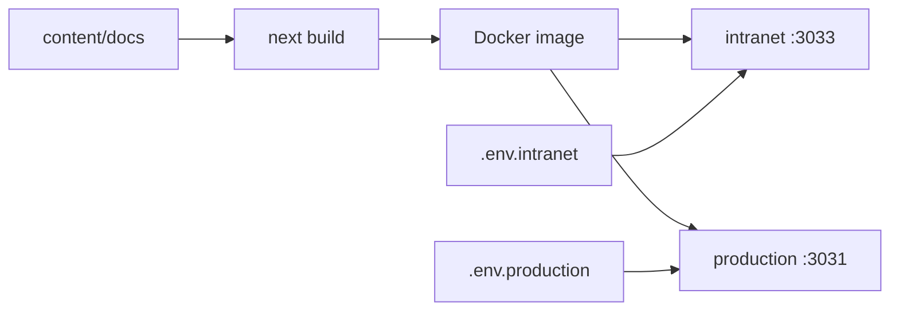

# HeroKnowledge

HeroKnowledge 是预策·数据连接中心的内部知识库，基于 [Fumadocs](https://fumadocs.vercel.app/) 与 [Next.js](https://nextjs.org/) 构建。站点收录 RPA 连接器说明和授权帮助，并提供全文检索、AI 问答、RSS 订阅与 MCP 服务。

当前版本为 **0.6.6**。版本说明见 [CHANGELOG.md](CHANGELOG.md)。

## 功能概览

- **分区文档**：连接器在 `/docs/rpa`，授权帮助在 `/docs/auth`（后者以 Git Submodule 引入）。
- **阅读体验**：支持单栏与双栏对照、引用卡片、链接预览、选词分享图，以及面向大模型的导出页（`/llms.mdx`）。
- **检索与对话**：关键词搜索与 AI 语义问答；对话里可以打开文档（右侧预览或左侧整页）。
- **MCP**：提供 `list_docs`、`search_docs`、`get_docs_meta`、`get_docs_content` 等工具，可用 `tag`、`prefix` 缩小范围，并读取调度相关元数据。
- **鉴权**：本地可用传统访问令牌；生产环境可启用 Cube SSO 与嵌入验签，详见 [`deploy/CUBE_SSO.md`](deploy/CUBE_SSO.md)。
- **可观测性**：本机可写 jsonl 审计（access / sso / mcp / secrets）；也可接入 Sentry，上报错误、链路、回放与业务审计。
- **部署方式**：本地用 Next.js 开发；仓库根目录提供单容器 Compose；同机双实例见 [`deploy/dual-instance/`](deploy/dual-instance/)。

## 快速开始

```bash
git clone --recurse-submodules <主仓库地址>
cd documents   # 若在 monorepo 中，进入本目录即可
cp .env.example .env
npm install
npm run dev
```

开发服务器默认监听 [http://localhost:3000](http://localhost:3000)。可先打开 [/docs/rpa](http://localhost:3000/docs/rpa) 与 [/docs/auth](http://localhost:3000/docs/auth) 确认内容已加载。

克隆时若未加 `--recurse-submodules`，`/docs/auth` 会是空目录，处理方式见 [常见问题](#常见问题)。

## 常用命令

| 命令 | 说明 |
|------|------|
| `npm run dev` | 启动开发服务器，支持热更新 |
| `npm run build` | 生产构建，产物为 `.next/standalone` |
| `npm run start` | 本地预览生产构建 |
| `npm run types:check` | 类型检查（含 MDX） |
| `npm run test:unit` | 运行单元测试 |
| `npm run lint` | 运行 ESLint |

`npm install` 之后会通过 `postinstall` 自动执行 `fumadocs-mdx`。若提示找不到 `.fumadocs-mdx` 模块，再执行一次 `npm install` 即可。

## 环境变量

```bash
cp .env.example .env
```

全部变量及注释见 [`.env.example`](.env.example)。站点根地址、展示名称和 Git 链接请使用 **`KNOWLEDGE_*`**；旧的 `NEXT_PUBLIC_*` 仍可作为回退。修改运行时变量后，重启 Node 进程，或执行 `docker compose up -d`，**不必**重新 `--build`。

| 变量 | 说明 |
|------|------|
| `KNOWLEDGE_SITE_URL` | 站点规范地址，用于 RSS、OG、MCP 绝对链接；生产环境建议填写 |
| `KNOWLEDGE_SITE_NAME` | 站点展示名称 |
| `PORT` | 映射到宿主机的端口；容器内固定监听 `3000` |
| `COMPOSE_IMAGE` | 单实例使用的镜像标签；双实例请看 `deploy/dual-instance/.env` |
| `DOCS_CUBE_SSO_ENABLED` | 是否启用 Cube SSO |
| `DOCS_SECRETS_FILE_PATH` / `DOCS_SECRETS_DIR` | SSO 密钥文件；容器内路径固定为 `/opt/secrets/secrets.json` |
| `DOCS_OBSERVABILITY_LOG_*` | 本机审计日志的开关与落盘目录 |
| `SENTRY_DSN` | 未设置则关闭 Sentry；运行时读取，改完重启即可 |
| `SENTRY_ENVIRONMENT` | Sentry 上的环境标签，默认 `dev`，与 `NODE_ENV` 无关 |
| `SENTRY_AUTH_TOKEN` | 仅在构建阶段上传 source map；未设置则跳过，构建不会失败 |

双实例的端口、日志目录和 `PRODUCTION_SECRETS_DIR` 写在共享的 [`deploy/dual-instance/.env.example`](deploy/dual-instance/.env.example) 中，不要写进 `.env.intranet` 或 `.env.production`。

### Sentry

自托管项目为 `knowledge`，地址 `https://sentry.yuce-tech.cn`。未配置 `SENTRY_DSN` 时不会初始化 SDK。浏览器侧的 DSN 由根布局注入到 `globalThis.__KNOWLEDGE_PUBLIC_CONFIG__`。

开启后可上报错误、链路追踪（采样率见 `SENTRY_TRACES_SAMPLE_RATE`）、可选的性能剖析、会话回放（同源隧道 `/monitoring`）以及日志。业务审计包括 `docs.view`、`mcp.call` / `mcp.deny`、`sso.redirect` / `sso.deny`、`auth.deny`。相关代码在 `src/instrumentation.ts` 与 `src/lib/observability/sentry/`。

### 本机审计日志

由 `DOCS_OBSERVABILITY_LOG_ENABLED` 控制是否写入，路径由 `DOCS_OBSERVABILITY_LOG_PATH` 指定。Compose 默认把宿主机的 `./logs` 挂到容器 `/app/logs`。每条记录用 `type` 区分 `access`、`sso`、`mcp`、`secrets`。生产环境默认开启，开发环境默认关闭。`/health` 与 `/_next/*` 不会记入日志；查询参数里的 `token` 等会脱敏。旧变量 `DOCS_ACCESS_LOG_*` 仍然有效，新部署请改用 `DOCS_OBSERVABILITY_LOG_*`。

```bash
mkdir -p logs && chown 1001:1001 logs   # 容器内写入失败（权限不够）时在宿主机执行
tail -f logs/log-$(date -u +%Y%m%d).jsonl
grep '"type":"mcp"' logs/log-*.jsonl
```

## Docker 部署

**单实例**使用仓库根目录的 `docker-compose.yml`：

```bash
docker compose up -d --build
# 只改运行时环境变量时：docker compose up -d
# 不要用 docker compose restart，否则不会重新加载 env_file
```

默认映射宿主机 `3000` 端口。文档正文在构建时打进镜像，修改 `content/docs` 之后必须重新 `--build`。

**同一台机器同时跑内网站和 SSO 站**时，推荐 [`deploy/dual-instance/`](deploy/dual-instance/README.md)：构建一次镜像，用 `.env.intranet`（默认 `3033`，关闭 SSO）和 `.env.production`（默认 `3031`，开启 SSO）拉起两个容器。1Panel 定时任务请指向 `deploy/dual-instance/deploy.sh`，不要与 `scripts/deplpy.sh` 同时执行。两套脚本都支持 `--force`（跳过 Git 更新检查，按当前工作区构建），用于首次配置或手动重建。

更新脚本会在构建前把当前镜像标记为 `<仓库名>:previous`。两个容器都通过健康检查后，只保留最新镜像；若探活失败，会自动回退。等待超时可用 `HEALTH_WAIT_SECONDS` 调整，默认 180 秒。

**嵌入验签密钥**仅 SSO / production 实例需要：

```bash
./scripts/manage-secrets.sh --file /opt/secrets/secrets.json list
./scripts/manage-secrets.sh --file /opt/secrets/secrets.json add
```

密钥目录以只读方式挂进容器，应用按文件修改时间热加载。若出现 `EACCES`，在宿主机执行 `./scripts/manage-secrets.sh fix-perms`。单实例默认读取仓库根 `.env` 里的 `DOCS_SECRETS_FILE_PATH`。

**构建较慢时**：打开 BuildKit（`export DOCKER_BUILDKIT=1`），并为 `node:22-bookworm-slim` 配置镜像加速。镜像内不安装 git，构建时用 `FUMADOCS_LAST_MODIFIED=fs`，按文件修改时间生成「最后更新」。

不使用 Compose 时可以手动构建：

```bash
docker build -t rpa-products-docs:latest .
docker run -d -p 3000:3000 -e KNOWLEDGE_SITE_URL=https://docs.example.com rpa-products-docs:latest
```

Dockerfile 分三阶段：`deps` 执行 `npm ci`，`builder` 产出 standalone，`runner` 拷贝 standalone、静态资源和 `src/fonts`。OG 图片在运行时渲染，二维码上的域名来自当时的 `KNOWLEDGE_SITE_URL`。

## 仓库结构

```
documents/
├── content/docs/          # rpa（主仓库）+ auth（Submodule）
├── deploy/
│   ├── CUBE_SSO.md        # 与魔方的对接说明
│   └── dual-instance/     # 一镜像、两容器
├── scripts/deplpy.sh      # 1Panel 单实例滚动更新
├── Dockerfile
├── docker-compose.yml     # 单实例
├── .env.example
└── src/                   # Next.js 应用、组件与可观测性
```



日常改文档只需编辑 `content/docs/rpa/` 或 `content/docs/auth/`。授权帮助属于独立仓库，修改后要在 Submodule 目录里单独提交并推送。

## 常见问题

**修改了文档内容，Docker 容器需要重启吗？**

需要重新构建镜像，例如 `docker compose up -d --build`，或执行对应的 `deploy.sh`。文档在构建阶段已被打进镜像，仅重启容器不会更新正文。

**启动时报 `Cannot find module '.fumadocs-mdx/...'`？**

再执行一次 `npm install`，`postinstall` 会重新生成 fumadocs 类型文件。

**新机器上如何完整克隆？**

| 路径 | 站点路由 | 归属 |
|------|----------|------|
| `content/docs/rpa/` | `/docs/rpa` | 主仓库 |
| `content/docs/auth/` | `/docs/auth` | [connectors-auth-docs](https://codeup.aliyun.com/yuce-tech/knowledge/connectors-auth-docs)（SSH：`git@codeup.aliyun.com:yuce-tech/knowledge/connectors-auth-docs.git`） |

```bash
git clone --recurse-submodules <主仓库地址>
npm install && npm run dev
# 已经克隆过、但 auth 为空时：
git submodule sync --recursive && git submodule update --init --recursive
```

本机需要能访问云效（HTTPS 凭据或 SSH 公钥）。服务器部署建议为主仓库和 auth 仓库分别配置只读 Deploy Key。

**如何只更新授权帮助？**

```bash
cd content/docs/auth
git add -A && git commit -m "docs: …" && git push origin main
cd ../../..
git add content/docs/auth && git commit -m "chore: bump auth submodule"
```

`scripts/deplpy.sh` 与 `deploy/dual-instance/deploy.sh` 都会跟踪 auth 远程最新提交；即使主仓库尚未更新 gitlink，有变更时也会重建。两套脚本不要同时跑。首次或只想按当前代码重建时加 `--force`。

**1Panel 里如何指定分支？**

| 变量 | 含义 |
|------|------|
| `DEPLOY_PATH` | 服务器上的仓库目录。`deplpy.sh` 默认为 `/opt/1panel/apps/rpa-products-docs`；dual-instance 的 `deploy.sh` 默认为脚本所在目录的上两级 |
| `BRANCH` | 主仓库跟踪分支，默认 `main` |
| `AUTH_BRANCH` | auth Submodule 跟踪分支，默认 `main` |

**改了 `KNOWLEDGE_*` 或 `SENTRY_DSN`，需要重新构建镜像吗？**

不需要。执行 `docker compose up -d`（不要用 `restart`）即可。`SENTRY_AUTH_TOKEN` 只在需要上传 source map 的那一次构建中使用。
