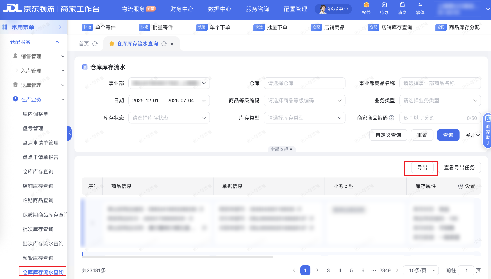

:::warning[权限说明]
访问「仓库库存流水」须已开通**物流商家权限**。若账号未开通，页面会提示无权限，连接器将返回不可重试错误。请联系主账号在京麦-店铺-子账号设置中开通物流工作台【一键授权】。
:::

| 属性             | 值                                                                                 |
| ---------------- | ---------------------------------------------------------------------------------- |
| **连接器类型**   | `RPA 连接器`|
| **连接器名称**   | `ODS_物流仓库库存流水明细表(京麦RPA)`|
| **连接器代码**   | `rpa.conn.jingmai.wl.inventory.flow`|
| **操作类型**     | `页面解析` + `文件导出`|
| **目标网页**     | `https://wl.jdl.com/supplychain--inventory/flow`|
| **适用场景**     | 在京东物流工作台仓库库存流水页，按日期范围导出库存流水明细数据|
| **数据表名**     | `ods_rpa_jingmai_wl_inventory_flow_du`|
| **业务表名**     | `ODS_物流仓库库存流水明细表(京麦RPA)`|

### 目标页面

> **取数路径**：京东物流工作台—供应链—库存—库存流水
>
> **取数链接**：[https://wl.jdl.com/supplychain--inventory/flow](https://wl.jdl.com/supplychain--inventory/flow)



### 业务入参

| 字段 | 中文释义 | 数据类型 | 必填 | 默认值 | 说明 |
| ---- | -------- | -------- | ---- | ------ | ---- |
| `date_range` | 日期范围 | `String` | 否 | `LAST_THREE_MONTHS` | 可选值：`LAST_WEEK`（最近一周）、`LAST_MONTH`（最近一月）、`LAST_THREE_MONTHS`（最近三月）、`LAST_YEAR`（最近一年）、`CUSTOM`（自定义） |
| `custom_start_date` | 自定义开始日期 | `String` | `date_range` 为 `CUSTOM` 时必填 | — | 支持格式：YYYYMMDD、YYYY-MM-DD；非 `CUSTOM` 模式不可传入 |
| `custom_end_date` | 自定义结束日期 | `String` | `date_range` 为 `CUSTOM` 时必填 | — | 支持格式：YYYYMMDD、YYYY-MM-DD；不能早于 `custom_start_date`；不能晚于当天；非 `CUSTOM` 模式不可传入 |

### 入参样例

```json
{
  "date_range": "LAST_THREE_MONTHS"
}
```

```json
{
  "date_range": "CUSTOM",
  "custom_start_date": "2025-12-01",
  "custom_end_date": "2026-07-04"
}
```

### 入参校验

```json-schema collapsed
{
  "$schema": "https://json-schema.org/draft/2020-12/schema",
  "title": "京麦-仓库库存流水导出 - 查询入参",
  "description": "在京东物流工作台仓库库存流水页，按日期范围导出库存流水明细数据",
  "type": "object",
  "properties": {
    "date_range": {
      "type": "string",
      "description": "日期范围。可选值：LAST_WEEK（最近一周）、LAST_MONTH（最近一月）、LAST_THREE_MONTHS（最近三月）、LAST_YEAR（最近一年）、CUSTOM（自定义）",
      "enum": [
        "LAST_WEEK",
        "LAST_MONTH",
        "LAST_THREE_MONTHS",
        "LAST_YEAR",
        "CUSTOM"
      ],
      "default": "LAST_THREE_MONTHS"
    },
    "custom_start_date": {
      "type": "string",
      "description": "自定义开始日期。支持格式：YYYYMMDD、YYYY-MM-DD；date_range 为 CUSTOM 时必填；非 CUSTOM 模式不可传入",
      "anyOf": [
        { "pattern": "^\\d{8}$" },
        { "pattern": "^\\d{4}-\\d{2}-\\d{2}$" }
      ]
    },
    "custom_end_date": {
      "type": "string",
      "description": "自定义结束日期。支持格式：YYYYMMDD、YYYY-MM-DD；不能早于 custom_start_date；不能晚于当天；date_range 为 CUSTOM 时必填；非 CUSTOM 模式不可传入",
      "anyOf": [
        { "pattern": "^\\d{8}$" },
        { "pattern": "^\\d{4}-\\d{2}-\\d{2}$" }
      ]
    }
  },
  "required": [],
  "if": {
    "properties": {
      "date_range": { "const": "CUSTOM" }
    }
  },
  "then": {
    "required": ["custom_start_date", "custom_end_date"]
  },
  "additionalProperties": false
}
```

### 数据字段

:::field-tree
@define 页面筛选项
| `filterStartDate` | 筛选开始日期 | `String` | 否 | 页面日期筛选项 | `2025-12-01` |
| `filterEndDate` | 筛选结束日期 | `String` | 否 | 页面日期筛选项 | `2026-07-04` |
| `dept` | 事业部 | `String` | 是 | 页面事业部筛选项 | `EBU4418046517622_上海雪仑尔家纺有限公司` |

| 字段 | 中文释义 | 数据类型 | 可为空 | 取数路径 | 示例 |
| ---- | -------- | -------- | ------ | -------- | ---- |
| `serialNo` | 序号 | `Number` | 否 | `CSV.0.序号` | `32307880411` |
| `bizOccurTime` | 业务发生时间 | `String` | 否 | `CSV.0.业务发生时间` | `2026-07-04 23:21:47` |
| `deptCode` | 事业部编码 | `String` | 否 | `CSV.0.事业部编码` | `EBU4418046517622` |
| `deptName` | 事业部名称 | `String` | 否 | `CSV.0.事业部名称` | `上海雪仑尔家纺有限公司` |
| `warehouseCode` | 仓库编码 | `Number` | 否 | `CSV.0.仓库编码` | `110030165` |
| `warehouseName` | 仓库名称 | `String` | 否 | `CSV.0.仓库名称` | `无锡常温C平台仓13号库-CHN` |
| `merchantSkuCode` | 商家商品编码 | `String` | 是 | `CSV.0.商家商品编码` | — |
| `deptGoodsNo` | 事业部商品编号 | `String` | 否 | `CSV.0.事业部商品编号` | `EMG4418052286339` |
| `merchantSkuSign` | 商家商品标识 | `String` | 否 | `CSV.0.商家商品标识` | `A30317306000331` |
| `deptGoodsName` | 事业部商品名称 | `String` | 否 | `CSV.0.事业部商品名称` | `康尔馨希尔顿五星级酒店枕头 抗菌纯棉纤维枕成人家用单人枕头芯 白色 高枕(50*80cm) 单只` |
| `merchantDocCode` | 商家单据编码 | `String` | 否 | `CSV.0.商家单据编码` | `3549444001190535` |
| `jdDocCode` | 京东单据编码 | `String` | 否 | `CSV.0.京东单据编码` | `ESL00000025180826127` |
| `relatedDocCode` | 关联单据编码 | `String` | 否 | `CSV.0.关联单据编码` | `ESL00000025180826127` |
| `bizType` | 业务类型 | `String` | 否 | `CSV.0.业务类型` | `客单出库回传` |
| `stockStatus` | 库存状态 | `String` | 否 | `CSV.0.库存状态` | `良品` |
| `goodsLevelCode` | 商品等级编码 | `Number` | 否 | `CSV.0.商品等级编码` | `100` |
| `merchantSkuLevelName` | 商家商品等级名称 | `String` | 是 | `CSV.0.商家商品等级名称` | — |
| `merchantSkuLevelCode` | 商家商品等级编码 | `String` | 是 | `CSV.0.商家商品等级编码` | — |
| `stockType` | 库存类型 | `String` | 否 | `CSV.0.库存类型` | `可销售` |
| `actualOriginalStock` | 实际原始库存 | `Number` | 否 | `CSV.0.实际原始库存` | `194` |
| `actualStockChange` | 实际库存加减数量 | `Number` | 否 | `CSV.0.实际库存加减数量` | `-1` |
| `actualStockBalance` | 实际库存结存 | `Number` | 否 | `CSV.0.实际库存结存` | `193` |
| `availableOriginalStock` | 可用原始库存 | `Number` | 否 | `CSV.0.可用原始库存` | `193` |
| `availableStockChange` | 可用库存加减数量 | `Number` | 否 | `CSV.0.可用库存加减数量` | `0` |
| `availableStockBalance` | 可用库存结存 | `Number` | 否 | `CSV.0.可用库存结存` | `193` |
| `styleNo` | 款号 | `String` | 是 | `CSV.0.款号` | — |
| `color` | 颜色 | `String` | 是 | `CSV.0.颜色` | `白色` |
| `size` | 尺码 | `String` | 是 | `CSV.0.尺码` | — |
| `unit` | 计量单位 | `String` | 否 | `CSV.0.计量单位` | `件` |
| `stockChannel` | 库存渠道 | `String` | 否 | `CSV.0.库存渠道` | `一般渠道` |
| `actualFilterValues` @页面筛选项 | 页面筛选项真实值 | `Dict` | 否 | 查询后采集页面筛选项 | 见数据样例 |
| `bizDate` | 业务日期 | `String` | 否 | 附加 |  |
| `accountId` | 授权 ID | `String` | 否 | 附加 |  |
:::

### 数据样例

```json
{
  "serialNo": 32307880411,
  "bizOccurTime": "2026-07-04 23:21:47",
  "deptCode": "EBU4418046517622",
  "deptName": "上海雪仑尔家纺有限公司",
  "warehouseCode": 110030165,
  "warehouseName": "无锡常温C平台仓13号库-CHN",
  "merchantSkuCode": null,
  "deptGoodsNo": "EMG4418052286339",
  "merchantSkuSign": "A30317306000331",
  "deptGoodsName": "康尔馨希尔顿五星级酒店枕头 抗菌纯棉纤维枕成人家用单人枕头芯 白色 高枕(50*80cm) 单只",
  "merchantDocCode": "3549444001190535",
  "jdDocCode": "ESL00000025180826127",
  "relatedDocCode": "ESL00000025180826127",
  "bizType": "客单出库回传",
  "stockStatus": "良品",
  "goodsLevelCode": 100,
  "merchantSkuLevelName": null,
  "merchantSkuLevelCode": null,
  "stockType": "可销售",
  "actualOriginalStock": 194,
  "actualStockChange": -1,
  "actualStockBalance": 193,
  "availableOriginalStock": 193,
  "availableStockChange": 0,
  "availableStockBalance": 193,
  "styleNo": null,
  "color": "白色",
  "size": null,
  "unit": "件",
  "stockChannel": "一般渠道",
  "actualFilterValues": {
    "filterStartDate": "2025-12-01",
    "filterEndDate": "2026-07-04",
    "dept": "EBU4418046517622_上海雪仑尔家纺有限公司"
  },
  "bizDate": "20260709",
  "accountId": "122"
}
```

---
