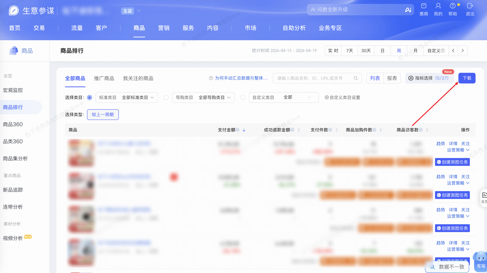

| 属性             | 值                                                         |
| ---------------- | ---------------------------------------------------------- |
| **连接器类型**   | `RPA 连接器`|
| **连接器名称**   | `ODS_商品排行全部商品数据下载(生意参谋RPA)`|
| **连接器代码**   | `rpa.conn.sycm.item.rank.all`|
| **操作类型**     | `文件导出`|
| **目标网页**     | `https://sycm.taobao.com/cc/item_rank`|
| **适用场景**     | 按日期类型（日/周/月）和日期参数下载生意参谋商品排行全部数据，支持天、自然周、自然月维度|
| **数据表名**     | `ods_rpa_sycm_item_rank_all_du`|
| **业务表名**     | `ODS_商品排行全部商品数据下载(生意参谋RPA)`|

### 目标页面

> **取数路径**：生意参谋—商品—商品排行
>
> **取数链接**：[https://sycm.taobao.com/cc/item_rank](https://sycm.taobao.com/cc/item_rank)



### 业务入参

| 字段        | 中文释义 | 数据类型 | 必填 | 默认值 | 说明 |
| ----------- | -------- | -------- | ---- | ------ | ---- |
| `date_type` | 日期类型 | `string` | 是   | —      | 可选值：`day`（天）/ `week`（自然周）/ `month`（自然月） |
| `biz_date`  | 业务日期 | `string` | 是   | —      | 格式：`YYYYMMDD`；`day` 最晚昨天、`week` 最晚上一完整周、`month` 最晚上个月 |

### 入参样例

```json
{
    // 按「天」维度查询 2026-04-19 的商品排行
    "date_type": "day",
    "biz_date": "20260419"
}
```

```json
{
    // 按「自然周」维度查询：传入该周内任意一天，系统自动对齐到周一～周日
    "date_type": "week",
    "biz_date": "20260414"
}
```

```json
{
    // 按「自然月」维度查询：传入该月内任意一天，系统自动对齐到月初～月末
    "date_type": "month",
    "biz_date": "20260301"
}
```

### 数据字段

| 字段                    | 中文释义             | 数据类型 | 可为空 | 取数路径              | 示例 |
| ----------------------- | -------------------- | -------- | ------ | --------------------- | ---- |
| `statDate`              | 统计日期             | `string` | 否     | `XLS.0.统计日期`      | 2026-04-19 |
| `itemId`                | 商品 ID              | `number` | 否     | `XLS.0.商品ID`        | 988297980428 |
| `itemTitle`             | 商品名称             | `string` | 否     | `XLS.0.商品名称`      | 松下小欢洗Ultra婴儿洗衣机迷你宝宝内衣裤小型2kg全自动洗烘一体 |
| `mainProductId`         | 主商品 ID            | `number` | 否     | `XLS.0.主商品ID`      | 988297980428 |
| `itemType`              | 商品类型             | `string` | 否     | `XLS.0.商品类型`      | 主商品 |
| `articleNumber`         | 货号                 | `string` | 是     | `XLS.0.货号`          | - |
| `itemStatus`            | 商品状态             | `string` | 否     | `XLS.0.商品状态`      | 当前在线 |
| `itemTag`               | 商品标签             | `string` | 是     | `XLS.0.商品标签`      | 迷你洗-推广,迷你洗 |
| `itmUv`                 | 商品访客数           | `string` | 否     | `XLS.0.商品访客数`    | 1,391 |
| `itmPv`                 | 商品浏览量           | `string` | 否     | `XLS.0.商品浏览量`    | 3,186 |
| `stayTimeAvg`           | 平均停留时长         | `number` | 否     | `XLS.0.平均停留时长`  | 15.74 |
| `itmBounceRate`         | 商品详情页跳出率     | `string` | 否     | `XLS.0.商品详情页跳出率` | 77.48% |
| `itemCltByrCnt`         | 商品收藏人数         | `number` | 否     | `XLS.0.商品收藏人数`  | 18 |
| `itemCartCnt`           | 商品加购件数         | `number` | 否     | `XLS.0.商品加购件数`  | 70 |
| `itemCartByrCnt`        | 商品加购人数         | `number` | 否     | `XLS.0.商品加购人数`  | 63 |
| `crtByrCnt`             | 下单买家数           | `number` | 否     | `XLS.0.下单买家数`    | 6 |
| `crtItmQty`             | 下单件数             | `number` | 否     | `XLS.0.下单件数`      | 10 |
| `crtAmt`                | 下单金额             | `string` | 否     | `XLS.0.下单金额`      | 34,895.00 |
| `crtRate`               | 下单转化率           | `string` | 否     | `XLS.0.下单转化率`    | 0.43% |
| `payByrCnt`             | 支付买家数           | `number` | 否     | `XLS.0.支付买家数`    | 6 |
| `payItmCnt`             | 支付件数             | `number` | 否     | `XLS.0.支付件数`      | 9 |
| `subPayOrdItmQty`       | 总支付商品件数       | `number` | 否     | `XLS.0.总支付商品件数` | 9 |
| `payAmt`                | 支付金额             | `string` | 否     | `XLS.0.支付金额`      | 31,396.00 |
| `subPayOrdAmt`          | 总支付金额           | `string` | 否     | `XLS.0.总支付金额`    | 31,396.00 |
| `payRate`               | 商品支付转化率       | `string` | 否     | `XLS.0.商品支付转化率` | 0.43% |
| `newPayByrCnt`          | 支付新买家数         | `number` | 否     | `XLS.0.支付新买家数`  | 4 |
| `payOldByrCnt`          | 支付老买家数         | `number` | 否     | `XLS.0.支付老买家数`  | 2 |
| `olderPayAmt`           | 老买家支付金额       | `string` | 否     | `XLS.0.老买家支付金额` | 17,360.00 |
| `juPayAmt`              | 聚划算支付金额       | `number` | 否     | `XLS.0.聚划算支付金额` | 0.0 |
| `uvAvgValue`            | 访客平均价值         | `number` | 否     | `XLS.0.访客平均价值`  | 22.57 |
| `sucRefundAmt`          | 成功退款金额         | `string` | 否     | `XLS.0.成功退款金额`  | 13,796.00 |
| `competitiveScore`      | 竞争力评分           | `string` | 是     | `XLS.0.竞争力评分`    | - |
| `ytdPayAmt`             | 年累计支付金额       | `string` | 是     | `XLS.0.年累计支付金额` | - |
| `mtdPayAmt`             | 月累计支付金额       | `string` | 是     | `XLS.0.月累计支付金额` | - |
| `mtdPayItmCnt`          | 月累计支付件数       | `string` | 是     | `XLS.0.月累计支付件数` | - |
| `seGuidePayRate`        | 搜索引导支付转化率   | `string` | 否     | `XLS.0.搜索引导支付转化率` | 2.38% |
| `seGuideUv`             | 搜索引导访客数       | `number` | 否     | `XLS.0.搜索引导访客数` | 126 |
| `seGuidePayByrCnt`      | 搜索引导支付买家数   | `number` | 否     | `XLS.0.搜索引导支付买家数` | 3 |
| `structDetailGuideRate` | 结构化详情引导转化率 | `string` | 是     | `XLS.0.结构化详情引导转化率` | - |
| `structDetailGuidePct`  | 结构化详情引导成交占比 | `string` | 是   | `XLS.0.结构化详情引导成交占比` | - |
| `bizDate`               | 业务日期             | `string` | 否     | 附加               |      |
| `accountId`             | 授权 ID              | `string` | 否     | 附加               |      |
| `taskId`                | 任务 ID              | `string` | 否     | 附加               |      |

### 数据样例

```json
[
  {
    "statDate": "2026-04-19",
    "itemId": 988297980428,
    "itemTitle": "松下小欢洗Ultra婴儿洗衣机迷你宝宝内衣裤小型2kg全自动洗烘一体",
    "mainProductId": 988297980428,
    "itemType": "主商品",
    "articleNumber": "-",
    "itemStatus": "当前在线",
    "itemTag": "迷你洗-推广,迷你洗",
    "itmUv": "1,391",
    "itmPv": "3,186",
    "stayTimeAvg": 15.74,
    "itmBounceRate": "77.48%",
    "itemCltByrCnt": 18,
    "itemCartCnt": 70,
    "itemCartByrCnt": 63,
    "crtByrCnt": 6,
    "crtItmQty": 10,
    "crtAmt": "34,895.00",
    "crtRate": "0.43%",
    "payByrCnt": 6,
    "payItmCnt": 9,
    "subPayOrdItmQty": 9,
    "payAmt": "31,396.00",
    "subPayOrdAmt": "31,396.00",
    "payRate": "0.43%",
    "newPayByrCnt": 4,
    "payOldByrCnt": 2,
    "olderPayAmt": "17,360.00",
    "juPayAmt": 0.0,
    "uvAvgValue": 22.57,
    "sucRefundAmt": "13,796.00",
    "competitiveScore": "-",
    "ytdPayAmt": "-",
    "mtdPayAmt": "-",
    "mtdPayItmCnt": "-",
    "seGuidePayRate": "2.38%",
    "seGuideUv": 126,
    "seGuidePayByrCnt": 3,
    "structDetailGuideRate": "-",
    "structDetailGuidePct": "-",
    "bizDate": "20260413",
    "accountId": "101",
    "taskId": "dev-0-81e889a7"
  }
]
```

---
