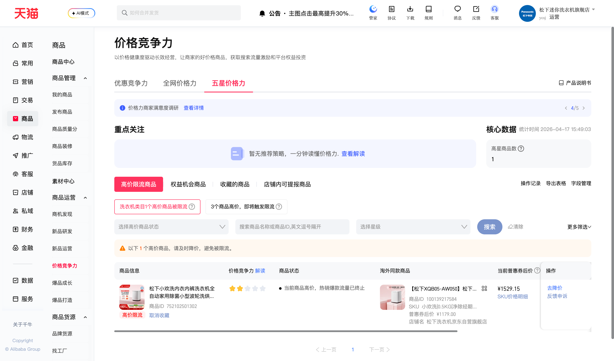

## 2026-04-17｜价格力竞争页面标签改版

**影响连接器：** `rpa.conn.qianniu.item.price.flow.limit`

**目标页面：** https://myseller.taobao.com/home.htm/starb/price-home

#### 变更说明

价格竞争力页面一级标签结构发生改版，原「同款价格力」标签已更名为「五星价格力」，二级标签「高价限流商品」归属关系保持不变。

| 层级 | 改版前 | 改版后 |
| ---- | ------ | ------ |
| 一级标签 | `同款价格力` | `五星价格力` |
| 二级标签 | `高价限流商品` | `高价限流商品`（不变） |

改版后页面完整标签结构如下：
- **一级标签：**`优惠竞争力` / `全网价格力` / **`五星价格力`**
- **二级标签：**`高价限流商品` / `权益机会商品` / `收藏的商品` / `店铺内可提报商品`

**页面改版后截图**

#### 变更内容

- 将一级标签定位从 `同款价格力` 更新为 `五星价格力`
- 新增兜底策略：当首选一级标签下找不到目标二级标签时，自动枚举页面所有实际存在的标签元素逐一尝试，不依赖预设文本，降低后续改版影响

---