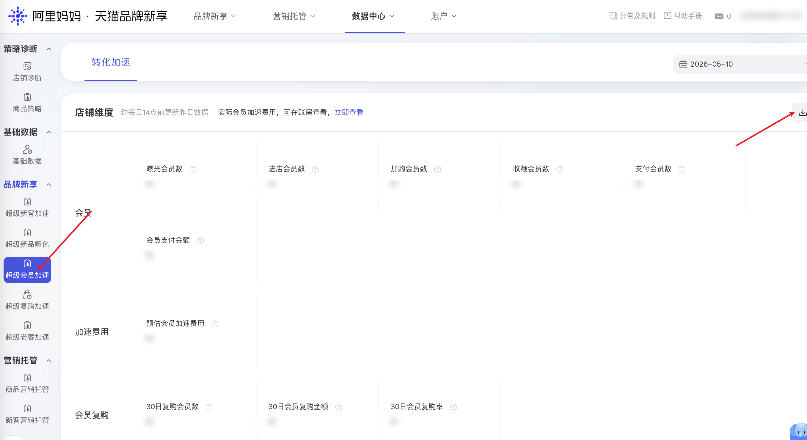

| 属性             | 值                                                                          |
| ---------------- | --------------------------------------------------------------------------- |
| **连接器类型**   | `RPA 连接器`|
| **连接器名称**   | `ODS_品牌新享超级会员加速数据导出明细表(阿里妈妈RPA)`|
| **连接器代码**   | `rpa.conn.alimm.ppxx.data.center.memacc.index`|
| **操作类型**     | `文件导出`|
| **目标网页**     | `https://ppxk.tmall.com/new/index.htm#!/data-center/memacc/index`|
| **适用场景**     | 采集阿里妈妈品牌新享数据中心「超级会员加速」模块的会员数据指标|
| **数据表名**     | `ods_rpa_alimm_ppxx_data_center_memacc_index_du`|
| **业务表名**     | `ODS_品牌新享超级会员加速数据导出明细表(阿里妈妈RPA)`|

### 目标页面

> **取数路径**：阿里妈妈—品牌新享—数据中心—超级会员加速
>
> **取数链接**：[https://ppxk.tmall.com/new/index.htm#!/data-center/memacc/index](https://ppxk.tmall.com/new/index.htm#!/data-center/memacc/index)



### 业务入参

| 字段 | 中文释义 | 数据类型 | 必填 | 默认值 | 说明 |
| ---- | -------- | -------- | ---- | ------ | ---- |
| `custom_start_date` | 起始日期 | `string` | 是 | — | 格式 `YYYYMMDD` |
| `custom_end_date` | 结束日期 | `string` | 是 | — | 格式 `YYYYMMDD`，不能超过今天 |

### 入参样例

```json
{
    "custom_start_date": "20260501",
    "custom_end_date": "20260510"
}
```

### 数据字段

| 字段 | 中文释义 | 数据类型 | 可为空 | 取数路径 | 示例 |
| ---- | -------- | -------- | ------ | -------- | ---- |
| `exposureMemberCnt` | 曝光会员数 | `number` | 否 | `XLSX.0.曝光会员数` | — |
| `visitMemberCnt` | 进店会员数 | `number` | 否 | `XLSX.0.进店会员数` | — |
| `cartMemberCnt` | 加购会员数 | `number` | 否 | `XLSX.0.加购会员数` | — |
| `favorMemberCnt` | 收藏会员数 | `number` | 否 | `XLSX.0.收藏会员数` | — |
| `payMemberCnt` | 支付会员数 | `number` | 否 | `XLSX.0.支付会员数` | — |
| `memberPayAmount` | 会员支付金额 | `number` | 否 | `XLSX.0.会员支付金额` | — |
| `estimatedBoostCost` | 预估会员加速费用 | `number` | 否 | `XLSX.0.预估会员加速费用` | — |
| `repurchase30dMemberCnt` | 30日复购会员数 | `number` | 否 | `XLSX.0.30日复购会员数` | — |
| `repurchase30dAmount` | 30日会员复购金额 | `number` | 否 | `XLSX.0.30日会员复购金额` | — |
| `repurchase30dRate` | 30日会员复购率 | `number` | 否 | `XLSX.0.30日会员复购率` | — |
| `statDate` | 日期 | `number` | 否 | `XLSX.0.日期` | — |
| `bizDate` | 业务日期 | `string` | 否 | 附加 |  |
| `accountId` | 授权 ID | `string` | 否 | 附加 |  |
| `taskId` | 任务 ID | `string` | 否 | 附加 |  |

### 数据样例

{/* TODO: 数据样例待补充 */}

---
