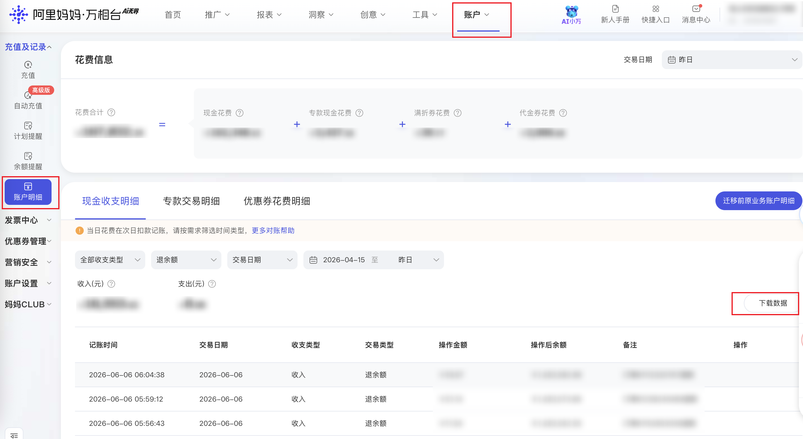

| 属性             | 值                                                                 |
| ---------------- | ------------------------------------------------------------------ |
| **连接器类型**   | `RPA 连接器`                                                       |
| **连接器代码**   | `rpa.conn.alimm.wxt.account.detail`                                |
| **操作类型**     | `文件导出`                                    |
| **目标网页**     | `https://one.alimama.com/index.html#!/account/detail`              |
| **适用场景**     | 导出阿里妈妈万相台账户明细（现金收支）数据，支持按收支类型、交易类型及日期范围筛选 |

### 目标页面

> **路径**：阿里妈妈—万相台—账户—账户明细
>
> **网址**：[https://one.alimama.com/index.html#!/account/detail](https://one.alimama.com/index.html#!/account/detail)



### 业务入参

| 字段 | 中文释义 | 数据类型 | 必填 | 默认值 | 说明 |
| ---- | -------- | -------- | ---- | ------ | ---- |
| `fin_type` | 收支类型 | `string` | 否 | `—` | 可选 `""` 或 `all`（全部）/ `expense`（支出）/ `income`（收入），不传表示全部 |
| `trade_type` | 交易类型 | `string` | 否 | `—` | 可选 `""` 或 `all`（全部）/ `recharge` 或 `charge`（充值）/ `refund`（退款）/ `deduct`（扣款）/ `transfer`（转账）/ `compen`（赔付）/ `freeze`（冻结）/ `unfreeze`（解冻）/ `pay`（付款）/ `unpay`（退余额），不传表示全部 |
| `time_type` | 时间维度 | `string` | 否 | `account_time` | 可选 `account_time`（记账时间）/ `trade_date`（交易日期） |
| `date_type` | 日期快捷选项 | `string` | 否 | `last_30_days` | 可选 `today`（今天）/ `yesterday`（昨天）/ `last_week`（上周）/ `this_month`（本月）/ `last_month`（上月）/ `last_7_days`（近7天）/ `last_15_days`（近15天）/ `last_30_days`（近30天）/ `last_90_days`（近90天）/ `last_180_days`（近180天）/ `custom`（自定义，需配合 `custom_start_date` / `custom_end_date`） |
| `custom_start_date` | 自定义起始日期 | `string` | 否 | `—` | `date_type` 为 `custom` 时必填，格式 `YYYYMMDD` 或 `YYYY-MM-DD` |
| `custom_end_date` | 自定义结束日期 | `string` | 否 | `—` | `date_type` 为 `custom` 时必填，格式 `YYYYMMDD` 或 `YYYY-MM-DD`，最晚为今天 |

### 入参样例

```json
{
    "fin_type": "income",
    "trade_type": "refund",
    "time_type": "account_time",
    "date_type": "last_30_days"
}
```

### 数据字段

| 字段 | 中文释义 | 数据类型 | 可为空 | 取数路径 | 示例 |
| ---- | -------- | -------- | ------ | -------- | ---- |
| `accountTime` | 记账时间 | `string` | 否 | `CSV.0.记账时间` | `2026-06-06 06:04:38` |
| `tradeDate` | 交易日期 | `string` | 否 | `CSV.0.交易日期` | `2026-06-06` |
| `finType` | 收支类型 | `string` | 否 | `CSV.0.收支类型` | `收入` |
| `tradeType` | 交易类型 | `string` | 否 | `CSV.0.交易类型` | `付款退回` |
| `amount` | 操作金额（元） | `number` | 否 | `CSV.0.操作金额(元)` | `18.97` |
| `balanceAfter` | 操作后余额（元） | `number` | 否 | `CSV.0.操作后余额(元)` | `1420592.66` |
| `remark` | 备注 | `string` | 是 | `CSV.0.备注` | `订单81112325767退款` |
| `bizDate` | 业务日期 | `string` | 否 | 附加 |  |
| `accountId` | 授权 ID | `string` | 否 | 附加 |  |

### 数据样例

```json
{
  "accountTime": "2026-06-06 06:04:38",
  "tradeDate": "2026-06-06",
  "finType": "收入",
  "tradeType": "付款退回",
  "amount": 18.97,
  "balanceAfter": 1420592.66,
  "remark": "订单81112325767退款",
  "bizDate": "20260611",
  "accountId": "108"
}
```

---
