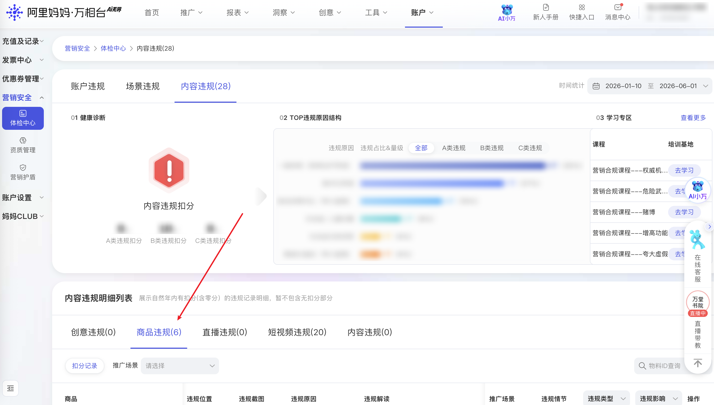

| 属性             | 值                                                                                       |
| ---------------- | ---------------------------------------------------------------------------------------- |
| **连接器类型**   | `RPA 连接器`                                                                             |
| **连接器代码**   | `rpa.conn.alimm.wxt.item.violation`                                                      |
| **操作类型**     | `页面解析`                                                          |
| **目标网页**     | `https://one.alimama.com/index.html#!/account/violation/index?tab=content&tabIndex=item` |
| **适用场景**     | 采集阿里妈妈万相台内容违规列表中的商品违规记录，支持推广场景、物料ID、违规类型、违规影响及时间范围筛选 |

### 目标页面

> **路径**：阿里妈妈—万相台—账户—违规管理—内容违规—商品
>
> **网址**：[https://one.alimama.com/index.html#!/account/violation/index?tab=content&tabIndex=item](https://one.alimama.com/index.html#!/account/violation/index?tab=content&tabIndex=item)



### 业务入参

| 字段 | 中文释义 | 数据类型 | 必填 | 默认值 | 说明 |
| ---- | -------- | -------- | ---- | ------ | ---- |
| `scene_id` | 推广场景 appId | `string` | 否 | `""` | 可选值：`372`（人群推广）、`428`（多目标直投）、`419`（追投快）、`418`（策略快）、`436`（货品全站推广）、`383`（全媒体智投）、`479`（店铺直达）、`408`（全店推广）、`376`（货品运营）、`533`（光合商单）、`386`（超级直播）、`400`（短直联动）、`387`（超级短视频）、`395`（线索推广）、`371`（关键词推广） |
| `element_id` | 物料 ID | `string` | 否 | `""` | 纯数字，最长 20 位 |
| `violate_id` | 违规类型 ID | `string` | 否 | `""` | 可选值：`630`（A 类违规）、`631`（B 类违规）、`632`（C 类违规） |
| `violate_impact` | 违规影响分值 | `string` | 否 | `""` | 可选值：`0`（0 分）、`1`（1 分）、`2`（2 分）、`3`（3 分）、`6`（6 分及以上） |
| `custom_start_date` | 时间统计开始日期 | `string` | 否 | — | 格式 `YYYYMMDD` 或 `YYYY-MM-DD`，不早于当年 1 月 1 日；不传则不拼接 URL 时间参数（页面默认当年 1 月 1 日）；与 `custom_end_date` 成对传入 |
| `custom_end_date` | 时间统计结束日期 | `string` | 否 | — | 格式 `YYYYMMDD` 或 `YYYY-MM-DD`，不晚于今天；不传则不拼接 URL 时间参数（页面默认今天）；与 `custom_start_date` 成对传入 |

### 入参样例

```json
{}
```

```json
{
    "scene_id": "371",
    "violate_id": "631",
    "violate_impact": "1",
    "custom_start_date": "20260101",
    "custom_end_date": "20260604"
}
```

```json
{
    "element_id": "678264636662",
    "custom_start_date": "2026-03-01",
    "custom_end_date": "2026-03-31"
}
```

### 数据字段

| 字段 | 中文释义 | 数据类型 | 可为空 | 取数路径 | 示例 |
| ---- | -------- | -------- | ------ | -------- | ---- |
| `id` | 违规记录 ID | `number` | 否 | `id` | `8579150` |
| `elementId` | 物料 ID | `number` | 否 | `elementId` | `678264636662` |
| `elementType` | 物料类型 | `string` | 否 | `elementType` | `item` |
| `itemId` | 商品 ID | `number` | 否 | `itemId` | `678264636662` |
| `sceneName` | 推广场景名 | `string` | 否 | `sceneName` | `关键词推广` |
| `violateId` | 违规类型 ID | `number` | 否 | `violateId` | `631` |
| `violateType` | 违规类型 | `string` | 是 | `violateType` | — |
| `subViolateType` | 子违规类型 | `string` | 是 | `subViolateType` | `L4` |
| `score` | 违规影响分数 | `number` | 否 | `score` | `0` |
| `degree` | 违规等级 | `number` | 否 | `degree` | `1` |
| `isEffective` | 是否生效 | `number` | 否 | `isEffective` | `1` |
| `bizCode` | 业务代码 | `string` | 否 | `bizCode` | `onebpSearch` |
| `application` | 推广场景 appId | `number` | 否 | `application` | `700001` |
| `cumulateType` | 累计类型 | `string` | 否 | `cumulateType` | `lp` |
| `gmtCreate` | 违规时间 | `string` | 否 | `gmtCreate` | `2026-03-17 12:40:07` |
| `gmtModified` | 修改时间 | `string` | 否 | `gmtModified` | `2026-03-17 12:40:07` |
| `editUrl` | 编辑链接 | `string` | 否 | `editUrl` | `https://item.manager.taobao.com/taobao/manager/render.htm` |
| `reason` | 违规原因 | `string` | 否 | `reason` | 见数据样例 `reason` |
| `extendContent` | 扩展内容 | `string` | 是 | `extendContent` | — |
| `adgroupId` | 推广单元 ID | `number` | 是 | `adgroupId` | — |
| `campaignId` | 推广计划 ID | `number` | 是 | `campaignId` | — |
| `shortVideo` | 短视频信息 | `Dict` | 是 | `shortVideo` | — |
| `live` | 直播信息 | `Dict` | 是 | `live` | — |
| `creative` | 创意信息 | `Dict` | 是 | `creative` | — |
| `item` | 商品信息 | `Dict` | 是 | `item` | 见数据样例 `item` |
| `material` | 素材信息 | `Dict` | 是 | `material` | — |
| `qualification` | 资质信息 | `Dict` | 是 | `qualification` | — |
| `rssContentDO` | RSS 内容对象 | `Dict` | 是 | `rssContentDO` | — |
| `rss_content` | RSS 内容 | `Dict` | 是 | `rss_content` | — |
| `bizDate` | 业务日期 | `string` | 否 | 附加 |  |
| `accountId` | 授权 ID | `string` | 否 | 附加 |  |

### 数据样例

```json
{
    "id": 8579150,
    "elementId": 678264636662,
    "elementType": "item",
    "itemId": 678264636662,
    "sceneName": "关键词推广",
    "violateId": 631,
    "violateType": null,
    "subViolateType": "L4",
    "score": 0,
    "degree": 1,
    "isEffective": 1,
    "bizCode": "onebpSearch",
    "application": 700001,
    "cumulateType": "lp",
    "gmtCreate": "2026-03-17 12:40:07",
    "gmtModified": "2026-03-17 12:40:07",
    "editUrl": "https://item.manager.taobao.com/taobao/manager/render.htm",
    "reason": "[{\"auditBlockId\":325,\"auditBlockName\":\"推广图片\",\"blockUrl\":\"http://help.alimama.com/#!/ztc/faq/detail?id=5795497\",\"isManual\":false,\"auditGroupId\":922,\"auditGroupName\":\"基础-B类风险\",\"auditReasonId\":6971,\"auditReasonName\":\"绝对化用语\",\"remark\":\"您好，推广素材不符合平台对绝对化用语管控要求。常见违规点如下：（1）推广内容中使用了“国家级”、“最高级”、“最佳”、“顶级”、“极品”、“第一品牌”、“全球首发”等含义相同或近似的用语，后台未核实到相关资质证明文件。（2）推广内容中存在绝对化描述（例如声称“全国销量第一”、“功效最佳”）或使用了特定资质声明，但我们核对您的描述与后台提交的资质文件或相关证明材料不符。（3）推广内容中涉及产品或服务排名描述（例如“XX行业领先”、“销量位居前三”），但未明确注明数据统计时间、数据来源、调查机构等关键信息。【整改建议】请您删除推广内容中所有与现有资质不符的绝对化描述。若您确有相应资质或数据支撑，请在后台提交完整、合法、有效的证明材料，在素材中清晰、完整地注明所有关键引证内容，确保消费者能够查证其真实性。\",\"redirectUrl\":\"https://rule.alimama.com/#/detail?&id=11003888\",\"violateType\":2,\"subViolateType\":4,\"punishDegree\":1,\"auditLevel\":10,\"flawUrls\":[],\"uid\":\"0c619ee4-f9c2-48a8-bc6d-59da874306ea\",\"auditTime\":\"2026-03-17 12:40:05\"}]",
    "extendContent": null,
    "adgroupId": null,
    "campaignId": null,
    "shortVideo": null,
    "live": null,
    "creative": null,
    "item": {
        "imgUrl": "https://img.alicdn.com/tfscom/i2/3691886865/O1CN01pTMbJW20aE8SqJHuS_!!4611686018427386129-0-item_pic.jpg",
        "linkUrl": "https://detail.tmall.com/item.htm?id=678264636662",
        "id": 678264636662,
        "title": "兔头妈妈儿童牙膏高纯奥拉氟儿童含氟牙膏防蛀牙龋齿3-6-12岁宝宝"
    },
    "material": null,
    "qualification": null,
    "rssContentDO": null,
    "rss_content": null,
    "bizDate": "20260604",
    "accountId": "108"
}
```

---
