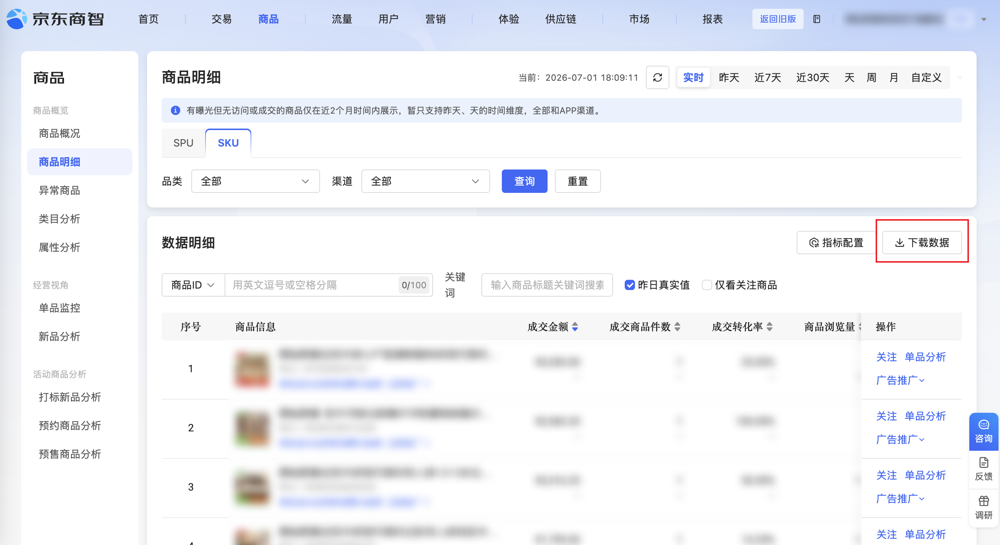

| 属性             | 值                                                                                      |
| ---------------- | --------------------------------------------------------------------------------------- |
| **连接器类型**   | `RPA 连接器`|
| **连接器名称**   | `ODS_商品SKU维度数据明细表(京东商智RPA)`|
| **连接器代码**   | `rpa.conn.jdsz.item.product.detail`|
| **操作类型**     | `文件导出`|
| **目标网页**     | `https://jdsz.jd.com/szweb/view/product/productDetail.html`|
| **适用场景**     | 在京东商智商品明细页导出 SKU 维度商品数据，支持实时及昨天/近7天/近30天/天/周/月/自定义等多种时间筛选；非实时场景支持汇总下载与分天下载|
| **数据表名**     | `ods_rpa_jdsz_item_product_detail_du`|
| **业务表名**     | `ODS_商品SKU维度数据明细表(京东商智RPA)`|

### 目标页面

> **取数路径**：京东商智—商品—商品明细
>
> **取数链接**：[https://jdsz.jd.com/szweb/view/product/productDetail.html](https://jdsz.jd.com/szweb/view/product/productDetail.html)



### 业务入参

| 字段 | 中文释义 | 数据类型 | 必填 | 默认值 | 说明 |
| ---- | -------- | -------- | ---- | ------ | ---- |
| `time_range` | 时间筛选 | `String` | 否 | `REALTIME` | 可选值：`REALTIME`（实时）、`YESTERDAY`（昨天）、`LAST_7_DAYS`（近7天）、`LAST_30_DAYS`（近30天）、`DAY`（天）、`WEEK`（周）、`MONTH`（月）、`CUSTOM`（自定义） |
| `download_type` | 下载类型 | `String` | 否 | `DAILY` | 仅 `time_range` 为非实时时生效；可选值：`SUMMARY`（汇总下载）、`DAILY`（分天下载） |
| `custom_start_date` | 目标日期 | `String` | 条件必填 | — | `time_range` 为 `DAY` / `WEEK` / `MONTH` / `CUSTOM` 时必填；支持格式：YYYYMMDD、YYYY-MM-DD |
| `custom_end_date` | 自定义结束日期 | `String` | 条件必填 | — | `time_range` 为 `CUSTOM` 时必填；不能晚于昨天；与 `custom_start_date` 间隔不超过 31 天（含首尾）；支持格式：YYYYMMDD、YYYY-MM-DD |

### 入参样例

**实时（默认）** — 不传参或显式指定 `REALTIME`，页面直接下载当前实时数据。

```json
{
  "time_range": "REALTIME"
}
```

**昨天 + 分天下载** — 非实时场景默认 `download_type` 为 `DAILY`。

```json
{
  "time_range": "YESTERDAY"
}
```

**近 7 天 + 汇总下载**

```json
{
  "time_range": "LAST_7_DAYS",
  "download_type": "SUMMARY"
}
```

**按天查询**

```json
{
  "time_range": "DAY",
  "custom_start_date": "2026-06-04"
}
```

**自定义日期范围**

```json
{
  "time_range": "CUSTOM",
  "custom_start_date": "2026-06-01",
  "custom_end_date": "2026-06-04",
  "download_type": "DAILY"
}
```

### 入参校验

```json-schema collapsed
{
  "$schema": "https://json-schema.org/draft/2020-12/schema",
  "title": "京东商智-商品明细-SKU数据导出 - 查询入参",
  "description": "在京东商智商品明细页导出 SKU 维度商品数据，支持实时及昨天/近7天/近30天/天/周/月/自定义等多种时间筛选；非实时场景支持汇总下载与分天下载",
  "type": "object",
  "properties": {
    "time_range": {
      "type": "string",
      "description": "时间筛选；可选值：REALTIME（实时）、YESTERDAY（昨天）、LAST_7_DAYS（近7天）、LAST_30_DAYS（近30天）、DAY（天）、WEEK（周）、MONTH（月）、CUSTOM（自定义）",
      "enum": [
        "REALTIME",
        "YESTERDAY",
        "LAST_7_DAYS",
        "LAST_30_DAYS",
        "DAY",
        "WEEK",
        "MONTH",
        "CUSTOM"
      ],
      "default": "REALTIME"
    },
    "download_type": {
      "type": "string",
      "description": "下载类型，仅 time_range 为非实时时生效；可选值：SUMMARY（汇总下载）、DAILY（分天下载）",
      "enum": ["SUMMARY", "DAILY"],
      "default": "DAILY"
    },
    "custom_start_date": {
      "type": "string",
      "description": "目标日期；time_range 为 DAY/WEEK/MONTH/CUSTOM 时必填；支持格式：YYYYMMDD、YYYY-MM-DD"
    },
    "custom_end_date": {
      "type": "string",
      "description": "自定义结束日期；time_range 为 CUSTOM 时必填；不能晚于昨天；与 custom_start_date 间隔不超过 31 天（含首尾）；支持格式：YYYYMMDD、YYYY-MM-DD"
    }
  },
  "required": [],
  "allOf": [
    {
      "if": {
        "properties": {
          "time_range": {
            "enum": ["DAY", "WEEK", "MONTH", "CUSTOM"]
          }
        },
        "required": ["time_range"]
      },
      "then": {
        "required": ["custom_start_date"]
      }
    },
    {
      "if": {
        "properties": {
          "time_range": {
            "const": "CUSTOM"
          }
        },
        "required": ["time_range"]
      },
      "then": {
        "required": ["custom_end_date"]
      }
    }
  ],
  "additionalProperties": false
}
```

### 时间筛选与输出字段

导出文件表头随 `time_range` 不同而有所差异；连接器统一输出**并集字段**（共 40 项业务字段 + `bizDate` / `accountId`），非当前场景专属字段补 `null`。

| 时间筛选 | 适用取值 | 有值的专属字段 | 为 `null` 的专属字段 |
| -------- | -------- | -------------- | -------------------- |
| **实时** | `REALTIME` | `cancelOrderAmt`、`cancelOrderSkuQty`、`cancelOrderQty` | 搜索/下单/取消及售后退款相关 13 项（见下表「非实时专属」） |
| **非实时** | `YESTERDAY`、`LAST_7_DAYS`、`LAST_30_DAYS`、`DAY`、`WEEK`、`MONTH`、`CUSTOM` | `searchExposureCnt`、`searchClickCnt`、`searchClickRate`、`detailAvgStayTime`、`orderAmt`、`orderSkuQty`、`orderQty`、`orderBuyerCnt`、`orderRate`、`orderPayRate`、`cancelRefundAmt`、`cancelRefundSkuQty`、`cancelRefundQty` | 实时专属 3 项（`cancelOrderAmt`、`cancelOrderSkuQty`、`cancelOrderQty`） |

**公共字段**（实时与非实时均有值，共 24 项）：`statTime`、`skuId`、`skuName`、`cate1Name`、`cate2Name`、`cate3Name`、`itemNum`、`payAmt`、`paySkuQty`、`payOrderQty`、`payBuyerCnt`、`payRate`、`payPerBuyerAmt`、`payPerSkuAmt`、`uvValue`、`itemPv`、`itemUv`、`itemAvgPv`、`cartSkuQty`、`cartBuyerCnt`、`cartSkuQtyPositive`、`cartSkuQtyNegative`、`cartRate`、`cartAmt`。

> 非实时场景下 `download_type`（`SUMMARY` / `DAILY`）仅影响导出粒度，**表头字段相同**。

### 数据字段

| 字段 | 中文释义 | 数据类型 | 可为空 | 取数路径 | 示例 |
| ---- | -------- | -------- | ------ | -------- | ---- |
| `statTime` | 时间 | `String` | 否 | `XLSX.0.时间` | `2026-06-04` |
| `skuId` | SKU | `String` | 否 | `XLSX.0.SKU` | `10216519586736` |
| `skuName` | SKU 名称 | `String` | 否 | `XLSX.0.SKU名称` | `原始原素实木沙发法式复古风布艺沙发简约小户型客厅直排沙发R7061 细条棕-2.1米 拉扣半软体` |
| `cate1Name` | 一级类目 | `String` | 否 | `XLSX.0.一级类目` | `家具` |
| `cate2Name` | 二级类目 | `String` | 否 | `XLSX.0.二级类目` | `沙发类` |
| `cate3Name` | 三级类目 | `String` | 否 | `XLSX.0.三级类目` | `实木沙发` |
| `itemNum` | 货号 | `String` | 是 | `XLSX.0.货号` | `R7061` |
| `payAmt` | 成交金额 | `Number` | 是 | `XLSX.0.成交金额` | `4012.17` |
| `paySkuQty` | 成交商品件数 | `Number` | 是 | `XLSX.0.成交商品件数` | `1.0` |
| `payOrderQty` | 成交单量 | `Number` | 是 | `XLSX.0.成交单量` | `1.0` |
| `payBuyerCnt` | 成交客户数 | `Number` | 是 | `XLSX.0.成交客户数` | `1.0` |
| `payRate` | 成交转化率 | `String` | 是 | `XLSX.0.成交转化率` | `50.00%` |
| `payPerBuyerAmt` | 客单价 | `Number` | 是 | `XLSX.0.客单价` | `4012.17` |
| `payPerSkuAmt` | 件单价 | `Number` | 是 | `XLSX.0.件单价` | `4012.17` |
| `uvValue` | UV 价值 | `Number` | 是 | `XLSX.0.UV价值` | `2006.085` |
| `itemPv` | 商品浏览量 | `Number` | 是 | `XLSX.0.商品浏览量` | `2.0` |
| `itemUv` | 商品访客数 | `Number` | 是 | `XLSX.0.商品访客数` | `2.0` |
| `itemAvgPv` | 商品人均浏览量 | `Number` | 是 | `XLSX.0.商品人均浏览量` | `1.0` |
| `cartSkuQty` | 加购商品件数 | `Number` | 是 | `XLSX.0.加购商品件数` | `2.0` |
| `cartBuyerCnt` | 加购客户数 | `Number` | 是 | `XLSX.0.加购客户数` | `1.0` |
| `cartSkuQtyPositive` | 加购商品件数（正向） | `Number` | 是 | `XLSX.0.加购商品件数（正向）` | `2.0` |
| `cartSkuQtyNegative` | 加购商品件数（负向） | `Number` | 是 | `XLSX.0.加购商品件数（负向）` | `0.0` |
| `cartRate` | 加购转化率 | `String` | 是 | `XLSX.0.加购转化率` | `50.00%` |
| `cartAmt` | 加购金额 | `Number` | 是 | `XLSX.0.加购金额` | `11988.0` |
| `cancelOrderAmt` | 取消订单金额 | `Number` | 是 | `XLSX.0.取消订单金额` | — |
| `cancelOrderSkuQty` | 取消订单商品件数 | `Number` | 是 | `XLSX.0.取消订单商品件数` | — |
| `cancelOrderQty` | 取消订单单量 | `Number` | 是 | `XLSX.0.取消订单单量` | — |
| `searchExposureCnt` | 搜索曝光次数 | `Number` | 是 | `XLSX.0.搜索曝光次数` | `6.0` |
| `searchClickCnt` | 搜索点击次数 | `Number` | 是 | `XLSX.0.搜索点击次数` | `0.0` |
| `searchClickRate` | 搜索点击率 | `String` | 是 | `XLSX.0.搜索点击率` | `0.00%` |
| `detailAvgStayTime` | 商详平均停留时长 | `Number` | 是 | `XLSX.0.商详平均停留时长` | `6.0` |
| `orderAmt` | 下单金额 | `Number` | 是 | `XLSX.0.下单金额` | `4012.17` |
| `orderSkuQty` | 下单商品件数 | `Number` | 是 | `XLSX.0.下单商品件数` | `1.0` |
| `orderQty` | 下单单量 | `Number` | 是 | `XLSX.0.下单单量` | `1.0` |
| `orderBuyerCnt` | 下单客户数 | `Number` | 是 | `XLSX.0.下单客户数` | `1.0` |
| `orderRate` | 下单转化率 | `String` | 是 | `XLSX.0.下单转化率` | `50.00%` |
| `orderPayRate` | 下单成交转化率 | `String` | 是 | `XLSX.0.下单成交转化率` | `100.00%` |
| `cancelRefundAmt` | 取消及售后退款金额 | `Number` | 是 | `XLSX.0.取消及售后退款金额` | — |
| `cancelRefundSkuQty` | 取消及售后退款商品件数 | `Number` | 是 | `XLSX.0.取消及售后退款商品件数` | — |
| `cancelRefundQty` | 取消及售后退款单量 | `Number` | 是 | `XLSX.0.取消及售后退款单量` | — |
| `bizDate` | 业务日期 | `String` | 否 | 附加 |  |
| `accountId` | 授权 ID | `String` | 否 | 附加 |  |

> **字段可用性速查**：`cancelOrderAmt` / `cancelOrderSkuQty` / `cancelOrderQty` 仅在 `time_range = REALTIME` 时有值；`searchExposureCnt` 至 `cancelRefundQty` 共 13 项仅在非实时时有值。上表「示例」列以非实时样例为准，实时专属字段示例留空。

### 数据样例

```json
{
  "statTime": "2026-06-04",
  "skuId": "10216519586736",
  "skuName": "原始原素实木沙发法式复古风布艺沙发简约小户型客厅直排沙发R7061 细条棕-2.1米 拉扣半软体",
  "cate1Name": "家具",
  "cate2Name": "沙发类",
  "cate3Name": "实木沙发",
  "itemNum": "R7061",
  "payAmt": 4012.17,
  "paySkuQty": 1.0,
  "payOrderQty": 1.0,
  "payBuyerCnt": 1.0,
  "payRate": "50.00%",
  "payPerBuyerAmt": 4012.17,
  "payPerSkuAmt": 4012.17,
  "uvValue": 2006.085,
  "itemPv": 2.0,
  "itemUv": 2.0,
  "itemAvgPv": 1.0,
  "cartSkuQty": 2.0,
  "cartBuyerCnt": 1.0,
  "cartSkuQtyPositive": 2.0,
  "cartSkuQtyNegative": 0.0,
  "cartRate": "50.00%",
  "cartAmt": 11988.0,
  "cancelOrderAmt": null,
  "cancelOrderSkuQty": null,
  "cancelOrderQty": null,
  "searchExposureCnt": 6.0,
  "searchClickCnt": 0.0,
  "searchClickRate": "0.00%",
  "detailAvgStayTime": 6.0,
  "orderAmt": 4012.17,
  "orderSkuQty": 1.0,
  "orderQty": 1.0,
  "orderBuyerCnt": 1.0,
  "orderRate": "50.00%",
  "orderPayRate": "100.00%",
  "cancelRefundAmt": null,
  "cancelRefundSkuQty": null,
  "cancelRefundQty": null,
  "bizDate": "20260701",
  "accountId": "118"
}
```

---
