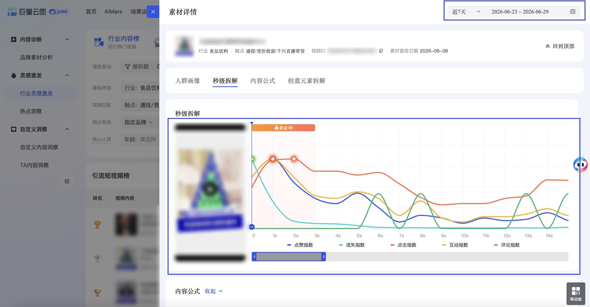

| 属性             | 值                                                                                                                                            |
| ---------------- | --------------------------------------------------------------------------------------------------------------------------------------------- |
| **连接器类型**   | `RPA 连接器`|
| **连接器代码**   | `rpa.conn.juliang.yt.industry.content.rankings.detail`|
| **操作类型**     | `页面解析`|
| **目标网页**     | `https://yuntu.oceanengine.com/yuntu_brand/ecom/content_new/creative/content_lab/inspiration/industryContent`|
| **适用场景**     | 采集巨量云图行业内容榜中指定素材的秒级拆解指数（点赞/流失/点击/互动/评论）及视频链接                                                         |

### 目标页面

> **路径**：巨量云图—内容—创意内容实验室—行业灵感—行业内容榜—素材详情—秒级拆解
>
> **网址**：[https://yuntu.oceanengine.com/yuntu_brand/ecom/content_new/creative/content_lab/inspiration/industryContent](https://yuntu.oceanengine.com/yuntu_brand/ecom/content_new/creative/content_lab/inspiration/industryContent)



### 业务入参

| 字段 | 中文释义 | 数据类型 | 必填 | 默认值 | 说明 |
| ---- | -------- | -------- | ---- | ------ | ---- |
| `material_id` | 素材 ID | `String` | 是 | — | 必须为纯数字 |
| `date_range_type` | 时间周期类型 | `String` | 是 | — | 可选值：`LAST_7_DAYS`（近7天）、`LAST_30_DAYS`（近30天）、`CUSTOM`（自定义） |
| `custom_start_date` | 自定义开始日期 | `String` | `date_range_type = CUSTOM` 时必填 | — | 支持格式：`YYYYMMDD`、`YYYY-MM-DD` |
| `custom_end_date` | 自定义结束日期 | `String` | `date_range_type = CUSTOM` 时必填 | — | 支持格式：`YYYYMMDD`、`YYYY-MM-DD`；不得早于 `custom_start_date` |

### 入参样例

**指定素材 ID + 近 7 天：**

```json
{
  "material_id": "7648216411198554162",
  "date_range_type": "LAST_7_DAYS"
}
```

**指定素材 ID + 近 30 天：**

```json
{
  "material_id": "7648216411198554162",
  "date_range_type": "LAST_30_DAYS"
}
```

**指定素材 ID + 自定义时间：**

```json
{
  "material_id": "7648216411198554162",
  "date_range_type": "CUSTOM",
  "custom_start_date": "2026-06-01",
  "custom_end_date": "2026-06-29"
}
```

### 入参校验

```json-schema collapsed
{
  "$schema": "https://json-schema.org/draft/2020-12/schema",
  "title": "巨量云图-行业内容榜素材详情秒级拆解 - 查询入参",
  "description": "采集巨量云图行业内容榜中指定素材的秒级拆解指数（点赞/流失/点击/互动/评论）及视频链接",
  "type": "object",
  "properties": {
    "material_id": {
      "type": "string",
      "description": "素材 ID，必须为纯数字",
      "pattern": "^\\d+$"
    },
    "date_range_type": {
      "type": "string",
      "description": "时间周期类型。可选值：LAST_7_DAYS（近7天）、LAST_30_DAYS（近30天）、CUSTOM（自定义）",
      "enum": ["LAST_7_DAYS", "LAST_30_DAYS", "CUSTOM"]
    },
    "custom_start_date": {
      "type": "string",
      "description": "自定义开始日期；date_range_type=CUSTOM 时必填。支持 YYYYMMDD 或 YYYY-MM-DD"
    },
    "custom_end_date": {
      "type": "string",
      "description": "自定义结束日期；date_range_type=CUSTOM 时必填。支持 YYYYMMDD 或 YYYY-MM-DD；不得早于 custom_start_date"
    }
  },
  "required": ["material_id", "date_range_type"],
  "if": {
    "properties": {
      "date_range_type": { "const": "CUSTOM" }
    },
    "required": ["date_range_type"]
  },
  "then": {
    "required": ["custom_start_date", "custom_end_date"],
    "dependentRequired": {
      "custom_start_date": ["custom_end_date"],
      "custom_end_date": ["custom_start_date"]
    }
  },
  "additionalProperties": false
}
```

### 数据字段

每次采集返回单条记录，`trends` 包含 5 类秒级拆解指数，`trendType` 取值 `1`=点赞指数、`2`=流失指数、`3`=点击指数、`4`=互动指数、`5`=评论指数。`bizDate` 格式为 `YYYYMMDD`。

:::field-tree
@define 曲线点
| `x` | 时间轴位置（秒） | `Number` | 否 | `trends[].tendList[].x` | `0` |
| `y` | 指数值（归一化 0–1） | `Number` | 否 | `trends[].tendList[].y` | `0.7358490566` |

@define 高光时刻
| `start_point` | 开始位置（秒） | `String` | 否 | `trends[].highPoint.start_point` | `1` |
| `end_point` | 结束位置（秒） | `String` | 否 | `trends[].highPoint.end_point` | `2` |

@define 流失点
| `start_point` | 开始位置（秒） | `String` | 否 | `trends[].lossPoint.start_point` | `0` |
| `end_point` | 结束位置（秒） | `String` | 否 | `trends[].lossPoint.end_point` | `1` |
| `loss_percent` | 流失比例 | `Number` | 否 | `trends[].lossPoint.loss_percent` | `0.5295117684` |

@define 秒级拆解指数
| `tendList` @曲线点 | 秒级曲线点列表 | `List[Dict]` | 否 | `trends[].tendList` | 见数据样例 |
| `highPoint` @高光时刻 | 高光时刻（高互动区间） | `Dict` | 是 | `trends[].highPoint` | 见数据样例 |
| `lossPoint` @流失点 | 流失点（最大流失区间） | `Dict` | 是 | `trends[].lossPoint` | 见数据样例 |
| `itemLink` | 视频预览链接 | `String` | 否 | `trends[].itemLink` | `https://yuntu.oceanengine.com/...` |
| `videoDurationType` | 视频时长类型 | `Number` | 否 | `trends[].videoDurationType` | `4` |
| `trendType` | 指数类型编号（1–5） | `Number` | 否 | `trends[].trendType` | `1` |
| `trendName` | 指数类型名称 | `String` | 否 | `trends[].trendName` | `点赞指数` |
| 字段 | 中文释义 | 数据类型 | 可为空 | 取数路径 | 示例 |
| ---- | -------- | -------- | ------ | -------- | ---- |
| `materialId` | 素材 ID | `String` | 否 | `materialId` | `7648216411198554162` |
| `startDate` | 统计开始日期 | `String` | 否 | `startDate` | `2026-06-23` |
| `endDate` | 统计结束日期 | `String` | 否 | `endDate` | `2026-06-29` |
| `dateRangeType` | 时间周期类型 | `String` | 否 | `dateRangeType` | `LAST_7_DAYS` |
| `videoUrl` | 视频 MP4 播放链接 | `String` | 是 | `videoUrl` | `https://v6-yd.oceanengine.com/...` |
| `trends` @秒级拆解指数 | 五类秒级拆解指数列表 | `List[Dict]` | 否 | `trends` | 见数据样例 |
| `allTrendZero` | 全部指数是否均为零 | `Boolean` | 否 | `allTrendZero` | `false` |
| `bizDate` | 业务日期 | `String` | 否 | 附加 |  |
| `accountId` | 授权 ID | `String` | 否 | 附加 |  |
:::

### 数据样例

```json
{
  "materialId": "7648216411198554162",
  "startDate": "2026-06-23",
  "endDate": "2026-06-29",
  "dateRangeType": "LAST_7_DAYS",
  "videoUrl": "https://v6-yd.oceanengine.com/a3279fcc65b76f20d0f0231cea93b982/6a4888f7/video/tos/cn/tos-cn-ve-51/oAqYCDrxzB5IfAeNoAzE95jQNID2g0qQkYR4sT/",
  "trends": [
    {
      "tendList": [
        { "x": 0, "y": 0.7358490566 },
        { "x": 1, "y": 1 },
        { "x": 2, "y": 0.6603773585 },
        { "x": 3, "y": 0.4339622642 }
      ],
      "highPoint": {
        "start_point": "1",
        "end_point": "2"
      },
      "lossPoint": {
        "start_point": "0",
        "end_point": "1",
        "loss_percent": 0.5295117684
      },
      "itemLink": "https://yuntu.oceanengine.com/yuntu_ng/content/shared/video_previewer?code=v02033g10000d8huopqljht8over7p9g",
      "videoDurationType": 4,
      "trendType": 1,
      "trendName": "点赞指数"
    },
    {
      "tendList": [
        { "x": 0, "y": 1 },
        { "x": 1, "y": 0.3901992067 },
        { "x": 2, "y": 0.1042562965 },
        { "x": 3, "y": 0.07222911 }
      ],
      "highPoint": null,
      "lossPoint": {
        "start_point": "0",
        "end_point": "1",
        "loss_percent": 0.5295117684
      },
      "itemLink": "https://yuntu.oceanengine.com/yuntu_ng/content/shared/video_previewer?code=v02033g10000d8huopqljht8over7p9g",
      "videoDurationType": 4,
      "trendType": 2,
      "trendName": "流失指数"
    },
    {
      "tendList": [
        { "x": 0, "y": 0.5897435897 },
        { "x": 1, "y": 0.9853479853 },
        { "x": 2, "y": 1 },
        { "x": 3, "y": 0.8241758242 }
      ],
      "highPoint": {
        "start_point": "2",
        "end_point": "3"
      },
      "lossPoint": {
        "start_point": "0",
        "end_point": "1",
        "loss_percent": 0.5295117684
      },
      "itemLink": "https://yuntu.oceanengine.com/yuntu_ng/content/shared/video_previewer?code=v02033g10000d8huopqljht8over7p9g",
      "videoDurationType": 4,
      "trendType": 3,
      "trendName": "点击指数"
    },
    {
      "tendList": [
        { "x": 0, "y": 0.7358490566 },
        { "x": 1, "y": 1 },
        { "x": 2, "y": 0.7358490566 },
        { "x": 3, "y": 0.4716981132 }
      ],
      "highPoint": {
        "start_point": "1",
        "end_point": "2"
      },
      "lossPoint": {
        "start_point": "0",
        "end_point": "1",
        "loss_percent": 0.5295117684
      },
      "itemLink": "https://yuntu.oceanengine.com/yuntu_ng/content/shared/video_previewer?code=v02033g10000d8huopqljht8over7p9g",
      "videoDurationType": 4,
      "trendType": 4,
      "trendName": "互动指数"
    },
    {
      "tendList": [
        { "x": 0, "y": 0 },
        { "x": 1, "y": 0 },
        { "x": 2, "y": 0 },
        { "x": 26, "y": 1 }
      ],
      "highPoint": {
        "start_point": "26",
        "end_point": "27"
      },
      "lossPoint": {
        "start_point": "0",
        "end_point": "1",
        "loss_percent": 0.5295117684
      },
      "itemLink": "https://yuntu.oceanengine.com/yuntu_ng/content/shared/video_previewer?code=v02033g10000d8huopqljht8over7p9g",
      "videoDurationType": 4,
      "trendType": 5,
      "trendName": "评论指数"
    }
  ],
  "allTrendZero": false,
  "bizDate": "20260704",
  "accountId": "114"
}
```

---
