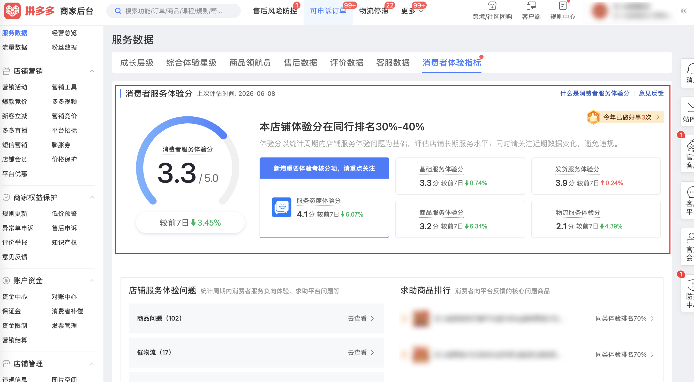

| 属性             | 值                                                                                  |
| ---------------- | ----------------------------------------------------------------------------------- |
| **连接器类型**   | `RPA 连接器`                                                                        |
| **连接器代码**   | `rpa.conn.pinduoduo.shop.consumer.experience.metrics`                             |
| **操作类型**     | `页面解析`                                                     |
| **目标网页**     | `https://mms.pinduoduo.com/sycm/goods_quality/help`                                 |
| **适用场景**     | 采集拼多多商家后台消费者服务体验分、各维度体验分及店铺服务体验问题数据              |

### 目标页面

> **路径**：拼多多商家后台—服务数据—消费者体验指标
>
> **网址**：[https://mms.pinduoduo.com/sycm/goods_quality/help](https://mms.pinduoduo.com/sycm/goods_quality/help)



### 业务入参

| 字段 | 中文释义 | 数据类型 | 必填 | 默认值 | 说明 |
| ---- | -------- | -------- | ---- | ------ | ---- |

### 入参样例

```json
{}
```

### 数据字段

| 字段                            | 中文释义                     | 数据类型      | 可为空 | 取数路径                        | 示例                |
| ------------------------------- | ---------------------------- | ------------- | ------ | ------------------------------- | ------------------- |
| `readyDate`                     | 数据更新日期                 | `string`      | 否     | `readyDate`                     | `2026-06-08`        |
| `cstmrServScore`                | 消费者服务体验分             | `number`      | 否     | `cstmrServScore`                | `3.3955933567`      |
| `cstmrServRank`                 | 同行排名                     | `number`      | 否     | `cstmrServRank`                 | `0.3208813287`      |
| `cstmrServScorePpr1w`           | 消费者服务体验分较7日前      | `number`      | 否     | `cstmrServScorePpr1w`           | `-0.0345`           |
| `cstmrServScoreWarningStatus`   | 体验分预警状态               | `number`      | 否     | `cstmrServScoreWarningStatus`   | `0`                 |
| `cstmrServScoreWarning`         | 消费者服务体验分预警说明     | `string`      | 是     | `cstmrServScoreWarning`         | `""`                |
| `attiLmScore`                   | 服务态度体验分               | `number`      | 否     | `attiLmScore`                   | `4.1197909443`      |
| `attiLmScorePpr1w`              | 服务态度体验分较7日前        | `number`      | 否     | `attiLmScorePpr1w`              | `-0.0607`           |
| `attiLmScoreWarning`            | 服务态度体验分预警说明       | `string`      | 是     | `attiLmScoreWarning`            | `null`              |
| `jcfwLmScore`                   | 基础服务体验分               | `number`      | 否     | `jcfwLmScore`                   | `3.3321627513`      |
| `jcfwLmScorePpr1w`              | 基础服务体验分较7日前        | `number`      | 否     | `jcfwLmScorePpr1w`              | `-0.0074`           |
| `jcfwLmScoreWarning`            | 基础服务体验分预警说明       | `string`      | 是     | `jcfwLmScoreWarning`            | `null`              |
| `spLmScore`                     | 商品服务体验分               | `number`      | 否     | `spLmScore`                     | `3.2255692152`      |
| `spLmScorePpr1w`                | 商品服务体验分较7日前        | `number`      | 否     | `spLmScorePpr1w`                | `-0.0634`           |
| `spLmScoreWarning`              | 商品服务体验分预警说明       | `string`      | 是     | `spLmScoreWarning`              | `null`              |
| `fhLmScore`                     | 发货服务体验分               | `number`      | 否     | `fhLmScore`                     | `3.9874353459`      |
| `fhLmScorePpr1w`                | 发货服务体验分较7日前        | `number`      | 否     | `fhLmScorePpr1w`                | `0.0024`            |
| `wlLmScore`                     | 物流服务体验分               | `number`      | 否     | `wlLmScore`                     | `2.1218982316`      |
| `wlLmScorePpr1w`                | 物流服务体验分较7日前        | `number`      | 否     | `wlLmScorePpr1w`                | `-0.0439`           |
| `ptHelpRate1m`                  | 平台介入率（近30天）         | `number`      | 否     | `ptHelpRate1m`                  | `0.0071460899`      |
| `ptHelpRate1mPpr1w`               | 平台介入率较7日前            | `number`      | 否     | `ptHelpRate1mPpr1w`             | `0.0659`            |
| `hotProblems`                   | 店铺服务体验问题             | `List[Dict]`  | 否     | `hotProblems`                   | 见数据样例 `hotProblems` |
| `showExpScoreExamEntrance`      | 是否展示体验分考试入口       | `boolean`     | 否     | `showExpScoreExamEntrance`      | `false`             |
| `bizDate`                       | 业务日期                     | `string`      | 否     | 附加                            |                     |
| `accountId`                     | 授权 ID                      | `string`      | 否     | 附加                            |                     |

### 数据样例

```json
{
  "readyDate": "2026-06-08",
  "cstmrServScore": 3.3955933567,
  "cstmrServRank": 0.3208813287,
  "cstmrServScorePpr1w": -0.0345,
  "cstmrServScoreWarningStatus": 0,
  "cstmrServScoreWarning": "",
  "attiLmScore": 4.1197909443,
  "attiLmScorePpr1w": -0.0607,
  "attiLmScoreWarning": null,
  "jcfwLmScore": 3.3321627513,
  "jcfwLmScorePpr1w": -0.0074,
  "jcfwLmScoreWarning": null,
  "spLmScore": 3.2255692152,
  "spLmScorePpr1w": -0.0634,
  "spLmScoreWarning": null,
  "fhLmScore": 3.9874353459,
  "fhLmScorePpr1w": 0.0024,
  "wlLmScore": 2.1218982316,
  "wlLmScorePpr1w": -0.0439,
  "ptHelpRate1m": 0.0071460899,
  "ptHelpRate1mPpr1w": 0.0659,
  "hotProblems": [
    {
      "title": "商品问题",
      "probNameId": 2,
      "probName": "商品",
      "probDetailId": 201,
      "probDetail": "商品问题",
      "clfyOrdrCntRate": 0.7906976744,
      "probDesc": null,
      "clfyOrdrCnt": 102,
      "recent2dNegativeExpCnt": 6,
      "seriousExpProblem": 0,
      "negTypeList": [103903],
      "isNeg": 1
    },
    {
      "title": "催物流",
      "probNameId": 3,
      "probName": "物流",
      "probDetailId": 302,
      "probDetail": "催物流",
      "clfyOrdrCntRate": 0.1317829457,
      "probDesc": null,
      "clfyOrdrCnt": 17,
      "recent2dNegativeExpCnt": 0,
      "seriousExpProblem": 0,
      "negTypeList": null,
      "isNeg": 0
    },
    {
      "title": "无理由",
      "probNameId": 4,
      "probName": "额外服务",
      "probDetailId": 401,
      "probDetail": "无理由",
      "clfyOrdrCntRate": 0.0620155039,
      "probDesc": null,
      "clfyOrdrCnt": 8,
      "recent2dNegativeExpCnt": 0,
      "seriousExpProblem": 0,
      "negTypeList": null,
      "isNeg": 0
    },
    {
      "title": "客服敷衍回复",
      "probNameId": 5,
      "probName": "服务态度",
      "probDetailId": 503,
      "probDetail": "客服敷衍回复",
      "clfyOrdrCntRate": 0.0387596899,
      "probDesc": null,
      "clfyOrdrCnt": 5,
      "recent2dNegativeExpCnt": 0,
      "seriousExpProblem": 0,
      "negTypeList": null,
      "isNeg": 0
    },
    {
      "title": "投诉物流",
      "probNameId": 3,
      "probName": "物流",
      "probDetailId": 303,
      "probDetail": "投诉物流",
      "clfyOrdrCntRate": 0.023255814,
      "probDesc": null,
      "clfyOrdrCnt": 3,
      "recent2dNegativeExpCnt": 0,
      "seriousExpProblem": 0,
      "negTypeList": null,
      "isNeg": 0
    },
    {
      "title": "运费",
      "probNameId": 4,
      "probName": "额外服务",
      "probDetailId": 402,
      "probDetail": "运费",
      "clfyOrdrCntRate": 0.015503876,
      "probDesc": null,
      "clfyOrdrCnt": 2,
      "recent2dNegativeExpCnt": 0,
      "seriousExpProblem": 0,
      "negTypeList": null,
      "isNeg": 0
    },
    {
      "title": "好评返现",
      "probNameId": 4,
      "probName": "额外服务",
      "probDetailId": 404,
      "probDetail": "好评返现",
      "clfyOrdrCntRate": 0.007751938,
      "probDesc": null,
      "clfyOrdrCnt": 1,
      "recent2dNegativeExpCnt": 0,
      "seriousExpProblem": 0,
      "negTypeList": null,
      "isNeg": 0
    },
    {
      "title": "操作求助",
      "probNameId": 4,
      "probName": "额外服务",
      "probDetailId": 406,
      "probDetail": "操作求助",
      "clfyOrdrCntRate": 0.007751938,
      "probDesc": null,
      "clfyOrdrCnt": 1,
      "recent2dNegativeExpCnt": 0,
      "seriousExpProblem": 0,
      "negTypeList": null,
      "isNeg": 0
    }
  ],
  "showExpScoreExamEntrance": false,
  "bizDate": "20260609",
  "accountId": "102"
}
```

---
