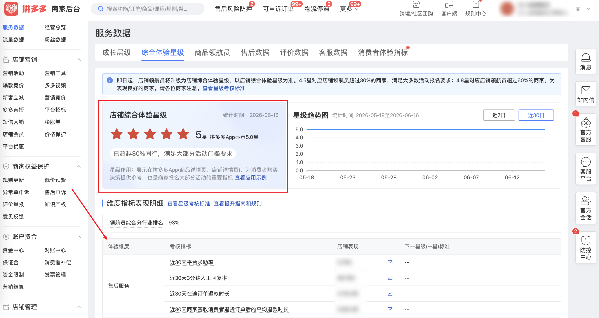

| 属性             | 值                                                                          |
| ---------------- | --------------------------------------------------------------------------- |
| **连接器类型**   | `RPA 连接器`                                                                |
| **连接器代码**   | `rpa.conn.pinduoduo.shop.pilot.mall`                                        |
| **操作类型**     | `页面解析`                                             |
| **目标网页**     | `https://mms.pinduoduo.com/sycm/goods_quality/pilot_mall`                   |
| **适用场景**     | 采集拼多多商家后台店铺综合体验星级及维度指标表现明细                        |

### 目标页面

> **路径**：拼多多商家后台—服务数据—综合体验星级
>
> **网址**：[https://mms.pinduoduo.com/sycm/goods_quality/pilot_mall](https://mms.pinduoduo.com/sycm/goods_quality/pilot_mall)



### 业务入参

| 字段 | 中文释义 | 数据类型 | 必填 | 默认值 | 说明 |
| ---- | -------- | -------- | ---- | ------ | ---- |

### 入参样例

```json
{}
```

### 数据字段

| 字段                        | 中文释义                               | 数据类型  | 可为空 | 取数路径                    | 示例                 |
| --------------------------- | -------------------------------------- | --------- | ------ | --------------------------- | -------------------- |
| `timestamp`                 | 统计时间                               | `String`  | 否     | `timestamp`                 | `2026-06-15`         |
| `mallId`                    | 店铺 ID                                | `Number`  | 否     | `mallId`                    | `888229089`          |
| `mallName`                  | 店铺名称                               | `String`  | 否     | `mallName`                  | `王小卤旗舰店`       |
| `stplName`                  | 主营类目                               | `String`  | 否     | `stplName`                  | `食品`               |
| `mallStarTomms`             | 店铺综合体验星级                       | `Number`  | 否     | `mallStarTomms`             | `5.0`                |
| `mallStarToc`               | 拼多多 App 显示星级                    | `Number`  | 否     | `mallStarToc`               | `5.0`                |
| `mallStarDesc`              | 星级描述                               | `String`  | 否     | `mallStarDesc`              | `已超越80%同行`      |
| `mallStarTommsChange`       | 星级较前期变化                         | `Number`  | 否     | `mallStarTommsChange`       | `0.0`                |
| `scoreRk`                   | 领航员综合分行业排名                   | `Number`  | 否     | `scoreRk`                   | `93.7475`            |
| `ptHelpRate1m`              | 近 30 天平台求助率                     | `Number`  | 否     | `ptHelpRate1m`              | `0.0078746379`       |
| `aprsIn3minRplyUsrRto1m`    | 近 30 天 3 分钟人工回复率               | `Number`  | 否     | `aprsIn3minRplyUsrRto1m`    | `0.9979135618`       |
| `rfSignTime1m`              | 近 30 天在途订单退款时长（小时）       | `Number`  | 否     | `rfSignTime1m`              | `3.7914279514`       |
| `rfProcTime1m`              | 近 30 天商家签收退货后平均退款时长（小时） | `Number`  | 否     | `rfProcTime1m`              | `5.5824902534`       |
| `avgDescRevScrRcatePct3m`   | 近 90 天用户评价得分排名               | `Number`  | 否     | `avgDescRevScrRcatePct3m`   | `68.29`              |
| `posTypeRto1m`              | 近 30 天积极评论率                     | `Number`  | 否     | `posTypeRto1m`              | `0.9907466496`       |
| `seriousInferiorRto1m`      | 近 30 天严重劣质率                     | `Number`  | 否     | `seriousInferiorRto1m`      | `0.0009741535`       |
| `adjNfkAvgCfmSignTime1m`    | 近 30 天成团签收时效（天）             | `Number`  | 否     | `adjNfkAvgCfmSignTime1m`    | `1.9952073492`       |
| `lgstMergeFine1m`           | 近 30 天物流综合违规处理率             | `Number`  | 否     | `lgstMergeFine1m`           | `0.0011753337`       |
| `gmvRk`                     | 近 30 天店铺活跃度                     | `Number`  | 否     | `gmvRk`                     | `99.492698966`       |
| `isRps`                     | 消费者体验提升计划开通状态             | `Boolean` | 否     | `isRps`                     | `true`               |
| `bizDate`                   | 业务日期                               | `String`  | 否     | 附加                        |                      |
| `accountId`                 | 授权 ID                                | `String`  | 否     | 附加                        |                      |

### 数据样例

```json
{
  "timestamp": "2026-06-15",
  "mallId": 888229089,
  "mallName": "王小卤旗舰店",
  "stplName": "食品",
  "mallStarTomms": 5.0,
  "mallStarToc": 5.0,
  "mallStarDesc": "已超越80%同行",
  "mallStarTommsChange": 0.0,
  "scoreRk": 93.7475,
  "ptHelpRate1m": 0.0078746379,
  "aprsIn3minRplyUsrRto1m": 0.9979135618,
  "rfSignTime1m": 3.7914279514,
  "rfProcTime1m": 5.5824902534,
  "avgDescRevScrRcatePct3m": 68.29,
  "posTypeRto1m": 0.9907466496,
  "seriousInferiorRto1m": 0.0009741535,
  "adjNfkAvgCfmSignTime1m": 1.9952073492,
  "lgstMergeFine1m": 0.0011753337,
  "gmvRk": 99.492698966,
  "isRps": true,
  "bizDate": "20260617",
  "accountId": "102"
}
```

---
