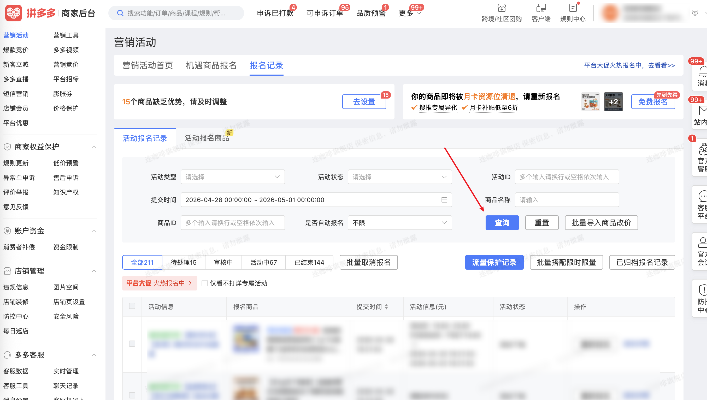

| 属性             | 值                                                                                  |
| ---------------- | ----------------------------------------------------------------------------------- |
| **连接器类型**   | `RPA 连接器`                                                                        |
| **连接器代码**   | `rpa.conn.pinduoduo.shop.register.record`                                           |
| **操作类型**     | `页面解析`                                                     |
| **目标网页**     | `https://mms.pinduoduo.com/act/register_record?tab=0`                               |
| **适用场景**     | 采集拼多多商家后台营销活动报名记录数据，支持按状态标签、活动类型、活动状态、商品名称/ID、提交时间筛选；支持翻页采集，最大 100 页 |

### 目标页面

> **路径**：拼多多商家后台—营销活动—报名记录
>
> **网址**：[https://mms.pinduoduo.com/act/register_record](https://mms.pinduoduo.com/act/register_record?tab=0)



### 业务入参

| 字段 | 中文释义 | 数据类型 | 必填 | 默认值 | 说明 |
| ---- | -------- | -------- | ---- | ------ | ---- |
| `status_tab` | 状态标签 | `string` | 否 | `全部` | 可选项：`全部`、`待处理`、`审核中`、`活动中`、`已结束` |
| `activity_type` | 活动类型 | `string` | 否 | — | 活动类型英文 code，如 `BILLION_SUBSIDY`（百亿补贴）；可选项见下方枚举 |
| `activity_status` | 活动状态 | `List[str]` 或 `string` | 否 | `[]` | 活动状态英文 code 列表，或英文逗号分隔字符串；`ALL` 表示全选（仅支持单值，不可与其它状态多选）；可选项见下方枚举 |
| `goods_name` | 商品名称 | `string` | 否 | — | 按商品名称模糊筛选 |
| `goods_id` | 商品 ID | `List[str]` 或 `string` | 否 | — | 英文逗号分隔字符串或列表；单个 ID 最长 17 位 |
| `submit_time_start` | 提交开始时间 | `string` | 与 `submit_time_end` 成对传入时必填 | — | 格式：`yyyyMMdd` / `yyyy-MM-dd` / `yyyyMMdd HH:mm:ss` / `yyyy-MM-dd HH:mm:ss`；纯日期自动补 `00:00:00` |
| `submit_time_end` | 提交结束时间 | `string` | 与 `submit_time_start` 成对传入时必填 | — | 格式同 `submit_time_start`；与开始时间范围不得超过 30 天 |

**`activity_type` 可选项：**

```json
{
    "LIMITED_FLASH_SALE": "限时秒杀",
    "SALE_99": "9块9特卖",
    "BIG_PROMOTION": "大促活动",
    "DAILY_GOOD_STORE": "每日好店",
    "LOVE_SHOPPING": "爱逛街",
    "CLEARANCE_BILLION_SUBSIDY": "断码清仓百亿补贴",
    "FOOD_SUPERMARKET": "食品超市",
    "LIMITED_DISCOUNT": "限时折扣",
    "QUANTITY_DISCOUNT": "限量折扣",
    "COUPON_CENTER": "领券中心",
    "BRAND_FLASH_SALE": "品牌秒杀",
    "MARKET_ACTIVITY": "市场活动",
    "BILLION_SUBSIDY": "百亿补贴",
    "CROSS_STORE_REBATE": "跨店满返",
    "SUPER_CATEGORY_DAY": "超级品类日",
    "NEW_CLOTHES_HALL": "新衣馆",
    "MEDICINE_HALL": "医药馆",
    "GLOBAL_PURCHASE": "全球购",
    "NEW_USER_EXCLUSIVE": "新人专享",
    "SAVE_MONEY_MONTHLY_CARD": "省钱月卡",
    "PERSONALIZED_HOMEPAGE": "个性化首页",
    "DUODUO_SUPPLY": "多多供货",
    "REMOTE_FREE_SHIPPING": "偏远包邮",
    "HOMEPAGE_RECOMMEND": "首页推荐专区",
    "BILLION_SUBSIDY_TIME_COUPON": "百亿补贴限时神券",
    "STORE_JOINT_SUBSIDY": "店铺联合补贴",
    "INFLUENCER_PROMOTION": "达人推广",
    "MULTI_PERSON_GROUP": "多人团",
    "TREND_GOOD_PRICE": "潮流好价",
    "BRAND_GOOD_PRICE": "品牌好价",
    "SCENE_EXCLUSIVE_COUPON": "场景专属券",
    "THREE_ORDER_CHALLENGE": "三单挑战",
    "MONTHLY_CARD_MEMBER": "月卡会员活动",
    "DUODUO_ORCHARD_SUBSIDY": "多多果园补贴",
    "SUPER_NIGHT_8": "超级晩8"
}
```

**`activity_status` 可选项：**

```json
{
    "ALL": "全选",
    "UNDER_REVIEW": "审核中",
    "REVIEW_PASSED": "审核通过",
    "REGISTRATION_REJECTED": "报名被驳回",
    "PENDING_DEPOSIT": "待缴活动保证金",
    "PENDING_FINAL_REVIEW": "待终审",
    "SYSTEM_PENDING_CONFIRM": "系统报名/返场待确认",
    "MARKETING_ACCOUNT_RECHARGE": "营销账户待充值",
    "SYSTEM_REVIEW_PASSED": "系统审核通过",
    "OPERATION_REVIEW_PASSED": "运营审核通过",
    "SYSTEM_PENDING_DEPOSIT_CHECK": "系统待校验保证金",
    "DEPOSIT_CHECK_PASSED": "保证金校验通过",
    "MERCHANT_CONFIRMED": "商家已确认返场/系统晋升",
    "PENDING_ADJUSTMENT": "待调整",
    "NEGOTIATION_PENDING_REVIEW": "协商待审核",
    "AGREE_ADJUSTMENT_PENDING": "同意调整待审核",
    "PENDING_SCHEDULE": "待确认排期",
    "ACTIVITY_TIME_CONFIRMED": "已确定具体活动时间",
    "SAMPLE_REVIEW": "寄样及寄样审核",
    "PUSHING": "推送中",
    "REGISTRATION_SUCCESS": "报名成功",
    "PUSH_FAILED": "推送失败",
    "CANCELLED": "已取消",
    "PRICE_REDUCED": "降低活动价格",
    "ACTIVITY_OFFLINE": "活动下线"
}
```

> **提示**：`status_tab` 选的不是 `全部` 时，部分 `activity_status` 在当前状态标签下不可设置；若传入了不可选的状态，连接器将返回空数据，并在结果消息中说明哪些状态不可选，例如：`当前状态标签「待处理」下活动状态「审核通过」不可选择`。

### 入参样例

```json
{
    "status_tab": "全部",
    "activity_type": "BILLION_SUBSIDY",
    "activity_status": "REVIEW_PASSED,CANCELLED,ACTIVITY_OFFLINE",
    "submit_time_start": "2026-04-28 01:00:00",
    "submit_time_end": "2026-05-01 21:49:59"
}
```

### 数据字段

| 字段 | 中文释义 | 数据类型 | 可为空 | 取数路径 | 示例 |
| ---- | -------- | -------- | ------ | -------- | ---- |
| `activity_goods_id` | 报名记录 ID | `number` | 否 | `activityGoodsId` | `11278861375712` |
| `activity_id` | 活动 ID | `number` | 否 | `activityId` | `22660` |
| `activity_name` | 活动名称 | `string` | 否 | `activityName` | `【免审】限时秒杀外场通道` |
| `activity_type` | 活动类型 | `number` | 否 | `activityType` | `101` |
| `business_type_str` | 活动类型描述 | `string` | 否 | `businessTypeStr` | `限时秒杀` |
| `goods_id` | 商品 ID | `number` | 否 | `goodsId` | `781634232288` |
| `goods_name` | 商品名称 | `string` | 否 | `goodsName` | `连咖啡燃燃咖黑咖啡粉2.1g*30袋…` |
| `thumb_url` | 商品缩略图 | `string` | 否 | `thumbUrl` | `https://img.pddpic.com/…` |
| `status` | 状态码 | `number` | 否 | `status` | `702` |
| `final_status_name` | 状态描述 | `string` | 否 | `finalStatusName` | `活动下线` |
| `activity_status` | 活动状态码 | `number` | 否 | `activityStatus` | `101` |
| `enroll_time` | 报名时间 | `number` | 否 | `enrollTime` | `1777548063239` |
| `enroll_start_time` | 活动报名开始时间 | `number` | 否 | `enrollStartTime` | `1681203898000` |
| `enroll_end_time` | 活动报名结束时间 | `number` | 否 | `enrollEndTime` | `1903795199000` |
| `refuse_reason` | 驳回原因 | `string` | 是 | `refuseReason` | — |
| `cancel_reason` | 取消原因 | `string` | 是 | `cancelReason` | — |
| `goods_quantity` | 商品库存 | `number` | 否 | `goodsQuantity` | `4986` |
| `sold_quantity` | 已售数量 | `number` | 否 | `soldQuantity` | `1014` |
| `activity_goods_time_list` | 活动时间段列表 | `List[Dict]` | 是 | `activityGoodsTimeList` | 见数据样例 `activity_goods_time_list` |
| `activity_sku_info` | SKU 活动信息 | `List[Dict]` | 是 | `activitySkuInfo` | 见数据样例 `activity_sku_info` |
| `min_on_sale_group_price` | 最低拼团价（分） | `number` | 是 | `minOnSaleGroupPrice` | `3290` |
| `bizDate` | 业务日期 | `string` | 否 | 附加 | |
| `accountId` | 授权 ID | `string` | 否 | 附加 | |

### 数据样例

```json
{
  "activity_goods_id": 11278861375712,
  "activity_id": 22660,
  "activity_name": "【免审】限时秒杀外场通道",
  "activity_type": 101,
  "business_type_str": "限时秒杀",
  "goods_id": 781634232288,
  "goods_name": "连咖啡燃燃咖黑咖啡粉2.1g*30袋椰子油茉莉风味熬夜办公提神美式",
  "thumb_url": "https://img.pddpic.com/gaudit-image/2025-07-18/5ad40cf05ba8194041dc05bfd228b57d.jpeg",
  "status": 702,
  "final_status_name": "活动下线",
  "activity_status": 101,
  "enroll_time": 1777548063239,
  "enroll_start_time": 1681203898000,
  "enroll_end_time": 1903795199000,
  "refuse_reason": null,
  "cancel_reason": null,
  "goods_quantity": 4986,
  "sold_quantity": 1014,
  "activity_goods_time_list": [
    {
      "activity_goods_start_time": 1777548063000,
      "activity_goods_end_time": 1777807263000,
      "activity_goods_event_id": 11278716990688,
      "event_type": 5,
      "max_activity_sku_price": 2980,
      "min_activity_sku_price": 1980,
      "activity_quantity": 3000
    }
  ],
  "activity_sku_info": [
    {
      "sku_id": 1761318107957,
      "sku_name": "【3盒】椰子油12条+茉莉山茶油6条",
      "goods_id": 781634232288,
      "activity_price": 1980,
      "cost_price": null,
      "is_on_sale": true
    },
    {
      "sku_id": 1761318107958,
      "sku_name": "【3盒】椰子油6条+山茶油6条+牛油果6条",
      "goods_id": 781634232288,
      "activity_price": 1980,
      "cost_price": null,
      "is_on_sale": true
    }
  ],
  "min_on_sale_group_price": 3290,
  "bizDate": "20260508",
  "accountId": "102"
}
```

---
