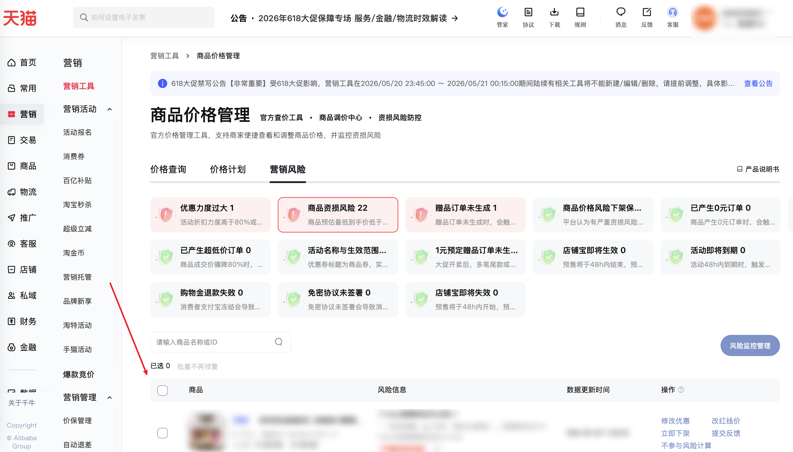

| 属性             | 值                                                                                                      |
| ---------------- | ------------------------------------------------------------------------------------------------------- |
| **连接器类型**   | `RPA 连接器`                                                                                            |
| **连接器代码**   | `rpa.conn.qianniu.marketing.risk.detect.item.list`                                                      |
| **操作类型**     | `页面解析`                                                                         |
| **目标网页**     | `https://myseller.taobao.com/home.htm/PriceManagement/?source=qianniulist&TabCode=Risk`                 |
| **适用场景**     | 按指定商品维度风险类型采集营销风险检测记录全量列表，用于价格与促销风险监控与处置跟进；默认配置每个风险选项卡最大翻页次数 100 |

### 目标页面

> **路径**：千牛后台—价格管理—营销风险
>
> **网址**：[https://myseller.taobao.com/home.htm/PriceManagement/?source=qianniulist&TabCode=Risk](https://myseller.taobao.com/home.htm/PriceManagement/?source=qianniulist&TabCode=Risk)



### 业务入参

| 字段 | 中文释义 | 数据类型 | 必填 | 默认值 | 说明 |
| ---- | -------- | -------- | ---- | ------ | ---- |
| `risk_codes` | 风险类型代码 | `string \| List[string]` | 是 | — | 支持数组或英文逗号分隔的字符串，可多选。可选值：`item_predict_risk`（商品资损风险）、`price_delist_protect`（商品价格风险下架保护）、`zero_price_order`（已产生0元订单）、`ultra_low_price_order`（已产生超低价订单）、`shop_coupon_upcoming`（店铺宝即将生效）、`shop_coupon_expiring`（店铺宝即将失效） |

### 入参样例

**数组形式：**

```json
{
    "risk_codes": [
        "item_predict_risk",
        "price_delist_protect",
        "zero_price_order",
        "ultra_low_price_order",
        "shop_coupon_upcoming",
        "shop_coupon_expiring"
    ]
}
```

**逗号分隔字符串形式：**

```json
{
    "risk_codes": "item_predict_risk,price_delist_protect,zero_price_order"
}
```

### 数据字段

| 字段 | 中文释义 | 数据类型 | 可为空 | 取数路径 | 示例 |
| ---- | -------- | -------- | ------ | -------- | ---- |
| `recordId` | 风险记录 ID | `number` | 否 | `recordId` | 1536683208195 |
| `riskCode` | 接口风险类型代码 | `string` | 否 | `riskCode` | ITEM_PREDICT_RISK_DETECT |
| `riskScope` | 风险作用域 | `string` | 否 | `riskScope` | itemId |
| `gmtModified` | 记录更新时间 | `string` | 否 | `gmtModified` | 2026-05-20 11:50:34 |
| `itemInfo` | 商品信息 | `Dict` | 否 | `itemInfo` | 见数据样例 `itemInfo` |
| `riskDesc` | 风险描述 | `Dict` | 否 | `riskDesc` | 见数据样例 `riskDesc` |
| `riskActionCode` | 可操作项代码 | `List[string]` | 否 | `riskActionCode` | 见数据样例 `riskActionCode` |
| `continueQuery` | 是否继续查询 | `boolean` | 否 | `continueQuery` | false |
| `success` | 单条记录处理是否成功 | `boolean` | 否 | `success` | false |
| `traceId` | 链路追踪 ID | `string` | 否 | `traceId` | 213e031b17792494264518559e0f01 |
| `riskCodeInput` | 入参风险类型代码 | `string` | 否 | 入参 `risk_codes` 对应项 | item_predict_risk |
| `riskLabel` | 风险选项卡名称 | `string` | 否 | 页面选项卡中文名 | 商品资损风险 |
| `bizDate` | 业务日期 | `string` | 否 | 附加 |  |
| `accountId` | 授权 ID | `string` | 否 | 附加 |  |
| `taskId` | 任务 ID | `string` | 否 | 附加 | dev-0-a6c3aaef |

### 数据样例

```json
[
    {
        "recordId": 1536683208195,
        "riskCode": "ITEM_PREDICT_RISK_DETECT",
        "riskScope": "itemId",
        "gmtModified": "2026-05-20 11:50:34",
        "itemInfo": {
            "attention": false,
            "auctionStatus": 0,
            "camp": false,
            "continueQuery": false,
            "fuseDownShelf": false,
            "itemDetailUrl": "https://item.taobao.com/item.htm?id=756965676475",
            "itemId": 756965676475,
            "itemTitle": "【林依轮直播间】连咖啡50颗意式浓缩黑咖啡粉速溶金馥顺桶",
            "mainPicture": "https://img.alicdn.com/imgextra/i4/2208761467628/O1CN01G3kjOd26DgKSawQre_!!4611686018427384556-0-item_pic.jpg_70x70.jpg",
            "originalPrice": "329.00",
            "originalPriceLowerBound": "329.00",
            "originalPriceUpperBound": "329.00",
            "preSale": true,
            "skuId": 6243384118974,
            "skuNum": 4,
            "success": false,
            "traceId": "213e031b17792494264518559e0f01"
        },
        "riskDesc": {
            "exampleLowPrice": "109.00",
            "exampleRedPrice": "279.00",
            "exampleSkuTitle": "「【双焙桶】3g*50杯（美式&拿铁）」",
            "lowPriceName": "普惠券后价",
            "lowPriceSkuNum": 1,
            "originalPrice": "199.00",
            "preSaleRisk": true,
            "promotionDetails": [
                {
                    "activityId": "134004051036",
                    "activityName": "天猫618抢先购官方立减",
                    "activityUrl": "//qn.taobao.com/home.htm/starb/tmc-next/sale/seller/sign_records.htm?signRecordId=3293806444",
                    "calculateLevel": 1,
                    "detailId": "2883737727238",
                    "discountMoney": "30.00",
                    "endTime": "2026-05-30 23:59:59",
                    "fundComponent": 1,
                    "parallel": false,
                    "promotionText": "8.5折",
                    "startTime": "2026-05-21 00:00:00",
                    "templateCode": "134004051036",
                    "toolCode": "commonItemDiscount",
                    "toolName": "官方立减"
                },
                {
                    "activityId": "135337563987",
                    "activityName": "林依轮金馥顺桶",
                    "activityUrl": "//qn.taobao.com/home.htm/coupon?isFirst=true&isNew=true&activityId=135337563987&tabType=1",
                    "calculateLevel": 2,
                    "detailId": "135337563987",
                    "discountMoney": "60.00",
                    "endTime": "2026-06-03 23:59:59",
                    "fundComponent": 1,
                    "parallel": false,
                    "promotionText": "满199元减60元",
                    "startTime": "2026-05-27 00:00:00",
                    "templateCode": "135337563987",
                    "toolCode": "itemCoupon",
                    "toolName": "商品优惠券"
                }
            ],
            "redPriceName": "近期普惠券后价",
            "riskDetectSubDesc": [
                "「【双焙桶】3g*50杯（美式&拿铁）」普惠券后价109.00 近期普惠券后价279.00"
            ],
            "riskDetectTitle": "1个sku普惠券后价过低",
            "riskTags": [
                "2"
            ]
        },
        "riskActionCode": [
            "MODIFY_ACTIVITY",
            "MODIFY_PROMOTION",
            "RED_PRICE",
            "DOWN_SHELF_ITEM",
            "FEEDBACK",
            "IMMUNE_ITEM"
        ],
        "continueQuery": false,
        "success": false,
        "traceId": "213e031b17792494264518559e0f01",
        "riskCodeInput": "item_predict_risk",
        "riskLabel": "商品资损风险",
        "bizDate": "20260520",
        "accountId": "106",
        "taskId": "dev-0-a6c3aaef"
    }
]
```

---
