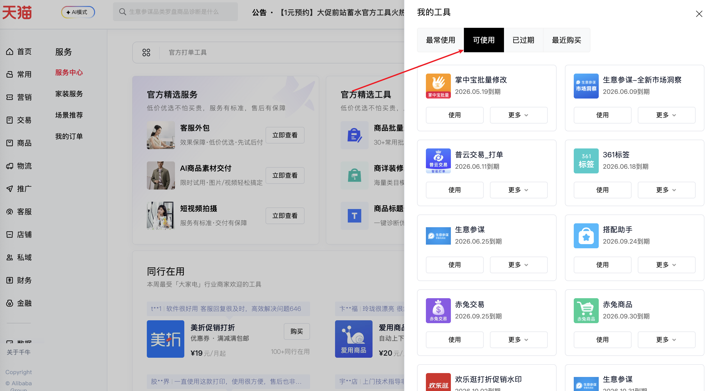

| 属性             | 值                                                                                         |
| ---------------- | ------------------------------------------------------------------------------------------ |
| **连接器类型**   | `RPA 连接器`                                                                               |
| **连接器代码**   | `rpa.conn.qianniu.shop.tools.usable.list`                                                  |
| **操作类型**     | `页面解析`                                                            |
| **目标网页**     | `https://myseller.taobao.com/home.htm/qianniu-service-market/`                             |
| **适用场景**     | 采集千牛服务市场中当前店铺已订购且可使用的工具/服务列表，包含到期时间、剩余天数等信息       |

### 目标页面

> **路径**：千牛后台—服务市场—我的工具—可使用
>
> **网址**：[https://myseller.taobao.com/home.htm/qianniu-service-market/](https://myseller.taobao.com/home.htm/qianniu-service-market/)



### 业务入参

| 字段 | 中文释义 | 数据类型 | 必填 | 默认值 | 说明 |
| ---- | -------- | -------- | ---- | ------ | ---- |

### 入参样例

```json
{}
```

### 数据字段

| 字段               | 中文释义       | 数据类型  | 可为空 | 取数路径        | 示例                                                                                  |
| ------------------ | -------------- | --------- | ------ | --------------- | ------------------------------------------------------------------------------------- |
| `articleCode`      | 服务编码       | `string`  | 否     | `articleCode`   | `A-FWDC`                                                                              |
| `articleName`      | 服务名称       | `string`  | 否     | `articleName`   | `官方客服绩效`                                                                        |
| `title`            | 工具标题       | `string`  | 否     | `title`         | `官方客服绩效`                                                                        |
| `itemCode`         | 订购项编码     | `string`  | 否     | `itemCode`      | `I-20GYSZHBB`                                                                         |
| `itemName`         | 订购版本名称   | `string`  | 否     | `itemName`      | `专业版`                                                                              |
| `endDate`          | 到期时间       | `string`  | 否     | `endDate`       | `2026-07-07 00:00:00`                                                                 |
| `expiringDays`     | 剩余天数       | `number`  | 否     | `expiringDays`  | `50`                                                                                  |
| `expiringDaysDesc` | 剩余天数描述   | `string`  | 是     | `expiringDaysDesc` | —                                                                                  |
| `logo`             | 图标 URL       | `string`  | 否     | `logo`          | `https://img.alicdn.com/tfs/TB18uSCYYY1gK0jSZTEXXXDQVXa-260-160.png`                 |
| `useUrl`           | 使用链接       | `string`  | 否     | `useUrl`        | `//fuwu.taobao.com/using/serv_use_soon.htm?service_code=A-FWDC&item_code=I-20GYSZHBB` |
| `detailUrl`        | 详情链接       | `string`  | 否     | `deailUrl`      | `//fw.taobao.com/common/detail.html?code=A-FWDC`                                      |
| `canScore`         | 是否可评分     | `boolean` | 否     | `canScore`      | `true`                                                                                |
| `tag`              | 版本标签       | `string`  | 是     | `tag`           | `专业版`                                                                              |
| `bizDate`          | 业务日期       | `string`  | 否     | 附加            |                                                                                       |
| `accountId`        | 授权 ID        | `string`  | 否     | 附加            |                                                                                       |
| `taskId`           | 任务 ID        | `string`  | 否     | 附加            |                                                                                       |

### 数据样例

```json
[
  {
    "articleCode": "A-FWDC",
    "articleName": "官方客服绩效",
    "title": "官方客服绩效",
    "itemCode": "I-20GYSZHBB",
    "itemName": "专业版",
    "endDate": "2026-07-07 00:00:00",
    "expiringDays": 50,
    "expiringDaysDesc": null,
    "logo": "https://img.alicdn.com/tfs/TB18uSCYYY1gK0jSZTEXXXDQVXa-260-160.png",
    "useUrl": "//fuwu.taobao.com/using/serv_use_soon.htm?service_code=A-FWDC&item_code=I-20GYSZHBB",
    "detailUrl": "//fw.taobao.com/common/detail.html?code=A-FWDC",
    "canScore": true,
    "tag": "专业版",
    "bizDate": "20260518",
    "accountId": "103"
  }
]
```

---
