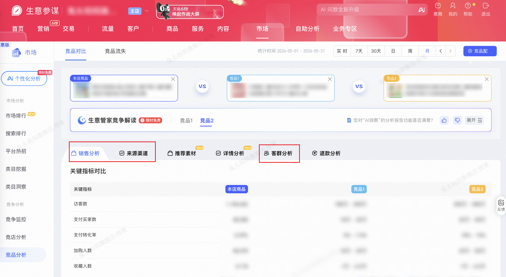

| 属性             | 值                                                                                 |
| ---------------- | ---------------------------------------------------------------------------------- |
| **连接器类型**   | `RPA 连接器`                                                                       |
| **连接器代码**   | `rpa.conn.sycm.item.ci`                                                            |
| **操作类型**     | `页面解析`                                                    |
| **目标网页**     | `https://sycm.taobao.com/mc/free/ci_item`                                          |
| **适用场景**     | 按本店与竞品商品 ID 采集生意参谋竞品对比页的销售分析、来源渠道与客群分析数据       |

### 目标页面

> **路径**：生意参谋—市场—竞争—竞品对比
>
> **网址**：[https://sycm.taobao.com/mc/free/ci_item](https://sycm.taobao.com/mc/free/ci_item)



### 业务入参

| 字段 | 中文释义 | 数据类型 | 必填 | 默认值 | 说明 |
| ---- | -------- | -------- | ---- | ------ | ---- |
| `self_item_id` | 本店商品 ID | `string` | 是 | — | 本店参与对比的商品 ID |
| `rival_item_id_1` | 竞品商品 ID（第一个） | `string` | 是 | — | 第一个竞品商品 ID |
| `rival_item_id_2` | 竞品商品 ID（第二个） | `string` | 否 | — | 第二个竞品商品 ID；不传则不采集竞品 2 相关数据 |
| `date_type` | 销售/来源统计周期类型 | `string` | 否 | 实时 | 允许值：`实时`/`today`（今日）、`recent7`（近 7 天）、`recent30`（近 30 天）、`day`（指定日）、`week`（指定周）、`month`（指定月） |
| `stat_date` | 销售/来源统计日期 | `string` | 条件必填 | — | 当 `date_type` 为 `day`/`week`/`month` 时必填；格式 `YYYYMMDD` 或 `YYYY-MM-DD` |
| `customer_date_type` | 客群分析统计周期类型 | `string` | 否 | `day` | 允许值：`day`（指定日）、`month`（指定月） |
| `customer_stat_date` | 客群分析统计日期 | `string` | 条件必填 | 昨天 | 当 `customer_date_type=month` 时必填；`day` 时未传则默认昨天；格式 `YYYYMMDD` 或 `YYYY-MM-DD`；日粒度范围为近 90 天（不含今天），月粒度仅支持过去 3 个完整月 |

> 三个商品 ID（`self_item_id` / `rival_item_id_1` / `rival_item_id_2`）不允许重复。执行前会在页面商品选择框中搜索校验 ID 是否可命中；未搜到则返回空数据。

### 入参样例

```json
{
    "self_item_id": "975048717355",
    "rival_item_id_1": "638281143270",
    "date_type": "week",
    "stat_date": "2026-04-14",
    "customer_date_type": "month",
    "customer_stat_date": "2026-05-14"
}
```

### 数据字段

每条任务输出 **1 条聚合记录**（`data[0]`），各模块以数组内嵌，非行级平铺。

:::field-tree
@define 统计时间对象
| `dateType` | 实际统计周期类型 | `string` | 否 | 对应模块接口 URL 中的 `dateType` | `week` |
| `dateRangeStart` | 实际统计区间起始日 | `string` | 否 | 对应模块接口 URL 中的 `dateRange` 起始 | `2026-04-13` |
| `dateRangeEnd` | 实际统计区间结束日 | `string` | 否 | 对应模块接口 URL 中的 `dateRange` 结束 | `2026-04-19` |

@define 对比商品项
| `role` | 商品角色 | `string` | 否 | 固定枚举 | `selfItem` |
| `itemId` | 商品 ID | `string` | 否 | 来自入参或搜索接口 | `975048717355` |
| `title` | 商品标题 | `string` | 是 | 搜索接口或页面 DOM | `疯狂动物城x兔头妈妈儿童牙膏儿童抗糖防蛀牙膏防蛀牙防龋齿含氟` |
| `picUrl` | 商品头图 URL | `string` | 是 | 搜索接口或页面 DOM | `https://img.alicdn.com/bao/uploaded/i2/3691886865/O1CN01K8VP9d20aE8hMbWc0_!!3691886865.jpg` |

@define 关键指标项
| `itemId` | 商品 ID | `number` | 否 | `itemId` | `975048717355` |
| `itemRole` | 商品角色 | `string` | 否 | 由接口 role 映射 | `selfItem` |
| `uv` | 访客数 | `number` / `string` | 是 | `uv` | `286971` |
| `payBuyerCnt` | 支付买家数 | `number` / `string` | 是 | `payByrCnt` | `12764` |
| `payRate` | 支付转化率 | `number` / `string` | 是 | `payRate` | `0.04447836192507257` |
| `cartBuyerCnt` | 加购人数 | `number` / `string` | 是 | `cartByrCnt` | `11284` |
| `collectBuyerCnt` | 收藏人数 | `number` / `string` | 是 | `cltByrCnt` | `891` |

@define SKU分析项
| `itemId` | 商品 ID | `string` | 否 | 来自入参 | `975048717355` |
| `itemRole` | 商品角色 | `string` | 否 | 由表格列映射 | `selfItem` |
| `skuId` | SKU ID | `string` | 否 | `skuId` | `6093008626514` |
| `skuName` | SKU 名称 | `string` | 否 | `skuName` | `颜色分类:【朱迪款】儿童防蛀抗糖牙膏-葡萄味 40g` |
| `payBuyerCntRatioMkt` | 支付买家数占比 | `number` | 是 | `payByrCntRatioMkt` | `0.5346` |
| `page` | 分页页码 | `number` | 否 | 分页序号 | `1` |

@define 属性分析项
| `itemId` | 商品 ID | `string` | 否 | 来自入参 | `975048717355` |
| `itemRole` | 商品角色 | `string` | 否 | 由表格列映射 | `selfItem` |
| `attrName` | 属性维度名称 | `string` | 否 | 接口请求 `attrName` 参数 | `颜色分类` |
| `attrValue` | 属性值 | `string` | 否 | `attrValue` | `【朱迪款】儿童防蛀抗糖牙膏-葡萄味 40g` |
| `payBuyerCntRatioMkt` | 支付买家数占比 | `number` | 是 | `payByrCntRatioMkt` | `0.5374` |
| `page` | 分页页码 | `number` | 否 | 分页序号 | `1` |

@define 入店搜索词项
| `itemId` | 商品 ID | `string` | 否 | 来自入参 | `975048717355` |
| `itemRole` | 商品角色 | `string` | 否 | 由接口 role 映射 | `selfItem` |
| `metricTab` | 指标 Tab | `string` | 否 | 由页面 Tab 映射 | `uv` |
| `keyword` | 搜索关键词 | `string` | 否 | `keyword` | `儿童牙膏` |
| `uv` | 访客数 | `number` / `string` | 是 | `uv` | `1369` |
| `payBuyerCnt` | 支付买家数 | `number` / `string` | 是 | `payByrCnt` | `341` |
| `payRate` | 支付转化率 | `number` / `string` | 是 | `payRate` | `0.2491` |

@define 入店来源项
| `itemId` | 商品 ID | `string` | 否 | 来自入参 | `975048717355` |
| `itemRole` | 商品角色 | `string` | 否 | 由接口 role 映射 | `selfItem` |
| `metricTab` | 指标 Tab | `string` | 否 | 由页面 Tab 映射 | `uv` |
| `sourceName` | 来源名称 | `string` | 否 | `pageName` / `sourceName` | `主动回访` |
| `parentSourceName` | 上级来源名称 | `string` | 是 | 树形父节点名称 | `主动回访` |
| `uv` | 访客数 | `number` / `string` | 是 | `{role}Uv` | `11176` |
| `payBuyerCnt` | 支付买家数 | `number` / `string` | 是 | `{role}PayByrCnt` | `1704` |
| `payRate` | 支付转化率 | `number` / `string` | 是 | `{role}PayRate` | `0.15246957766642805` |

@define 经营优势项
| `tabType` | 模块类型 | `string` | 否 | 固定枚举 | `sourceChannel` |
| `sourceName` | 来源名称 | `string` | 否 | `pageName` / `sourceName` | `搜索` |
| `parentSourceName` | 上级来源名称 | `string` | 是 | 树形父节点名称 | `付费推广` |
| `selfUv` | 本店访客数 | `number` / `string` | 是 | `selfItemUv` | `4876` |
| `selfPayBuyerCnt` | 本店支付买家数 | `number` / `string` | 是 | `selfItemPayByrCnt` | `967` |
| `selfPayRate` | 本店支付转化率 | `number` / `string` | 是 | `selfItemPayRate` | `0.198318293683347` |
| `rival1Uv` | 竞品 1 访客数 | `number` / `string` | 是 | `rivalItem1Uv` | `1万 ~ 2.5万` |
| `rival1PayBuyerCnt` | 竞品 1 支付买家数 | `number` / `string` | 是 | `rivalItem1PayByrCnt` | `1000 ~ 2500` |
| `rival1PayRate` | 竞品 1 支付转化率 | `number` / `string` | 是 | `rivalItem1PayRate` | `15% ~ 20%` |
| `rival2Uv` | 竞品 2 访客数 | `number` / `string` | 是 | `rivalItem2Uv` | — |
| `rival2PayBuyerCnt` | 竞品 2 支付买家数 | `number` / `string` | 是 | `rivalItem2PayByrCnt` | — |
| `rival2PayRate` | 竞品 2 支付转化率 | `number` / `string` | 是 | `rivalItem2PayRate` | — |

@define 客群画像项
| `itemId` | 商品 ID | `string` | 是 | 来自入参 | `975048717355` |
| `itemRole` | 商品角色 | `string` | 是 | 由接口 role 映射 | `selfItem` |
| `crowdsType` | 人群类型代码 | `string` | 否 | 接口 `crowdsType` | `appSearchUv` |
| `crowdsLabel` | 人群类型名称 | `string` | 否 | 页面 Tab 文案 | `搜索人群` |
| `profileType` | 画像维度 | `string` | 是 | 接口 `profileType` | `gender` |
| `attrValue` | 画像属性值 | `string` | 是 | `attrValue` | `女` |
| `ratio` | 占比 | `number` | 是 | `{crowdsType}.ratio` | `0.8717` |
| `dataStatus` | 数据状态 | `string` | 是 | 仅 Tab 全员无数据占位行输出 | `UNSUPPORTED` |
| `noDataReason` | 无数据原因 | `string` | 是 | 仅 Tab 全员无数据占位行输出 | `人群较少暂不支持分析` |
| 字段 | 中文释义 | 数据类型 | 可为空 | 取数路径 | 示例 |
| ---- | -------- | -------- | ------ | -------- | ---- |
| `selfItemId` | 本店商品 ID | `string` | 否 | 来自入参 | `975048717355` |
| `rivalItemId1` | 竞品 1 商品 ID | `string` | 否 | 来自入参 | `638281143270` |
| `rivalItemId2` | 竞品 2 商品 ID | `string` | 是 | 来自入参 | `null` |
| `dateType` | 销售/来源统计周期类型 | `string` | 否 | 由入参 `date_type` 映射 | `week` |
| `dateRangeStart` | 销售/来源统计区间起始日 | `string` | 否 | 由入参与周期类型计算 | `2026-04-13` |
| `dateRangeEnd` | 销售/来源统计区间结束日 | `string` | 否 | 由入参与周期类型计算 | `2026-04-19` |
| `compareItems` @对比商品项 | 对比商品信息 | `List[Dict]` | 是 | 预检搜索与页面回填；按本店 → 竞品 1 → 竞品 2 顺序 | 见数据样例 |
| `keyMetrics` @关键指标项 | 关键指标对比 | `List[Dict]` | 是 | 销售分析；本店/竞品各一行 | 见数据样例 |
| `skuAnalysis` @SKU分析项 | SKU 分析 | `List[Dict]` | 是 | SKU 分析 | 见数据样例 |
| `attributeAnalysis` @属性分析项 | 属性分析 | `List[Dict]` | 是 | 属性分析 | 见数据样例 |
| `saleStatTime` @统计时间对象 | 销售分析实际统计时间 | `Dict` | 是 | 销售分析模块 | 见数据样例 |
| `searchWords` @入店搜索词项 | 入店搜索词 | `List[Dict]` | 是 | 来源渠道 | 见数据样例 |
| `flowSource` @入店来源项 | 入店来源 | `List[Dict]` | 是 | 来源渠道 | 见数据样例 |
| `bizAdvantage` @经营优势项 | 经营优势 | `List[Dict]` | 是 | 来源渠道 | 见数据样例 |
| `flowStatTime` @统计时间对象 | 来源渠道实际统计时间 | `Dict` | 是 | 来源渠道模块 | 见数据样例 |
| `customerProfile` @客群画像项 | 客群画像 | `List[Dict]` | 是 | 客群分析 | 见数据样例 |
| `customerStatTime` @统计时间对象 | 客群分析实际统计时间 | `Dict` | 是 | 客群分析模块 | 见数据样例 |
| `bizDate` | 业务日期 | `string` | 否 | 附加 |  |
| `accountId` | 授权 ID | `string` | 否 | 附加 |  |
:::

> **对比商品信息**：预检阶段通过商品搜索接口回填标题与头图；进入目标页后若 DOM 已渲染，会再次读取页面商品位补全。按 `selfItem` → `rivalItem1` → `rivalItem2` 顺序输出；未传入竞品 2 时不含 `rivalItem2` 条目。
>
> **关键指标对比**：每个参与对比的商品（本店 / 竞品 1 / 竞品 2）各输出一行。竞品侧部分指标为区间脱敏值（如 `1万 ~ 2.5万`），本店侧为精确数值。
>
> **入店搜索词**：按指标 Tab（访客数 / 支付买家数 / 支付转化率）分别采集；`date_type=today` 时仅采集访客数 Tab。
>
> **入店来源**：树形结构按节点展开，子节点带 `parentSourceName`；按指标 Tab 分别采集。
>
> **经营优势**：横向对比本店与竞品，非按 `itemRole` 展开；`tabType` 允许值 `sourceChannel`（来源渠道）、`specialAdvantage`（专项优势）。`rival2*` 字段仅在入参传入 `rival_item_id_2` 时输出。
>
> **客群画像**：覆盖搜索人群 / 访问人群 / 支付人群三个 Tab，依次切换采集；某 Tab 页面提示「当前人群较少，暂不支持分析」时视为该 Tab 全员无数据。`profileType` 允许值：`gender`（性别）、`age`（年龄）、`crowd`（人群标签）、`brand_prefer`（品牌偏好）、`cate_prefer`（类目偏好）、`city`（城市）、`province`（省份）。
>
> **客群画像无数据场景**：
>
> | 场景 | 输出 |
> | ---- | ---- |
> | 某 Tab 全员无数据（如支付人群） | 该 Tab 写入 **1 条占位行**，`dataStatus=UNSUPPORTED`，`noDataReason=人群较少暂不支持分析`，其余画像字段为 `null` |
> | 某 Tab 有竞品数据 | 输出正常画像行，**不含** `dataStatus` / `noDataReason` 字段 |
> | 本店无数据、竞品有数据 | 仅输出竞品正常画像行，**不写占位行**（Tab 级仍有数据） |
>
> 下游可按 `dataStatus === "UNSUPPORTED"` 识别平台暂不支持分析；正常画像行不含 `dataStatus` / `noDataReason` 字段。

### 数据样例

```json
{
    "accountId": "108",
    "bizDate": "20260615",
    "selfItemId": "975048717355",
    "rivalItemId1": "638281143270",
    "rivalItemId2": null,
    "dateType": "week",
    "dateRangeStart": "2026-04-13",
    "dateRangeEnd": "2026-04-19",
    "compareItems": [
        {
            "role": "selfItem",
            "itemId": "975048717355",
            "title": "疯狂动物城x兔头妈妈儿童牙膏儿童抗糖防蛀牙膏防蛀牙防龋齿含氟",
            "picUrl": "https://img.alicdn.com/bao/uploaded/i2/3691886865/O1CN01K8VP9d20aE8hMbWc0_!!3691886865.jpg"
        },
        {
            "role": "rivalItem1",
            "itemId": "638281143270",
            "title": "贝德美儿童洗发水儿专用0-15宝宝控油去屑蓬松青少年中大童洗头膏",
            "picUrl": "https://img.alicdn.com/bao/uploaded/i2/2201196082363/O1CN01oGHWSU1TKJ3HZROuH_!!4611686018427385019-0-item_pic.jpg"
        }
    ],
    "keyMetrics": [
        {
            "cartBuyerCnt": 11284,
            "collectBuyerCnt": 891,
            "itemId": 975048717355,
            "itemRole": "selfItem",
            "payBuyerCnt": 12764,
            "payRate": "0.04447836192507257",
            "uv": 286971
        },
        {
            "cartBuyerCnt": "2.5万 ~ 5万",
            "collectBuyerCnt": "5000 ~ 7500",
            "itemId": 638281143270,
            "itemRole": "rivalItem1",
            "payBuyerCnt": "1万 ~ 2.5万",
            "payRate": "1% ~ 2.5%",
            "uv": "75万 ~ 100万"
        }
    ],
    "skuAnalysis": [
        {
            "itemId": "975048717355",
            "itemRole": "selfItem",
            "skuId": "6093008626514",
            "skuName": "颜色分类:【朱迪款】儿童防蛀抗糖牙膏-葡萄味 40g",
            "payBuyerCntRatioMkt": 0.5346,
            "page": 1
        }
    ],
    "attributeAnalysis": [
        {
            "attrName": "颜色分类",
            "attrValue": "【朱迪款】儿童防蛀抗糖牙膏-葡萄味 40g",
            "itemId": "975048717355",
            "itemRole": "selfItem",
            "payBuyerCntRatioMkt": 0.5374,
            "page": 1
        }
    ],
    "saleStatTime": {
        "dateType": "week",
        "dateRangeStart": "2026-04-13",
        "dateRangeEnd": "2026-04-19"
    },
    "searchWords": [
        {
            "itemId": "975048717355",
            "itemRole": "selfItem",
            "keyword": "儿童牙膏",
            "metricTab": "uv",
            "payBuyerCnt": 341,
            "payRate": 0.2491,
            "uv": 1369
        }
    ],
    "flowSource": [
        {
            "itemId": "975048717355",
            "itemRole": "selfItem",
            "metricTab": "uv",
            "sourceName": "主动回访",
            "payBuyerCnt": 1704,
            "payRate": 0.15246957766642805,
            "uv": 11176
        },
        {
            "itemId": "975048717355",
            "itemRole": "selfItem",
            "metricTab": "uv",
            "parentSourceName": "主动回访",
            "sourceName": "站内沟通",
            "payBuyerCnt": 1679,
            "payRate": 0.23306496390893947,
            "uv": 7204
        }
    ],
    "bizAdvantage": [
        {
            "rival1PayBuyerCnt": "1000 ~ 2500",
            "rival1PayRate": "15% ~ 20%",
            "rival1Uv": "1万 ~ 2.5万",
            "selfPayBuyerCnt": 967,
            "selfPayRate": "0.198318293683347",
            "selfUv": 4876,
            "sourceName": "搜索",
            "tabType": "sourceChannel"
        },
        {
            "parentSourceName": "付费推广",
            "rival1PayBuyerCnt": "750 ~ 1000",
            "rival1PayRate": "20% ~ 25%",
            "rival1Uv": "2500 ~ 5000",
            "selfPayBuyerCnt": 269,
            "selfPayRate": 0.3237063778580024,
            "selfUv": 831,
            "sourceName": "淘宝客",
            "tabType": "specialAdvantage"
        }
    ],
    "flowStatTime": {
        "dateType": "week",
        "dateRangeStart": "2026-04-13",
        "dateRangeEnd": "2026-04-19"
    },
    "customerProfile": [
        {
            "attrValue": "女",
            "crowdsLabel": "搜索人群",
            "crowdsType": "appSearchUv",
            "itemId": "975048717355",
            "itemRole": "selfItem",
            "profileType": "gender",
            "ratio": 0.8717
        },
        {
            "crowdsType": "payByrCnt",
            "crowdsLabel": "支付人群",
            "profileType": null,
            "attrValue": null,
            "ratio": null,
            "itemRole": null,
            "itemId": null,
            "dataStatus": "UNSUPPORTED",
            "noDataReason": "人群较少暂不支持分析"
        }
    ],
    "customerStatTime": {
        "dateType": "month",
        "dateRangeStart": "2026-05-01",
        "dateRangeEnd": "2026-05-31"
    }
}
```

---
