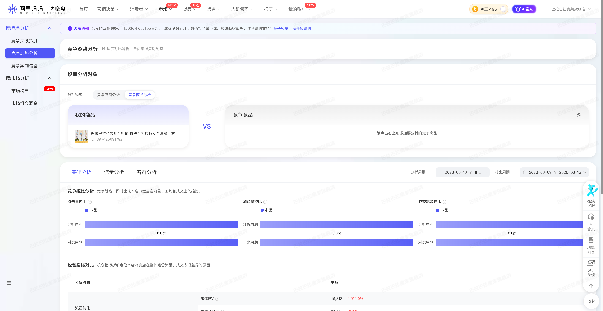

| 属性             | 值                                                                                      |
| ---------------- | --------------------------------------------------------------------------------------- |
| **连接器类型**   | `RPA 连接器`                                                                            |
| **连接器代码**   | `rpa.conn.alimm.dmp.compete.situation.item`                                             |
| **归属 PyPI 包** | `rpa-conn-alimm-all`                                                                    |
| **操作类型**     | 浏览器自动化操作 + 网络请求监听                                                         |
| **目标网页**     | `https://dmp.taobao.com/index_new.html#!/compete/compete-situation`                     |
| **适用场景**     | 采集达摩盘竞争态势分析页中本品与竞品的「基础分析 + 流量分析（广告域/全域归因）」指标，支持快捷周期与自定义四段日期 |
| **预估耗时**     | `90s`                                                                                   |

### 目标页面

> **路径**：阿里妈妈达摩盘—市场—竞争分析—竞争态势分析—竞争商品分析
>
> **网址**：[https://dmp.taobao.com/index_new.html#!/compete/compete-situation](https://dmp.taobao.com/index_new.html#!/compete/compete-situation)



### 业务入参

| 字段 | 中文释义 | 数据类型 | 必填 | 默认值 | 说明 |
| ---- | -------- | -------- | ---- | ------ | ---- |
| `self_item_id` | 本店商品 ID | `String` | 是 | — | `self_item_id` 与 `rival_item_id_1/2/3` 不允许重复 |
| `rival_item_id_1` | 竞争商品 ID（第一个） | `String` | 是 | — | — |
| `rival_item_id_2` | 竞争商品 ID（第二个） | `String` | 否 | — | — |
| `rival_item_id_3` | 竞争商品 ID（第三个） | `String` | 否 | — | — |
| `date_type` | 分析周期类型 | `String` | 否 | `recent7` | 可选值：`yesterday`（昨日）、`recent7`（近7天）、`recent30`（近30天）、`custom`（自定义）；别名：`昨日`、`近7天`、`近30天`、`自定义`；兼容旧入参 `today`（等同 `yesterday`） |
| `begin_date` | 分析开始日期 | `String` | 条件必填 | — | `date_type=custom` 时必填；支持格式：YYYYMMDD、YYYY-MM-DD；别名 `beginDate` |
| `end_date` | 分析结束日期 | `String` | 条件必填 | — | `date_type=custom` 时必填；支持格式：YYYYMMDD、YYYY-MM-DD；别名 `endDate` |
| `peer_begin_date` | 对比周期开始日期 | `String` | 条件必填 | — | `date_type=custom` 时必填；支持格式：YYYYMMDD、YYYY-MM-DD；别名 `peerBeginDate` |
| `peer_end_date` | 对比周期结束日期 | `String` | 条件必填 | — | `date_type=custom` 时必填；支持格式：YYYYMMDD、YYYY-MM-DD；别名 `peerEndDate` |

**周期说明：**

- **快捷周期**（`yesterday` / `recent7` / `recent30`）：结束日固定为「昨日」；对比周期为分析周期前一段等长区间（环比，与分析周期不重叠）。
- **自定义周期**（`custom`）：四段日期均由入参指定；分析周期与对比周期允许重叠；每段日期须在「最近 90 天、最晚至昨日」窗口内。
- **全域归因**：切换失败或未捕获到对应接口响应时，任务返回 `success=False`（不再静默成功）。

### 入参样例

```json
{
  "self_item_id": "897425691792",
  "rival_item_id_1": "1057000824998",
  "rival_item_id_2": "1044235732163",
  "rival_item_id_3": "1019326026903",
  "date_type": "recent7"
}
```

```json
{
  "self_item_id": "897425691792",
  "rival_item_id_1": "1057000824998",
  "date_type": "yesterday"
}
```

```json
{
  "self_item_id": "897425691792",
  "rival_item_id_1": "1057000824998",
  "date_type": "custom",
  "begin_date": "20260610",
  "end_date": "20260620",
  "peer_begin_date": "20260605",
  "peer_end_date": "20260615"
}
```

### 入参校验

```json-schema collapsed
{
  "$schema": "https://json-schema.org/draft/2020-12/schema",
  "title": "阿里妈妈达摩盘-竞争商品分析 - 查询入参",
  "description": "采集达摩盘竞争态势分析页中本品与竞品的「基础分析 + 流量分析（广告域/全域归因）」指标，支持快捷周期与自定义四段日期",
  "type": "object",
  "properties": {
    "self_item_id": {
      "type": "string",
      "description": "本店商品 ID"
    },
    "rival_item_id_1": {
      "type": "string",
      "description": "竞争商品 ID（第一个）"
    },
    "rival_item_id_2": {
      "type": "string",
      "description": "竞争商品 ID（第二个）"
    },
    "rival_item_id_3": {
      "type": "string",
      "description": "竞争商品 ID（第三个）"
    },
    "date_type": {
      "type": "string",
      "description": "分析周期类型。可选值：yesterday（昨日）、recent7（近7天）、recent30（近30天）、custom（自定义）；别名：昨日、近7天、近30天、自定义；today 兼容为 yesterday",
      "enum": [
        "yesterday",
        "recent7",
        "recent30",
        "custom",
        "昨日",
        "近7天",
        "近30天",
        "自定义",
        "today"
      ],
      "default": "recent7"
    },
    "begin_date": {
      "type": "string",
      "description": "分析开始日期；date_type=custom 时必填；支持 YYYYMMDD 或 YYYY-MM-DD"
    },
    "end_date": {
      "type": "string",
      "description": "分析结束日期；date_type=custom 时必填；支持 YYYYMMDD 或 YYYY-MM-DD；须在最近 90 天内且最晚为昨日"
    },
    "peer_begin_date": {
      "type": "string",
      "description": "对比周期开始日期；date_type=custom 时必填；支持 YYYYMMDD 或 YYYY-MM-DD"
    },
    "peer_end_date": {
      "type": "string",
      "description": "对比周期结束日期；date_type=custom 时必填；支持 YYYYMMDD 或 YYYY-MM-DD；须在最近 90 天内且最晚为昨日"
    }
  },
  "required": ["self_item_id", "rival_item_id_1"],
  "allOf": [
    {
      "if": {
        "properties": {
          "date_type": { "const": "custom" }
        },
        "required": ["date_type"]
      },
      "then": {
        "required": [
          "begin_date",
          "end_date",
          "peer_begin_date",
          "peer_end_date"
        ]
      }
    }
  ],
  "additionalProperties": false
}
```

### 数据字段

输出为 `data[0]` 单条聚合对象，包含任务元数据、汇总分析、原始映射数据与数据质量信息。

:::field-tree
@define 竞品指标项
| `base` | 分析周期值 | `Number / String` | 是 | competitorList[].base | `372` |
| `basePeriod` | 对比周期值 | `Number / String` | 是 | competitorList[].basePeriod | `325` |
| `growthRate` | 环比增长率 | `Number / String` | 是 | competitorList[].growthRate | `0.15` |
| `competitorId` | 商品 ID | `String` | 否 | competitorList[].competitorId | `897425691792` |

@define 单指标竞争对比
| `competitorList` @竞品指标项 | 本品/竞品对比列表 | `List[Dict]` | 是 | data.{metric}.competitorList | 见数据样例 |

@define 接口指标字典
| `{metricKey}` @单指标竞争对比 | 指标竞争对比 | `Dict` | 是 | base/shop indicator data.{metricKey} | 见数据样例 |

@define 渠道树节点
| `channelName` | 渠道名称 | `String` | 是 | flow/indicator list[].channelName | `关键词推广` |
| `channelId` | 渠道 ID | `String` | 是 | flow/indicator list[].channelId | `371` |
| `channelType` | 渠道类型 | `String` | 是 | flow/indicator list[].channelType | `ad` |
| `subChannels` @渠道树节点 | 子渠道列表 | `List[Dict]` | 是 | flow/indicator list[].subChannels | 见数据样例 |
| `{metricKey}` @单指标竞争对比 | 渠道指标 | `Dict` | 是 | flow/indicator list[].{metricKey} | 见数据样例 |

@define 原始映射数据
| `baseData` @接口指标字典 | 基础分析原始指标 | `Dict` | 否 | base/indicator data | 见数据样例 |
| `shopData` @接口指标字典 | 店铺分析原始指标 | `Dict` | 否 | base/shop/indicator data | 见数据样例 |
| `flowAdData` @渠道树节点 | 广告域归因渠道树 | `List[Dict]` | 否 | flow/indicator（广告域）list | 见数据样例 |
| `flowFullData` @渠道树节点 | 全域归因渠道树 | `List[Dict]` | 否 | flow/indicator（全域）list | 见数据样例 |

@define 基础分析条目
| `itemRole` | 商品角色 | `String` | 否 | 经入参映射 | `selfItem` |
| `itemId` | 商品 ID | `String` | 否 | 经入参映射 | `897425691792` |
| `ipv` | 浏览量 | `Number / String` | 是 | 经 base/shop 指标汇总 | — |
| `cartRate` | 加购率 | `Number / String` | 是 | 经 base/shop 指标汇总 | — |
| `conversionRate` | 成交转化率 | `Number / String` | 是 | 经 base/shop 指标汇总 | — |
| `orderCount` | 成交笔数 | `Number / String` | 是 | 经 base/shop 指标汇总 | — |
| `avgOrderValue` | 笔单价 | `Number / String` | 是 | 经 base/shop 指标汇总 | — |
| `paidClickCount` | 付费点击量 | `Number / String` | 是 | 经 base 指标汇总 | — |
| `clickCost` | 点击成本 | `Number / String` | 是 | 经 base 指标汇总 | — |
| `roi1d` | 当天引导 ROI | `Number / String` | 是 | 经 base 指标汇总 | — |
| `guidedOrderCount1d` | 当天引导成交笔数 | `Number / String` | 是 | 经 base 指标汇总 | — |

@define 效果广告汇总
| `wholeNetworkClickCount` | 全站推广点击量 | `Number / String` | 是 | 经广告域渠道汇总 | — |
| `wholeNetworkCartRate1d` | 全站推广当天引导加购率 | `Number / String` | 是 | 经广告域渠道汇总 | — |
| `wholeNetworkClickRate1d` | 全站推广当天引导点击率 | `Number / String` | 是 | 经广告域渠道汇总 | — |
| `wholeNetworkConversionRate1d` | 全站推广当天引导成交转化率 | `Number / String` | 是 | 经广告域渠道汇总 | — |
| `wholeNetworkRoi1d` | 全站推广当天引导 ROI | `Number / String` | 是 | 经广告域渠道汇总 | — |
| `keywordClickCount` | 关键词推广点击量 | `Number / String` | 是 | 经广告域渠道汇总 | — |
| `keywordCartRate1d` | 关键词推广当天引导加购率 | `Number / String` | 是 | 经广告域渠道汇总 | — |
| `keywordClickRate1d` | 关键词推广当天引导点击率 | `Number / String` | 是 | 经广告域渠道汇总 | — |
| `keywordConversionRate1d` | 关键词推广当天引导成交转化率 | `Number / String` | 是 | 经广告域渠道汇总 | — |
| `keywordRoi1d` | 关键词推广当天引导 ROI | `Number / String` | 是 | 经广告域渠道汇总 | — |
| `audienceClickCount` | 人群推广点击量 | `Number / String` | 是 | 经广告域渠道汇总 | — |
| `audienceCartRate1d` | 人群推广当天引导加购率 | `Number / String` | 是 | 经广告域渠道汇总 | — |
| `audienceClickRate1d` | 人群推广当天引导点击率 | `Number / String` | 是 | 经广告域渠道汇总 | — |
| `audienceConversionRate1d` | 人群推广当天引导成交转化率 | `Number / String` | 是 | 经广告域渠道汇总 | — |
| `audienceRoi1d` | 人群推广当天引导 ROI | `Number / String` | 是 | 经广告域渠道汇总 | — |

@define 非广告汇总
| `recommendClickCount` | 淘宝推荐点击量 | `Number / String` | 是 | 经全域归因一级渠道汇总 | — |
| `recommendCartRate1d` | 淘宝推荐当天引导加购率 | `Number / String` | 是 | 经全域归因一级渠道汇总 | — |
| `recommendConversionRate1d` | 淘宝推荐当天引导成交转化率 | `Number / String` | 是 | 经全域归因一级渠道汇总 | — |
| `searchClickCount` | 淘宝搜索点击量 | `Number / String` | 是 | 经全域归因一级渠道汇总 | — |
| `searchCartRate1d` | 淘宝搜索当天引导加购率 | `Number / String` | 是 | 经全域归因一级渠道汇总 | — |
| `searchConversionRate1d` | 淘宝搜索当天引导成交转化率 | `Number / String` | 是 | 经全域归因一级渠道汇总 | — |
| `liveClickCount` | 淘宝直播点击量 | `Number / String` | 是 | 经全域归因一级渠道汇总 | — |
| `liveCartRate1d` | 淘宝直播当天引导加购率 | `Number / String` | 是 | 经全域归因一级渠道汇总 | — |
| `liveConversionRate1d` | 淘宝直播当天引导成交转化率 | `Number / String` | 是 | 经全域归因一级渠道汇总 | — |

@define 流量分析条目
| `itemRole` | 商品角色 | `String` | 否 | 经入参映射 | `selfItem` |
| `itemId` | 商品 ID | `String` | 否 | 经入参映射 | `897425691792` |
| `adEffect` @效果广告汇总 | 效果广告汇总 | `Dict` | 否 | 经广告域渠道汇总 | 见数据样例 |
| `nonAd` @非广告汇总 | 非广告渠道汇总 | `Dict` | 否 | 经全域归因一级渠道汇总 | 见数据样例 |

@define 流量渠道明细指标块
| `clickCount` | 点击量 | `Number / String` | 是 | 渠道节点 metric 汇总 | — |
| `cartRate` | 加购率 | `Number / String` | 是 | 渠道节点 metric 汇总 | — |
| `cartRate1d` | 当天引导加购率 | `Number / String` | 是 | 渠道节点 metric 汇总 | — |
| `conversionRate1d` | 当天引导成交转化率 | `Number / String` | 是 | 渠道节点 metric 汇总 | — |
| `conversionRate` | 成交转化率 | `Number / String` | 是 | 渠道节点 metric 汇总 | — |
| `orderCount1d` | 当天引导成交笔数 | `Number / String` | 是 | 渠道节点 metric 汇总 | — |
| `orderCount` | 成交笔数 | `Number / String` | 是 | 渠道节点 metric 汇总 | — |
| `clickRate` | 点击率 | `Number / String` | 是 | 渠道节点 metric 汇总 | — |
| `roi1d` | 当天引导 ROI | `Number / String` | 是 | 渠道节点 metric 汇总 | — |
| `clickCost` | 点击成本 | `Number / String` | 是 | 渠道节点 metric 汇总 | — |
| `cost` | 花费 | `Number / String` | 是 | 渠道节点 metric 汇总 | — |
| `avgOrderValue` | 笔单价 | `Number / String` | 是 | 渠道节点 metric 汇总 | — |

@define 流量渠道明细
| `itemRole` | 商品角色 | `String` | 否 | 经入参映射 | `selfItem` |
| `itemId` | 商品 ID | `String` | 否 | 经入参映射 | `897425691792` |
| `sourceType` | 归因类型 | `String` | 否 | ad=广告域，full=全域归因 | `ad` |
| `sourceName` | 渠道名称 | `String` | 否 | 渠道树节点 channelName | `关键词推广` |
| `parentSourceName` | 父渠道名称 | `String` | 是 | 上级渠道 channelName | — |
| `channelName` | 渠道名称 | `String` | 是 | 渠道树节点 channelName | `关键词推广` |
| `channelId` | 渠道 ID | `String` | 是 | 渠道树节点 channelId | `371` |
| `channelType` | 渠道类型 | `String` | 是 | 渠道树节点 channelType | `ad` |
| `level` | 渠道层级 | `Number` | 否 | 递归展开层级 | `1` |
| `clickCount` | 点击量 | `Number / String` | 是 | 当前周期指标 | — |
| `cartRate` | 加购率 | `Number / String` | 是 | 当前周期指标 | — |
| `cartRate1d` | 当天引导加购率 | `Number / String` | 是 | 当前周期指标 | — |
| `conversionRate1d` | 当天引导成交转化率 | `Number / String` | 是 | 当前周期指标 | — |
| `conversionRate` | 成交转化率 | `Number / String` | 是 | 当前周期指标 | — |
| `orderCount1d` | 当天引导成交笔数 | `Number / String` | 是 | 当前周期指标 | — |
| `orderCount` | 成交笔数 | `Number / String` | 是 | 当前周期指标 | — |
| `clickRate` | 点击率 | `Number / String` | 是 | 当前周期指标 | — |
| `roi1d` | 当天引导 ROI | `Number / String` | 是 | 当前周期指标 | — |
| `clickCost` | 点击成本 | `Number / String` | 是 | 当前周期指标 | — |
| `cost` | 花费 | `Number / String` | 是 | 当前周期指标 | — |
| `avgOrderValue` | 笔单价 | `Number / String` | 是 | 当前周期指标 | — |
| `basePeriod` @流量渠道明细指标块 | 对比周期指标 | `Dict` | 否 | 对比周期 competitorList 汇总 | 见数据样例 |
| `growthRate` @流量渠道明细指标块 | 环比增长率指标 | `Dict` | 否 | growthRate competitorList 汇总 | 见数据样例 |

@define 缺失字段记录
| `scope` | 缺失范围 | `String` | 否 | 汇总字段缺失统计 | `basicAnalysis` |
| `itemRole` | 商品角色 | `String` | 否 | 经入参映射 | `selfItem` |
| `itemId` | 商品 ID | `String` | 否 | 经入参映射 | `897425691792` |
| `field` | 缺失字段名 | `String` | 否 | 汇总输出字段 key | `ipv` |
| `reason` | 缺失原因 | `String` | 否 | 接口未返回或页面未展示 | `接口返回值为 null` |

@define 数据质量摘要
| `adChannelNodeCount` | 广告域渠道节点数 | `Number` | 否 | 广告域渠道树统计 | — |
| `fullChannelNodeCount` | 全域归因渠道节点数 | `Number` | 否 | 全域渠道树统计 | — |
| `flowSourceDetailCount` | 渠道明细行数 | `Number` | 否 | flowSourceDetails 统计 | — |
| `itemRoleCount` | 参与对比商品数 | `Number` | 否 | 本品+竞品计数 | `4` |
| `currentValueCount` | 当前周期非空值数 | `Number` | 否 | 渠道树 competitorList.base 统计 | — |
| `basePeriodValueCount` | 对比周期非空值数 | `Number` | 否 | 渠道树 competitorList.basePeriod 统计 | — |
| `growthRateValueCount` | 增长率非空值数 | `Number` | 否 | 渠道树 competitorList.growthRate 统计 | — |
| `summaryFieldCount` | 汇总字段总数 | `Number` | 否 | basicAnalysis + flowAnalysis 汇总字段 | — |
| `missingSummaryFieldCount` | 汇总字段缺失数 | `Number` | 否 | missingFields 对应汇总统计 | — |
| `note` | 说明 | `String` | 是 | 固定说明文案 | 见数据样例 |

| 字段 | 中文释义 | 数据类型 | 可为空 | 取数路径 | 示例 |
| ---- | -------- | -------- | ------ | -------- | ---- |
| `selfItemId` | 本店商品 ID | `String` | 否 | 任务入参 self_item_id | `897425691792` |
| `rivalItemId1` | 竞争商品 ID（第一个） | `String` | 否 | 任务入参 rival_item_id_1 | `1057000824998` |
| `rivalItemId2` | 竞争商品 ID（第二个） | `String` | 是 | 任务入参 rival_item_id_2 | `1044235732163` |
| `rivalItemId3` | 竞争商品 ID（第三个） | `String` | 是 | 任务入参 rival_item_id_3 | `1019326026903` |
| `dateType` | 分析周期类型 | `String` | 否 | 任务入参 date_type | `recent7` |
| `beginDate` | 分析开始日期 | `String` | 否 | 快捷周期自动计算；custom 取 begin_date | `2026-06-18` |
| `endDate` | 分析结束日期 | `String` | 否 | 快捷周期自动计算；custom 取 end_date | `2026-06-24` |
| `peerBeginDate` | 对比周期开始日期 | `String` | 否 | 快捷周期环比推算；custom 取 peer_begin_date | `2026-06-11` |
| `peerEndDate` | 对比周期结束日期 | `String` | 否 | 快捷周期环比推算；custom 取 peer_end_date | `2026-06-17` |
| `basicAnalysis` @基础分析条目 | 基础分析汇总 | `List[Dict]` | 否 | base/shop indicator 汇总 | 见数据样例 |
| `flowAnalysis` @流量分析条目 | 流量分析汇总 | `List[Dict]` | 否 | flow/indicator 汇总 | 见数据样例 |
| `flowSourceDetails` @流量渠道明细 | 全渠道递归明细 | `List[Dict]` | 否 | 广告域+全域渠道树展开 | 见数据样例 |
| `rawFlowSourceTree` @渠道树节点 | 映射后全域归因渠道树 | `List[Dict]` | 否 | flow/indicator（全域）映射后 list | 见数据样例 |
| `rawData` @原始映射数据 | 映射后原始接口数据 | `Dict` | 否 | base/shop/flow 接口 data 映射 | 见数据样例 |
| `missingFields` @缺失字段记录 | 汇总字段缺失清单 | `List[Dict]` | 否 | 汇总字段空值统计 | 见数据样例 |
| `dataQuality` @数据质量摘要 | 数据质量统计 | `Dict` | 否 | 渠道树与汇总字段统计 | 见数据样例 |
| `bizDate` | 业务日期 | `String` | 否 | 附加 |  |
| `accountId` | 授权 ID | `String` | 否 | 附加 |  |
:::

### 数据样例

> 数据来源：账号 120 / `date_type=recent7` / 2026-06-26 E2E 验收

```json
[
  {
    "bizDate": "20260626",
    "accountId": "120",
    "selfItemId": "897425691792",
    "rivalItemId1": "1057000824998",
    "rivalItemId2": "1044235732163",
    "rivalItemId3": "1019326026903",
    "dateType": "recent7",
    "beginDate": "2026-06-18",
    "endDate": "2026-06-24",
    "peerBeginDate": "2026-06-11",
    "peerEndDate": "2026-06-17",
    "basicAnalysis": [
      {
        "itemRole": "selfItem",
        "itemId": "897425691792",
        "ipv": null,
        "cartRate": 0.01938431,
        "conversionRate": 0.00441307,
        "orderCount": 372,
        "avgOrderValue": 267.82586022,
        "paidClickCount": 17620,
        "clickCost": 0.76751759,
        "roi1d": 6.81390156,
        "guidedOrderCount1d": 325
      }
    ],
    "flowAnalysis": [
      {
        "itemRole": "selfItem",
        "itemId": "897425691792",
        "adEffect": {
          "keywordClickCount": 1504,
          "keywordCartRate1d": 0.11702128,
          "keywordClickRate1d": 0.04769606,
          "keywordConversionRate1d": 0.02260638,
          "keywordRoi1d": 11.36538179,
          "audienceClickCount": 16116,
          "audienceCartRate1d": 0.09617771,
          "audienceClickRate1d": 0.06536287,
          "audienceConversionRate1d": 0.01805659,
          "audienceRoi1d": 6.48982229
        },
        "nonAd": {
          "recommendClickCount": 2819,
          "recommendCartRate1d": 0.06278822,
          "recommendConversionRate1d": 0.00886839,
          "searchClickCount": 1374,
          "searchCartRate1d": 0.07714702,
          "searchConversionRate1d": 0.01746725,
          "liveClickCount": 1165,
          "liveCartRate1d": 0.05751073,
          "liveConversionRate1d": 0.02660944
        }
      }
    ],
    "flowSourceDetails": [
      {
        "itemRole": "selfItem",
        "itemId": "897425691792",
        "sourceType": "ad",
        "sourceName": "关键词推广",
        "channelName": "关键词推广",
        "channelId": "371",
        "channelType": "ad",
        "level": 1,
        "clickCount": 1504,
        "basePeriod": {
          "clickCount": 4137
        },
        "growthRate": {
          "clickCount": -0.64
        }
      }
    ],
    "rawFlowSourceTree": "/* 省略：映射后全域归因渠道树 */",
    "rawData": {
      "baseData": "/* 省略：base/indicator 映射后 data */",
      "shopData": "/* 省略：base/shop/indicator 映射后 data */",
      "flowAdData": "/* 省略：广告域 flow/indicator list */",
      "flowFullData": "/* 省略：全域 flow/indicator list */"
    },
    "missingFields": [
      {
        "scope": "basicAnalysis",
        "itemRole": "selfItem",
        "itemId": "897425691792",
        "field": "ipv",
        "reason": "接口返回值为 null"
      }
    ],
    "dataQuality": {
      "itemRoleCount": 4,
      "note": "flowAnalysis 仅保留页面需求汇总字段，完整渠道数据见 flowSourceDetails"
    }
  }
]
```

---
