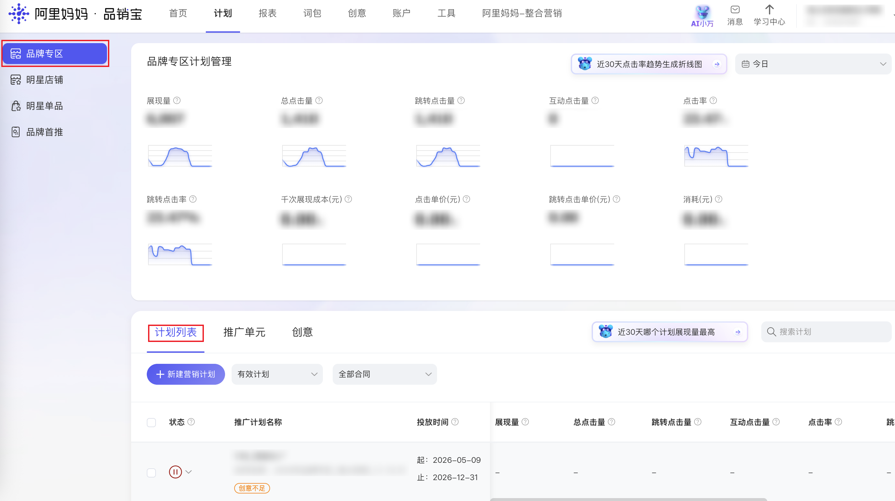

| 属性             | 值                                                          |
| ---------------- | ----------------------------------------------------------- |
| **连接器类型**   | `RPA 连接器`                                                |
| **连接器代码**   | `rpa.conn.alimm.pxb.brand.plan.list`                        |
| **归属 PyPI 包** | `rpa-conn-alimm-all`                                        |
| **操作类型**     | 浏览器自动化操作 + 网络请求监听                             |
| **目标网页**     | `https://branding.taobao.com/#!/plan/index`                 |
| **适用场景**     | 采集合妈妈品销宝品牌专区推广计划列表及展现、点击、消耗等报表指标 |

### 目标页面

> **路径**：阿里妈妈—品销宝—品牌专区—计划列表
>
> **网址**：[https://branding.taobao.com/#!/plan/index](https://branding.taobao.com/#!/plan/index)



### 业务入参

| 字段 | 中文释义 | 数据类型 | 必填 | 默认值 | 说明 |
| ---- | -------- | -------- | ---- | ------ | ---- |
| `status` | 计划状态 | `string` | 否 | `valid` | 可选 `all`（全部状态）/ `valid`（有效计划）/ `running`（正在投放）/ `paused`（暂停投放）/ `waiting`（等待投放）/ `ended`（结束投放） |
| `date_type` | 统计时间类型 | `string` | 否 | `today` | 可选 `today`（今天）/ `yesterday`（昨天）/ `last_7_days`（过去7天，不含今天）/ `last_15_days`（过去15天，不含今天）/ `last_30_days`（过去30天，不含今天）/ `this_month`（本月1日至今天）/ `last_month`（上月整月）/ `custom`（自定义，需配合 `custom_start_date` / `custom_end_date`） |
| `custom_start_date` | 自定义起始日期 | `string` | 否 | `—` | `date_type` 为 `custom` 时必填，格式 `YYYYMMDD` 或 `YYYY-MM-DD` |
| `custom_end_date` | 自定义结束日期 | `string` | 否 | `—` | `date_type` 为 `custom` 时必填，格式 `YYYYMMDD` 或 `YYYY-MM-DD`，最晚为今天 |
| `search_plan` | 搜索计划关键词 | `string` | 否 | `—` | 按计划名称模糊搜索，留空表示不筛选 |

### 入参样例

```json
{
    "status": "valid",
    "date_type": "today"
}
```

### 数据字段

| 字段 | 中文释义 | 数据类型 | 可为空 | 取数路径 | 示例 |
| ---- | -------- | -------- | ------ | -------- | ---- |
| `campaignId` | 推广计划 ID | `number` | 否 | `campaignId` | `14127726028` |
| `campaignName` | 推广计划名称 | `string` | 否 | `campaignName` | `Y26_洗发水` |
| `campaignType` | 计划类型 | `number` | 否 | `campaignType` | `1` |
| `contractId` | 合同 ID | `number` | 否 | `contractId` | `276347` |
| `contractName` | 合同名称 | `string` | 否 | `contractName` | `2026年品牌专区_兔头妈妈_1.1-12.31` |
| `startTime` | 投放开始时间 | `string` | 否 | `beginTime` | `2026-05-09 00:00:00` |
| `endTime` | 投放结束时间 | `string` | 否 | `endTime` | `2026-12-31 00:00:00` |
| `status` | 计划状态 | `number` | 否 | `status` | `2` |
| `lifeCycle` | 生命周期状态码 | `number` | 否 | `lifeCycle` | `99` |
| `productId` | 产品线 ID | `number` | 否 | `productId` | `101005201` |
| `campaignNoEnough` | 创意是否不足 | `boolean` | 否 | `campaignNoEnough` | `true` |
| `campaignReasonDesc` | 创意不足说明 | `string` | 是 | `campaignReasonDesc` | ` 该计划下单元（y26洗发水）无有效创意，请及时上传创意，避免投放期间无展现;` |
| `impression` | 展现量 | `number` | 否 | `impression` | `5905.0` |
| `click` | 总点击量 | `number` | 否 | `click` | `1334.0` |
| `shopClick` | 跳转点击量 | `number` | 否 | `shopclick` | `1334.0` |
| `interactClick` | 互动点击量 | `number` | 否 | `interactclick` | `0.0` |
| `ctr` | 点击率 | `number` | 否 | `ctr` | `0.2259` |
| `shopCtr` | 跳转点击率 | `number` | 否 | `shopctr` | `0.2259` |
| `cpm` | 千次展现成本（元） | `number` | 否 | `cpm` | `0.0` |
| `cpc` | 点击单价（元） | `number` | 否 | `cpc` | `0.0` |
| `shopCpc` | 跳转点击单价（元） | `number` | 否 | `shopcpc` | `0.0` |
| `cost` | 消耗（元） | `number` | 否 | `cost` | `0.0` |
| `bizDate` | 业务日期 | `string` | 否 | 附加 |  |
| `accountId` | 授权 ID | `string` | 否 | 附加 |  |

### 数据样例

```json
{
  "campaignId": 14127726028,
  "campaignName": "Y26_洗发水",
  "campaignType": 1,
  "contractId": 276347,
  "contractName": "2026年品牌专区_兔头妈妈_1.1-12.31",
  "startTime": "2026-05-09 00:00:00",
  "endTime": "2026-12-31 00:00:00",
  "status": 2,
  "lifeCycle": 99,
  "productId": 101005201,
  "campaignNoEnough": true,
  "campaignReasonDesc": " 该计划下单元（y26洗发水）无有效创意，请及时上传创意，避免投放期间无展现;",
  "impression": 5905.0,
  "click": 1334.0,
  "shopClick": 1334.0,
  "interactClick": 0.0,
  "ctr": 0.2259,
  "shopCtr": 0.2259,
  "cpm": 0.0,
  "cpc": 0.0,
  "shopCpc": 0.0,
  "cost": 0.0,
  "bizDate": "20260610",
  "accountId": "108"
}
```

### 运行时配置

```json
{
    "name": "rpa.conn.alimm.pxb.brand.plan.list",
    "package": "rpa-conn-alimm-all",
    "version": null,
    "mode": "Eager"
}
```

---
