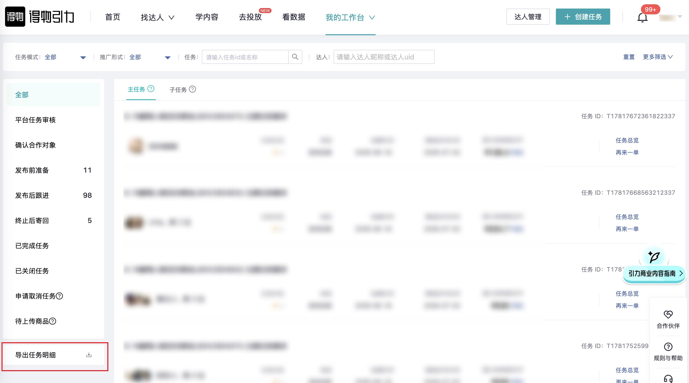

| 属性             | 值                                                                                   |
| ---------------- | ------------------------------------------------------------------------------------ |
| **连接器类型**   | `RPA 连接器`                                                                         |
| **连接器代码**   | `rpa.conn.dewu.gravity.task.export`                                                 |
| **归属 PyPI 包** | `rpa-conn-dewu-all`                                                                  |
| **操作类型**     | 浏览器自动化操作 + 网络请求监听 + XLSX 文件导出                                      |
| **目标网页**     | `https://gravity.dewu.com/task`                                                      |
| **适用场景**     | 导出得物引力平台任务明细数据，支持按任务创建时间、推广形式、任务模式、任务状态筛选   |
| **预估耗时**     | `300s`                                                                               |

### 目标页面

> **路径**：得物引力—我的工作台—任务
>
> **网址**：[https://gravity.dewu.com/task](https://gravity.dewu.com/task)



### 业务入参

| 字段 | 中文释义 | 数据类型 | 必填 | 默认值 | 说明 |
| ---- | -------- | -------- | ---- | ------ | ---- |
| `start_date` | 任务创建开始日期 | `String` | 是 | — | 支持格式：`YYYYMMDD`、`YYYY-MM-DD` |
| `end_date` | 任务创建结束日期 | `String` | 是 | — | 支持格式：`YYYYMMDD`、`YYYY-MM-DD`；不得晚于当天；与 `start_date` 间隔不超过 90 天（含起止日） |
| `promote_types` | 推广形式 | `String` / `List[String]` | 否 | 全选 | 不传或 `ALL` 表示全选；多选时用英文逗号分隔或 JSON 数组。可选值：`VIDEO_OR_IMAGE`（视频或图文）、`IMAGE_ONLY`（仅图文）、`VIDEO_ONLY`（仅视频）、`LIVE`（直播） |
| `task_modes` | 任务模式 | `String` / `List[String]` | 否 | 全选 | 不传或 `ALL` 表示全选；多选时用英文逗号分隔或 JSON 数组。可选值：`DIRECTED`（定向任务）、`SUBMISSION`（投稿任务） |
| `task_states` | 任务状态 | `String` / `List[String]` | 否 | 全选 | 不传或 `ALL` 表示全选；多选时用英文逗号分隔或 JSON 数组。可选值：`UNDER_REVIEW`（任务审核中）、`PENDING_MODIFICATION`（待修改）、`CONFIRM_COLLABORATOR`（确认合作对象）、`PENDING_SHIPMENT`（待发货）、`PENDING_CREATOR_RECEIPT`（待达人收货）、`PENDING_PUBLISH`（待发布）、`CONTENT_UNDER_REVIEW`（动态审核中）、`PENDING_ACCEPTANCE`（待验收）、`REJECTED`（已驳回）、`PENDING_RETURN`（待寄回）、`PENDING_MERCHANT_RECEIPT`（待商家收货）、`COMPLETED`（已完成任务）、`CLOSED`（已关闭任务）、`PENDING_PRODUCT_UPLOAD`（待上传商品）、`CANCELLATION_REQUESTED`（申请取消任务）、`PENDING_MERCHANT_CONFIRM`（待商家确认）、`MERCHANT_INITIATED`（商家已发起）、`RETURN_AFTER_TERMINATION`（终止后寄回） |

### 入参样例

```json
{
    "start_date": "2026-05-01",
    "end_date": "2026-05-19",
    "task_modes": "SUBMISSION",
    "task_states": "COMPLETED"
}
```

### 入参校验

```json-schema collapsed
{
  "$schema": "https://json-schema.org/draft/2020-12/schema",
  "title": "得物-引力任务明细导出 - 查询入参",
  "description": "导出得物引力平台任务明细数据，支持按任务创建时间、推广形式、任务模式、任务状态筛选",
  "type": "object",
  "properties": {
    "start_date": {
      "description": "任务创建开始日期，支持格式：YYYYMMDD、YYYY-MM-DD",
      "type": "string"
    },
    "end_date": {
      "description": "任务创建结束日期，支持格式：YYYYMMDD、YYYY-MM-DD；不得晚于当天；与 start_date 间隔不超过 90 天（含起止日）",
      "type": "string"
    },
    "promote_types": {
      "description": "推广形式 code。不传或 ALL 表示全选；多选时用英文逗号分隔或 JSON 数组。可选值：VIDEO_OR_IMAGE（视频或图文）、IMAGE_ONLY（仅图文）、VIDEO_ONLY（仅视频）、LIVE（直播）",
      "oneOf": [
        {
          "type": "string"
        },
        {
          "type": "array",
          "items": {
            "type": "string",
            "enum": ["VIDEO_OR_IMAGE", "IMAGE_ONLY", "VIDEO_ONLY", "LIVE"]
          },
          "uniqueItems": true
        }
      ]
    },
    "task_modes": {
      "description": "任务模式 code。不传或 ALL 表示全选；多选时用英文逗号分隔或 JSON 数组。可选值：DIRECTED（定向任务）、SUBMISSION（投稿任务）",
      "oneOf": [
        {
          "type": "string"
        },
        {
          "type": "array",
          "items": {
            "type": "string",
            "enum": ["DIRECTED", "SUBMISSION"]
          },
          "uniqueItems": true
        }
      ]
    },
    "task_states": {
      "description": "任务状态 code。不传或 ALL 表示全选；多选时用英文逗号分隔或 JSON 数组。可选值：UNDER_REVIEW（任务审核中）、PENDING_MODIFICATION（待修改）、CONFIRM_COLLABORATOR（确认合作对象）、PENDING_SHIPMENT（待发货）、PENDING_CREATOR_RECEIPT（待达人收货）、PENDING_PUBLISH（待发布）、CONTENT_UNDER_REVIEW（动态审核中）、PENDING_ACCEPTANCE（待验收）、REJECTED（已驳回）、PENDING_RETURN（待寄回）、PENDING_MERCHANT_RECEIPT（待商家收货）、COMPLETED（已完成任务）、CLOSED（已关闭任务）、PENDING_PRODUCT_UPLOAD（待上传商品）、CANCELLATION_REQUESTED（申请取消任务）、PENDING_MERCHANT_CONFIRM（待商家确认）、MERCHANT_INITIATED（商家已发起）、RETURN_AFTER_TERMINATION（终止后寄回）",
      "oneOf": [
        {
          "type": "string"
        },
        {
          "type": "array",
          "items": {
            "type": "string",
            "enum": [
              "UNDER_REVIEW",
              "PENDING_MODIFICATION",
              "CONFIRM_COLLABORATOR",
              "PENDING_SHIPMENT",
              "PENDING_CREATOR_RECEIPT",
              "PENDING_PUBLISH",
              "CONTENT_UNDER_REVIEW",
              "PENDING_ACCEPTANCE",
              "REJECTED",
              "PENDING_RETURN",
              "PENDING_MERCHANT_RECEIPT",
              "COMPLETED",
              "CLOSED",
              "PENDING_PRODUCT_UPLOAD",
              "CANCELLATION_REQUESTED",
              "PENDING_MERCHANT_CONFIRM",
              "MERCHANT_INITIATED",
              "RETURN_AFTER_TERMINATION"
            ]
          },
          "uniqueItems": true
        }
      ]
    }
  },
  "required": ["start_date", "end_date"],
  "additionalProperties": false
}
```

### 数据字段

| 字段 | 中文释义 | 数据类型 | 可为空 | 取数路径 | 示例 |
| ---- | -------- | -------- | ------ | -------- | ---- |
| `parentTaskId` | 父任务 ID | `String` | 否 | `XLSX.0.父任务ID` | `T17783908597482337` |
| `subTaskId` | 子任务 ID | `String` | 否 | `XLSX.0.子任务ID` | `S17785661759934721` |
| `taskName` | 任务名称 | `String` | 否 | `XLSX.0.任务名称` | `5/10蜡笔小新投稿送拍0003U 款式随机 码数36-38` |
| `taskPublishTime` | 任务发布时间 | `String` | 否 | `XLSX.0.任务发布时间` | `2026-05-10 13:27:39` |
| `taskPromoteType` | 任务推广形式 | `String` | 否 | `XLSX.0.任务推广形式` | `图文或视频` |
| `taskMode` | 任务模式 | `String` | 否 | `XLSX.0.任务模式` | `投稿任务` |
| `taskStatus` | 任务状态 | `String` | 否 | `XLSX.0.任务状态` | `完成` |
| `taskCompleteTime` | 任务完成时间 | `String` | 是 | `XLSX.0.任务完成时间` | `2026-05-19 11:31:11` |
| `taskAmount` | 任务金额 | `String` | 否 | `XLSX.0.任务金额` | `20元` |
| `collaboratorName` | 合作达人 | `String` | 否 | `XLSX.0.合作达人` | `芝士冉冉` |
| `creatorUid` | 达人 UID | `Number` | 否 | `XLSX.0.达人uid` | `139554721` |
| `isSent` | 是否寄送 | `String` | 否 | `XLSX.0.是否寄送` | `是` |
| `isReturned` | 是否寄回 | `String` | 否 | `XLSX.0.是否寄回` | `否` |
| `sendLogisticsNo` | 寄送物流 | `String` | 是 | `XLSX.0.寄送物流` | `物流公司：其他 & 物流号：1` |
| `returnLogisticsNo` | 寄回物流 | `String` | 是 | `XLSX.0.寄回物流` | `暂无` |
| `contentSubmitTime` | 动态提交时间 | `String` | 是 | `XLSX.0.动态提交时间` | `2026-05-19 10:37:51` |
| `contentPublishTime` | 动态发布时间 | `String` | 是 | `XLSX.0.动态发布时间` | `2026-05-19 11:31:11` |
| `articleNo` | 货号 | `String` | 是 | `XLSX.0.货号` | `LBXX230003U,LBXXMH-1` |
| `exposureCount` | 曝光 | `String` | 是 | `XLSX.0.曝光` | `3718` |
| `readCount` | 阅读数 | `String` | 是 | `XLSX.0.阅读数` | `313` |
| `interactionCount` | 互动数 | `String` | 是 | `XLSX.0.互动数` | `51` |
| `productDetailVisitCount` | 商详访问 | `String` | 是 | `XLSX.0.商详访问` | `28` |
| `videoDuration` | 视频时长 | `String` | 是 | `XLSX.0.视频时长` | `35` |
| `videoAvgPlayDuration` | 视频平均播放时长 | `String` | 是 | `XLSX.0.视频平均播放时长` | `6` |
| `playRate3s` | 3 秒播放率 | `String` | 是 | `XLSX.0.3s播放率` | `44.7%` |
| `contentLink` | 动态链接 | `String` | 是 | `XLSX.0.动态链接` | `https://m.poizon.com/rn-activity/community-share?trendId=488505534` |
| `bizDate` | 业务日期 | `String` | 否 | 附加 |  |
| `accountId` | 授权 ID | `String` | 否 | 附加 |  |

### 数据样例

```json
{
  "parentTaskId": "T17783908597482337",
  "subTaskId": "S17785661759934721",
  "taskName": "5/10蜡笔小新投稿送拍0003U 款式随机 码数36-38",
  "taskPublishTime": "2026-05-10 13:27:39",
  "taskPromoteType": "图文或视频",
  "taskMode": "投稿任务",
  "taskStatus": "完成",
  "taskCompleteTime": "2026-05-19 11:31:11",
  "taskAmount": "20元",
  "collaboratorName": "芝士冉冉",
  "creatorUid": 139554721,
  "isSent": "是",
  "isReturned": "否",
  "sendLogisticsNo": "物流公司：其他 & 物流号：1",
  "returnLogisticsNo": "暂无",
  "contentSubmitTime": "2026-05-19 10:37:51",
  "contentPublishTime": "2026-05-19 11:31:11",
  "articleNo": "LBXX230003U,LBXXMH-1",
  "exposureCount": "3718",
  "readCount": "313",
  "interactionCount": "51",
  "productDetailVisitCount": "28",
  "videoDuration": "35",
  "videoAvgPlayDuration": "6",
  "playRate3s": "44.7%",
  "contentLink": "https://m.poizon.com/rn-activity/community-share?trendId=488505534"
}
```

---
