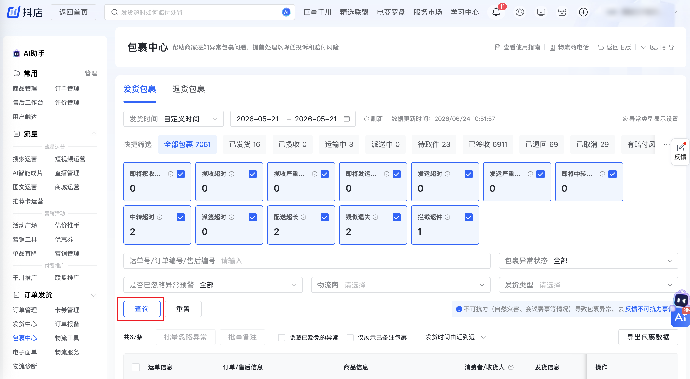

| 属性             | 值                                                                                         |
| ---------------- | ------------------------------------------------------------------------------------------ |
| **连接器类型**   | `RPA 连接器`                                                                               |
| **连接器代码**   | `rpa.conn.doudian.shop.shipping.package.list`                                              |
| **归属 PyPI 包** | `rpa-conn-doudian-all`                                                                     |
| **操作类型**     | 浏览器自动化操作 + 网络请求监听                                                            |
| **目标网页**     | `https://fxg.jinritemai.com/ffa/logistics/parcelCenter`                                    |
| **适用场景**     | 采集抖店包裹中心发货包裹异常列表，支持按发货时间、异常类型、包裹异常状态、是否已忽略异常预警筛选 |
| **预估耗时**     | `600s`                                                                                     |

### 目标页面

> **路径**：抖店商家后台—物流—包裹中心—发货包裹
>
> **网址**：[https://fxg.jinritemai.com/ffa/logistics/parcelCenter](https://fxg.jinritemai.com/ffa/logistics/parcelCenter)



### 业务入参

| 字段 | 中文释义 | 数据类型 | 必填 | 默认值 | 说明 |
| ---- | -------- | -------- | ---- | ------ | ---- |
| `ship_time_type` | 发货时间范围 | `String` | 否 | `LAST_30_DAYS` | 可选值：`TODAY`（今天）、`YESTERDAY`（昨天）、`LAST_7_DAYS`（近7天）、`LAST_30_DAYS`（近30天）、`CUSTOM`（自定义时间） |
| `custom_start_date` | 自定义起始日期 | `String` | `ship_time_type = CUSTOM` 时必填 | — | 支持格式：`YYYYMMDD`、`YYYY-MM-DD` |
| `custom_end_date` | 自定义结束日期 | `String` | `ship_time_type = CUSTOM` 时必填 | — | 支持格式：`YYYYMMDD`、`YYYY-MM-DD`；不能晚于当天；起止跨度（含首尾）最多 31 天 |
| `exception_types` | 异常类型卡片 | `String / List[String]` | 否 | — | 多选时用英文逗号分隔或 JSON 数组；不传则不切换卡片筛选。可选值：`PICKUP_PRE_TIMEOUT`（即将揽收超时）、`PICKUP_TIMEOUT`（揽收超时）、`PICKUP_SERIOUS_TIMEOUT`（揽收严重超时）、`DISPATCH_PRE_TIMEOUT`（即将发运超时）、`DISPATCH_TIMEOUT`（发运超时）、`DISPATCH_SERIOUS_TIMEOUT`（发运严重超时）、`TRANSIT_PRE_TIMEOUT`（即将中转超时）、`TRANSIT_TIMEOUT`（中转超时）、`DELIVERY_TIMEOUT`（派签超时）、`LONG_DELIVERY`（配送超长）、`SUSPECTED_LOST`（疑似遗失）、`INTERCEPTED_RETURN`（拦截返件） |
| `exception_status` | 包裹异常状态 | `String` | 否 | `IN_PROGRESS` | 可选值：`ALL`（全部）、`IN_PROGRESS`（进行中）、`COMPLETED`（已完结） |
| `ignore_warning` | 是否已忽略异常预警 | `String` | 否 | `NO` | 可选值：`ALL`（全部）、`YES`（是）、`NO`（否） |

### 入参样例

```json
{
    "ship_time_type": "LAST_30_DAYS",
    "exception_status": "IN_PROGRESS",
    "ignore_warning": "NO"
}
```

```json
{
    "ship_time_type": "CUSTOM",
    "custom_start_date": "20260525",
    "custom_end_date": "20260624",
    "exception_types": ["PICKUP_TIMEOUT", "DISPATCH_TIMEOUT"],
    "exception_status": "ALL",
    "ignore_warning": "ALL"
}
```

### 入参校验

```json-schema collapsed
{
  "$schema": "https://json-schema.org/draft/2020-12/schema",
  "title": "抖店-发货包裹异常列表 - 查询入参",
  "description": "采集抖店包裹中心发货包裹异常列表，支持按发货时间、异常类型、包裹异常状态、是否已忽略异常预警筛选",
  "type": "object",
  "properties": {
    "ship_time_type": {
      "type": "string",
      "description": "发货时间范围。可选值：TODAY（今天）、YESTERDAY（昨天）、LAST_7_DAYS（近7天）、LAST_30_DAYS（近30天）、CUSTOM（自定义时间）",
      "enum": [
        "TODAY",
        "YESTERDAY",
        "LAST_7_DAYS",
        "LAST_30_DAYS",
        "CUSTOM"
      ],
      "default": "LAST_30_DAYS"
    },
    "custom_start_date": {
      "type": "string",
      "description": "自定义起始日期，ship_time_type = CUSTOM 时必填。支持格式：YYYYMMDD、YYYY-MM-DD"
    },
    "custom_end_date": {
      "type": "string",
      "description": "自定义结束日期，ship_time_type = CUSTOM 时必填。支持格式：YYYYMMDD、YYYY-MM-DD；不能晚于当天；起止跨度（含首尾）最多 31 天"
    },
    "exception_types": {
      "oneOf": [
        {
          "type": "string",
          "description": "异常类型卡片，英文逗号分隔"
        },
        {
          "type": "array",
          "description": "异常类型卡片多选",
          "items": {
            "type": "string",
            "enum": [
              "PICKUP_PRE_TIMEOUT",
              "PICKUP_TIMEOUT",
              "PICKUP_SERIOUS_TIMEOUT",
              "DISPATCH_PRE_TIMEOUT",
              "DISPATCH_TIMEOUT",
              "DISPATCH_SERIOUS_TIMEOUT",
              "TRANSIT_PRE_TIMEOUT",
              "TRANSIT_TIMEOUT",
              "DELIVERY_TIMEOUT",
              "LONG_DELIVERY",
              "SUSPECTED_LOST",
              "INTERCEPTED_RETURN"
            ]
          },
          "uniqueItems": true
        }
      ],
      "description": "异常类型卡片。可选值：PICKUP_PRE_TIMEOUT（即将揽收超时）、PICKUP_TIMEOUT（揽收超时）、PICKUP_SERIOUS_TIMEOUT（揽收严重超时）、DISPATCH_PRE_TIMEOUT（即将发运超时）、DISPATCH_TIMEOUT（发运超时）、DISPATCH_SERIOUS_TIMEOUT（发运严重超时）、TRANSIT_PRE_TIMEOUT（即将中转超时）、TRANSIT_TIMEOUT（中转超时）、DELIVERY_TIMEOUT（派签超时）、LONG_DELIVERY（配送超长）、SUSPECTED_LOST（疑似遗失）、INTERCEPTED_RETURN（拦截返件）"
    },
    "exception_status": {
      "type": "string",
      "description": "包裹异常状态。可选值：ALL（全部）、IN_PROGRESS（进行中）、COMPLETED（已完结）",
      "enum": [
        "ALL",
        "IN_PROGRESS",
        "COMPLETED"
      ],
      "default": "IN_PROGRESS"
    },
    "ignore_warning": {
      "type": "string",
      "description": "是否已忽略异常预警。可选值：ALL（全部）、YES（是）、NO（否）",
      "enum": [
        "ALL",
        "YES",
        "NO"
      ],
      "default": "NO"
    }
  },
  "required": [],
  "additionalProperties": false,
  "if": {
    "properties": {
      "ship_time_type": {
        "const": "CUSTOM"
      }
    }
  },
  "then": {
    "required": [
      "custom_start_date",
      "custom_end_date"
    ],
    "dependentRequired": {
      "custom_start_date": [
        "custom_end_date"
      ],
      "custom_end_date": [
        "custom_start_date"
      ]
    }
  }
}
```

### 数据字段

`bizDate` 格式为 `YYYYMMDD`。

:::field-tree
@define 最新路由节点
| `operateTime` | 操作时间 | `Number` | 是 | `list[].lastRouteNode.operateTime` | `1779504760` |
| `siteName` | 站点名称 | `String` | 是 | `list[].lastRouteNode.siteName` | `廊坊临空转运中心` |
| `siteType` | 站点类型 | `String` | 是 | `list[].lastRouteNode.siteType` | `` |
| `content` | 路由内容 | `String` | 是 | `list[].lastRouteNode.content` | `快件到达【廊坊临空转运中心】物流问题请联系956025为您解决` |
| `state` | 路由状态 | `String` | 是 | `list[].lastRouteNode.state` | `运输中` |

@define SKU订单明细
| `payAmount` | 实付金额（分） | `Number` | 否 | `list[].orderList[].skuOrderInfoList[].payAmount` | `3990` |
| `orderAmount` | 订单金额（分） | `Number` | 否 | `list[].orderList[].skuOrderInfoList[].orderAmount` | `3990` |
| `skuOrderId` | SKU 订单 ID | `String` | 否 | `list[].orderList[].skuOrderInfoList[].skuOrderId` | `6926504241939446886` |
| `itemOrderNum` | 商品件数 | `Number` | 否 | `list[].orderList[].skuOrderInfoList[].itemOrderNum` | `1` |
| `modifyAmount` | 改价金额（分） | `Number` | 否 | `list[].orderList[].skuOrderInfoList[].modifyAmount` | `0` |
| `productId` | 商品 ID | `Number` | 否 | `list[].orderList[].skuOrderInfoList[].productId` | `3765449022458953846` |
| `productName` | 商品名称 | `String` | 否 | `list[].orderList[].skuOrderInfoList[].productName` | `【五效合一】青蛙王子氨基酸无硅油洗发儿童沐浴露春夏保湿滋润洁面` |
| `productImg` | 商品图片 URL | `String` | 否 | `list[].orderList[].skuOrderInfoList[].productImg` | `https://p3-aio.ecombdimg.com/img/ecom-shop-material/jpeg_m_8cf53a17fe0dc360005aa0e077031dc7_sx_256803_www800-800~240x0.image` |
| `skuId` | SKU ID | `Number` | 否 | `list[].orderList[].skuOrderInfoList[].skuId` | `3520913744964098` |
| `itemOriginAmount` | 商品原价（分） | `Number` | 否 | `list[].orderList[].skuOrderInfoList[].itemOriginAmount` | `3990` |
| `itemSumAmount` | 商品合计金额（分） | `Number` | 否 | `list[].orderList[].skuOrderInfoList[].itemSumAmount` | `3990` |

@define 订单明细
| `orderId` | 订单 ID | `String` | 否 | `list[].orderList[].orderId` | `6926504241939446886` |
| `skuOrderInfoList` @SKU订单明细 | SKU 订单明细列表 | `List[Dict]` | 否 | `list[].orderList[].skuOrderInfoList` | 见数据样例 |
| `expCompensationAmount` | 体验补偿金额（分） | `Number` | 否 | `list[].orderList[].expCompensationAmount` | `0` |
| `aftersaleId` | 售后单 ID | `String` | 是 | `list[].orderList[].aftersaleId` | `` |
| `tags` | 订单标签 | `List` | 否 | `list[].orderList[].tags` | `[]` |

@define 异常明细
| `uniqIdTail` | 唯一标识尾号 | `String` | 是 | `list[].exceptionList[].uniqIdTail` | `` |
| `exceptionType` | 异常类型 | `String` | 否 | `list[].exceptionList[].exceptionType` | `DISTRIBUTION_EXCEPTION` |
| `exceptionSubType` | 异常子类型 | `String` | 否 | `list[].exceptionList[].exceptionSubType` | `DISTRIBUTION_EXCEPTION` |
| `exceptionStatus` | 异常状态 | `String` | 否 | `list[].exceptionList[].exceptionStatus` | `work` |
| `exceptionDesc` | 异常描述 | `String` | 是 | `list[].exceptionList[].exceptionDesc` | `已超过标准时效30天` |
| `dealState` | 处理状态 | `String` | 否 | `list[].exceptionList[].dealState` | `PENDING` |
| `reason` | 原因 | `String` | 是 | `list[].exceptionList[].reason` | `` |

@define 大促物流保障
| `tagKey` | 标签键 | `String` | 否 | `list[].guaranteedInfo.tagKey` | `Guaranteed` |
| `tagName` | 标签名称 | `String` | 否 | `list[].guaranteedInfo.tagName` | `大促物流保障` |
| `hoverMsg` | 悬停说明 | `String` | 是 | `list[].guaranteedInfo.hoverMsg` | `大促活动期间保障及时揽派，商家因物流发运超时、中转超时、揽收后48小时无分拨记录产生的消费者赔付金额由大促保障物流商承担 ` |
| `infoLink` | 详情链接 | `String` | 是 | `list[].guaranteedInfo.infoLink` | `https://fxg.jinritemai.com/ffa/logistics-project/logistics-service/svc-wbeeguarantee` |
| `infoLinkName` | 详情链接文案 | `String` | 是 | `list[].guaranteedInfo.infoLinkName` | `查看详情` |
| `activityName` | 活动名称 | `String` | 是 | `list[].guaranteedInfo.activityName` | `2026年618大促活动` |

| 字段 | 中文释义 | 数据类型 | 可为空 | 取数路径 | 示例 |
| ---- | -------- | -------- | ------ | -------- | ---- |
| `trackNo` | 运单号 | `String` | 否 | `list[].trackNo` | `JT2186781030229` |
| `express` | 物流商编码 | `String` | 否 | `list[].express` | `jtexpress` |
| `expressName` | 物流商名称 | `String` | 否 | `list[].expressName` | `极兔速递` |
| `expressTel` | 物流商电话 | `String` | 是 | `list[].expressTel` | `956025` |
| `expressStatus` | 物流状态 | `String` | 否 | `list[].expressStatus` | `polling` |
| `deliveryTime` | 发货时间（Unix 秒） | `Number` | 是 | `list[].deliveryTime` | `1779329714` |
| `collectTime` | 揽收时间（Unix 秒） | `Number` | 是 | `list[].collectTime` | `1779344654` |
| `signTime` | 签收时间（Unix 秒） | `Number` | 是 | `list[].signTime` | `0` |
| `packageState` | 包裹状态 | `String` | 否 | `list[].packageState` | `0` |
| `businessModel` | 业务模式 | `String` | 否 | `list[].businessModel` | `3` |
| `shopId` | 店铺 ID | `String` | 否 | `list[].shopId` | `7347300` |
| `receiverNameSecret` | 收货人姓名（脱敏） | `String` | 否 | `list[].receiverNameSecret` | `李*` |
| `receiverTelSecret` | 收货人电话（脱敏） | `String` | 否 | `list[].receiverTelSecret` | `1**********` |
| `receiverAddressSecret` | 收货地址（脱敏） | `String` | 否 | `list[].receiverAddressSecret` | `北京市北京市大兴区黄村地区 ***********************************` |
| `collectProvince` | 揽收省份 | `String` | 是 | `list[].collectProvince` | `福建省` |
| `collectCity` | 揽收城市 | `String` | 是 | `list[].collectCity` | `漳州市` |
| `comment` | 备注 | `String` | 是 | `list[].comment` | `` |
| `invalidOrderIds` | 无效订单号 | `String` | 是 | `list[].invalidOrderIds` | `` |
| `pigeonDecision` | 飞鸽决策 | `String` | 是 | `list[].pigeonDecision` | `pass` |
| `pigeonRefuseReason` | 飞鸽拒绝原因 | `String` | 是 | `list[].pigeonRefuseReason` | `成功` |
| `pigeonJumpLink` | 飞鸽跳转链接 | `String` | 是 | `list[].pigeonJumpLink` | `https://im.jinritemai.com/pc_seller_v2/main/workspace?fromOrder=6926504241939446886&otherSideId=AQAsM7bTraMJEnXdwgmtRGbRojrNpMWrw9iPa4rHbrefUPvNBcW_kqTkorXtsKWjVbjiH0and-DfF_OmblvXYLrV` |
| `lastRouteNode` @最新路由节点 | 最新路由节点 | `Dict` | 是 | `list[].lastRouteNode` | 见数据样例 |
| `orderList` @订单明细 | 关联订单列表 | `List[Dict]` | 否 | `list[].orderList` | 见数据样例 |
| `exceptionList` @异常明细 | 异常列表 | `List[Dict]` | 否 | `list[].exceptionList` | 见数据样例 |
| `guaranteedInfo` @大促物流保障 | 大促物流保障 | `Dict` | 是 | `list[].guaranteedInfo` | 见数据样例 |
| `bizDate` | 业务日期 | `String` | 否 | 附加 |  |
| `accountId` | 授权 ID | `String` | 否 | 附加 |  |
:::

### 数据样例

```json
[
  {
    "trackNo": "JT2186781030229",
    "express": "jtexpress",
    "expressName": "极兔速递",
    "expressTel": "956025",
    "expressStatus": "polling",
    "deliveryTime": 1779329714,
    "collectTime": 1779344654,
    "signTime": 0,
    "packageState": "0",
    "businessModel": "3",
    "shopId": "7347300",
    "receiverNameSecret": "李*",
    "receiverTelSecret": "1**********",
    "receiverAddressSecret": "北京市北京市大兴区黄村地区 ***********************************",
    "collectProvince": "福建省",
    "collectCity": "漳州市",
    "comment": "",
    "invalidOrderIds": "",
    "pigeonDecision": "pass",
    "pigeonRefuseReason": "成功",
    "pigeonJumpLink": "https://im.jinritemai.com/pc_seller_v2/main/workspace?fromOrder=6926504241939446886&otherSideId=AQAsM7bTraMJEnXdwgmtRGbRojrNpMWrw9iPa4rHbrefUPvNBcW_kqTkorXtsKWjVbjiH0and-DfF_OmblvXYLrV",
    "lastRouteNode": {
      "operateTime": 1779504760,
      "siteName": "廊坊临空转运中心",
      "siteType": "",
      "content": "快件到达【廊坊临空转运中心】物流问题请联系956025为您解决",
      "state": "运输中"
    },
    "orderList": [
      {
        "orderId": "6926504241939446886",
        "skuOrderInfoList": [
          {
            "payAmount": 3990,
            "orderAmount": 3990,
            "skuOrderId": "6926504241939446886",
            "itemOrderNum": 1,
            "modifyAmount": 0,
            "productId": 3765449022458953846,
            "productName": "【五效合一】青蛙王子氨基酸无硅油洗发儿童沐浴露春夏保湿滋润洁面",
            "productImg": "https://p3-aio.ecombdimg.com/img/ecom-shop-material/jpeg_m_8cf53a17fe0dc360005aa0e077031dc7_sx_256803_www800-800~240x0.image",
            "skuId": 3520913744964098,
            "itemOriginAmount": 3990,
            "itemSumAmount": 3990
          }
        ],
        "expCompensationAmount": 0,
        "aftersaleId": "",
        "tags": []
      }
    ],
    "exceptionList": [
      {
        "uniqIdTail": "",
        "exceptionType": "DISTRIBUTION_EXCEPTION",
        "exceptionSubType": "DISTRIBUTION_EXCEPTION",
        "exceptionStatus": "work",
        "exceptionDesc": "已超过标准时效30天",
        "dealState": "PENDING",
        "reason": ""
      },
      {
        "uniqIdTail": "",
        "exceptionType": "SUSPECTED_LOST_SELF",
        "exceptionSubType": "SUSPECTED_LOST_SELF",
        "exceptionStatus": "work",
        "exceptionDesc": "",
        "dealState": "PENDING",
        "reason": ""
      },
      {
        "uniqIdTail": "",
        "exceptionType": "TRANS_EXCEPTION",
        "exceptionSubType": "TRANS_EXCEPTION",
        "exceptionStatus": "work",
        "exceptionDesc": "已超时28天23小时",
        "dealState": "PENDING",
        "reason": ""
      }
    ],
    "guaranteedInfo": {
      "tagKey": "Guaranteed",
      "tagName": "大促物流保障",
      "hoverMsg": "大促活动期间保障及时揽派，商家因物流发运超时、中转超时、揽收后48小时无分拨记录产生的消费者赔付金额由大促保障物流商承担 ",
      "infoLink": "https://fxg.jinritemai.com/ffa/logistics-project/logistics-service/svc-wbeeguarantee",
      "infoLinkName": "查看详情",
      "activityName": "2026年618大促活动"
    },
    "bizDate": "20260624",
    "accountId": "105"
  }
]
```

---
