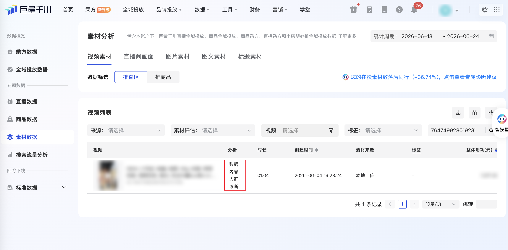
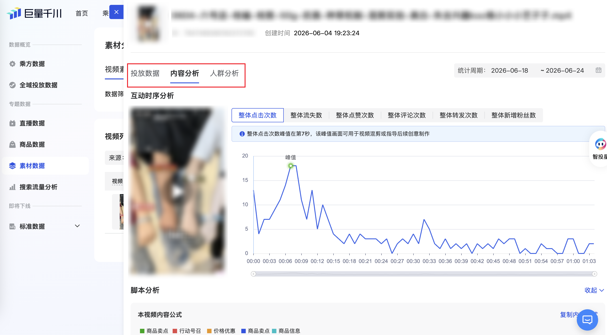

| 属性             | 值                                                                                                                                    |
| ---------------- | ------------------------------------------------------------------------------------------------------------------------------------- |
| **连接器类型**   | `RPA 连接器`                                                                                                                          |
| **连接器代码**   | `rpa.conn.juliang.qc.material.analysis.video.live.diagnosis`                                                                          |
| **归属 PyPI 包** | `rpa-conn-juliang-all`                                                                                                                |
| **操作类型**     | 浏览器自动化操作 + 网络请求监听 + XLSX 文件导出                                                                                       |
| **目标网页**     | `https://qianchuan.jinritemai.com/dataV2/roi2-material-analysis`                                                                      |
| **适用场景**     | 采集巨量千川素材分析页指定素材的「数据内容人群诊断」面板数据，含内容分析互动时序、素材元信息、脚本分析、人群维度分布及投放明细分日数据 |
| **预估耗时**     | `600s`                                                                                                                                |

### 目标页面

> **路径**：巨量千川—数据—素材分析—视频素材—推直播—数据内容人群诊断
>
> **网址**：[https://qianchuan.jinritemai.com/dataV2/roi2-material-analysis](https://qianchuan.jinritemai.com/dataV2/roi2-material-analysis)





### 业务入参

| 字段 | 中文释义 | 数据类型 | 必填 | 默认值 | 说明 |
| ---- | -------- | -------- | ---- | ------ | ---- |
| `material_id` | 素材 ID | `String` | 是 | — | 在素材分析页搜索并定位的目标素材 ID |
| `date_range_type` | 统计周期类型 | `String` | 是 | — | 可选值：`YESTERDAY`（昨天）、`LAST_7_DAYS`（最近7天）、`LAST_15_DAYS`（最近15天）、`LAST_WEEK`（上周）、`THIS_MONTH`（本月）、`LAST_MONTH`（上月）、`CUSTOM`（自定义）；在内容分析 Tab 设置一次，人群分析与投放数据共用 |
| `custom_start_date` | 自定义开始日期 | `String` | `date_range_type = CUSTOM` 时必填 | — | 支持格式：`YYYYMMDD`、`YYYY-MM-DD` |
| `custom_end_date` | 自定义结束日期 | `String` | `date_range_type = CUSTOM` 时必填 | — | 支持格式：`YYYYMMDD`、`YYYY-MM-DD`；不能早于 `custom_start_date`；结束日期为昨天时，若昨日数据暂未产出则任务失败 |

**统计周期说明：**

- 快捷周期（`YESTERDAY` / `LAST_7_DAYS` / `LAST_15_DAYS` / `THIS_MONTH`）：若昨日数据暂未产出，页面会自动排除昨天，实际统计周期少一天（`actualStartDate` / `actualEndDate` 与入参可能不一致）。
- `YESTERDAY`：若昨日数据暂未产出，任务直接失败。
- `CUSTOM` 且结束日期为昨天：若昨日数据暂未产出，任务直接失败。

**账号配置：** 须在账号 `auth_extension.qianchuan_id` 中配置千川广告主 ID（aavid）。

### 入参样例

```json
{
  "material_id": "7647499280192372763",
  "date_range_type": "LAST_7_DAYS"
}
```

```json
{
  "material_id": "7647499280192372763",
  "date_range_type": "CUSTOM",
  "custom_start_date": "2026-06-12",
  "custom_end_date": "2026-06-24"
}
```

### 入参校验

```json-schema collapsed
{
  "$schema": "https://json-schema.org/draft/2020-12/schema",
  "title": "巨量千川-视频推直播单条诊断 - 查询入参",
  "description": "采集巨量千川素材分析页指定素材的「数据内容人群诊断」面板数据，含内容分析互动时序、素材元信息、脚本分析、人群维度分布及投放明细分日数据",
  "type": "object",
  "properties": {
    "material_id": {
      "type": "string",
      "description": "素材 ID，在素材分析页搜索并定位的目标素材"
    },
    "date_range_type": {
      "type": "string",
      "description": "统计周期类型。可选值：YESTERDAY（昨天）、LAST_7_DAYS（最近7天）、LAST_15_DAYS（最近15天）、LAST_WEEK（上周）、THIS_MONTH（本月）、LAST_MONTH（上月）、CUSTOM（自定义）",
      "enum": [
        "YESTERDAY",
        "LAST_7_DAYS",
        "LAST_15_DAYS",
        "LAST_WEEK",
        "THIS_MONTH",
        "LAST_MONTH",
        "CUSTOM"
      ]
    },
    "custom_start_date": {
      "type": "string",
      "description": "自定义开始日期；date_range_type=CUSTOM 时必填。支持 YYYYMMDD 或 YYYY-MM-DD"
    },
    "custom_end_date": {
      "type": "string",
      "description": "自定义结束日期；date_range_type=CUSTOM 时必填。支持 YYYYMMDD 或 YYYY-MM-DD；不能早于 custom_start_date"
    }
  },
  "required": ["material_id", "date_range_type"],
  "allOf": [
    {
      "if": {
        "properties": {
          "date_range_type": { "const": "CUSTOM" }
        },
        "required": ["date_range_type"]
      },
      "then": {
        "required": ["custom_start_date", "custom_end_date"],
        "dependentRequired": {
          "custom_start_date": ["custom_end_date"],
          "custom_end_date": ["custom_start_date"]
        }
      }
    }
  ],
  "additionalProperties": false
}
```

### 数据字段

输出为 `List[Dict]`，每条记录通过 `recordType` 区分数据类型。`bizDate` 格式为 `YYYYMMDD`。

:::field-tree
@define 统计维度值
| `Value` | 原始值 | `String` | 是 | `Dimensions.{dimKey}.Value` | `31-40` |
| `ValueStr` | 展示值 | `String` | 是 | `Dimensions.{dimKey}.ValueStr` | `31-40` |

@define 统计指标值
| `Value` | 原始值 | `Number / String` | 是 | `Metrics.{metricKey}.Value` | `14` |
| `ValueStr` | 展示值 | `String` | 是 | `Metrics.{metricKey}.ValueStr` | `14` |

@define 标签名称项
| `text` | 标签文本 | `String` | 否 | `tag_name_list[].text` | `追求健康营养的人群` |
| `hintMsg` | 标签说明 | `String` | 是 | `tag_name_list[].hintMsg` | `用于存储商品和物资的大型空间，通常有货架和存储设施` |

@define 素材标签组
| `material_tag_type` | 标签类型 ID | `Number` | 否 | `myTagEntry[].material_tag_type` | `4` |
| `tag_label` | 标签分类名称 | `String` | 否 | `myTagEntry[].tag_label` | `适用人群` |
| `tag_name_list` @标签名称项 | 标签名称列表 | `List[Dict]` | 否 | `myTagEntry[].tag_name_list` | 见数据样例 |

@define 脚本分段明细
| `label` | 分段标签名称 | `String` | 否 | `scriptInfo.detail.{id}.label` | `适用场景` |
| `list` | 分段文案列表 | `List[String]` | 否 | `scriptInfo.detail.{id}.list` | 见数据样例 |

@define 脚本分析信息
| `formula` | 内容公式结构 | `Dict` | 否 | 脚本分析接口.formula | 见数据样例 |
| `detail` @脚本分段明细 | 分段脚本明细 | `Dict` | 否 | 脚本分析接口.detail | 见数据样例 |
| `text` | 完整脚本文案 | `String` | 否 | 脚本分析接口.text | 见数据样例 |
| `data` | 内容公式层级标签 | `List[Dict]` | 否 | 脚本分析接口.data | 见数据样例 |

@define 素材分析详情
| `material_id` | 素材 ID | `String` | 否 | 素材信息接口.material_id | `7647499280192372763` |
| `material_uri` | 素材 URI | `String` | 否 | 素材信息接口.material_uri | `v28033gi0000d8gm09vog65j3bo0vbcg` |
| `title` | 抖音标题 | `String` | 否 | 素材信息接口.title | 见数据样例 |
| `cost` | 消耗 | `Number` | 是 | 素材信息接口.cost | `12016.79` |
| `cost_rank` | 消耗排名 | `String` | 是 | 素材信息接口.cost_rank | `10%` |
| `ctr` | 点击率 | `Number` | 是 | 素材信息接口.ctr | `0.0816` |
| `ctr_rank` | 点击率排名 | `String` | 是 | 素材信息接口.ctr_rank | `10%～25%` |
| `play_over_rate` | 完播率 | `Number` | 是 | 素材信息接口.play_over_rate | `0.0821` |
| `video_duration` | 视频时长（秒） | `Number` | 是 | 素材信息接口.video_duration | `64.226` |
| `my_tag_entry` @素材标签组 | 本素材标签 | `List[Dict]` | 否 | 素材信息接口.my_tag_entry | 见数据样例 |
| `bench_tag_entry` @素材标签组 | 行业基准标签 | `List[Dict]` | 否 | 素材信息接口.bench_tag_entry | 见数据样例 |

| 字段 | 中文释义 | 数据类型 | 可为空 | 取数路径 | 示例 |
| ---- | -------- | -------- | ------ | -------- | ---- |
| `recordType` | 记录类型 | `String` | 否 | 经 recordType 派生 | `interaction_series` |
| `materialId` | 素材 ID | `String` | 否 | 入参 `material_id` | `7647499280192372763` |
| `dateRangeType` | 统计周期类型 | `String` | 否 | 入参 `date_range_type` | `CUSTOM` |
| `customStartDate` | 入参统计开始日期 | `String` | 否 | 入参解析 | `2026-06-12` |
| `customEndDate` | 入参统计结束日期 | `String` | 否 | 入参解析 | `2026-06-24` |
| `actualStartDate` | 页面实际统计开始日期 | `String` | 否 | 面板日期回读 | `2026-06-12` |
| `actualEndDate` | 页面实际统计结束日期 | `String` | 否 | 面板日期回读 | `2026-06-24` |
| `interactionMetric` | 互动时序指标代码 | `String` | 是 | `recordType=interaction_series` 时互动时序统计数据 | `CLICK_COUNT` |
| `interactionMetricName` | 互动时序指标名称 | `String` | 是 | 经 `interaction_metric_map` 映射 | `整体点击次数` |
| `durationSec` | 视频播放时长点（秒） | `Number` | 是 | `recordType=interaction_series` 时 `Dimensions.duration.Value` | `0` |
| `metricValue` | 互动时序指标值 | `Number` | 是 | `recordType=interaction_series` 时 Metrics 对应指标 Value | `14` |
| `displayMetric` | 人群展示指标代码 | `String` | 是 | `recordType=crowd_analysis` 时 | `SHOW_COUNT` |
| `displayMetricName` | 人群展示指标名称 | `String` | 是 | 经 `display_metric_map` 映射 | `整体展现次数` |
| `dimensionKey` | 人群维度字段 | `String` | 是 | `recordType=crowd_analysis` 时 | `age` |
| `dimensionName` | 人群维度名称 | `String` | 是 | 经 `dimension_map` 映射 | `年龄` |
| `dimensionTotal` | 维度指标合计 | `Number` | 是 | 人群分析统计数据合计 | `42805` |
| `metricPercentage` | 指标占比（%） | `Number` | 是 | 基于 metricValue / dimensionTotal 计算 | `49.45` |
| `Dimensions` @统计维度值 | 维度值对象 | `Dict` | 是 | 页面统计数据.Dimensions | 见数据样例 |
| `Metrics` @统计指标值 | 指标值对象 | `Dict` | 是 | 页面统计数据.Metrics | 见数据样例 |
| `Fields` | 扩展字段 | `Dict` | 是 | 页面统计数据.Fields | `{}` |
| `materialName` | 素材文件名 | `String` | 是 | `recordType=material_info` 时页面 DOM | 见数据样例 |
| `materialIdTag` | 素材 ID 展示标签 | `String` | 是 | `recordType=material_info` 时页面 DOM | `ID：7647499280192372763` |
| `createTime` | 素材创建时间 | `String` | 是 | `recordType=material_info` 时页面 DOM | `2026-06-04 19:23:24` |
| `videoUrl` | 视频播放地址 | `String` | 是 | `recordType=material_info` 时页面 video src | 见数据样例 |
| `thumbnailUrl` | 封面图地址 | `String` | 是 | `recordType=material_info` 时页面缩略图 | 见数据样例 |
| `materialUri` | 素材 URI | `String` | 是 | 素材信息接口 / 脚本分析 | `v28033gi0000d8gm09vog65j3bo0vbcg` |
| `douyinTitle` | 抖音标题 | `String` | 是 | `recordType=material_info` 时素材信息接口 | 见数据样例 |
| `videoDuration` | 视频时长（秒） | `Number` | 是 | `recordType=material_info` 时素材信息接口 | `64.226` |
| `cost` | 消耗 | `Number` | 是 | `recordType=material_info` 时素材信息接口 | `12016.79` |
| `ctr` | 点击率 | `Number` | 是 | `recordType=material_info` 时素材信息接口 | `0.0816` |
| `playOverRate` | 完播率 | `Number` | 是 | `recordType=material_info` 时素材信息接口 | `0.0821` |
| `myTagEntry` @素材标签组 | 本素材标签 | `List[Dict]` | 是 | `recordType=material_info` 时素材信息接口 | 见数据样例 |
| `benchTagEntry` @素材标签组 | 行业基准标签 | `List[Dict]` | 是 | `recordType=material_info` 时素材信息接口 | 见数据样例 |
| `analysisInfo` @素材分析详情 | 素材分析详情 | `Dict` | 是 | `recordType=material_info` 时素材信息接口原样保留 | 见数据样例 |
| `scriptInfo` @脚本分析信息 | 脚本分析 | `Dict` | 是 | `recordType=script_analysis` 时脚本分析接口 | 见数据样例 |
| `detailType` | 投放明细类型 | `String` | 是 | `recordType=delivery_material_detail` 时固定 | `MATERIAL_DETAIL` |
| `statDate` | 分日统计日期 | `String` | 是 | `recordType=delivery_material_detail` 时 `XLSX.0.日期` | `2026-06-12` |
| `showCount` | 整体展现次数 | `String / Number` | 是 | `XLSX.0.整体展现次数` | `502` |
| `clickCount` | 整体点击次数 | `Number` | 是 | `XLSX.0.整体点击次数` | `6` |
| `clickRate` | 整体点击率 | `String` | 是 | `XLSX.0.整体点击率` | `1.20%` |
| `conversionRate` | 整体转化率 | `String` | 是 | `XLSX.0.整体转化率` | `0.00%` |
| `totalCost` | 整体消耗 | `String / Number` | 是 | `XLSX.0.整体消耗` | `132.56` |
| `baseCost` | 基础消耗 | `String / Number` | 是 | `XLSX.0.基础消耗` | `132.56` |
| `payRoi` | 整体支付 ROI | `Number` | 是 | `XLSX.0.整体支付ROI` | `0` |
| `payGmv` | 整体成交金额 | `Number` | 是 | `XLSX.0.整体成交金额` | `0` |
| `payOrderCount` | 整体成交订单数 | `Number` | 是 | `XLSX.0.整体成交订单数` | `0` |
| `payOrderCost` | 整体成交订单成本 | `Number` | 是 | `XLSX.0.整体成交订单成本` | `0` |
| `userPayAmount` | 用户实际支付金额 | `Number` | 是 | `XLSX.0.用户实际支付金额` | `0` |
| `clickCost` | 整体点击单价 | `Number` | 是 | `XLSX.0.整体点击单价` | `22.09` |
| `cpm` | 整体千次展现费用 | `Number` | 是 | `XLSX.0.整体千次展现费用` | `264.06` |
| `couponAmount` | 智能优惠券金额 | `Number` | 是 | `XLSX.0.智能优惠券金额` | `0` |
| `platformSubsidyAmount` | 电商平台补贴金额 | `Number` | 是 | `XLSX.0.电商平台补贴金额` | `0` |
| `presaleEstimatedAmount` | 整体未完结预售订单预估金额 | `Number` | 是 | `XLSX.0.整体未完结预售订单预估金额` | `0` |
| `comprehensiveCost` | 综合成本 | `String / Number` | 是 | `XLSX.0.综合成本` | `132.56` |
| `comprehensiveRoi` | 综合 ROI | `String / Number` | 是 | `XLSX.0.综合ROI` | `-` |
| `comprehensiveOrderCost` | 综合订单成本 | `String / Number` | 是 | `XLSX.0.综合订单成本` | `-` |
| `netPayRoi` | 净成交 ROI | `Number` | 是 | `XLSX.0.净成交ROI` | `0` |
| `netPayGmv` | 净成交金额 | `Number` | 是 | `XLSX.0.净成交金额` | `0` |
| `netPayOrderCount` | 净成交订单数 | `Number` | 是 | `XLSX.0.净成交订单数` | `0` |
| `netPayOrderCost` | 净成交订单成本 | `Number` | 是 | `XLSX.0.净成交订单成本` | `0` |
| `netUserPayAmount` | 用户实际支付净成交金额 | `Number` | 是 | `XLSX.0.用户实际支付净成交金额` | `0` |
| `couponUnrefundedAmount` | 智能优惠券未退款金额 | `Number` | 是 | `XLSX.0.智能优惠券未退款金额` | `0` |
| `platformSubsidyUnrefundedAmount` | 电商平台补贴未退款金额 | `Number` | 是 | `XLSX.0.电商平台补贴未退款金额` | `0` |
| `netPayGmvSettlementRate` | 净成交金额结算率 | `String` | 是 | `XLSX.0.净成交金额结算率` | `0.00%` |
| `netPayOrderSettlementRate` | 净成交订单结算率 | `String` | 是 | `XLSX.0.净成交订单结算率` | `0.00%` |
| `refundOrderCount1h` | 1 小时内退款订单数 | `Number` | 是 | `XLSX.0.1小时内退款订单数` | `0` |
| `refundAmount1h` | 1 小时内退款金额 | `Number` | 是 | `XLSX.0.1小时内退款金额` | `0` |
| `refundRate1h` | 1 小时内退款率 | `String` | 是 | `XLSX.0.1小时内退款率` | `0.00%` |
| `settlement7dRoi` | 7 日结算 ROI | `Number` | 是 | `XLSX.0.7日结算ROI` | `0` |
| `settlement7dAmount` | 7 日结算金额 | `Number` | 是 | `XLSX.0.7日结算金额` | `0` |
| `settlement7dOrderCount` | 7 日结算订单数 | `Number` | 是 | `XLSX.0.7日结算订单数` | `0` |
| `settlement7dOrderCost` | 7 日结算订单成本 | `Number` | 是 | `XLSX.0.7日结算订单成本` | `0` |
| `settlement7dGmvRate` | 7 日 GMV 结算率 | `String` | 是 | `XLSX.0.7日GMV结算率` | `0.00%` |
| `settlement7dOrderRate` | 7 日订单结算率 | `String` | 是 | `XLSX.0.7日订单结算率` | `0.00%` |
| `settlement14dRoi` | 14 日结算 ROI | `Number` | 是 | `XLSX.0.14日结算ROI` | `0` |
| `settlement14dAmount` | 14 日结算金额 | `Number` | 是 | `XLSX.0.14日结算金额` | `0` |
| `settlement14dOrderCount` | 14 日结算订单数 | `Number` | 是 | `XLSX.0.14日结算订单数` | `0` |
| `settlement14dOrderCost` | 14 日结算订单成本 | `Number` | 是 | `XLSX.0.14日结算订单成本` | `0` |
| `settlement14dGmvRate` | 14 日 GMV 结算率 | `String` | 是 | `XLSX.0.14日GMV结算率` | `0.00%` |
| `settlement14dOrderRate` | 14 日订单结算率 | `String` | 是 | `XLSX.0.14日订单结算率` | `0.00%` |
| `settlement30dRoi` | 30 日结算 ROI | `Number` | 是 | `XLSX.0.30日结算ROI` | `0` |
| `settlement30dAmount` | 30 日结算金额 | `Number` | 是 | `XLSX.0.30日结算金额` | `0` |
| `settlement30dOrderCount` | 30 日结算订单数 | `Number` | 是 | `XLSX.0.30日结算订单数` | `0` |
| `settlement30dOrderCost` | 30 日结算订单成本 | `Number` | 是 | `XLSX.0.30日结算订单成本` | `0` |
| `settlement30dGmvRate` | 30 日 GMV 结算率 | `String` | 是 | `XLSX.0.30日GMV结算率` | `0.00%` |
| `settlement30dOrderRate` | 30 日订单结算率 | `String` | 是 | `XLSX.0.30日订单结算率` | `0.00%` |
| `settlement90dRoi` | 90 日结算 ROI | `Number` | 是 | `XLSX.0.90日结算ROI` | `0` |
| `settlement90dAmount` | 90 日结算金额 | `Number` | 是 | `XLSX.0.90日结算金额` | `0` |
| `settlement90dOrderCount` | 90 日结算订单数 | `Number` | 是 | `XLSX.0.90日结算订单数` | `0` |
| `settlement90dOrderCost` | 90 日结算订单成本 | `Number` | 是 | `XLSX.0.90日结算订单成本` | `0` |
| `settlement90dGmvRate` | 90 日 GMV 结算率 | `String` | 是 | `XLSX.0.90日GMV结算率` | `0.00%` |
| `settlement90dOrderRate` | 90 日订单结算率 | `String` | 是 | `XLSX.0.90日订单结算率` | `0.00%` |
| `videoLikeCount` | 视频点赞数 | `Number` | 是 | `XLSX.0.视频点赞数` | `0` |
| `newFollowerCount` | 新增粉丝数 | `Number` | 是 | `XLSX.0.新增粉丝数` | `0` |
| `avgWatchDuration` | 平均观看时长 | `Number` | 是 | `XLSX.0.平均观看时长` | `5.48` |
| `videoPlayCount` | 视频播放数 | `String / Number` | 是 | `XLSX.0.视频播放数` | `513` |
| `videoCompletionRate` | 视频完播率 | `String` | 是 | `XLSX.0.视频完播率` | `2.34%` |
| `videoCommentCount` | 视频评论数 | `Number` | 是 | `XLSX.0.视频评论数` | `0` |
| `playRate2s` | 2 秒播放率 | `String` | 是 | `XLSX.0.2秒播放率` | `35.67%` |
| `playRate3s` | 3 秒播放率 | `String` | 是 | `XLSX.0.3秒播放率` | `23.20%` |
| `playRate5s` | 5 秒播放率 | `String` | 是 | `XLSX.0.5秒播放率` | `15.40%` |
| `playRate10s` | 10 秒播放率 | `String` | 是 | `XLSX.0.10秒播放率` | `11.31%` |
| `boostShowCount` | 追投调控展示次数 | `String / Number` | 是 | `XLSX.0.追投调控展示次数` | `0` |
| `boostClickCount` | 追投调控点击次数 | `Number` | 是 | `XLSX.0.追投调控点击次数` | `0` |
| `boostClickRate` | 追投调控点击率 | `String` | 是 | `XLSX.0.追投调控点击率` | `0.00%` |
| `boostConversionRate` | 追投调控转化率 | `String` | 是 | `XLSX.0.追投调控转化率` | `0.00%` |
| `boostCost` | 追投调控消耗 | `Number` | 是 | `XLSX.0.追投调控消耗` | `0` |
| `boostPayGmv` | 追投调控成交金额 | `Number` | 是 | `XLSX.0.追投调控成交金额` | `0` |
| `boostPayRoi` | 追投调控支付 ROI | `Number` | 是 | `XLSX.0.追投调控支付ROI` | `0` |
| `boostPayOrderCount` | 追投调控成交订单数 | `Number` | 是 | `XLSX.0.追投调控成交订单数` | `0` |
| `boostPayOrderCost` | 追投调控成交订单成本 | `Number` | 是 | `XLSX.0.追投调控成交订单成本` | `0` |
| `boostUserPayAmount` | 追投调控用户实际支付金额 | `Number` | 是 | `XLSX.0.追投调控用户实际支付金额` | `0` |
| `boostCouponAmount` | 追投调控成交智能优惠券金额 | `Number` | 是 | `XLSX.0.追投调控成交智能优惠券金额` | `0` |
| `boostPlatformSubsidyAmount` | 追投调控电商平台补贴金额 | `Number` | 是 | `XLSX.0.追投调控电商平台补贴金额` | `0` |
| `boostPresaleEstimatedAmount` | 追投调控未完结预售订单预估金额 | `Number` | 是 | `XLSX.0.追投调控未完结预售订单预估金额` | `0` |
| `boostTransactionCost` | 追投调控成交成本 | `Number` | 是 | `XLSX.0.追投调控成交成本` | `0` |
| `boostBuyerCount` | 追投调控成交人数 | `Number` | 是 | `XLSX.0.追投调控成交人数` | `0` |
| `boostNetPayGmv` | 追投调控净成交金额 | `Number` | 是 | `XLSX.0.追投调控净成交金额` | `0` |
| `boostNetPayRoi` | 追投调控净成交 ROI | `Number` | 是 | `XLSX.0.追投调控净成交ROI` | `0` |
| `boostNetPayOrderCount` | 追投调控净成交订单数 | `Number` | 是 | `XLSX.0.追投调控净成交订单数` | `0` |
| `boostNetConversionRate` | 追投调控净成交转化率 | `String` | 是 | `XLSX.0.追投调控净成交转化率` | `0.00%` |
| `boostNetPayOrderCost` | 追投调控净成交订单成本 | `Number` | 是 | `XLSX.0.追投调控净成交订单成本` | `0` |
| `boostNetUserPayAmount` | 追投调控用户实际支付净成交金额 | `Number` | 是 | `XLSX.0.追投调控用户实际支付净成交金额` | `0` |
| `boostCouponUnrefundedAmount` | 追投调控智能优惠券未退款金额 | `Number` | 是 | `XLSX.0.追投调控智能优惠券未退款金额` | `0` |
| `boostPlatformSubsidyUnrefundedAmount` | 追投调控电商平台补贴未退款金额 | `Number` | 是 | `XLSX.0.追投调控电商平台补贴未退款金额` | `0` |
| `boostNetPayGmvSettlementRate` | 追投调控净成交金额结算率 | `String` | 是 | `XLSX.0.追投调控净成交金额结算率` | `0.00%` |
| `boostNetPayOrderSettlementRate` | 追投调控净成交订单结算率 | `String` | 是 | `XLSX.0.追投调控净成交订单结算率` | `0.00%` |
| `boostRefundOrderCount1h` | 追投调控 1 小时内退款订单数 | `Number` | 是 | `XLSX.0.追投调控1小时内退款订单数` | `0` |
| `boostRefundAmount1h` | 追投调控 1 小时内退款金额 | `Number` | 是 | `XLSX.0.追投调控1小时内退款金额` | `0` |
| `boostRefundRate1h` | 追投调控 1 小时内退款率 | `String` | 是 | `XLSX.0.追投调控1小时内退款率` | `0.00%` |
| `boostSettlement7dRoi` | 追投调控 7 日结算 ROI | `Number` | 是 | `XLSX.0.追投调控7日结算ROI` | `0` |
| `boostSettlement7dAmount` | 追投调控 7 日结算金额 | `Number` | 是 | `XLSX.0.追投调控7日结算金额` | `0` |
| `boostSettlement7dOrderCount` | 追投调控 7 日结算订单数 | `Number` | 是 | `XLSX.0.追投调控7日结算订单数` | `0` |
| `boostSettlement7dOrderCost` | 追投调控 7 日结算订单成本 | `Number` | 是 | `XLSX.0.追投调控7日结算订单成本` | `0` |
| `boostSettlement7dGmvRate` | 追投调控 7 日 GMV 结算率 | `String` | 是 | `XLSX.0.追投调控7日GMV结算率` | `0.00%` |
| `boostSettlement7dOrderRate` | 追投调控 7 日订单结算率 | `String` | 是 | `XLSX.0.追投调控7日订单结算率` | `0.00%` |
| `bizDate` | 业务日期 | `String` | 否 | 附加 |  |
| `accountId` | 授权 ID | `String` | 否 | 附加 |  |
:::

**recordType 取值说明：**

| recordType | 含义 |
| ---------- | ---- |
| `interaction_series` | 内容分析—互动时序（6 个指标 × 多个播放时长点） |
| `material_info` | 内容分析—视频链接及素材元信息（单条） |
| `script_analysis` | 内容分析—脚本分析（单条） |
| `crowd_analysis` | 人群分析—按展示指标 × 人群维度（年龄/性别/省份/城市/八大人群） |
| `delivery_material_detail` | 投放数据—素材明细分日数据 |

### 数据样例

```json
[
  {
    "recordType": "interaction_series",
    "materialId": "7647499280192372763",
    "dateRangeType": "CUSTOM",
    "customStartDate": "2026-06-12",
    "customEndDate": "2026-06-24",
    "actualStartDate": "2026-06-12",
    "actualEndDate": "2026-06-24",
    "interactionMetric": "CLICK_COUNT",
    "interactionMetricName": "整体点击次数",
    "durationSec": 0,
    "metricValue": 14,
    "Dimensions": {
      "duration": { "Value": "0", "ValueStr": "0" }
    },
    "Metrics": {
      "live_watch_count_for_roi2_v2": { "Value": 14, "ValueStr": "14" }
    },
    "Fields": {},
    "bizDate": "20260626",
    "accountId": "113"
  },
  {
    "recordType": "material_info",
    "materialId": "7647499280192372763",
    "dateRangeType": "CUSTOM",
    "customStartDate": "2026-06-12",
    "customEndDate": "2026-06-24",
    "actualStartDate": "2026-06-12",
    "actualEndDate": "2026-06-24",
    "materialName": "0604-六号店-枝编-枝剪-50g-抗衰-种草机制-混剪实拍-美白-失去兴趣koc杨小小小艺子子.mp4",
    "materialIdTag": "ID：7647499280192372763",
    "createTime": "2026-06-04 19:23:24",
    "videoUrl": "https://v3-adadmin.oceanengine.com/...",
    "thumbnailUrl": "https://p0-adecp-private.jinritemai.com/...",
    "materialUri": "v28033gi0000d8gm09vog65j3bo0vbcg",
    "douyinTitle": "一个月竟然白了三个色号？？？ #小仙炖鲜炖燕窝 #紧致提升淡化皱纹 #美白淡斑 #提亮肤色改善暗沉",
    "videoDuration": 64.226,
    "cost": 12016.79,
    "ctr": 0.0816,
    "playOverRate": 0.0821,
    "myTagEntry": [{ "material_tag_type": 4, "tag_label": "适用人群", "tag_name_list": [{ "text": "追求健康营养的人群" }] }],
    "benchTagEntry": [{ "material_tag_type": 1, "tag_label": "拍摄场景", "tag_name_list": [{ "text": "仓库/货架仓" }] }],
    "analysisInfo": { "material_id": "7647499280192372763", "cost": 12016.79, "ctr": 0.0816 },
    "bizDate": "20260626",
    "accountId": "113"
  },
  {
    "recordType": "script_analysis",
    "materialId": "7647499280192372763",
    "dateRangeType": "CUSTOM",
    "customStartDate": "2026-06-12",
    "customEndDate": "2026-06-24",
    "actualStartDate": "2026-06-12",
    "actualEndDate": "2026-06-24",
    "materialUri": "v28033gi0000d8gm09vog65j3bo0vbcg",
    "scriptInfo": {
      "text": "跑跑two three go！…限量5,000张，赶紧冲！",
      "detail": {
        "6": { "label": "适用场景", "list": ["这是52岁的我，我早上起来从不吃碳水…"] }
      }
    },
    "bizDate": "20260626",
    "accountId": "113"
  },
  {
    "recordType": "crowd_analysis",
    "materialId": "7647499280192372763",
    "dateRangeType": "CUSTOM",
    "customStartDate": "2026-06-12",
    "customEndDate": "2026-06-24",
    "actualStartDate": "2026-06-12",
    "actualEndDate": "2026-06-24",
    "displayMetric": "SHOW_COUNT",
    "displayMetricName": "整体展现次数",
    "dimensionKey": "age",
    "dimensionName": "年龄",
    "dimensionTotal": 42805,
    "metricPercentage": 49.45,
    "Dimensions": { "age": { "Value": "31-40", "ValueStr": "31-40" } },
    "Metrics": { "live_show_count_for_roi2_v2": { "Value": 21167, "ValueStr": "21,167" } },
    "Fields": {},
    "bizDate": "20260626",
    "accountId": "113"
  },
  {
    "recordType": "delivery_material_detail",
    "materialId": "7647499280192372763",
    "dateRangeType": "CUSTOM",
    "customStartDate": "2026-06-12",
    "customEndDate": "2026-06-24",
    "actualStartDate": "2026-06-12",
    "actualEndDate": "2026-06-24",
    "detailType": "MATERIAL_DETAIL",
    "statDate": "2026-06-12",
    "showCount": "502",
    "clickCount": 6,
    "clickRate": "1.20%",
    "conversionRate": "0.00%",
    "totalCost": "132.56",
    "baseCost": "132.56",
    "payRoi": 0,
    "payGmv": 0,
    "avgWatchDuration": 5.48,
    "videoPlayCount": "513",
    "videoCompletionRate": "2.34%",
    "playRate2s": "35.67%",
    "bizDate": "20260626",
    "accountId": "113"
  }
]
```

---
