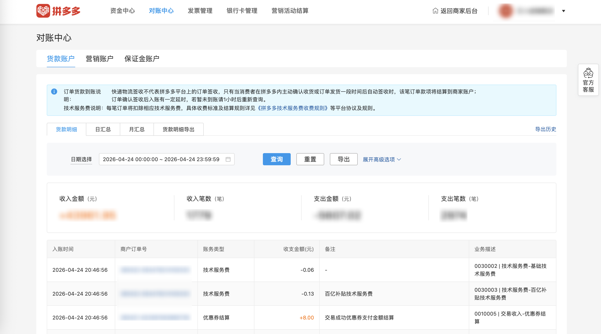

| 属性             | 值                                                                                          |
| ---------------- | ------------------------------------------------------------------------------------------- |
| **连接器类型**   | `RPA 连接器`                                                                                |
| **连接器代码**   | `rpa.conn.pinduoduo.finance.bill.list`                                                      |
| **归属 PyPI 包** | `rpa-conn-pinduoduo-all`                                                                    |
| **操作类型**     | 浏览器自动化操作 + 网络请求监听 + 下载监听                                                  |
| **目标网页**     | `https://cashier.pinduoduo.com/main/bills`                                                  |
| **适用场景**     | 按日期区间从拼多多对账中心导出账单明细；支持单日（`bizDate`）或区间（`beginDate`/`endDate`），区间含首尾不超过 31 天，仅支持最近 12 个自然月内日期 |


### 目标页面

> **路径**：拼多多商家后台 → 对账中心 → 账单
>
> **网址**：[https://cashier.pinduoduo.com/main/bills](https://cashier.pinduoduo.com/main/bills?tab=4001&__app_code=113)



### 业务入参

| 字段          | 中文释义     | 数据类型  | 必填 | 默认值 | 说明                                                                                             |
| ------------- | ------------ | --------- | ---- | ------ | ------------------------------------------------------------------------------------------------ |
| `bizDate`     | 单日账单日期 | `string`  | 否   | 昨天   | 格式：`YYYYMMDD`；与 `beginDate`/`endDate` 不能同时传                                            |
| `beginDate`   | 区间开始日期 | `string`  | 否   | —      | 格式：`YYYYMMDD`；须与 `endDate` 同时传，且 `beginDate ≤ endDate`，含首尾跨度不超过 31 天          |
| `endDate`     | 区间结束日期 | `string`  | 否   | —      | 格式：`YYYYMMDD`；须与 `beginDate` 同时传，且 `beginDate ≤ endDate`，含首尾跨度不超过 31 天          |

### 入参样例

```json
// 单日账单
{ "bizDate": "20260417" }

// 区间账单（7 天）
{ "beginDate": "20260411", "endDate": "20260417" }
```

### 数据字段

`bizDate` 格式为 `YYYYMMDD`。

| 字段               | 中文释义           | 数据类型         | 可为空 | 取数路径                | 示例                          |
| ------------------ | ------------------ | ---------------- | ------ | ----------------------- | ----------------------------- |
| `order_no`         | 商户订单号         | `string`         | 否     | `CSV.0.商户订单号`      | 240417-123456789012345        |
| `trade_time`       | 发生时间           | `string`         | 是     | `CSV.0.发生时间`        | 2026-04-17 10:18:22           |
| `income_amount`    | 收入金额（+元）    | `string`         | 是     | `CSV.0.收入金额（+元）` | 59.90                         |
| `expense_amount`   | 支出金额（-元）    | `string`         | 是     | `CSV.0.支出金额（-元）` | 0.00                          |
| `bill_type`        | 账务类型           | `string`         | 是     | `CSV.0.账务类型`        | 交易收款                      |
| `remark`           | 备注               | `string`         | 是     | `CSV.0.备注`            |                               |
| `biz_desc`         | 业务描述           | `string`         | 是     | `CSV.0.业务描述`        | 订单到账                      |
| `bizDate`          | 业务日期           | `string`         | 否     | 附加                    | —                             |
| `accountId`        | 授权 ID            | `string`         | 否     | 附加                    | —                             |

### 数据样例

```json
[
  {
    "order_no": "240417-123456789012345",
    "trade_time": "2026-04-17 10:18:22",
    "income_amount": "59.90",
    "expense_amount": "0.00",
    "bill_type": "交易收款",
    "remark": "",
    "biz_desc": "订单到账",
    "bizDate": "20260417",
    "accountId": "test_account_1"
  }
]
```

### 运行时配置

```json
{
    "name": "rpa.conn.pinduoduo.finance.bill.list",
    "package": "rpa-conn-pinduoduo-all",
    "version": null,
    "mode": "Eager"
}
```

---
