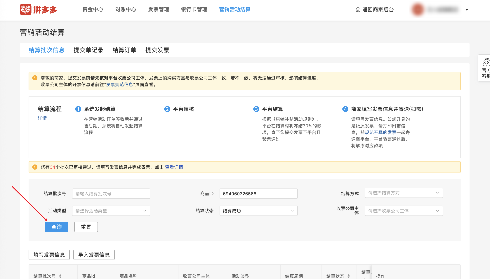

| 属性             | 值                                                                                       |
| ---------------- | ---------------------------------------------------------------------------------------- |
| **连接器类型**   | `RPA 连接器`                                                                             |
| **连接器代码**   | `rpa.conn.pinduoduo.finance.settlement.batch.list`                                       |
| **归属 PyPI 包** | `rpa-conn-pinduoduo-all`                                                                 |
| **操作类型**     | 浏览器自动化操作 + 网络请求监听                                                          |
| **目标网页**     | `https://mms.pinduoduo.com/finance/expense`                                              |
| **适用场景**     | 采集拼多多商家后台营销活动结算批次列表数据，支持按批次号、商品ID、结算状态筛选            |

### 目标页面

> **路径**：拼多多商家后台—营销结算
>
> **网址**：[https://mms.pinduoduo.com/finance/expense](https://mms.pinduoduo.com/finance/expense)



### 业务入参

| 字段 | 中文释义 | 数据类型 | 必填 | 默认值 | 说明 |
| ---- | -------- | -------- | ---- | ------ | ---- |
| `expense_batch_sn` | 结算批次号 | `string` | 否 | `""` | — |
| `goods_id` | 商品ID | `string` | 否 | `""` | 纯数字 |
| `status` | 结算状态 | `string` | 否 | `""` | 可选值：`reviewing`（审核中） / `pending_invoice`（待填写发票信息） / `released_pending_invoice`（已释放待填写发票信息） / `pending_verification`（待系统验证） / `verification_failed`（系统验证失败） / `pending_shipping_info`（待填写寄票信息） / `pending_ticket_check`（待验票） / `pending_payment`（待打款） / `settled`（结算成功） / `revoked`（已撤销） |

### 入参样例

```json
{
    "expense_batch_sn": "",
    "goods_id": "",
    "status": "settled"
}
```

### 数据字段

| 字段 | 中文释义 | 数据类型 | 可为空 | 取数路径 | 示例 |
| ---- | -------- | -------- | ------ | -------- | ---- |
| `expenseBatchSn` | 结算批次号 | `string` | 否 | `expenseBatchSn` | `BO260407103018492` |
| `goodsId` | 商品ID | `number` | 否 | `goodsId` | `694060326566` |
| `goodsName` | 商品名称 | `string` | 否 | `goodsName` | `王小卤虎皮凤爪送礼礼盒544g卤味零食大礼包宿舍屯粮即食小吃解馋` |
| `bizType` | 业务类型编码 | `number` | 否 | `bizType` | `1034` |
| `bizTypeDesc` | 业务类型描述 | `string` | 否 | `bizTypeDesc` | `百亿补贴-日常` |
| `subjectType` | 主体类型 | `number` | 否 | `subjectType` | `1` |
| `expensePeriod` | 结算周期 | `string` | 否 | `expensePeriod` | `2026-04-01 - 2026-04-01` |
| `payType` | 结算方式 | `number` | 否 | `payType` | `3` |
| `orderNum` | 订单数 | `number` | 否 | `orderNum` | `1` |
| `refundNum` | 退款数 | `number` | 否 | `refundNum` | `0` |
| `subsidyAmount` | 补贴金额（分） | `number` | 否 | `subsidyAmount` | `830` |
| `status` | 结算状态 | `number` | 否 | `status` | `5` |
| `cate2` | 二级类目 | `string` | 否 | `cate2` | `100100` |
| `cate2MmsName` | 活动类型名称 | `string` | 否 | `cate2MmsName` | `营销活动` |
| `payTime` | 打款时间戳 | `number` | 是 | `payTime` | `1775714664000` |
| `createTime` | 创建时间戳 | `number` | 否 | `createTime` | `1775540937000` |
| `needInvoice` | 是否需要发票 | `boolean` | 否 | `needInvoice` | `false` |
| `urgeStatus` | 催结算状态 | `number` | 否 | `urgeStatus` | `0` |
| `bizDate` | 业务日期 | `string` | 否 | 附加 |  |
| `accountId` | 授权 ID | `string` | 否 | 附加 |  |
| `taskId` | 任务 ID | `string` | 否 | 附加 |  |

### 数据样例

```json
{
  "expenseBatchSn": "BO260407103018492",
  "goodsId": 694060326566,
  "goodsName": "王小卤虎皮凤爪送礼礼盒544g卤味零食大礼包宿舍屯粮即食小吃解馋",
  "bizType": 1034,
  "bizTypeDesc": "百亿补贴-日常",
  "subjectType": 1,
  "expensePeriod": "2026-04-01 - 2026-04-01",
  "payType": 3,
  "orderNum": 1,
  "refundNum": 0,
  "subsidyAmount": 830,
  "status": 5,
  "cate2": "100100",
  "cate2MmsName": "营销活动",
  "payTime": 1775714664000,
  "createTime": 1775540937000,
  "needInvoice": false,
  "urgeStatus": 0,
  "bizDate": "20260513",
  "accountId": "102"
}
```

### 运行时配置

```json
{
    "name": "rpa.conn.pinduoduo.finance.settlement.batch.list",
    "package": "rpa-conn-pinduoduo-all",
    "version": null,
    "mode": "Eager"
}
```

---
