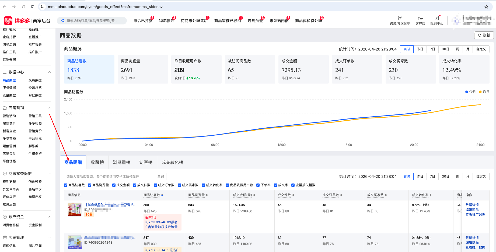

| 属性 | 值 |
| ---------------- | ---------------- |
| **连接器类型**   | `RPA 连接器` |
| **连接器代码**   | `rpa.conn.pinduoduo.item.goods.data`|
| **归属 PyPI 包** | `rpa-conn-pinduoduo-all`|
| **操作类型**     | 浏览器自动化操作 + 网络请求监听 |
| **目标网页**     | `https://mms.pinduoduo.com/sycm/goods_effect?msfrom=mms_sidenav`|
| **适用场景**     | 按统计日期查看商品维度的流量、转化、成交与环比/同行等指标的明细数据，按**商品销售额（成交金额）**降序排列；默认配置最大翻页次数 100            |


### 目标页面

> **路径**：拼多多商家后台—数据中心—商品数据—商品明细
>
> **网址**：[https://mms.pinduoduo.com/sycm/goods_effect](https://mms.pinduoduo.com/sycm/goods_effect?msfrom=mms_sidenav)



### 业务入参

| 字段         | 中文释义 | 数据类型  | 必填 | 默认值 | 说明 |
| ------------ | -------- | --------- | ---- | ------ | ---- |
| `biz_date`   | 业务日期 | `string`  | 否   | 昨天 T-1  | 格式：`YYYYMMDD` |

### 入参样例

```json
{
    "biz_date": "20260419"
}
```

### 数据字段

| 字段 | 中文释义 | 数据类型 | 可为空 | 取数路径 | 示例 |
| ---- | -------- | -------- | ------ | -------- | ---- |
| `statDate` | 统计日期 | `string` | 否 | `goodsDetailList[].statDate` | 2026-04-19 |
| `goodsId` | 商品 ID | `number` | 否 | `goodsDetailList[].goodsId` | 930005554830 |
| `goodsName` | 商品名称 | `string` | 否 | `goodsDetailList[].goodsName` | 【抖音爆款】兔头妈妈儿童牙膏抗糖防蛀宝宝学生专研牙膏水果味 |
| `goodsFavCnt` | 商品收藏用户数 | `string` | 否 | `goodsDetailList[].goodsFavCnt` | 25 |
| `goodsUv` | 商品访客数 | `string` | 否 | `goodsDetailList[].goodsUv` | 525 |
| `goodsPv` | 商品浏览量 | `string` | 否 | `goodsDetailList[].goodsPv` | 675 |
| `payOrdrCnt` | 成交订单数 | `string` | 否 | `goodsDetailList[].payOrdrCnt` | 61 |
| `goodsVcr` | 成交转化率 | `string` | 否 | `goodsDetailList[].goodsVcr` | 11.43% |
| `pctGoodsVcr` | 同行成交转化率 | `string` | 否 | `goodsDetailList[].pctGoodsVcr` | 0.00% |
| `payOrdrGoodsQty` | 成交件数 | `string` | 否 | `goodsDetailList[].payOrdrGoodsQty` | 63 |
| `payOrdrUsrCnt` | 成交买家数 | `string` | 否 | `goodsDetailList[].payOrdrUsrCnt` | 60 |
| `payOrdrAmt` | 成交金额 | `string` | 否 | `goodsDetailList[].payOrdrAmt` | 2209.58 |
| `cfmOrdrCnt` | 确认订单数 | `string` | 否 | `goodsDetailList[].cfmOrdrCnt` | 61 |
| `cfmOrdrGoodsQty` | 确认订单件数 | `string` | 否 | `goodsDetailList[].cfmOrdrGoodsQty` | 63 |
| `imprUsrCnt` | 曝光用户数 | `string` | 否 | `goodsDetailList[].imprUsrCnt` | 0 |
| `ordrCrtUsrCnt` | 下单用户数 | `string` | 否 | `goodsDetailList[].ordrCrtUsrCnt` | 63 |
| `ordrVstrRto` | 下单率 | `string` | 否 | `goodsDetailList[].ordrVstrRto` | 12.00% |
| `payOrdrRto` | 成交率 | `string` | 否 | `goodsDetailList[].payOrdrRto` | 95.24% |
| `goodsPtHelpRate` | 流量损失指数 | `string` | 否 | `goodsDetailList[].goodsPtHelpRate` | 0.00% |
| `cnsltUsrQty` | 咨询用户数 | `string` | 否 | `goodsDetailList[].cnsltUsrQty` | 0 |
| `goodsFavCntYtd` | 收藏用户数（昨日） | `string` | 是 | `goodsDetailList[].goodsFavCntYtd` | null |
| `goodsUvYtd` | 访客数（昨日） | `string` | 是 | `goodsDetailList[].goodsUvYtd` | null |
| `goodsPvYtd` | 浏览量（昨日） | `string` | 是 | `goodsDetailList[].goodsPvYtd` | null |
| `payOrdrCntYtd` | 订单数（昨日） | `string` | 是 | `goodsDetailList[].payOrdrCntYtd` | null |
| `goodsVcrYtd` | 转化率（昨日） | `string` | 是 | `goodsDetailList[].goodsVcrYtd` | 0.00% |
| `pctGoodsVcrYtd` | 同行转化率（昨日） | `string` | 是 | `goodsDetailList[].pctGoodsVcrYtd` | 0.00% |
| `payOrdrGoodsQtyYtd` | 成交件数（昨日） | `string` | 是 | `goodsDetailList[].payOrdrGoodsQtyYtd` | null |
| `payOrdrUsrCntYtd` | 成交买家数（昨日） | `string` | 是 | `goodsDetailList[].payOrdrUsrCntYtd` | null |
| `payOrdrAmtYtd` | 成交金额（昨日） | `string` | 是 | `goodsDetailList[].payOrdrAmtYtd` | null |
| `cfmOrdrCntYtd` | 确认订单数（昨日） | `string` | 是 | `goodsDetailList[].cfmOrdrCntYtd` | null |
| `cfmOrdrGoodsQtyYtd` | 确认订单件数（昨日） | `string` | 是 | `goodsDetailList[].cfmOrdrGoodsQtyYtd` | null |
| `imprUsrCntYtd` | 曝光用户数（昨日） | `string` | 是 | `goodsDetailList[].imprUsrCntYtd` | null |
| `ordrCrtUsrCntYtd` | 下单用户数（昨日） | `string` | 是 | `goodsDetailList[].ordrCrtUsrCntYtd` | 0 |
| `ordrVstrRtoYtd` | 下单率（昨日） | `string` | 是 | `goodsDetailList[].ordrVstrRtoYtd` | 0.00% |
| `payOrdrRtoYtd` | 成交率（昨日） | `string` | 是 | `goodsDetailList[].payOrdrRtoYtd` | 0.00% |
| `cnsltUsrQtyYtd` | 咨询用户数（昨日） | `string` | 是 | `goodsDetailList[].cnsltUsrQtyYtd` | 0 |
| `goodsUvPpr` | 访客数环比 | `float` | 否 | `goodsDetailList[].goodsUvPpr` | -0.1294 |
| `goodsPvPpr` | 浏览量环比 | `float` | 否 | `goodsDetailList[].goodsPvPpr` | -0.1118 |
| `payOrdrCntPpr` | 订单数环比 | `float` | 否 | `goodsDetailList[].payOrdrCntPpr` | 0.1961 |
| `goodsVcrPpr` | 转化率环比 | `float` | 否 | `goodsDetailList[].goodsVcrPpr` | 0.3783 |
| `payOrdrAmtPpr` | 成交金额环比 | `float` | 否 | `goodsDetailList[].payOrdrAmtPpr` | 0.1786 |
| `goodsFavCntPpr` | 收藏用户数环比 | `float` | 否 | `goodsDetailList[].goodsFavCntPpr` | -0.1379 |
| `payOrdrGoodsQtyPpr` | 成交件数环比 | `float` | 否 | `goodsDetailList[].payOrdrGoodsQtyPpr` | 0.2115 |
| `payOrdrUsrCntPpr` | 成交买家数环比 | `float` | 否 | `goodsDetailList[].payOrdrUsrCntPpr` | 0.2 |
| `cfmOrdrCntPpr` | 确认订单数环比 | `float` | 否 | `goodsDetailList[].cfmOrdrCntPpr` | 0.1961 |
| `cfmOrdrGoodsQtyPpr` | 确认订单件数环比 | `float` | 否 | `goodsDetailList[].cfmOrdrGoodsQtyPpr` | 0.2115 |
| `cfmOrdrRtoPpr` | 确认率环比 | `float` | 否 | `goodsDetailList[].cfmOrdrRtoPpr` | 0.0 |
| `imprUsrCntPpr` | 曝光用户数环比 | `float` | 否 | `goodsDetailList[].imprUsrCntPpr` | 0.0 |
| `ordrCrtUsrCntPpr` | 下单用户数环比 | `float` | 否 | `goodsDetailList[].ordrCrtUsrCntPpr` | 0.2115 |
| `ordrVstrRtoPpr` | 下单率环比 | `float` | 否 | `goodsDetailList[].ordrVstrRtoPpr` | 0.3915 |
| `payOrdrRtoPpr` | 成交率环比 | `float` | 否 | `goodsDetailList[].payOrdrRtoPpr` | -0.0095 |
| `goodsPtHelpRatePpr` | 流量损失指数环比 | `float` | 否 | `goodsDetailList[].goodsPtHelpRatePpr` | 0.0 |
| `cnsltUsrQtyPpr` | 咨询用户数环比 | `float` | 否 | `goodsDetailList[].cnsltUsrQtyPpr` | 4.5 |
| `goodsUvPprIsPercent` | 访客数环比为百分比 | `boolean` | 否 | `goodsDetailList[].goodsUvPprIsPercent` | true |
| `goodsPvPprIsPercent` | 浏览量环比为百分比 | `boolean` | 否 | `goodsDetailList[].goodsPvPprIsPercent` | true |
| `payOrdrCntPprIsPercent` | 订单数环比为百分比 | `boolean` | 否 | `goodsDetailList[].payOrdrCntPprIsPercent` | true |
| `goodsVcrPprIsPercent` | 转化率环比为百分比 | `boolean` | 否 | `goodsDetailList[].goodsVcrPprIsPercent` | true |
| `cfmOrdrRtoPprIsPercent` | 确认率环比为百分比 | `boolean` | 否 | `goodsDetailList[].cfmOrdrRtoPprIsPercent` | true |
| `goodsFavCntPprIsPercent` | 收藏环比为百分比 | `boolean` | 否 | `goodsDetailList[].goodsFavCntPprIsPercent` | true |
| `payOrdrGoodsQtyPprIsPercent` | 成交件数环比为百分比 | `boolean` | 否 | `goodsDetailList[].payOrdrGoodsQtyPprIsPercent` | true |
| `payOrdrUsrCntPprIsPercent` | 成交买家数环比为百分比 | `boolean` | 否 | `goodsDetailList[].payOrdrUsrCntPprIsPercent` | true |
| `payOrdrAmtPprIsPercent` | 成交金额环比为百分比 | `boole an` | 否 | `goodsDetailList[].payOrdrAmtPprIsPercent` | true |
| `cfmOrdrCntPprIsPercent` | 确认订单数环比为百分比 | `boolean` | 否 | `goodsDetailList[].cfmOrdrCntPprIsPercent` | true |
| `cfmOrdrGoodsQtyPprIsPercent` | 确认件数环比为百分比 | `boolean` | 否 | `goodsDetailList[].cfmOrdrGoodsQtyPprIsPercent` | true |
| `imprUsrCntPprIsPercent` | 曝光环比为百分比 | `boolean` | 否 | `goodsDetailList[].imprUsrCntPprIsPercent` | true |
| `imprUsrCntDetail` | 曝光详情标记 | `boolean` | 否 | `goodsDetailList[].imprUsrCntDetail` | false |
| `ordrCrtUsrCntPprIsPercent` | 下单用户环比为百分比 | `boolean` | 否 | `goodsDetailList[].ordrCrtUsrCntPprIsPercent` | true |
| `ordrVstrRtoPprIsPercent` | 下单率环比为百分比 | `boolean` | 否 | `goodsDetailList[].ordrVstrRtoPprIsPercent` | true |
| `payOrdrRtoPprIsPercent` | 成交率环比为百分比 | `boolean` | 否 | `goodsDetailList[].payOrdrRtoPprIsPercent` | true |
| `goodsPtHelpRatePprIsPercent` | 流量损失环比为百分比 | `boolean` | 否 | `goodsDetailList[].goodsPtHelpRatePprIsPercent` | true |
| `cnsltUsrQtyPprIsPercent` | 咨询用户环比为百分比 | `boolean` | 否 | `goodsDetailList[].cnsltUsrQtyPprIsPercent` | true |
| `hdThumbUrl` | 商品缩略图 URL | `string` | 否 | `goodsDetailList[].hdThumbUrl` | https://img.pddpic.com/gaudit-image/2026-03-30/c64a6e86fcf6688adcf96a7c2767b2b8.jpeg |
| `cate1Id` | 一级类目 ID | `number` | 否 | `goodsDetailList[].cate1Id` | 17285 |
| `cate1Name` | 一级类目名 | `string` | 否 | `goodsDetailList[].cate1Name` | 洗护清洁剂/卫生巾/纸/香薰 |
| `cate2Id` | 二级类目 ID | `number` | 否 | `goodsDetailList[].cate2Id` | 17286 |
| `cate2Name` | 二级类目名 | `string` | 否 | `goodsDetailList[].cate2Name` | 口腔护理 |
| `cate3Id` | 三级类目 ID | `number` | 否 | `goodsDetailList[].cate3Id` | 22094 |
| `cate3Name` | 三级类目名 | `string` | 否 | `goodsDetailList[].cate3Name` | 儿童牙膏 |
| `cate3PctGoodsVcr` | 三级类目同行转化率 | `string` | 否 | `goodsDetailList[].cate3PctGoodsVcr` | 98.08% |
| `cate3AvgGoodsVcr` | 三级类目平均转化率 | `string` | 否 | `goodsDetailList[].cate3AvgGoodsVcr` | 23.90% |
| `goodsVcrRised` | 转化率变化方向（-1/0/1） | `number` | 否 | `goodsDetailList[].goodsVcrRised` | -1 |
| `cate3IsPgvAbove` | 是否高于三级类目均值（1=是） | `number` | 否 | `goodsDetailList[].cate3IsPgvAbove` | 1 |
| `isCreated1m` | 是否近一月上架（1=是） | `number` | 否 | `goodsDetailList[].isCreated1m` | 1 |
| `isNewstyle` | 是否新款（1=是） | `number` | 否 | `goodsDetailList[].isNewstyle` | 0 |
| `goodsLabel` | 商品标签 | `float` | 否 | `goodsDetailList[].goodsLabel` | 0.0 |
| `goodsStatus` | 商品状态（1=在售） | `number` | 否 | `goodsDetailList[].goodsStatus` | 1 |
| `goodsPtHelpRateRank` | 流量损失指数排名 | `float` | 否 | `goodsDetailList[].goodsPtHelpRateRank` | 0.0 |
| `adStrategy` | 广告策略 | `any` | 是 | `goodsDetailList[].adStrategy` | null |
| `adStrategyStatus` | 广告策略状态 | `number` | 否 | `goodsDetailList[].adStrategyStatus` | 3 |
| `adStrategyDesc` | 广告策略描述 | `string` | 否 | `goodsDetailList[].adStrategyDesc` | 查看推广数据 |
| `adStrategyJumpUrl` | 广告策略跳转 URL | `string` | 否 | `goodsDetailList[].adStrategyJumpUrl` | https://yingxiao.pinduoduo.com/goods/promotion/list |
| `url` | 链接 | `string` | 是 | `goodsDetailList[].url` | null |
| `peerPerfPayOrdrAmt` | 同行表现-成交金额 | `number` | 否 | `goodsDetailList[].peerPerfPayOrdrAmt` | 4 |
| `peerPerfGoodsUv` | 同行表现-访客数 | `number` | 否 | `goodsDetailList[].peerPerfGoodsUv` | 4 |
| `peerPerfGoodsPv` | 同行表现-浏览量 | `number` | 否 | `goodsDetailList[].peerPerfGoodsPv` | 4 |
| `peerPerfGoodsFavCnt` | 同行表现-收藏用户数 | `number` | 否 | `goodsDetailList[].peerPerfGoodsFavCnt` | 2 |
| `peerPerfGoodsCvr` | 同行表现-转化率 | `number` | 否 | `goodsDetailList[].peerPerfGoodsCvr` | 1 |
| `peerPerfOrdrVstrRto` | 同行表现-下单率 | `number` | 否 | `goodsDetailList[].peerPerfOrdrVstrRto` | 1 |
| `peerPerfPayOrdrRto` | 同行表现-成交率 | `number` | 否 | `goodsDetailList[].peerPerfPayOrdrRto` | 1 |
| `peerPerfGoodsPtHelpRate` | 同行表现-流量损失 | `number` | 是 | `goodsDetailList[].peerPerfGoodsPtHelpRate` | null |
| `activityInfo` | 活动信息 | `Object` | 是 | `goodsDetailList[].activityInfo` | null |
| `showCol` | 展示列标记 | `number` | 否 | `goodsDetailList[].showCol` | 0 |
| `hotGoodsActivityInfo` | 热门商品活动信息 | `object` | 是 | `goodsDetailList[].hotGoodsActivityInfo` | 见数据样例 `hotGoodsActivityInfo` |
| `bizDate`           | 业务日期         | `string`  | 否     | 附加              |      |
| `accountId`         | 授权 ID          | `string`  | 否     | 附加              |      |

### 数据样例

```json
[
  {
    "statDate": "2026-04-19",
    "goodsId": 930005554830,
    "goodsName": "【抖音爆款】兔头妈妈儿童牙膏抗糖防蛀宝宝学生专研牙膏水果味",
    "goodsFavCnt": "25",
    "goodsUv": "525",
    "goodsPv": "675",
    "payOrdrCnt": "61",
    "goodsVcr": "11.43%",
    "pctGoodsVcr": "0.00%",
    "payOrdrGoodsQty": "63",
    "payOrdrUsrCnt": "60",
    "payOrdrAmt": "2209.58",
    "cfmOrdrCnt": "61",
    "cfmOrdrGoodsQty": "63",
    "imprUsrCnt": "0",
    "ordrCrtUsrCnt": "63",
    "ordrVstrRto": "12.00%",
    "payOrdrRto": "95.24%",
    "goodsPtHelpRate": "0.00%",
    "cnsltUsrQty": "0",
    "goodsFavCntYtd": null,
    "goodsUvYtd": null,
    "goodsPvYtd": null,
    "payOrdrCntYtd": null,
    "goodsVcrYtd": "0.00%",
    "pctGoodsVcrYtd": "0.00%",
    "payOrdrGoodsQtyYtd": null,
    "payOrdrUsrCntYtd": null,
    "payOrdrAmtYtd": null,
    "cfmOrdrCntYtd": null,
    "cfmOrdrGoodsQtyYtd": null,
    "imprUsrCntYtd": null,
    "ordrCrtUsrCntYtd": "0",
    "ordrVstrRtoYtd": "0.00%",
    "payOrdrRtoYtd": "0.00%",
    "cnsltUsrQtyYtd": "0",
    "goodsUvPpr": -0.1294,
    "goodsPvPpr": -0.1118,
    "payOrdrCntPpr": 0.1961,
    "goodsVcrPpr": 0.3783,
    "payOrdrAmtPpr": 0.1786,
    "goodsFavCntPpr": -0.1379,
    "payOrdrGoodsQtyPpr": 0.2115,
    "payOrdrUsrCntPpr": 0.2,
    "cfmOrdrCntPpr": 0.1961,
    "cfmOrdrGoodsQtyPpr": 0.2115,
    "cfmOrdrRtoPpr": 0.0,
    "imprUsrCntPpr": 0.0,
    "ordrCrtUsrCntPpr": 0.2115,
    "ordrVstrRtoPpr": 0.3915,
    "payOrdrRtoPpr": -0.0095,
    "goodsPtHelpRatePpr": 0.0,
    "cnsltUsrQtyPpr": 4.5,
    "goodsUvPprIsPercent": true,
    "goodsPvPprIsPercent": true,
    "payOrdrCntPprIsPercent": true,
    "goodsVcrPprIsPercent": true,
    "cfmOrdrRtoPprIsPercent": true,
    "goodsFavCntPprIsPercent": true,
    "payOrdrGoodsQtyPprIsPercent": true,
    "payOrdrUsrCntPprIsPercent": true,
    "payOrdrAmtPprIsPercent": true,
    "cfmOrdrCntPprIsPercent": true,
    "cfmOrdrGoodsQtyPprIsPercent": true,
    "imprUsrCntPprIsPercent": true,
    "imprUsrCntDetail": false,
    "ordrCrtUsrCntPprIsPercent": true,
    "ordrVstrRtoPprIsPercent": true,
    "payOrdrRtoPprIsPercent": true,
    "goodsPtHelpRatePprIsPercent": true,
    "cnsltUsrQtyPprIsPercent": true,
    "hdThumbUrl": "https://img.pddpic.com/gaudit-image/2026-03-30/c64a6e86fcf6688adcf96a7c2767b2b8.jpeg",
    "cate1Id": 17285,
    "cate1Name": "洗护清洁剂/卫生巾/纸/香薰",
    "cate2Id": 17286,
    "cate2Name": "口腔护理",
    "cate3Id": 22094,
    "cate3Name": "儿童牙膏",
    "cate3PctGoodsVcr": "98.08%",
    "cate3AvgGoodsVcr": "23.90%",
    "goodsVcrRised": -1,
    "cate3IsPgvAbove": 1,
    "isCreated1m": 1,
    "isNewstyle": 0,
    "goodsLabel": 0.0,
    "goodsStatus": 1,
    "goodsPtHelpRateRank": 0.0,
    "adStrategy": null,
    "adStrategyStatus": 3,
    "adStrategyDesc": "查看推广数据",
    "adStrategyJumpUrl": "https://yingxiao.pinduoduo.com/goods/promotion/list",
    "url": null,
    "peerPerfPayOrdrAmt": 4,
    "peerPerfGoodsUv": 4,
    "peerPerfGoodsPv": 4,
    "peerPerfGoodsFavCnt": 2,
    "peerPerfGoodsCvr": 1,
    "peerPerfOrdrVstrRto": 1,
    "peerPerfPayOrdrRto": 1,
    "peerPerfGoodsPtHelpRate": null,
    "activityInfo": null,
    "showCol": 0,
    "hotGoodsActivityInfo": {
      "desc": "爆单啦！恭喜解锁保权重权益",
      "showEntry": false
    },
    "bizDate": "20260419",
    "accountId": "test_account_6"
  }
]
```

### 运行时配置

```json
{
    "name": "rpa.conn.pinduoduo.item.goods.data",
    "package": "rpa-conn-pinduoduo-all",
    "version": null,
    "mode": "Eager"
}
```

---
