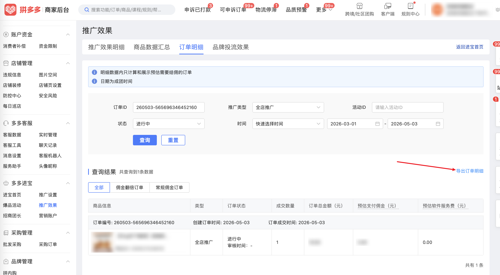

| 属性             | 值                                                                                          |
| ---------------- | ------------------------------------------------------------------------------------------- |
| **连接器类型**   | `RPA 连接器`                                                                                |
| **连接器代码**   | `rpa.conn.pinduoduo.jinbao.order.detail`                                                    |
| **归属 PyPI 包** | `rpa-conn-pinduoduo-all`                                                                    |
| **操作类型**     | 浏览器自动化操作 + 网络请求监听                                                             |
| **目标网页**     | `https://mms.pinduoduo.com/jinbao/orderDetail`                                              |
| **适用场景**     | 从拼多多多多进宝推广效果页面导出订单明细数据，支持按时间范围、订单ID、推广类型、活动ID、状态筛选 |

### 目标页面

> **路径**：拼多多商家后台 → 多多进宝 → 推广效果 → 订单明细
>
> **网址**：[https://mms.pinduoduo.com/jinbao/orderDetail](https://mms.pinduoduo.com/jinbao/orderDetail)



### 业务入参

| 字段               | 中文释义       | 数据类型  | 必填 | 默认值     | 说明                                                                                       |
| ------------------ | -------------- | --------- | ---- | ---------- | ------------------------------------------------------------------------------------------ |
| `order_sn`         | 订单ID         | `string`  | 否   | `""`       | —                                                                                          |
| `cps_type`         | 推广类型       | `string`  | 否   | `"全部"`   | 可选值：`全部` / `全店推广` / `单品推广` / `招商活动`                                       |
| `activity_id`      | 活动ID         | `string`  | 否   | `""`       | —                                                                                          |
| `promotion_status` | 状态           | `string`  | 否   | `"全部"`   | 可选值：`全部` / `推广成功` / `进行中` / `已失效`                                           |
| `time_range`       | 快速时间选择   | `string`  | 否   | `"过去7天"` | 可选值：`今天` / `昨天` / `过去7天` / `过去30天` / `过去60天` / `过去90天`；与自定义日期互斥 |
| `start_date`       | 自定义开始日期 | `string`  | 否   | `""`       | 格式：`YYYY-MM-DD`；须与 `end_date` 同时传，不能早于近 90 天前                              |
| `end_date`         | 自定义结束日期 | `string`  | 否   | `""`       | 格式：`YYYY-MM-DD`；须与 `start_date` 同时传，不能晚于今天                                  |

### 入参样例

```json
// 使用快速时间选择（默认过去7天）
{}

// 指定推广类型 + 自定义日期
{
    "cps_type": "全店推广",
    "start_date": "2026-04-01",
    "end_date": "2026-04-30"
}
```

### 数据字段

`bizDate` 格式为 `YYYYMMDD`。

| 字段                        | 中文释义           | 数据类型  | 可为空 | 取数路径                  | 示例                                                        |
| --------------------------- | ------------------ | --------- | ------ | ------------------------- | ----------------------------------------------------------- |
| `orderSn`                   | 订单编号           | `string`  | 否     | `orderSn`                 | 260503-565696346452160                                      |
| `promotionStatus`           | 推广状态           | `number`  | 否     | `promotionStatus`         | 3                                                           |
| `cpsType`                   | 推广类型           | `number`  | 否     | `cpsType`                 | 4                                                           |
| `orderCreateTime`           | 创建订单时间       | `string`  | 是     | `orderCreateTime`         | 2026-05-03                                                  |
| `groupSuccessTime`          | 订单成交时间       | `string`  | 是     | `groupSuccessTime`        | 2026-05-03                                                  |
| `verifyTime`                | 审核时间           | `string`  | 是     | `verifyTime`              |                                                             |
| `confirmReceiveTime`        | 确认收货时间       | `string`  | 是     | `confirmReceiveTime`      |                                                             |
| `goodsId`                   | 商品ID             | `number`  | 否     | `adGood.goodsId`          | 938521528818                                                |
| `goodsName`                 | 商品名称           | `string`  | 否     | `adGood.goodsName`        | 【50g冻干咖啡】连咖啡意式浓缩瓶装冻干咖啡速溶咖啡美式拿铁  |
| `groupPrice`                | 商品价格（分）     | `number`  | 否     | `adGood.groupPrice`       | 1990                                                        |
| `goodsNum`                  | 成交数量           | `number`  | 否     | `goodsNum`                | 1                                                           |
| `groupSuccessOrderAmount`   | 订单总金额（分）   | `number`  | 否     | `groupSuccessOrderAmount` | 18900                                                       |
| `originDdkFee`              | 预估支付佣金（分） | `number`  | 是     | `originDdkFee`            | 950                                                         |
| `technicalFee`              | 预估结算服务费（分）| `number` | 是     | `technicalFee`            | 0                                                           |
| `activityId`                | 活动ID             | `string`  | 是     | `activityId`              |                                                             |
| `zsActivityCode`            | 招商活动编码       | `number`  | 是     | `zsActivityCode`          | 0                                                           |
| `duoId`                     | 推手ID             | `string`  | 是     | `duoId`                   |                                                             |
| `duoName`                   | 推手名称           | `string`  | 是     | `duoName`                 |                                                             |
| `adId`                      | 广告ID             | `string`  | 是     | `adId`                    |                                                             |
| `feeRate`                   | 佣金比例           | `number`  | 是     | `feeRate`                 |                                                             |
| `totalFeeRate`              | 总佣金比例         | `number`  | 是     | `totalFeeRate`            |                                                             |
| `realDdkFee`                | 实际佣金（分）     | `number`  | 是     | `realDdkFee`              |                                                             |
| `couponFee`                 | 优惠券费（分）     | `number`  | 是     | `couponFee`               |                                                             |
| `realPlatformFee`           | 平台费（分）       | `number`  | 是     | `realPlatformFee`         |                                                             |
| `incomeFee`                 | 收入费（分）       | `number`  | 是     | `incomeFee`               |                                                             |
| `zsAgentFeeRate`            | 招商佣金比例       | `number`  | 是     | `zsAgentFeeRate`          |                                                             |
| `zsAgentFeeAmount`          | 招商佣金金额（分） | `number`  | 是     | `zsAgentFeeAmount`        | 0                                                           |
| `newMallSubsidyOrderSign`   | 新商家补贴标记     | `boolean` | 是     | `newMallSubsidyOrderSign` | false                                                       |
| `hoverTxt`                  | 提示文字           | `string`  | 是     | `hoverTxt`                |                                                             |
| `bizDate`                   | 业务日期           | `string`  | 否     | 附加                      |                                                             |
| `accountId`                 | 授权 ID            | `string`  | 否     | 附加                      |                                                             |

### 数据样例

```json
[
  {
    "orderSn": "260503-565696346452160",
    "promotionStatus": 3,
    "cpsType": 4,
    "orderCreateTime": "2026-05-03",
    "groupSuccessTime": "2026-05-03",
    "verifyTime": "",
    "confirmReceiveTime": null,
    "goodsId": 938521528818,
    "goodsName": "【50g冻干咖啡】连咖啡意式浓缩瓶装冻干咖啡速溶咖啡美式拿铁",
    "groupPrice": 1990,
    "goodsNum": 1,
    "groupSuccessOrderAmount": 18900,
    "originDdkFee": 950,
    "technicalFee": 0,
    "activityId": null,
    "zsActivityCode": 0,
    "duoId": null,
    "duoName": null,
    "adId": null,
    "feeRate": null,
    "totalFeeRate": null,
    "realDdkFee": null,
    "couponFee": null,
    "realPlatformFee": null,
    "incomeFee": null,
    "zsAgentFeeRate": null,
    "zsAgentFeeAmount": 0,
    "newMallSubsidyOrderSign": false,
    "hoverTxt": null,
    "bizDate": "20260506",
    "accountId": "104",
    "taskId": "dev-0-b917e3b4"
  }
]
```

### 运行时配置

```json
{
    "name": "rpa.conn.pinduoduo.jinbao.order.detail",
    "package": "rpa-conn-pinduoduo-all",
    "version": null,
    "mode": "Eager"
}
```

---
