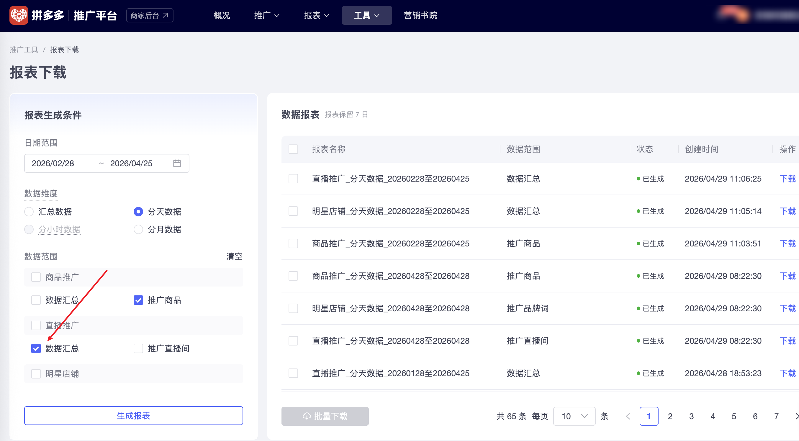

| 属性             | 值                                                                |
| ---------------- | ----------------------------------------------------------------- |
| **连接器类型**   | `RPA 连接器`                                                      |
| **连接器代码**   | `rpa.conn.pinduoduo.mms.live.report.download`                     |
| **归属 PyPI 包** | `rpa-conn-pinduoduo-all`                                          |
| **操作类型**     | 浏览器自动化操作 + XLSX 文件导出                                  |
| **目标网页**     | `https://yingxiao.pinduoduo.com/tools/report/download`            |
| **适用场景**     | 从拼多多推广平台下载「直播推广-数据汇总」分天数据报表，支持快捷日期与自定义日期范围 |

### 目标页面

> **路径**：拼多多推广平台—工具—报表下载
>
> **网址**：[https://yingxiao.pinduoduo.com/tools/report/download](https://yingxiao.pinduoduo.com/tools/report/download)



### 业务入参

| 字段 | 中文释义 | 数据类型 | 必填 | 默认值 | 说明 |
| ---- | -------- | -------- | ---- | ------ | ---- |
| `date_range` | 日期范围 | `string` | 否 | `"7d"` | 可选值：`today`(今日) / `yesterday`(昨日) / `7d`(近7日) / `30d`(近30日) / `90d`(近90日) / `custom`(自定义) |
| `custom_start_date` | 自定义开始日期 | `string` | 否 | — | 格式 YYYYMMDD，`date_range="custom"` 时必填 |
| `custom_end_date` | 自定义结束日期 | `string` | 否 | — | 格式 YYYYMMDD，`date_range="custom"` 时必填 |

### 入参样例

```json
{
    "date_range": "7d"
}
```

### 数据字段

| 字段 | 中文释义 | 数据类型 | 可为空 | 取数路径 | 示例 |
| ---- | -------- | -------- | ------ | -------- | ---- |
| `date` | 日期 | `string` | 否 | `XLSX.0.日期` | — |
| `total_cost` | 总花费(元) | `number` | 是 | `XLSX.0.总花费(元)` | — |
| `deal_cost` | 成交花费(元) | `number` | 是 | `XLSX.0.成交花费(元)` | — |
| `trade_amount` | 交易额(元) | `number` | 是 | `XLSX.0.交易额(元)` | — |
| `actual_roi` | 实际投产比 | `number` | 是 | `XLSX.0.实际投产比` | — |
| `deal_count` | 成交笔数 | `number` | 是 | `XLSX.0.成交笔数` | — |
| `cost_per_deal` | 每笔成交花费(元) | `number` | 是 | `XLSX.0.每笔成交花费(元)` | — |
| `amount_per_deal` | 每笔成交金额(元) | `number` | 是 | `XLSX.0.每笔成交金额(元)` | — |
| `impressions` | 曝光量 | `number` | 是 | `XLSX.0.曝光量` | — |
| `follow_count` | 关注量 | `number` | 是 | `XLSX.0.关注量` | — |
| `deep_view_count` | 深度观看 | `number` | 是 | `XLSX.0.深度观看` | — |
| `cpm` | 千次曝光花费(元) | `number` | 是 | `XLSX.0.千次曝光花费(元)` | — |
| `cvr_per_mille` | 千次曝光转化数 | `number` | 是 | `XLSX.0.千次曝光转化数` | — |
| `trade_per_mille` | 千次曝光交易额(元) | `number` | 是 | `XLSX.0.千次曝光交易额(元)` | — |
| `fans_per_mille` | 千次曝光增粉数 | `number` | 是 | `XLSX.0.千次曝光增粉数` | — |
| `comment_count` | 直播评论量 | `number` | 是 | `XLSX.0.直播评论量` | — |
| `goods_favorite_count` | 商品收藏量 | `number` | 是 | `XLSX.0.商品收藏量` | — |
| `taskId` | 任务 ID | `string` | 否 | 附加 | dev-0-b917e3b4 |
| `bizDate` | 业务日期 | `string` | 否 | 附加 |  |
| `accountId` | 授权 ID | `string` | 否 | 附加 |  |

### 数据样例

{/* TODO: 数据样例待补充 */}

### 运行时配置

```json
{
    "name": "rpa.conn.pinduoduo.mms.live.report.download",
    "package": "rpa-conn-pinduoduo-all",
    "version": null,
    "mode": "Eager"
}
```

---
