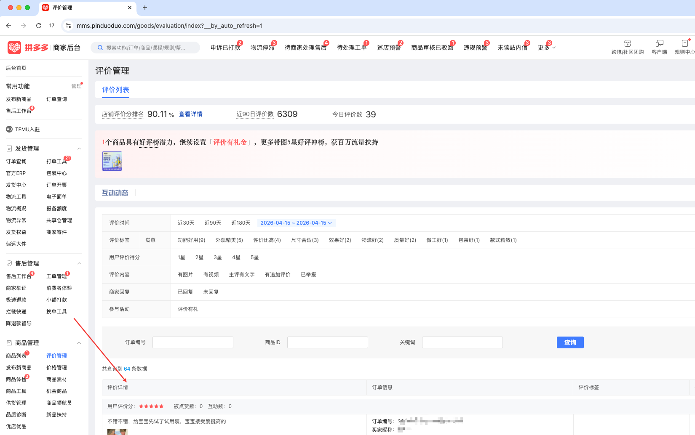

| 属性             | 值                                                                                                   |
| ---------------- | ---------------------------------------------------------------------------------------------------- |
| **连接器类型**   | `RPA 连接器` |
| **连接器代码**   | `rpa.conn.pinduoduo.shop.comment.list` |
| **归属 PyPI 包** | `rpa-conn-pinduoduo-all` |
| **操作类型**     | 浏览器自动化操作 + 网络请求监听 |
| **目标网页**     | `https://mms.pinduoduo.com/goods/evaluation/index?msfrom=mms_sidenav` |
| **适用场景**     | 按时间/评分/内容类型/回复状态/活动/订单/商品/关键词获取商品评价明细数据；默认配置最大翻页次数 100        |


### 目标页面

> **路径**：拼多多商家后台—商品管理—评价管理—评价列表
>
> **网址**：[https://mms.pinduoduo.com/goods/evaluation/index](https://mms.pinduoduo.com/goods/evaluation/index?msfrom=mms_sidenav)



### 业务入参

| 字段                 | 中文释义       | 数据类型         | 必填 | 默认值   | 说明 |
| -------------------- | -------------- | ---------------- | ---- | -------- | ---- |
| `time_range`         | 评价时间范围   | `string`         | 否   | `90d`    | `30d` / `90d` / `180d` / `custom` |
| `custom_start_date`  | 自定义开始日期 | `string`         | `time_range = custom` 时必填 | —     | 格式： `YYYYMMDD`，如 `20260101` |
| `custom_end_date`    | 自定义结束日期 | `string`         | `time_range = custom` 时必填 | —      | 格式： `YYYYMMDD`，如 `20260420` |
| `user_scores`        | 用户评分列表   | `List[int]`      | 否   | `[]`     | 可选项：`1`(1星)、`2`(2星)、`3`(3星)、`4`(4星)、`5`(5星) |
| `content_types`      | 评价内容筛选   | `List[str]`   | 否   | `[]`     | 可选项：`有图片`、`有视频`、`主评有文字`、`有追加评价`、`已举报` |
| `reply_status`       | 商家回复筛选   | `List[str]`   | 否   | `[]`     | 可选项：`已回复`、`未回复` |
| `activity`           | 参与活动筛选   | `List[str]`   | 否   | `[]`     | 可选项：`评价有礼` |
| `order_sn`           | 订单编号       | `string`         | 否   | —     | 比如 `260410-662259689903207` |
| `goods_id`           | 商品 ID        | `string`         | 否   | —    | 比如 `930005554830` |
| `keyword`            | 关键词         | `string`         | 否   | —     | 比如 `牙膏`；） |

### 入参样例

```json
// 30 天内，用户评分为 1、2、3 的评价，评价内容包含有文字的评价
{
    "time_range": "30d",
    "user_scores": [1, 2, 3],
    "content_types": ["主评有文字"]
}
// 自定义评价时间范围，用户评分为 1、2、3 的评价，有追加评价的评价
{
    "time_range": "custom",
    "custom_start_date": "20260101",
    "custom_end_date": "20260420",
    "user_scores": [1, 2, 3],
    "content_types": ["有追加评价"]
}
```

### 数据字段


| 字段               | 中文释义               | 数据类型        | 可为空 | 取数路径        | 示例 |
| ------------------ | ---------------------- | --------------- | ------ | --------------- | ---- |
| `reviewId`         | 评价 ID                | `string`        | 否     | `data[].reviewId` | 747883323036505742 |
| `userId`           | 用户 ID                | `number`           | 否     | `data[].userId` | 9895799943 |
| `goodsId`          | 商品 ID                | `number`           | 否     | `data[].goodsId` | 930005554830 |
| `orderId`          | 订单 ID                | `string`        | 否     | `data[].orderId` | 3282662259689903207 |
| `orderSn`          | 订单编号               | `string`        | 否     | `data[].orderSn` | 260410-662259689903207 |
| `score`            | 综合评分               | `number`           | 否     | `data[].score` | 0 |
| `descScore`        | 描述评分               | `number`           | 否     | `data[].descScore` | 5 |
| `logisticsScore`   | 物流评分               | `number`           | 否     | `data[].logisticsScore` | 5 |
| `serviceScore`     | 服务评分               | `number`           | 否     | `data[].serviceScore` | 5 |
| `comment`          | 评价内容               | `string`        | 是     | `data[].comment` | 牙膏非常好，推荐购买，很喜欢，还会回购，很喜欢[大爱][大爱][大爱][大爱] |
| `goodsName`        | 商品名称               | `string`        | 否     | `data[].goodsName` | 【抖音爆款】兔头妈妈儿童牙膏抗糖防蛀宝宝学生专研牙膏水果味 |
| `specs`            | 规格 JSON 字符串       | `string`        | 是     | `data[].specs` | 见数据样例 `specs` |
| `createTime`       | 评价时间（Unix 秒）   | `number`           | 否     | `data[].createTime` | 1776665876 |
| `anonymous`        | 是否匿名（1=是）       | `number`           | 否     | `data[].anonymous` | 1 |
| `append`           | 是否有追评（1=是）     | `number`           | 否     | `data[].append` | 0 |
| `appendNum`        | 追评次数               | `number`           | 否     | `data[].appendNum` | 0 |
| `reply`            | 商家回复内容           | `string`        | 是     | `data[].reply` | 兔头妈妈抗糖牙膏采用三重酶解抗糖配方，轻松应对多种糖分残留... |
| `replyTime`        | 回复时间（Unix 秒）   | `number` | 是     | `data[].replyTime` | 1776669842 |
| `replyStatus`      | 回复状态（1=已回复）  | `number`           | 否     | `data[].replyStatus` | 1 |
| `keywords`         | 评价关键词             | `List`          | 否     | `data[].keywords` | [] |
| `userName`         | 用户名（脱敏）         | `string`        | 否     | `data[].userName` | 阿*** |
| `thumbUrl`         | 用户头像 URL           | `string`        | 是     | `data[].thumbUrl` | https://img.pddpic.com/gaudit-image/2026-03-30/6bb9906a8b6938721d81ccb27240a85f.jpeg |
| `favorCount`       | 点赞数                 | `number`           | 否     | `data[].favorCount` | 0 |
| `replyCount`       | 回复数                 | `number`           | 否     | `data[].replyCount` | 1 |
| `status`           | 评价状态               | `number`           | 否     | `data[].status` | 2 |
| `pictureUrls`      | 评价图片 URL 列表     | `List[string]`  | 否     | `data[].pictureUrls` | 见数据样例 `pictureUrls` |
| `pictureCount`     | 图片数量               | `number`           | 否     | `data[].pictureCount` | 3 |
| `hasVideo`         | 是否有视频（1=是）     | `number`           | 否     | `data[].hasVideo` | 0 |
| `snapshotSpec`     | 下单规格快照           | `string`        | 是     | `data[].snapshotSpec` | 【抗糖防蛀水果味】,葡萄味60g*1支+蜜瓜味60g*1支+蜜桃牙膏10g*2支 |
| `snapshotGoodsName`| 下单商品名快照         | `string`        | 是     | `data[].snapshotGoodsName` | 【抖音爆款】兔头妈妈儿童牙膏抗糖防蛀宝宝学生专研牙膏水果味 |
| `appendComment`    | 追评内容               | `string`        | 是     | `data[].appendComment` | "" |
| `appendCreateTime` | 追评时间（Unix 秒）   | `number`  | 是     | `data[].appendCreateTime` | null |
| `reportStatus`     | 举报状态               | `number` | 是     | `data[].reportStatus` | 99 |
| `reportDesc`       | 举报描述               | `string`        | 是     | `data[].reportDesc` | 未被举报 |
| `bizDate`           | 业务日期         | `string`  | 否     | 附加              |      |
| `accountId`         | 授权 ID          | `string`  | 否     | 附加              |      |

#### 页面评价星级说明

- 根据页面渲染逻辑，页面中的「用户评价分」星级计算逻辑：
    - 若 `score === 0` 则取 `descScore` 的整数部分，即`Math.floor(descScore)`；
    - 若 `score === 0` 则取 `score` 的整数部分，即 `Math.floor(score)`；
- 通过翻页检查确认：
    - 未发现 `score !== 0` 的情况；
    - 未发现 `descScore` 非整数的情况；

### 数据样例

```json
[
  {
    "reviewId": "747883323036505742",
    "userId": 9895799943,
    "goodsId": 930005554830,
    "orderId": "3282662259689903207",
    "orderSn": "260410-662259689903207",
    "score": 0,
    "descScore": 5,
    "logisticsScore": 5,
    "serviceScore": 5,
    "comment": "牙膏非常好，推荐购买，很喜欢，还会回购，很喜欢[大爱][大爱][大爱][大爱]",
    "goodsName": "【抖音爆款】兔头妈妈儿童牙膏抗糖防蛀宝宝学生专研牙膏水果味",
    "specs": "[{\"spec_key\":\"款式\",\"spec_value\":\"【抗糖防蛀水果味】\"},{\"spec_key\":\"口味\",\"spec_value\":\"葡萄味60g*1支+蜜瓜味60g*1支+蜜桃牙膏10g*2支\"}]",
    "createTime": 1776665876,
    "anonymous": 1,
    "append": 0,
    "appendNum": 0,
    "reply": "兔头妈妈抗糖牙膏采用三重酶解抗糖配方，轻松应对多种糖分残留...",
    "replyTime": 1776669842,
    "replyStatus": 1,
    "keywords": [],
    "userName": "阿***",
    "thumbUrl": "https://img.pddpic.com/gaudit-image/2026-03-30/6bb9906a8b6938721d81ccb27240a85f.jpeg",
    "favorCount": 0,
    "replyCount": 1,
    "status": 2,
    "pictureUrls": [
      "https://review.pddpic.com/review3/review/2026-04-20/f514d234-3112-4195-b82d-ba6a66f451d2.jpeg",
      "https://review.pddpic.com/review3/review/2026-04-20/39921f2e-e84e-4015-a8ac-85feaeedbee1.jpeg",
      "https://review.pddpic.com/review3/review/2026-04-20/9590fe74-9fdd-4781-be09-0fe1e2398e59.jpeg"
    ],
    "pictureCount": 3,
    "hasVideo": 0,
    "snapshotSpec": "【抗糖防蛀水果味】,葡萄味60g*1支+蜜瓜味60g*1支+蜜桃牙膏10g*2支",
    "snapshotGoodsName": "【抖音爆款】兔头妈妈儿童牙膏抗糖防蛀宝宝学生专研牙膏水果味",
    "appendComment": "",
    "appendCreateTime": null,
    "reportStatus": 99,
    "reportDesc": "未被举报",
    "bizDate": "20260420",
    "accountId": "test_account_6"
  }
]
```

### 运行时配置

```json
{
    "name": "rpa.conn.pinduoduo.shop.comment.list",
    "package": "rpa-conn-pinduoduo-all",
    "version": null,
    "mode": "Eager"
}
```

---
