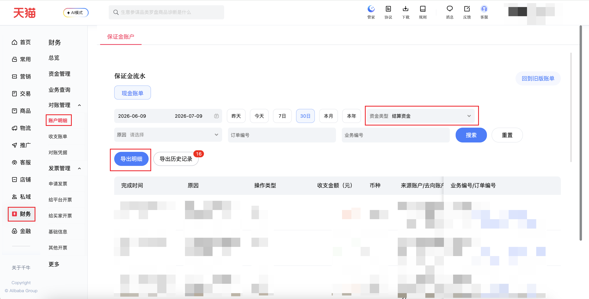

| 属性             | 值                                                                                    |
| ---------------- | ------------------------------------------------------------------------------------- |
| **连接器类型**   | `RPA 连接器`                                                                          |
| **连接器代码**   | `rpa.conn.qianniu.finance.bail.account.detail`                                        |
| **归属 PyPI 包** | `rpa-conn-qianniu-all`                                                                |
| **操作类型**     | 浏览器自动化操作 + XLSX 文件导出                                                      |
| **目标网页**     | `https://myseller.taobao.com/home.htm/whale-accountant/bill/account-details`          |
| **适用场景**     | 导出千牛保证金账户「结算资金」账单明细，支持快捷时间范围或自定义起止日期（暂不支持淘宝 C 店） |
| **预估耗时**     | `2100s`（约 35 分钟）                                                                 |

> **耗时说明**：千牛保证金账单明细采用「先提交导出申请、后台异步生成文件」模式，页面提示通常需 **20～30 分钟** 才能完成；连接器提交申请后需**每分钟轮询**导出历史，直至任务状态变为「执行成功」且出现「下载文件」链接，再触发下载与解析。查询时间范围越大、明细条数越多，等待时间越接近上限；若已有进行中的导出任务，会立即返回任务信息而不重复提交。

### 目标页面

> **路径**：千牛—财务—保证金账户—账单明细
>
> **网址**：[https://myseller.taobao.com/home.htm/whale-accountant/bill/account-details](https://myseller.taobao.com/home.htm/whale-accountant/bill/account-details)



### 业务入参

| 字段 | 中文释义 | 数据类型 | 必填 | 默认值 | 说明 |
| ---- | -------- | -------- | ---- | ------ | ---- |
| `date_range_type` | 时间范围类型 | `String` | 否 | `LAST_30_DAYS` | 可选值：`YESTERDAY`（昨天）、`TODAY`（今天）、`LAST_7_DAYS`（7 日）、`LAST_30_DAYS`（30 日）、`THIS_MONTH`（本月）、`THIS_YEAR`（本年）、`CUSTOM`（自定义） |
| `custom_start_date` | 自定义开始日期 | `String` | 条件必填 | — | `date_range_type` 为 `CUSTOM` 时必填；支持格式：`YYYYMMDD`、`YYYY-MM-DD`；不得晚于今天 |
| `custom_end_date` | 自定义结束日期 | `String` | 条件必填 | — | `date_range_type` 为 `CUSTOM` 时必填；支持格式：`YYYYMMDD`、`YYYY-MM-DD`；不得晚于今天；与开始日期含首尾跨度不超过 365 天；非 `CUSTOM` 模式不应传入 |

### 入参样例

```json
{
  "date_range_type": "LAST_30_DAYS"
}
```

### 入参校验

```json-schema collapsed
{
  "$schema": "https://json-schema.org/draft/2020-12/schema",
  "title": "千牛-结算资金账单明细 - 查询入参",
  "description": "导出千牛保证金账户「结算资金」账单明细，支持快捷时间范围或自定义起止日期（暂不支持淘宝 C 店）",
  "type": "object",
  "properties": {
    "date_range_type": {
      "type": "string",
      "description": "时间范围类型。可选值：YESTERDAY（昨天）、TODAY（今天）、LAST_7_DAYS（7 日）、LAST_30_DAYS（30 日）、THIS_MONTH（本月）、THIS_YEAR（本年）、CUSTOM（自定义）",
      "enum": [
        "YESTERDAY",
        "TODAY",
        "LAST_7_DAYS",
        "LAST_30_DAYS",
        "THIS_MONTH",
        "THIS_YEAR",
        "CUSTOM"
      ],
      "default": "LAST_30_DAYS"
    },
    "custom_start_date": {
      "type": "string",
      "description": "自定义开始日期。date_range_type 为 CUSTOM 时必填；支持格式 YYYYMMDD、YYYY-MM-DD；不得晚于今天"
    },
    "custom_end_date": {
      "type": "string",
      "description": "自定义结束日期。date_range_type 为 CUSTOM 时必填；支持格式 YYYYMMDD、YYYY-MM-DD；不得晚于今天；与开始日期含首尾跨度不超过 365 天；非 CUSTOM 模式不应传入"
    }
  },
  "required": [],
  "if": {
    "properties": {
      "date_range_type": {
        "const": "CUSTOM"
      }
    }
  },
  "then": {
    "required": ["custom_start_date", "custom_end_date"]
  },
  "additionalProperties": false
}
```

### 数据字段

| 字段 | 中文释义 | 数据类型 | 可为空 | 取数路径 | 示例 |
| ---- | -------- | -------- | ------ | -------- | ---- |
| `completeTime` | 完成时间 | `String` | 否 | `XLSX.0.完成时间` | `2026-07-08 09:40:06` |
| `operationType` | 操作类型 | `String` | 否 | `XLSX.0.操作类型` | `出账` |
| `reason` | 原因 | `String` | 否 | `XLSX.0.原因` | `交易赔付/争议处理/运费争议` |
| `currency` | 币种 | `String` | 否 | `XLSX.0.币种` | `CNY` |
| `amount` | 收支金额（元） | `Number` | 否 | `XLSX.0.收支金额(元)` | `-7.9` |
| `sourceAccount` | 来源账户 | `String` | 否 | `XLSX.0.来源账户` | `保证金余额` |
| `destAccount` | 去向账户 | `String` | 否 | `XLSX.0.去向账户` | `消费者（telly1993）` |
| `fundingType` | 出资类型 | `String` | 否 | `XLSX.0.出资类型` | `现金` |
| `bizDesc` | 业务描述 | `String` | 否 | `XLSX.0.业务描述` | `0070002&#124;其他支出-交易赔付（保证金扣款）` |
| `bizNo` | 业务编号 | `String` | 是 | `XLSX.0.业务编号` | — |
| `orderNo` | 订单编号 | `Number` | 是 | `XLSX.0.订单编号` | `5121428040576030737` |
| `remark` | 备注 | `String` | 是 | `XLSX.0.备注` | `-` |
| `sellerPlatform` | 店铺平台 | `String` | 否 | 附加 | `tmall` |
| `bizDate` | 业务日期 | `String` | 否 | 附加 |  |
| `accountId` | 授权 ID | `String` | 否 | 附加 |  |

### 数据样例

```json
[
  {
    "completeTime": "2026-07-08 09:40:06",
    "operationType": "出账",
    "reason": "交易赔付/争议处理/运费争议",
    "currency": "CNY",
    "amount": -7.9,
    "sourceAccount": "保证金余额",
    "destAccount": "消费者（telly1993）",
    "fundingType": "现金",
    "bizDesc": "0070002|其他支出-交易赔付（保证金扣款）",
    "bizNo": null,
    "orderNo": 5121428040576030737,
    "remark": "-",
    "sellerPlatform": "tmall",
    "bizDate": "2026-07-08T16:00:00.000Z",
    "accountId": "138"
  }
]
```

---
