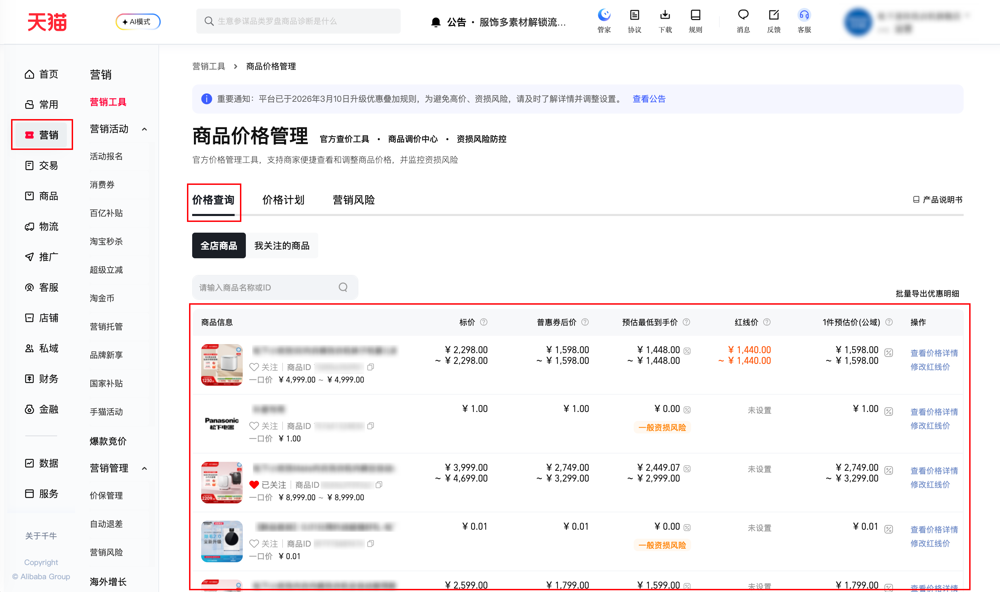

| 属性             | 值                                                                                       |
| ---------------- | ---------------------------------------------------------------------------------------- |
| **连接器类型**   | `RPA 连接器`                                                                             |
| **连接器代码**   | `rpa.conn.qianniu.item.price.discount.list`                                              |
| **归属 PyPI 包** | `rpa-conn-qianniu-all`                                                                   |
| **操作类型**     | 浏览器自动化操作 + 网络请求监听 + XLSX文件导出                                           |
| **目标网页**     | `https://myseller.taobao.com/home.htm/PriceManagement/?source=qianniulist&TabCode=Price` |
| **适用场景**     | 按商品 ID 批量导出价格优惠明细，支持按价格类型、导出维度筛选，最多 800 个商品            |

### 目标页面

> **路径**：千牛后台—营销—营销风险—商品价格管理—价格查询
>
> **网址**：[https://myseller.taobao.com/home.htm/PriceManagement/?source=qianniulist&TabCode=Price](https://myseller.taobao.com/home.htm/PriceManagement/?source=qianniulist&TabCode=Price)



### 业务入参

| 字段 | 中文释义 | 数据类型 | 必填 | 默认值 | 说明 |
| ------------ | ------------ | ------------ | ------------ | ------------ | ------------ |
| `item_ids` | 商品 ID 列表 | `string` \| `list[string]` | 是   | — | 支持英文逗号或空格分隔的字符串，或字符串数组；最多 800 个；中文逗号会转为英文逗号 |
| `effective_time` | 优惠生效时间 | `string` | 否   | — | 格式 `YYYY-MM-DD HH:MM:SS`；不传则保持页面默认（通常相较于数据采集时间晚1小时） |
| `price_type` | 价格类型     | `string` | 否   | `1件预估价(公域)` | 可选值：`1件预估价(公域)`、`预估最低到手价` |
| `export_type` | 导出维度 | `string` | 否   | `SKU维度` | 可选值：`商品维度`、`SKU维度` |

### 入参样例

```json
{
    "item_ids": [
        "720056350901",
        "826562939262",
        "752102501302",
        "741212242088",
        "740949636929"
    ],
    "effective_time": "",
    "price_type": "1件预估价(公域)",
    "export_type": "SKU维度"
}
```

### 数据字段

`bizDate` 格式为 `YYYYMMDD`。`header=2`，`rename_columns` 将表头中文列映射为下列字段名。

| 字段            | 中文释义       | 数据类型 | 可为空 | 取数路径                | 示例                                                     |
| --------------- | -------------- | -------- | ------ | ----------------------- | -------------------------------------------------------- |
| `itemName`      | 商品名称       | `string` | 否     | `XLSX.0.商品名称`       | 松下小欢洗内衣内裤洗衣机全自动家用除菌小型波轮洗烘一体机 |
| `itemId`        | 商品 ID        | `string` | 否     | `XLSX.0.商品Id`         | 719850241635                                             |
| `skuName`       | SKU 名称       | `string` | 否     | `XLSX.0.sku名称`        | 颜色分类:XQB05-AW05C 0.5kg暖心米                         |
| `skuId`         | SKU ID         | `string` | 否     | `XLSX.0.skuId`          | 6035855913917                                            |
| `lowPrice`      | 预估最低到手价 | `string` | 否     | `XLSX.0.预估最低到手价` | 1769.0                                                   |
| `originalPrice` | 一口价         | `string` | 否     | `XLSX.0.一口价`         | 4999.0                                                   |
| `bidPrice`      | 标价           | `string` | 否     | `XLSX.0.标价`           | 2599.0                                                   |
| `activityName`  | 活动名称       | `string` | 否     | `XLSX.0.活动名称`       | 2026年天猫春季家装节                                     |
| `discountLevel` | 优惠层级       | `string` | 否     | `XLSX.0.优惠层级`       | 单品级                                                   |
| `toolName`      | 工具名称       | `string` | 否     | `XLSX.0.工具名称`       | 官方立减                                                 |
| `discountDesc`  | 优惠信息       | `string` | 否     | `XLSX.0.优惠信息`       | 减400元                                                  |
| `activityId`    | 活动 ID        | `string` | 否     | `XLSX.0.活动id`         | 130638447290                                             |
| `discountFee`   | 优惠金额       | `string` | 否     | `XLSX.0.优惠金额`       | 400.0                                                    |
| `activityTime`  | 活动时间       | `string` | 否     | `XLSX.0.活动时间`       | 2026-03-23 00:00:00-2026-03-31 23:59:59                  |
| `bizDate`           | 业务日期         | `string`  | 否     | 附加              |      |
| `accountId`         | 授权 ID          | `string`  | 否     | 附加              |      |

### 数据样例

```json
[
    {
        "itemName": "松下小欢洗SE内衣裤洗衣机袜子机婴儿家用小型全自动洗脱一体机",
        "itemId": 720056350901,
        "skuName": "颜色分类:XQB10-A10C米釉瓷",
        "skuId": 5015033904244,
        "lowPrice": 1568.0,
        "originalPrice": 4999.0,
        "bidPrice": 2298.0,
        "activityName": "优惠价",
        "speScoreStatus": "单品级",
        "toolName": "官方大促",
        "discountDesc": "一口价2298元",
        "activityId": 132071382522,
        "discountFee": 2701.0,
        "activityTime": "2026-04-15 00:00:00-2026-04-19 23:59:59",
        "bizDate": "20260417",
        "accountId": "101"
    }
]
```

### 运行时配置

```json
{
    "name": "rpa.conn.qianniu.item.price.discount.list",
    "package": "rpa-conn-qianniu-all",
    "version": null,
    "mode": "Eager"
}
```

---
