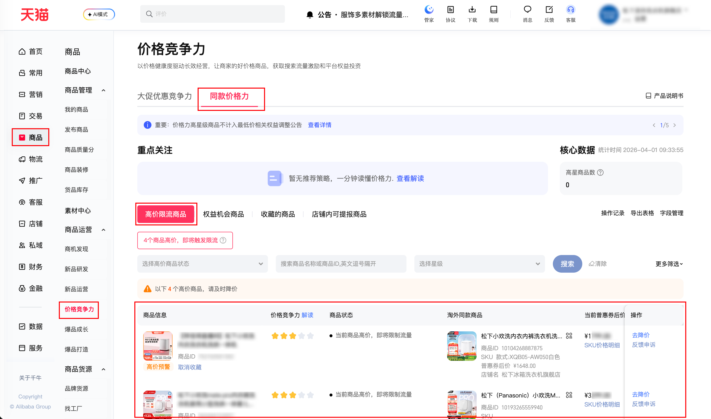

| 属性             | 值                                                                                          |
| ---------------- | ------------------------------------------------------------------------------------------- |
| **连接器类型**   | `RPA 连接器`                                                                                |
| **连接器代码**   | `rpa.conn.qianniu.item.price.flow.limit`                                                    |
| **归属 PyPI 包** | `rpa-conn-qianniu-all`                                                                      |
| **操作类型**     | 浏览器自动化操作 + 网络请求监听 + XLSX 文件导出                                            |
| **目标网页**     | `https://myseller.taobao.com/home.htm/starb/price-home`                                   |
| **适用场景**     | 导出「价格力竞争 → 五星价格力 → 高价限流商品」明细报表，对淘内外比价与限流状态进行采集   |

### 目标页面

> **路径**：千牛后台—商品—商业运营—价格力竞争—同款价格力—高价限流商品
>
> **网址**：https://myseller.taobao.com/home.htm/starb/price-home



### 业务入参

| 字段 | 中文释义 | 数据类型 | 必填 | 默认值 | 说明 |
| ------------ | ------------ | ------------ | ------------ | ------------ | ------------ |

### 入参样例

```json
{}
```

### 数据字段


| 字段                | 中文释义         | 数据类型  | 可为空 | 取数路径         | 示例 |
| ------------------- | ---------------- | --------- | ------ | ---------------- | ---- |
| `itemName`          | 商品名称         | `string`  | 否     | `XLSX.0.0`       | 松下小欢洗内衣内裤洗衣机全自动家用除菌小型波轮洗烘一体机    |
| `itemId`            | 商品 ID          | `string`  | 否     | `XLSX.0.1`       | 752102501302    |
| `starLevel`         | 当前商品星级     | `string`  | 否     | `XLSX.0.2`       | 2    |
| `limitStatus`       | 高价限流状态     | `string`  | 否     | `XLSX.0.3`       | 当前商品高价，热销爆款流量已终止    |
| `topCategory`       | 一级类目名称     | `string`  | 否     | `XLSX.0.4`       | 大家电    |
| `secondCategory`    | 二级类目名称     | `string`  | 否     | `XLSX.0.5`       | 洗衣机    |
| `leafCategory`      | 叶子类目名称     | `string`  | 是     | `XLSX.0.6`       | —    |
| `price`             | 当前普惠券后价   | `string`  | 否     | `XLSX.0.7`       | ¥1529.15   |
| `recommendPrice`    | 平台建议价       | `string`  | 是     | `XLSX.0.8`       | —   |
| `discount`          | 需降价幅度       | `string`  | 是     | `XLSX.0.9`       | —    |
| `saleNum`           | 销量             | `string`  | 否     | `XLSX.0.10`      | 2438    |
| `compareItemName`   | 同款淘外竞品名称 | `string`  | 否     | `XLSX.0.11`      | 【松下XQB05-AW050】松下（Panasonic）【价低LJQ9折】小欢洗 迷你波轮 0.5KG 洗烘一体 全自动小型内衣洗衣机 除HPV血渍 XQB05-AW050【行情 报价 价格 评测】    |
| `compareItemId`     | 同款淘外竞品 ID  | `string`  | 否     | `XLSX.0.12`      | 100139217584    |
| `compareItemPrice`  | 同款淘外竞品价格 | `string`  | 否     | `XLSX.0.13`      | ¥1179.00    |
| `compareItemUrl`    | 同款淘外竞品链接 | `string`  | 否     | `XLSX.0.14`      | https://item.jd.com/100139217584.html    |
| `bizDate`           | 业务日期         | `string`  | 否     | 附加              |      |
| `accountId`         | 授权 ID          | `string`  | 否     | 附加              |      |

### 数据样例

```json
[
  {
    "itemName": "松下小欢洗内衣内裤洗衣机全自动家用除菌小型波轮洗烘一体机",
    "itemId": 752102501302,
    "starLevel": 2,
    "limitStatus": "当前商品高价，热销爆款流量已终止",
    "topCategory": "大家电",
    "secondCategory": "洗衣机",
    "leafCategory": null,
    "price": "¥1529.15",
    "recommendPrice": null,
    "discount": null,
    "saleNum": 2438,
    "compareItemName": "【松下XQB05-AW050】松下（Panasonic）【价低LJQ9折】小欢洗 迷你波轮 0.5KG 洗烘一体 全自动小型内衣洗衣机 除HPV血渍 XQB05-AW050【行情 报价 价格 评测】",
    "compareItemId": 100139217584,
    "compareItemPrice": "¥1179.00",
    "compareItemUrl": "https://item.jd.com/100139217584.html",
    "bizDate": "20260417",
    "accountId": "101"
  }
]
```

### 运行时配置

```json
{
    "name": "rpa.conn.qianniu.item.price.flow.limit",
    "package": "rpa-conn-qianniu-all",
    "version": null,
    "mode": "Eager"
}
```

---
