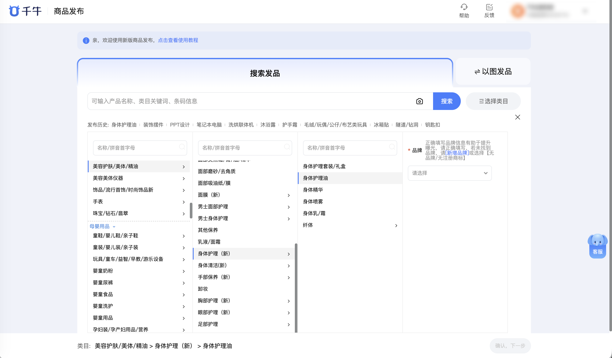

| 属性             | 值                                                                              |
| ---------------- | ------------------------------------------------------------------------------- |
| **连接器类型**   | `RPA 连接器`                                                                    |
| **连接器代码**   | `rpa.conn.qianniu.item.publish.cate.template`                                   |
| **归属 PyPI 包** | `rpa-conn-qianniu-all`                                                          |
| **操作类型**     | 浏览器自动化操作 + 网络请求监听                                                 |
| **目标网页**     | `https://item.upload.taobao.com/sell/ai/category.htm`                          |
| **适用场景**     | 在千牛商品发布页搜索并选择目标类目，自动提取该类目的基础信息、销售信息、物流服务、图文描述等可直接填写的上架模板结构。 |

### 目标页面

> **路径**：千牛商家工作台—商品发布—选择类目
>
> **网址**：[https://item.upload.taobao.com/sell/ai/category.htm](https://item.upload.taobao.com/sell/ai/category.htm)



### 业务入参

| 字段                  | 中文释义                 | 数据类型       | 必填 | 默认值 | 说明                                                                                                                       |
| --------------------- | ------------------------ | -------------- | ---- | ------ | -------------------------------------------------------------------------------------------------------------------------- |
| `category_path`       | 目标类目路径             | `string`       | 是   | —      | 支持 `>` 或 `>>` 分隔的多级路径，如 `生活电器>>迷你生活电器>>迷你衣物消毒机`                                              |
| `select_stage_props`  | 类目选择阶段必填属性预设 | `List[Dict]`   | 否   | —      | 每项字段：`name`（属性 ID，可选）、`label`（属性名，必填）、`uiType`、`required`、`input_value`（`{"text":…,"value":…}`）；不提供时必填属性自动选第一项 |
| `select_cat_props`    | 编辑页类目属性选择       | `List[Dict]`   | 否   | —      | 适用于编辑页品牌等属性会触发模板联动的场景；格式：`prop_id`、`label`、`ui_type`、`required`、`values`（如 `[{"value":30652,"text":"Midea/美的"}]`）；不提供时自动选首个未选值的 combobox/select 属性 |

### 入参样例

```json
{
    "category_path": "生活电器>>迷你生活电器>>迷你衣物消毒机",
    "select_cat_props": [
        {
            "prop_id": "p-20000",
            "label": "品牌",
            "ui_type": "combobox",
            "required": false,
            "values": [{"value": 30652, "text": "Midea/美的"}]
        }
    ]
}
```

### 数据字段

| 字段                          | 中文释义                     | 数据类型     | 可为空 | 取数路径             | 示例                                   |
| ----------------------------- | ---------------------------- | ------------ | ------ | -------------------- | -------------------------------------- |
| `cat_id`                      | 类目 ID                      | `number`     | 否     | `cat_id`             | `201338501`                            |
| `category_path`               | 类目路径文本                 | `string`     | 否     | `category_path`      | `生活电器>>迷你生活电器>>迷你衣物消毒机` |
| `category_chain`              | 类目链（含 ID/路径/层级信息）| `List[Dict]` | 否     | `category_chain`     | 见数据样例 `category_chain`            |
| `select_stage_required_props` | 选择阶段已填写的必填属性列表 | `List[Dict]` | 是     | `select_stage_required_props` | `[]`                          |
| `base_info`                   | 基础信息模板（宝贝类型、主图、标题、类目属性、采购地等） | `Dict` | 否 | `base_info` | 见数据样例 `base_info`    |
| `sale_info`                   | 销售信息模板（销售属性、SKU、价格、库存、上架时间等）   | `Dict` | 否 | `sale_info` | 见数据样例 `sale_info`    |
| `logistics`                   | 物流服务模板（发货时间、运费模板、售后服务等）         | `Dict` | 否 | `logistics` | 见数据样例 `logistics`    |
| `description`                 | 图文描述模板（3:4 主图、视频、白底图、详情、店铺分类） | `Dict` | 否 | `description` | 见数据样例 `description` |
| `bizDate`                     | 业务日期                     | `string`     | 否     | 附加                 |                                        |
| `accountId`                   | 授权 ID                      | `string`     | 否     | 附加                 |                                        |

### 数据样例

```json
{
  "cat_id": 201338501,
  "category_path": "生活电器>>迷你生活电器>>迷你衣物消毒机",
  "category_chain": [
    {
      "id": 50012100,
      "name": "生活电器",
      "path": ["生活电器"],
      "idpath": [50012100],
      "isBrand": false,
      "leaf": false,
      "tips": ""
    },
    {
      "id": 201323402,
      "name": "迷你生活电器",
      "path": ["生活电器", "迷你生活电器"],
      "idpath": [50012100, 201323402],
      "isBrand": false,
      "leaf": false,
      "tips": ""
    },
    {
      "id": 201338501,
      "name": "迷你衣物消毒机",
      "path": ["生活电器", "迷你生活电器", "迷你衣物消毒机"],
      "idpath": [50012100, 201323402, 201338501],
      "publish": true,
      "isBrand": false,
      "leaf": true,
      "submitId": 201338501,
      "tips": ""
    }
  ],
  "base_info": {
    "stuff_status": {
      "label": "宝贝类型",
      "required": true,
      "type": "radio",
      "options": [
        {"value": 5, "text": "全新"},
        {"value": 6, "text": "二手"}
      ]
    },
    "images": {
      "label": "1:1主图",
      "required": true,
      "type": "images",
      "max_count": 5,
      "ratio": "1:1"
    },
    "title": {
      "label": "宝贝标题",
      "required": true,
      "type": "text",
      "max_length": 60
    },
    "shopping_title": {
      "label": "导购标题",
      "required": false,
      "type": "text",
      "max_length": 30
    },
    "cat_props": [
      {
        "prop_id": "p-20000",
        "label": "品牌",
        "ui_type": "combobox",
        "required": false,
        "max_length": 100,
        "max_items": null,
        "max_custom_items": null,
        "tip": null,
        "values": [
          {"value": 30652, "text": "Midea/美的"},
          {"value": 11016, "text": "Haier/海尔"}
        ],
        "units": []
      },
      {
        "prop_id": "p-20000~1",
        "label": "型号",
        "ui_type": "input",
        "required": true,
        "max_length": 42,
        "max_items": 100,
        "max_custom_items": null,
        "tip": null,
        "values": [],
        "units": []
      },
      {
        "prop_id": "p-151784225",
        "label": "容量",
        "ui_type": "taoSirProp",
        "required": true,
        "max_length": 40,
        "max_items": null,
        "max_custom_items": null,
        "tip": null,
        "values": [],
        "units": [{"value": 43, "text": "L"}]
      }
    ],
    "global_stock": {
      "label": "采购地",
      "required": true,
      "type": "radio",
      "options": [
        {"value": "globalStock_0", "text": "中国内地（大陆）"},
        {"value": "globalStock_1", "text": "中国港澳台地区及其他国家和地区"}
      ]
    }
  },
  "sale_info": {
    "sale_props": {
      "label": "销售属性",
      "required": true,
      "dimensions": [
        {
          "prop_id": "p-1627207",
          "label": "颜色分类",
          "required": false,
          "max_custom": 56,
          "type": "select",
          "options": [
            {"value": null, "text": "白色系"},
            {"value": null, "text": "灰色系"},
            {"value": null, "text": "黑色系"}
          ]
        }
      ]
    },
    "sku_list": {
      "label": "SKU列表",
      "required": true,
      "max_count": 600,
      "dimensions": [{"prop_id": "p-1627207", "label": "颜色分类"}],
      "columns": ["price", "quantity", "outer_id", "barcode"]
    },
    "price": {"label": "一口价", "required": true, "type": "money"},
    "quantity": {"label": "总库存", "required": true, "type": "number"},
    "sub_stock": {
      "label": "库存扣减方式",
      "required": true,
      "type": "radio",
      "options": [
        {"value": 1, "text": "拍下减库存"},
        {"value": 0, "text": "付款减库存"}
      ]
    },
    "start_time": {
      "label": "上架时间",
      "required": true,
      "type": "radio",
      "options": [
        {"value": 0, "text": "立刻上架"},
        {"value": 1, "text": "定时上架"},
        {"value": 2, "text": "放入仓库"}
      ]
    },
    "purchase_tips": {"label": "购买须知", "required": false, "type": "text", "max_length": 60},
    "outer_id": {"label": "商家编码", "required": false, "type": "text", "max_length": 64},
    "barcode": {"label": "商品条形码", "required": false, "type": "text", "max_length": 32},
    "multi_discount": {"label": "多件优惠", "required": false, "type": "discount", "min_fold": 5.0, "max_fold": 9.9}
  },
  "logistics": {
    "delivery_time": {
      "label": "发货时间",
      "required": true,
      "type": "radio",
      "options": [
        {"value": "3", "text": "24小时内发货"},
        {"value": "0", "text": "48小时内发货"},
        {"value": "2", "text": "大于48小时发货"}
      ]
    },
    "shipping_template": {"label": "运费模板", "required": true, "type": "template_id"},
    "region_limit": {"label": "区域限售", "required": false, "type": "bool"},
    "warranty": {
      "label": "售后服务",
      "required": false,
      "type": "checkbox",
      "options": [{"value": 1, "text": "保修服务"}]
    },
    "seven_day_return": {"label": "七天无理由退货", "required": false, "type": "bool"}
  },
  "description": {
    "images_3_4": {"label": "3:4主图", "required": false, "type": "images", "max_count": 5, "ratio": "3:4"},
    "videos": {"label": "商品视频", "required": false, "type": "videos", "max_count": 5, "max_duration": 300},
    "white_bg_image": {"label": "白底图", "required": false, "type": "images", "max_count": 1, "size": "800x800"},
    "detail": {"label": "宝贝详情", "required": true, "type": "rich_text"},
    "shop_categories": {
      "label": "店铺中分类",
      "required": false,
      "type": "multi_select",
      "max_count": 20,
      "options": [
        {"value": 1839905092, "text": "11111"},
        {"value": 1839906455, "text": "22222"}
      ]
    }
  },
  "select_stage_required_props": [],
  "bizDate": "20260424",
  "accountId": "103"
}
```

### 运行时配置

```json
{
    "name": "rpa.conn.qianniu.item.publish.cate.template",
    "package": "rpa-conn-qianniu-all",
    "version": null,
    "mode": "Eager"
}
```

---
