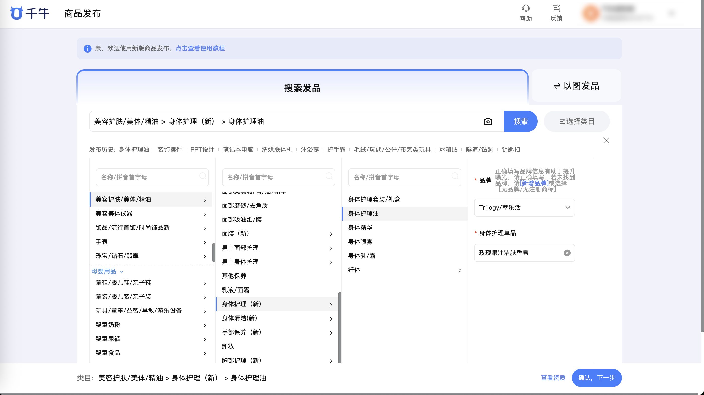

| 属性             | 值                                                                                                                                 |
| ---------------- | ---------------------------------------------------------------------------------------------------------------------------------- |
| **连接器类型**   | `RPA 连接器`                                                                                                                       |
| **连接器代码**   | `rpa.conn.qianniu.item.publish.item`                                                                                               |
| **归属 PyPI 包** | `rpa-conn-qianniu-all`                                                                                                             |
| **操作类型**     | 浏览器自动化操作 + 网络请求监听                                                                                                    |
| **目标网页**     | `https://item.upload.taobao.com/sell/ai/category.htm`                                                                             |
| **适用场景**     | 在千牛商品发布页按照 publish_cate_template 输出的模板骨架，自动完成类目选择、基础信息、销售信息、物流服务、图文描述的填写，并执行提交上架或保存草稿操作。 |

### 目标页面

> **路径**：千牛商家工作台—商品发布—填写商品信息
>
> **网址**：[https://item.upload.taobao.com/sell/ai/category.htm](https://item.upload.taobao.com/sell/ai/category.htm)



### 业务入参

| 字段                 | 中文释义                     | 数据类型     | 必填 | 默认值 | 说明                                                                                                                                                                       |
| -------------------- | ---------------------------- | ------------ | ---- | ------ | -------------------------------------------------------------------------------------------------------------------------------------------------------------------------- |
| `category_path`      | 目标类目路径                 | `string`     | 是   | —      | 与 `publish_cate_template` 入参一致，如 `美容护肤/美体/精油 > 身体护理（新） > 身体护理油`                                                                                |
| `select_stage_props` | 类目选择阶段必填属性预设     | `List[Dict]` | 否   | —      | 每项字段：`name`（属性 ID，可选）、`label`（属性名，必填）、`uiType`、`required`、`input_value`（`{"text":…,"value":…}`）；不提供且属性为必填时将报错                     |
| `base_info`          | 基础信息                     | `Dict`       | 是   | —      | 基于 `publish_cate_template` 输出的骨架，在每个需填写字段上追加 `input_value`；包含宝贝类型、1:1主图、宝贝标题、导购标题、类目属性、采购地                               |
| `sale_info`          | 销售信息                     | `Dict`       | 否   | —      | 同上；包含销售规格（`sale_props.sku_specs`）、SKU 列表（`sku_list.input_value`）、一口价、总库存、购买须知、商家编码、商品条形码、多件优惠、库存扣减方式、上架时间          |
| `logistics`          | 物流服务                     | `Dict`       | 否   | —      | 同上；包含发货时间、运费模板、区域限售、售后服务（保修）、七天无理由退货                                                                                                   |
| `description`        | 图文描述                     | `Dict`       | 否   | —      | 同上；包含 3:4主图、白底图、宝贝详情（HTML 源码）、店铺中分类                                                                                                              |
| `submit_action`      | 提交动作                     | `string`     | 是   | —      | `"submit"` 提交宝贝信息并上架；`"draft"` 保存草稿（草稿箱上限 10 个，满时报错）                                                                                           |

#### 构造规则

publish_item 的入参基于 publish_template 输出的模板骨架构造. 调用方在每个需要填写的字段上添加 `input_value`:

- **普通字段**

> 在模板字段上追加 `input_value`:

```json
{
  "label": "宝贝标题", "required": true, "type": "text", "max_length": 60,
  "input_value": "Trilogy萃乐活玫瑰果油身体护理精油天然有机滋润保湿修护"
}
```

各字段类型对应的 `input_value` 格式：

| type | input_value 格式 | 示例 |
| ---- | ---------------- | ---- |
| `radio` | `{"value": v, "text": "显示文本"}` 从 options 中选一项 | `{"value": 5, "text": "全新"}` |
| `text` | `string` 文本内容 | `"Trilogy萃乐活玫瑰果油身体护理精油"` |
| `number` | `int` 数值 | `1` |
| `money` | `string` 金额字符串 | `"12"` |
| `images` | `List[string]` 淘宝图片空间中的图片名称列表 | `["123456789_1!2691691417"]` |
| `bool` | `bool` | `false` |
| `checkbox` | `List[Dict]` 从 options 中选多项 | `[{"value": 1, "text": "保修服务"}]` |
| `multi_select` | `List[Dict]` 从 options 中选多项 | `[{"value": 1839905092, "text": "11111"}]` |
| `rich_text` | `string` HTML 源码（换行符自动去除） | `"<p></p>"` |
| `template_id` | `string` 运费模板名称（按名称搜索匹配） | `"淘宝二手默认运费模板_浙江"` |
| `discount` | `{"enabled": bool, "type": "满N件打折", "value": "折扣"}` | `{"enabled": true, "type": "满2件打折", "value": "9.2"}` |


- **cat_props**

> 在模板的 `values` 字段中只保留要填写的值 (模板原始 values 是全部候选项):

```json
{
  "prop_id": "p-20000", "label": "品牌", "ui_type": "select",
  "required": true, "max_length": null, "max_items": null, "max_custom_items": null, "tip": null,
  "values": [{"value": 7209056529, "text": "Trilogy/萃乐活"}],
  "units": []
}
```

各 ui_type 的 values 填写规则:

| ui_type | values 填写 | 说明 |
| ------- | ----------- | ---- |
| `select` | 1 项 `{"value": v, "text": "..."}` | 从模板 values 中选一个 |
| `combobox` | 1 项 `{"value": v, "text": "..."}` | 从模板 values 中选一个，或自定义文本 |
| `checkbox` | 多项 `[{"value": v, "text": "..."}, ...]` | 从模板 values 中选多个，数量 ≤ max_items |
| `input` | 1 项 `{"text": "文本"}` | 自由输入文本，长度 ≤ max_length |
| `datepicker` | 1 项 `{"text": "2025-03"}` | 年月格式日期 |
| `taoSirProp` | 1 项 `{"text": "数值", "unit": {"value": 43, "text": "L"}}` 或仅 `{"text": "数值"}` | 数值在 `text`；单位优先取 `values[0].unit`，未指定时 fallback 到顶层 `units[0]` |

- **sale_props**

> 不使用模板中的 dimensions 结构, 改用 `sku_specs` 列表:

```json
{
  "sale_props": {
    "sku_specs": ["规格1", "规格2"]
  }
}
```

- **sku_list**

> 使用 `input_value` 列表, 每项按 name 匹配 SKU 行:

```json
{
  "sku_list": {
    "input_value": [
      {"name": "规格1", "price": "12.00", "quantity": "10", "merchant_code": "11111111"},
      {"name": "规格2", "price": "25.00", "quantity": "50", "merchant_code": "2222222"}
    ]
  }
}
```

#### 校验规则

连接器在执行前会进行统一校验 (`_validate_fields`):

| 校验项 | 规则 |
|--------|------|
| `category_path` | 不能为空 |
| `submit_action` | 只允许 `"submit"` 或 `"draft"` |
| 各 section 必填字段 | `required=true` 的字段必须提供 `input_value` |
| `max_length` | 文本类 input_value 长度不能超过 max_length |
| `max_count` | 列表类 input_value 数量不能超过 max_count |
| `cat_props` 单选类型 | `select` / `combobox` / `datepicker` 的 values 只能提供 1 个 |
| `cat_props` max_items | `checkbox` 的 values 数量不能超过 max_items |
| `cat_props` 必填 | `required=true` 的属性必须提供 values |

### 入参样例

```json
{
    "submit_action": "submit",
    "category_path": "美容护肤/美体/精油 > 身体护理（新） > 身体护理油",
    "select_stage_props": [
        {
            "name": "p-20000",
            "label": "品牌",
            "uiType": "select",
            "required": true,
            "input_value": {"text": "Trilogy/萃乐活", "value": "7209056529"}
        },
        {
            "name": "p-20000-234253835",
            "label": "身体护理单品",
            "uiType": "combobox",
            "required": true,
            "input_value": {"text": "芳香美体调理油", "value": "551836019"}
        }
    ],
    "base_info": {
        "stuff_status": {
            "label": "宝贝类型", "required": true, "type": "radio",
            "options": [{"value": 5, "text": "全新"}, {"value": 6, "text": "二手"}],
            "input_value": {"value": 5, "text": "全新"}
        },
        "images": {
            "label": "1:1主图", "required": true, "type": "images",
            "max_count": 5, "ratio": "1:1",
            "input_value": ["123456789_1!2691691417", "123456789_2!2691691417"]
        },
        "title": {
            "label": "宝贝标题", "required": true, "type": "text", "max_length": 60,
            "input_value": "Trilogy萃乐活玫瑰果油身体护理精油天然有机滋润保湿修护"
        },
        "shopping_title": {
            "label": "导购标题", "required": false, "type": "text", "max_length": 30,
            "input_value": "萃乐活玫瑰果油身体护理"
        },
        "cat_props": [
            {
                "prop_id": "p-20000", "label": "品牌", "ui_type": "select",
                "required": true, "max_length": null, "max_items": null,
                "max_custom_items": null, "tip": null,
                "values": [{"value": 7209056529, "text": "Trilogy/萃乐活"}], "units": []
            }
        ],
        "global_stock": {
            "label": "采购地", "required": true, "type": "radio",
            "options": [
                {"value": "globalStock_0", "text": "中国内地（大陆）"},
                {"value": "globalStock_1", "text": "中国港澳台地区及其他国家和地区"}
            ],
            "input_value": {"value": "globalStock_0", "text": "中国内地（大陆）"}
        }
    },
    "sale_info": {
        "sale_props": {"sku_specs": ["规格1", "规格2"]},
        "sku_list": {
            "input_value": [
                {"name": "规格1", "price": "12.00", "quantity": "10", "merchant_code": "11111111"},
                {"name": "规格2", "price": "25.00", "quantity": "50", "merchant_code": "2222222"}
            ]
        },
        "price": {"label": "一口价", "required": true, "type": "money", "input_value": "12"},
        "quantity": {"label": "总库存", "required": true, "type": "number", "input_value": 1},
        "sub_stock": {
            "label": "库存扣减方式", "required": true, "type": "radio",
            "options": [{"value": 1, "text": "拍下减库存"}, {"value": 0, "text": "付款减库存"}],
            "input_value": {"value": 0, "text": "付款减库存"}
        },
        "start_time": {
            "label": "上架时间", "required": true, "type": "radio",
            "options": [
                {"value": 0, "text": "立刻上架"},
                {"value": 1, "text": "定时上架"},
                {"value": 2, "text": "放入仓库"}
            ],
            "input_value": {"value": 0, "text": "立刻上架"}
        }
    },
    "logistics": {
        "delivery_time": {
            "label": "发货时间", "required": true, "type": "radio",
            "options": [
                {"value": "4", "text": "今日发"},
                {"value": "3", "text": "24小时内发货"},
                {"value": "0", "text": "48小时内发货"},
                {"value": "2", "text": "大于48小时发货"}
            ],
            "input_value": {"value": "0", "text": "48小时内发货"}
        },
        "shipping_template": {
            "label": "运费模板", "required": true, "type": "template_id",
            "input_value": "淘宝二手默认运费模板_浙江"
        },
        "seven_day_return": {
            "label": "七天无理由退货", "required": false, "type": "bool",
            "input_value": false
        }
    },
    "description": {
        "detail": {
            "label": "宝贝详情", "required": true, "type": "rich_text",
            "input_value": "<p></p>"
        },
        "shop_categories": {
            "label": "店铺中分类", "required": false, "type": "multi_select",
            "max_count": 20,
            "options": [{"value": 1839905092, "text": "11111"}],
            "input_value": [{"value": 1839905092, "text": "11111"}]
        }
    }
}
```

### 数据字段

| 字段          | 中文释义           | 数据类型 | 可为空 | 取数路径  | 示例           |
| ------------- | ------------------ | -------- | ------ | --------- | -------------- |
| `cat_id`      | 选中的类目 ID      | `string` | 否     | `cat_id`  | `121422012`    |
| `item_id`     | 发布成功后的商品 ID | `string` | 是     | `item_id` | `952207123921` |
| `saved_time`  | 草稿保存时间       | `string` | 是     | `saved_time` | `11:23`     |
| `bizDate`     | 业务日期           | `string` | 否     | 附加      |                |
| `accountId`   | 授权 ID            | `string` | 否     | 附加      |                |

> `item_id` 仅 `submit_action="submit"` 成功时有值；
> `saved_time` 仅 `submit_action="draft"` 成功时有值。

### 数据样例

#### 提交上架/submit

```json
{
  "success": true,
  "message": "商品提交成功",
  "data": [{"cat_id": 121422012, "item_id": "952207123921", "saved_time": "", "bizDate": "20260424", "accountId": 110}]
}
```

#### 保存草稿/draft

```json
{
  "success": true,
  "message": "商品已保存草稿",
  "data": [{"cat_id": 121422012, "item_id": "", "saved_time": "11:23", "bizDate": "20260424", "accountId": 110}]
}
```

#### 失败

```json
{
  "success": false,
  "message": "提交宝贝信息失败: barcode: 您条形码格式不正确",
  "data": []
}
```

### 运行时配置

```json
{
    "name": "rpa.conn.qianniu.item.publish.item",
    "package": "rpa-conn-qianniu-all",
    "version": null,
    "mode": "Eager"
}
```

---
