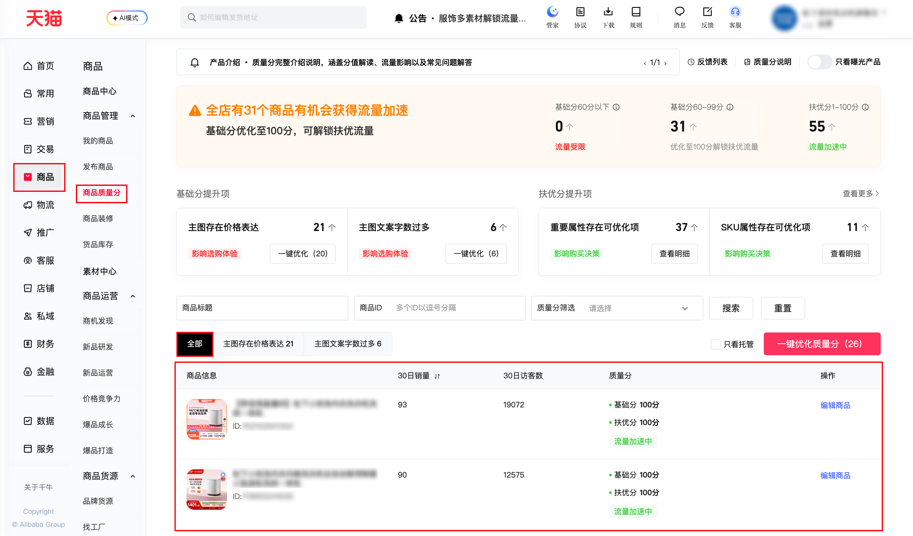

| 属性             | 值                                                                                                    |
| ---------------- | ----------------------------------------------------------------------------------------------------- |
| **连接器类型**   | `RPA 连接器`                                                                                          |
| **连接器代码**   | `rpa.conn.qianniu.item.quality.score.list`                                                            |
| **归属 PyPI 包** | `rpa-conn-qianniu-all`                                                                                |
| **操作类型**     | 浏览器自动化操作 + 网络请求监听                                                                       |
| **目标网页**     | `https://qn.taobao.com/home.htm/item-diagnose-manage/?queryDiagnoseCode=ALL&current=1&pageSize=5`     |
| **适用场景**     | 按页获取商品质量分、30日销量与访客数信息，用于质量诊断与运营跟进；默认配置每页条数20、最大翻页次数100 |

### 目标页面

> **路径**：千牛后台—商品—商品质量分—全部
>
> **网址**：https://qn.taobao.com/home.htm/item-diagnose-manage/?onlyHaveExposure=false&autoGovernance=false&openAllIssueGovernanceV2=false&queryDiagnoseCode=ALL&current=1&pageSize=5



### 业务入参

| 字段 | 中文释义 | 数据类型 | 必填 | 默认值 | 说明 |
| ---- | -------- | -------- | ---- | ------ | ---- |

### 入参样例

```json
{}
```

### 数据字段

| 字段              | 中文释义       | 数据类型 | 可为空 | 取数路径                          | 示例                                     |
| ----------------- | -------------- | -------- | ------ | --------------------------------- | ---------------------------------------- |
| `itemId`          | 商品 ID | `string` | 否 | `itemId` | 1000248268803 |
| `itemTitle`       | 商品标题 | `string` | 否 | `itemInfo.title` | 【Crispr护糖】不含双胍 Homenvoy欧洲进口血糖平衡铬胰素中老年 |
| `itemImageUrl`    | 商品主图 URL | `string` | 否 | `itemInfo.imageUrl` | https://img.alicdn.com/imgextra/i2/2217248216062/O1CN019R2yCw1ueS50AVGuL_!!4611686018427384830-2-item_pic.png |
| `itemDetailUrl`   | 商品详情页 URL | `string` | 否     | `itemInfo.detailUrl` | https://item.taobao.com/item.htm?id=1000248268803 |
| `monthlySold`     | 近 30 日销量   | `number` | 否     | `monthlySoldQuantity` | 75 |
| `monthlyVisitors` | 近 30 日访客数 | `number` | 否     | `monthlyVisitorCount` | 264873 |
| `basicScore`      | 质量分基础分   | `number` | 是     | `itemQualityScore.basicScore` | 100.0 |
| `speScore`        | 质量分扶优分   | `number` | 是     | `itemQualityScore.speScore` | — |
| `speScoreStatus`  | 扶优分状态     | `string` | 是     | `itemQualityScore.speScoreStatus` | `not_covered` / `unactivated` / `unlocked` |
| `scoreLabel`      | 质量标签文字   | `string` | 是     | `itemQualityScore.scoreLabel`     | 流量加速中 |
| `bizDate`         | 业务日期       | `string` | 否     | 附加 | |
| `accountId`       | 授权 ID        | `string` | 否     | 附加 | |

### 数据样例

```json
[
    {
        "itemId": 1000248268803,
        "itemTitle": "【Crispr护糖】不含双胍 Homenvoy欧洲进口血糖平衡铬胰素中老年",
        "itemImageUrl": "https://img.alicdn.com/imgextra/i2/2217248216062/O1CN019R2yCw1ueS50AVGuL_!!4611686018427384830-2-item_pic.png",
        "itemDetailUrl": "https://item.taobao.com/item.htm?id=1000248268803",
        "monthlySold": "75",
        "monthlyVisitors": "264873",
        "basicScore": 100.0,
        "speScore": null,
        "speScoreStatus": "not_covered",
        "scoreLabel": "流量加速中",
        "bizDate": "20260410",
        "accountId": "dyt001"
    }
]
```

### 运行时配置

```json
{
    "name": "rpa.conn.qianniu.item.quality.score.list",
    "package": "rpa-conn-qianniu-all",
    "version": null,
    "mode": "Eager"
}
```

---
