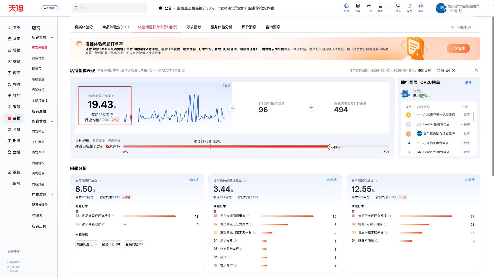

| 属性             | 值                                                                                        |
| ---------------- | ----------------------------------------------------------------------------------------- |
| **连接器类型**   | `RPA 连接器`                                                                              |
| **连接器代码**   | `rpa.conn.qianniu.item.voc.abnormal.order.list`                                            |
| **归属 PyPI 包** | `rpa-conn-qianniu-all`                                                                    |
| **操作类型**     | 浏览器自动化 + 网络请求监听 + XLSX 文件导出                                                |
| **目标网页**     | `https://myseller.taobao.com/home.htm/voc-tmall/task/QuestionReporter`                    |
| **适用场景**     | 导出店铺体验问题订单率「商品分析」明细报表，附加页面提供的汇总指标数据 |

### 目标页面

> **路径**：千牛后台—店铺—店铺管理—真实体验分—体验问题订单率（试运行）
>
> **网址**：[https://myseller.taobao.com/home.htm/voc-tmall/task/QuestionReporter](https://myseller.taobao.com/home.htm/voc-tmall/task/QuestionReporter)



### 业务入参

| 字段 | 中文释义 | 数据类型 | 必填 | 默认值 | 说明 |
| ------------ | ------------ | ------------ | ------------ | ------------ | ------------ |

### 入参样例

```json
{}
```

### 数据字段


| 字段                             | 中文释义            | 数据类型  | 可为空 | 取数路径                 | 示例 |
| -------------------------------- | ------------------- | --------- | ------ | ------------------------ | ---- |
| `item_name_code`                 | 商品名称/编码       | `string`  | 否     | `XLSX.0.商品名称/编码`   | 松下小欢洗内衣内裤洗衣机全自动家用除菌小型波轮洗烘一体机/719850241635 |
| `problem_order_cnt`              | 问题订单量          | `string`  | 否     | `XLSX.0.问题订单量`      | 42 |
| `paid_order_cnt`                 | 有效订单量          | `string`  | 否     | `XLSX.0.有效订单量`      | 234 |
| `problem_order_rate`             | 问题订单率          | `string`  | 否     | `XLSX.0.问题订单率`      | 17.94% |
| `product_problem_order_cnt`      | 商品问题订单量      | `string`  | 否     | `XLSX.0.商品问题订单量`  | 14 |
| `logistics_problem_order_cnt`     | 物流问题订单量      | `string`  | 否     | `XLSX.0.物流问题订单量`  | 7 |
| `aftersales_problem_order_cnt`   | 售后问题订单量      | `string`  | 否     | `XLSX.0.售后问题订单量`  | 28 |
| `exp_order_rate`                 | 体验问题订单率（整体）| `string` | 否   | 响应解析                 | 19.43 |
| `industry_avg`                   | 行业均值            | `string`  | 否     | 响应解析                 | 8.29 |
| `problem_order_cnt_30d`          | 近 30 天问题订单量  | `string`  | 否     | 响应解析                 | 96 |
| `paid_order_cnt_30d`             | 近 30 天有效支付量  | `string`  | 否     | 响应解析                 | 494 |
| `update_date`                    | 数据日期            | `string`  | 否     | 响应解析                 | 20260402 |
| `bizDate`                        | 业务日期            | `string`  | 否     | 附加 | |
| `accountId`                      | 授权 ID             | `string`  | 否     | 附加 | |

### 数据样例

```json
[
  {
    "item_name_code": "松下小欢洗内衣内裤洗衣机全自动家用除菌小型波轮洗烘一体机/719850241635",
    "exp_order_rate": "19.43",
    "industry_avg": "8.29",
    "problem_order_cnt_30d": "96",
    "paid_order_cnt_30d": "494",
    "update_date": "20260402",
    "bizDate": "20260402",
    "accountId": "test_account_2",
    "problem_order_cnt": 42,
    "paid_order_cnt": 234,
    "problem_order_rate": "17.94%",
    "product_problem_order_cnt": 14,
    "logistics_problem_order_cnt": 7,
    "aftersales_problem_order_cnt": 28
  }
]
```

### 运行时配置

```json
{
    "name": "rpa.conn.qianniu.item.voc.abnormal.order.list",
    "package": "rpa-conn-qianniu-all",
    "version": null,
    "mode": "Eager"
}
```

---
