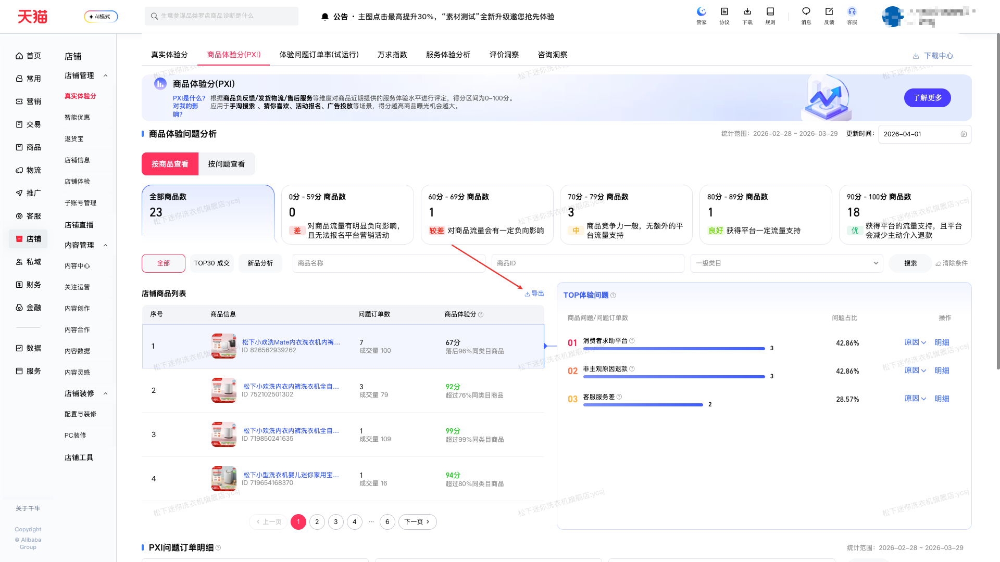

| 属性             | 值                                                                                 |
| ---------------- | ---------------------------------------------------------------------------------- |
| **连接器类型**   | `RPA 连接器`                                                                       |
| **连接器代码**   | `rpa.conn.qianniu.item.voc.pxi.list`                                               |
| **归属 PyPI 包** | `rpa-conn-qianniu-all`                                                             |
| **操作类型**     | 浏览器自动化 + XLSX 文件导出                                                       |
| **目标网页**     | `https://myseller.taobao.com/home.htm/voc-tmall/task/pxi`                         |
| **适用场景**     | 导出「商品体验分 PXI—按商品查看」商品明细报表，按商品查看近 30 天问题/成交订单与 PXI 得分、同类目排名描述                          |

### 目标页面

> **路径**：千牛—店铺—店铺管理—真实体验分—商品体验分(PXI)—按商品查看
>
> **网址**：[https://myseller.taobao.com/home.htm/voc-tmall/task/pxi](https://myseller.taobao.com/home.htm/voc-tmall/task/pxi)



### 业务入参

| 字段 | 中文释义 | 数据类型 | 必填 | 默认值 | 说明 |
| ------------ | ------------ | ------------ | ------------ | ------------ | ------------ |

### 入参样例

```json
{}
```

### 数据字段


| 字段                 | 中文释义         | 数据类型  | 可为空 | 取数路径            | 示例 |
| -------------------- | ---------------- | --------- | ------ | ------------------- | ---- |
| `item_id`            | 商品 ID          | `string`  | 否     | `XLSX.0.商品ID`     | 719850241635 |
| `item_name`          | 商品名称         | `string`  | 否     | `XLSX.0.商品名称`   | 松下小欢洗内衣内裤洗衣机全自动家用除菌小型波轮洗烘一体机 |
| `problem_order_cnt`  | 近 30 天问题订单 | `string`  | 否     | `XLSX.0.问题订单数` | 10 |
| `paid_order_cnt`     | 近 30 天成交订单 | `string`  | 否     | `XLSX.0.成交订单数` | 226 |
| `pxi_score`          | 商品体验分       | `string`  | 否     | `XLSX.0.商品体验分` | 68 |
| `ranking_status`     | 排名情况         | `string`  | 否     | `XLSX.0.排名情况`   | 落后96%同类目商品 |
| `bizDate`            | 业务日期         | `string`  | 否     | 附加 | |
| `accountId`          | 授权 ID          | `string`  | 否     | 附加 | |

### 数据样例

```json
[
  {
    "bizDate": "20260402",
    "accountId": "test_account_2",
    "item_id": 719850241635,
    "item_name": "松下小欢洗内衣内裤洗衣机全自动家用除菌小型波轮洗烘一体机",
    "problem_order_cnt": 10,
    "paid_order_cnt": 226,
    "pxi_score": 68,
    "ranking_status": "落后96%同类目商品"
  }
]
```

### 运行时配置

```json
{
    "name": "rpa.conn.qianniu.item.voc.pxi.list",
    "package": "rpa-conn-qianniu-all",
    "version": null,
    "mode": "Eager"
}
```

---
