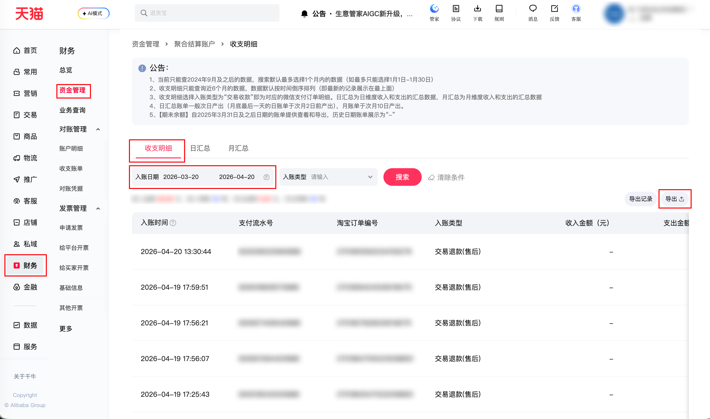

| 属性             | 值                                                                                          |
| ---------------- | ------------------------------------------------------------------------------------------- |
| **连接器类型**   | `RPA 连接器`                                                                                |
| **连接器代码**   | `rpa.conn.qianniu.shop.aggregated.fund.bill.detail`                                                 |
| **归属 PyPI 包** | `rpa-conn-qianniu-all`                                                                      |
| **操作类型**     | 浏览器自动化操作 + XLSX 文件导出                                                            |
| **目标网页**     | `https://myseller.taobao.com/home.htm/whale-accountant/pay/capital/home?active=fund_detail` |
| **适用场景**     | 导出「财务-聚合结算-收支明细」明细数据，支持按入账日区间拉取（起止日期遵循平台规则限制）    |

### 目标页面

> **路径**：千牛—财务—资金管理—聚合结算账户—收支明细
>
> **网址**：[https://myseller.taobao.com/home.htm/whale-accountant/pay/capital/home?active=fund_detail](https://myseller.taobao.com/home.htm/whale-accountant/pay/capital/home?active=fund_detail)



### 业务入参

| 字段              | 中文释义     | 数据类型 | 必填 | 默认值            | 说明                                                             |
| ----------------- | ------------ | -------- | ---- | ----------------- | ---------------------------------------------------------------- |
| `bill_date_start` | 入账开始日期 | `string` | 否   | bizDate - 1 Month | 格式：`YYYY-MM-DD`；不得早于 2024-09-01；不得早于 6 个月前       |
| `bill_date_end`   | 入账结束日期 | `string` | 否   | bizDate           | 格式：`YYYY-MM-DD`；不得晚于执行日期；与开始日期跨度不超过 31 天 |

### 入参样例

```json
{
    "bill_date_start": "2026-03-20",
    "bill_date_end": "2026-04-20"
}
```

### 数据字段

| 字段         | 中文释义       | 数据类型 | 可为空 | 取数路径                | 示例 |
| ------------ | -------------- | -------- | ------ | ----------------------- | ---- |
| `billTime`   | 入账时间       | `string` | 否     | `XLSX.0.入账时间`       | 2026-04-20 13:30:44 |
| `payFlowId`  | 支付流水号     | `string` | 否     | `XLSX.0.支付流水号`     | 832936025990888 |
| `tradeId`    | 淘宝订单编号   | `string` | 否     | `XLSX.0.淘宝订单编号`   | 2701855562034109276 |
| `billType`   | 入账类型       | `string` | 否     | `XLSX.0.入账类型`       | 交易退款(售后) |
| `incomeAmt`  | 收入金额（元） | `string` | 是     | `XLSX.0.收入金额（元）` | — |
| `outflowAmt` | 支出金额       | `string` | 是     | `XLSX.0.支出金额`       | 1.0 |
| `bizDesc`    | 业务描述       | `string` | 是     | `XLSX.0.业务描述`       | — |
| `remark`     | 备注           | `string` | 是     | `XLSX.0.备注`           | 订单{2701855562034109276}退款 |
| `bizDate`    | 业务日期       | `string` | 否     | 附加                    |      |
| `accountId`  | 授权 ID        | `string` | 否     | 附加                    |      |

### 数据样例

```json
[
    {
        "billTime": "2026-04-20 13:30:44",
        "payFlowId": 832936025990888,
        "tradeId": 2701855562034109276,
        "billType": "交易退款(售后)",
        "incomeAmt": null,
        "outflowAmt": 1.0,
        "bizDesc": null,
        "remark": "订单{2701855562034109276}退款",
        "bizDate": "2026-04-19T16:00:00.000Z",
        "accountId": "101"
    }
]
```

### 运行时配置

```json
{
    "name": "rpa.conn.shop.aggregated.fund.bill.detail",
    "package": "rpa-conn-qianniu-all",
    "version": null,
    "mode": "Eager"
}
```

---
