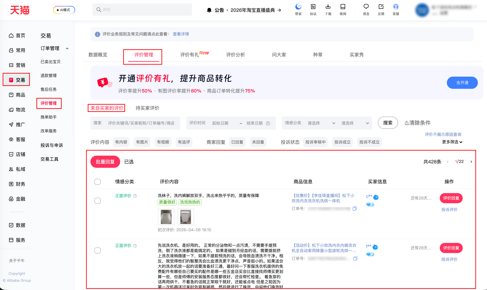

| 属性             | 值                                                                                                                |
| ---------------- | ----------------------------------------------------------------------------------------------------------------- |
| **连接器类型**   | `RPA 连接器`                                                                                                      |
| **连接器代码**   | `rpa.conn.qianniu.shop.comment.list`                                                                              |
| **归属 PyPI 包** | `rpa-conn-qianniu-all`                                                                                            |
| **操作类型**     | 浏览器自动化操作 + 网络请求监听                                                                                 |
| **目标网页**     | `https://myseller.taobao.com/home.htm/comment-manage/list/rateWait4PC`                                            |
| **适用场景**     | 按全部/正面/中性/负面及评价日期筛选，用于客服与口碑分析；默认配置最大翻页次数 100 |

### 目标页面

> **路径**：千牛后台—交易—评价管理—来自买家的评价
>
> **网址**：[https://myseller.taobao.com/home.htm/comment-manage/list/rateWait4PC](https://myseller.taobao.com/home.htm/comment-manage/list/rateWait4PC)



### 业务入参

| 字段                | 中文释义     | 数据类型  | 必填 | 默认值     | 说明 |
| ------------------- | ------------ | --------- | ---- | ---------- | ---- |
| `emotion_type`      | 情感分类     | `string`  | 否   | 可选项：`NEGATIVE` | `ALL` / `POSITIVE` / `NEUTRAL` / `NEGATIVE` |
| `rate_date_start`   | 评价开始日期 | `string`  | 否   | bizDate - 30     | `YYYY-MM-DD` |
| `rate_date_end`     | 评价结束日期 | `string`  | 否   | bizDate     | `YYYY-MM-DD` |

### 入参样例

```json
{
    "emotion_type": "NEGATIVE",
    "rate_date_start": "",
    "rate_date_end": ""
}
```

### 数据字段


| 字段                  | 中文释义     | 数据类型  | 可为空 | 取数路径 | 示例 |
| --------------------- | ------------ | --------- | ------ | -------- | ---- |
| `feedId`              | 评价 ID      | `string`  | 否     | `rateContent.mainRate.feedId` | 1301250188411 |
| `feedContent`         | 评价内容     | `string`  | 是     | `rateContent.mainRate.content` | 昨晚找客服预约的上门安装，提前一晚电联过时间，今早就过来了。安装速度还挺快的，监控里看到蛮细心的，是本地人。保修三年，先试试一段时间 |
| `feedExpression`      | 评价标签     | `List[Dict]`  | 是     | `rateContent.mainRate.expression` | 见数据样例 `feedExpression` |
| `feedMediaList`       | 评价媒体     | `List[Dict]`  | 是     | `rateContent.mainRate.mediaList` | 见数据样例 `feedMediaList` |
| `feedLanguage`        | 评价语言     | `string`  | 否     | `rateContent.mainRate.language` | zh_CN |
| `feedEmotion`         | 评价情感码(原始值)   | `number`  | 是     | `emotionType.status` | 11 |
| `feedEmotionName`     | 评价情感描述 | `string`  | 否 |  11-正面评价/12-中性评价/13-负面评价/其他-未知 | 正面评价 |
| `feedDate`            | 评价时间(时间戳)     | `number`  | 否     | `rateContent.mainRate.date` | 1774945444001 |
| `feedDateStr`         | 评价时间文本 | `string`  | 否     | 基于 `feedDate` 时间格式化：`YYYY-MM-DD HH:MM:SS` | 2026-03-31 16:24:04 |
| `appendId`            | 追评 ID      | `string`  | 是     | `rateContent.appendRate.feedId` | 1301344048837 |
| `appendContent`       | 追评内容     | `string`  | 是     | `rateContent.appendRate.content` | 因这台机子是外装的，所以家里没有预留它的位置。但是阳台正好有一个洗拖把的地方，机子尺寸也差不多，放上去也不会晃动。唯一缺点是机子的烘干模式是需要手动的，客服说是“烘干即停”，实际上三条内裤没有完完全全干透。 |
| `appendExpression`    | 追评标签     | `List[Dict]`  | 是     | `rateContent.appendRate.expression` | 见数据样例 `appendExpression` |
| `appendMediaList`     | 追评媒体     | `List[Dict]`  | 是     | `rateContent.appendRate.mediaList` | 见数据样例 `appendMediaList` |
| `appendLanguage`      | 追评语言     | `string`  | 是     | `rateContent.appendRate.language` | zh_CN |
| `appendEmotion`       | 追评情感码   | `number`  | 是     | `emotionType.appendRateStatus` | 12 |
| `appendEmotionName`   | 追评情感描述 | `string`  | 否     |  11-正面评价/12-中性评价/13-负面评价/其他-未知 | 中性评价 |
| `appendDays`          | 追评距收货天数 | `number` | 是   | `rateContent.appendRate.days` | 3.0 |
| `appendDaysStr`       | 追评时间描述 | `string`  | 否     | 确认收货后 `XXX` 天追加评论 | 确认收货后3天后追加评论 |
| `buyerName`           | 买家昵称     | `string`  | 否     | `userInfo.userName` | w** |
| `buyerStar`           | 买家星级     | `string`  | 否     | `userInfo.userStar` | https://img.alicdn.com/imgextra/i1/O1CN01phm4Vd24PvJPU1Vhb_!!6000000007384-2-tps-92-45.png |
| `orderId`             | 订单 ID      | `string`  | 否     | `itemInfo.orderId` | 4502224694062011129 |
| `itemTitle`           | 商品标题     | `string`  | 否     | `itemInfo.title` | 【优惠价】【李佳琦直播间】松下小欢洗内衣洗衣机洗烘一体机 |
| `itemId`              | 商品 ID      | `string`  | 否     | `itemInfo.itemId` | 752102501302 |
| `itemUrl`             | 商品详情链接 | `string`  | 否     | `itemInfo.link` | //item.taobao.com/item.htm?id=752102501302 |
| `mainComment`         | 首评内容(未解析) | `Dict`  | 否     | `rateContent.mainRate` | 见数据样例 `mainComment` |
| `appendComment`       | 追评内容(未解析) | `Dict`  | 否     | `rateContent.appendRate` | 见数据样例 `appendComment` |
| `buyerInfo`           | 买家信息(未解析) | `Dict`  | 否     | `userInfo` | 见数据样例 `buyerInfo` |
| `orderInfo`           | 订单信息(未解析) | `Dict`  | 否     | `orderInfo` | 见数据样例 `orderInfo` |
| `itemInfo`            | 商品信息(未解析) | `Dict`  | 否     | `itemInfo` | 见数据样例 `itemInfo` |
| `bizDate`             | 业务日期     | `string`  | 否     | 附加 | |
| `accountId`           | 授权 ID      | `string`  | 否     | 附加 | |

### 数据样例

```json
[
  {
    "feedId": "1301250188411",
    "feedContent": "昨晚找客服预约的上门安装，提前一晚电联过时间，今早就过来了。安装速度还挺快的，监控里看到蛮细心的，是本地人。保修三年，先试试一段时间",
    "feedExpression": [
      {
        "content": "安装很快",
        "emotion": "11"
      },
      {
        "content": "监控蛮细心",
        "emotion": "11"
      }
    ],
    "feedMediaList": [
      {
        "uiType": "image",
        "thumbnail": "//img.alicdn.com/i1/O1CN01z1ndBL1HtJvOePkKt_!!4611686018427386031-0-rate.jpg",
        "flashUrl": null,
        "mp4Url": null
      },
      {
        "uiType": "image",
        "thumbnail": "//img.alicdn.com/i1/O1CN01j4Iy131HtJvPVBmNO_!!4611686018427386031-2-rate.png",
        "flashUrl": null,
        "mp4Url": null
      }
    ],
    "feedLanguage": "zh_CN",
    "feedEmotion": "11",
    "feedDate": 1774945444001,
    "appendId": "1301344048837",
    "appendContent": "因这台机子是外装的，所以家里没有预留它的位置。但是阳台正好有一个洗拖把的地方，机子尺寸也差不多，放上去也不会晃动。唯一缺点是机子的烘干模式是需要手动的，客服说是“烘干即停”，实际上三条内裤没有完完全全干透。",
    "appendExpression": null,
    "appendMediaList": [
      {
        "uiType": "image",
        "thumbnail": "//img.alicdn.com/i2/2833520815/O1CN01llj4Dg1HtJvQAUHDs~livephoto~_!!2833520815-0-rate_livephoto.jpg",
        "flashUrl": null,
        "mp4Url": null
      },
      {
        "uiType": "image",
        "thumbnail": "//img.alicdn.com/i3/2833520815/O1CN01k1uict1HtJvPk8bgg~livephoto~_!!2833520815-0-rate_livephoto.jpg",
        "flashUrl": null,
        "mp4Url": null
      },
      {
        "uiType": "image",
        "thumbnail": "//img.alicdn.com/i3/2833520815/O1CN01GlmuCM1HtJvQR4G9f~livephoto~_!!2833520815-0-rate_livephoto.jpg",
        "flashUrl": null,
        "mp4Url": null
      }
    ],
    "appendLanguage": "zh_CN",
    "appendEmotion": "12",
    "appendDays": 3.0,
    "buyerName": "w**",
    "buyerStar": "https://img.alicdn.com/imgextra/i1/O1CN01phm4Vd24PvJPU1Vhb_!!6000000007384-2-tps-92-45.png",
    "orderId": "4502224694062011129",
    "itemTitle": "【优惠价】【李佳琦直播间】松下小欢洗内衣洗衣机洗烘一体机",
    "itemId": 752102501302,
    "itemUrl": "//item.taobao.com/item.htm?id=752102501302",
    "mainComment": {
      "date": 1774945444001,
      "mediaList": [
        {
          "uiType": "image",
          "thumbnail": "//img.alicdn.com/i1/O1CN01z1ndBL1HtJvOePkKt_!!4611686018427386031-0-rate.jpg",
          "flashUrl": null,
          "mp4Url": null
        },
        {
          "uiType": "image",
          "thumbnail": "//img.alicdn.com/i1/O1CN01j4Iy131HtJvPVBmNO_!!4611686018427386031-2-rate.png",
          "flashUrl": null,
          "mp4Url": null
        }
      ],
      "expression": [
        {
          "content": "安装很快",
          "emotion": "11"
        },
        {
          "content": "监控蛮细心",
          "emotion": "11"
        }
      ],
      "feedId": "1301250188411",
      "language": "zh_CN",
      "contentTitle": null,
      "content": "昨晚找客服预约的上门安装，提前一晚电联过时间，今早就过来了。安装速度还挺快的，监控里看到蛮细心的，是本地人。保修三年，先试试一段时间"
    },
    "appendComment": {
      "days": 3,
      "language": "zh_CN",
      "mediaList": [
        {
          "uiType": "image",
          "thumbnail": "//img.alicdn.com/i2/2833520815/O1CN01llj4Dg1HtJvQAUHDs~livephoto~_!!2833520815-0-rate_livephoto.jpg",
          "flashUrl": null,
          "mp4Url": null
        },
        {
          "uiType": "image",
          "thumbnail": "//img.alicdn.com/i3/2833520815/O1CN01k1uict1HtJvPk8bgg~livephoto~_!!2833520815-0-rate_livephoto.jpg",
          "flashUrl": null,
          "mp4Url": null
        },
        {
          "uiType": "image",
          "thumbnail": "//img.alicdn.com/i3/2833520815/O1CN01GlmuCM1HtJvQR4G9f~livephoto~_!!2833520815-0-rate_livephoto.jpg",
          "flashUrl": null,
          "mp4Url": null
        }
      ],
      "contentTitle": null,
      "feedId": "1301344048837",
      "content": "因这台机子是外装的，所以家里没有预留它的位置。但是阳台正好有一个洗拖把的地方，机子尺寸也差不多，放上去也不会晃动。唯一缺点是机子的烘干模式是需要手动的，客服说是“烘干即停”，实际上三条内裤没有完完全全干透。"
    },
    "buyerInfo": {
      "userStar": "https://img.alicdn.com/imgextra/i1/O1CN01phm4Vd24PvJPU1Vhb_!!6000000007384-2-tps-92-45.png",
      "isReceiver": false,
      "userName": "w**",
      "isForeigner": false,
      "securityuid": "RAzN8BQi9rUqeTdBChYTA8ZcTZx5Y"
    },
    "orderInfo": {
      "userStar": "//img.alicdn.com/newrank/b_blue_4.gif",
      "userName": "w**",
      "mainOrderId": "4502224694062011129",
      "orderId": "4502224694062011129"
    },
    "itemInfo": {
      "link": "//item.taobao.com/item.htm?id=752102501302",
      "itemId": 752102501302,
      "title": "【优惠价】【李佳琦直播间】松下小欢洗内衣洗衣机洗烘一体机",
      "orderId": "4502224694062011129"
    },
    "feedEmotionName": "正面评价",
    "feedDateStr": "2026-03-31 16:24:04",
    "appendEmotionName": "中性评价",
    "appendDaysStr": "确认收货后3天后追加评论",
    "bizDate": "20260408",
    "accountId": "101"
  }
]
```

### 运行时配置

```json
{
    "name": "rpa.conn.qianniu.shop.comment.list",
    "package": "rpa-conn-qianniu-all",
    "version": null,
    "mode": "Eager"
}
```

---
