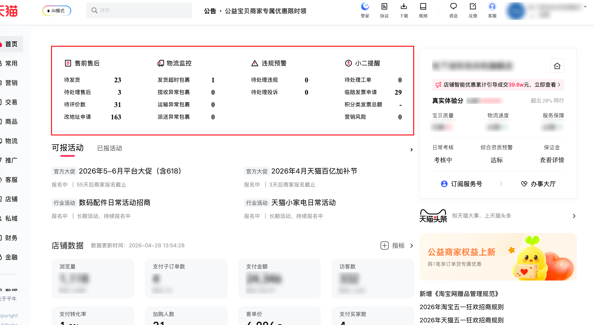

| 属性             | 值                                                                |
| ---------------- | ----------------------------------------------------------------- |
| **连接器类型**   | `RPA 连接器`                                                      |
| **连接器代码**   | `rpa.conn.qianniu.shop.overview.todolist`                         |
| **归属 PyPI 包** | `rpa-conn-qianniu-all`                                            |
| **操作类型**     | 浏览器自动化操作 + 网络请求监听                                   |
| **目标网页**     | `https://myseller.taobao.com/home.htm/QnworkbenchHome/`           |
| **适用场景**     | 采集千牛工作台首页各模块待办数据（物流监控、售前售后、宝贝管理、小二提醒） |

### 目标页面

> **路径**：千牛商家工作台—首页
>
> **网址**：[https://myseller.taobao.com/home.htm/QnworkbenchHome/](https://myseller.taobao.com/home.htm/QnworkbenchHome/)



### 业务入参

| 字段 | 中文释义 | 数据类型 | 必填 | 默认值 | 说明 |
| ---- | -------- | -------- | ---- | ------ | ---- |

### 入参样例

```json
{}
```

### 数据字段

| 字段 | 中文释义 | 数据类型 | 可为空 | 取数路径 | 示例 |
| ---- | -------- | -------- | ------ | -------- | ---- |
| `logisticsMonitor` | 物流监控模块 | `Dict` | 否 | 见数据样例 `logisticsMonitor` | 见数据样例 `logisticsMonitor` |
| `logisticsMonitor.totalCount` | 物流监控汇总数 | `number` | 否 | `data.result[?todoId==3].todoCount` | `1` |
| `logisticsMonitor.willTimeoutCnt` | 发货即将超时 | `number` | 否 | `data.result[?todoId==3].todoListDetail[?uiCode=='willTimeOutDelivery'].count` | `0` |
| `logisticsMonitor.timeoutCnt` | 发货超时包裹 | `number` | 否 | `data.result[?todoId==3].todoListDetail[?uiCode=='timeOutDelivery'].count` | `1` |
| `logisticsMonitor.collectTimeoutCnt` | 揽收异常包裹 | `number` | 否 | `data.result[?todoId==3].todoListDetail[?uiCode=='payGotException'].count` | `0` |
| `logisticsMonitor.updateTimeoutCnt` | 运输异常包裹 | `number` | 否 | `data.result[?todoId==3].todoListDetail[?uiCode=='updateException'].count` | `0` |
| `logisticsMonitor.deliveryTimeoutCnt` | 派送异常包裹 | `number` | 否 | `data.result[?todoId==3].todoListDetail[?uiCode=='deliveryException'].count` | `0` |
| `presale` | 售前模块 | `Dict` | 否 | 见数据样例 `presale` | 见数据样例 `presale` |
| `presale.totalCount` | 售前汇总数 | `number` | 否 | `data.result[?todoId==1].todoCount` | `54` |
| `presale.notDeliveryCnt` | 待发货 | `number` | 否 | `data.result[?todoId==1].todoListDetail[?uiCode=='notDelivery'].count` | `23` |
| `presale.waitForRatedCnt` | 待评价 | `number` | 否 | `data.result[?todoId==1].todoListDetail[?uiCode=='waitForRated'].count` | `31` |
| `aftersale` | 售后模块 | `Dict` | 否 | 见数据样例 `aftersale` | 见数据样例 `aftersale` |
| `aftersale.totalCount` | 售后汇总数 | `number` | 否 | `data.result[?todoId==2].todoCount` | `195` |
| `aftersale.pendingAftersaleCnt` | 待处理售后 | `number` | 否 | `data.result[?todoId==2].todoListDetail[?uiCode=='pendingAfterSale'].count` | `3` |
| `aftersale.invoiceApplyCnt` | 临赔发票申请 | `number` | 否 | `data.result[?todoId==2].todoListDetail[?uiCode=='invoiceApply'].count` | `29` |
| `aftersale.updateAddressCnt` | 改地址申请 | `number` | 否 | `data.result[?todoId==2].todoListDetail[?uiCode=='updateAddress'].count` | `163` |
| `itemManage` | 宝贝管理模块 | `Dict` | 否 | 见数据样例 `itemManage` | 见数据样例 `itemManage` |
| `itemManage.totalCount` | 宝贝管理汇总数 | `number` | 否 | `data.result[?todoId==4].todoCount` | `109` |
| `itemManage.onSaleCnt` | 出售中的宝贝数 | `number` | 否 | `data.result[?todoId==4].todoListDetail[?uiCode=='onSale'].count` | `49` |
| `itemManage.inStockCnt` | 等待上架的宝贝数 | `number` | 否 | `data.result[?todoId==4].todoListDetail[?uiCode=='inStock'].count` | `60` |
| `xiaoerReminder` | 小二提醒模块 | `Dict` | 否 | 见数据样例 `xiaoerReminder` | 见数据样例 `xiaoerReminder` |
| `xiaoerReminder.totalCount` | 小二提醒汇总数 | `number` | 否 | `data.result[?todoId==5].todoCount` | `0` |
| `xiaoerReminder.pendingComplaintCnt` | 待处理投诉 | `number` | 否 | `data.result[?todoId==5].todoListDetail[?uiCode=='pendingPunishComplaint'].count` | `0` |
| `xiaoerReminder.pendingPunishCnt` | 待处理违规 | `number` | 否 | `data.result[?todoId==5].todoListDetail[?uiCode=='pendingPunish'].count` | `0` |
| `xiaoerReminder.pendingOrderCnt` | 待处理工单 | `number` | 否 | `data.result[?todoId==5].todoListDetail[?uiCode=='pendingOrder'].count` | `0` |
| `xiaoerReminder.mktRiskCnt` | 营销风险 | `number` | 否 | `data.result[?todoId==5].todoListDetail[?uiCode=='mktPortalRisk'].count` | `0` |
| `bizDate` | 业务日期 | `string` | 否 | 附加 |  |
| `accountId` | 授权 ID | `string` | 否 | 附加 |  |

### 数据样例

```json
{
  "bizDate": "20260428",
  "accountId": "101",
  "logisticsMonitor": {
    "totalCount": 1,
    "willTimeoutCnt": 0,
    "timeoutCnt": 1,
    "collectTimeoutCnt": 0,
    "updateTimeoutCnt": 0,
    "deliveryTimeoutCnt": 0
  },
  "presale": {
    "totalCount": 54,
    "notDeliveryCnt": 23,
    "waitForRatedCnt": 31
  },
  "aftersale": {
    "totalCount": 195,
    "pendingAftersaleCnt": 3,
    "invoiceApplyCnt": 29,
    "updateAddressCnt": 163
  },
  "itemManage": {
    "totalCount": 109,
    "onSaleCnt": 49,
    "inStockCnt": 60
  },
  "xiaoerReminder": {
    "totalCount": 0,
    "pendingComplaintCnt": 0,
    "pendingPunishCnt": 0,
    "pendingOrderCnt": 0,
    "mktRiskCnt": 0
  }
}
```

### 运行时配置

```json
{
    "name": "rpa.conn.qianniu.shop.overview.todolist",
    "package": "rpa-conn-qianniu-all",
    "version": null,
    "mode": "Eager"
}
```

---
