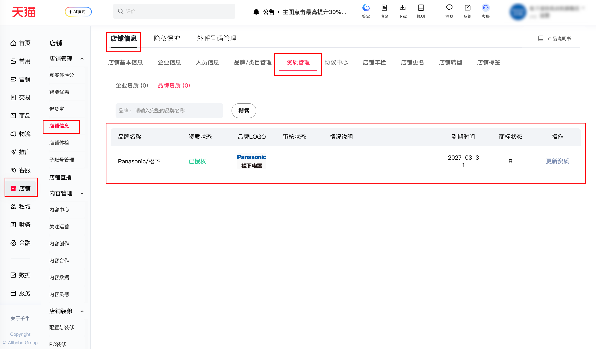

| 属性             | 值                                                                                               |
| ---------------- | ------------------------------------------------------------------------------------------------ |
| **连接器类型**   | `RPA 连接器`                                                                                     |
| **连接器代码**   | `rpa.conn.qianniu.shop.qualification.brand.list`                                                 |
| **归属 PyPI 包** | `rpa-conn-qianniu-all`                                                                           |
| **操作类型**     | 浏览器自动化操作 + 网络请求监听                                                                  |
| **目标网页**     | `https://myseller.taobao.com/home.htm/tm-shop-info-manage/?tab=qualification&qualiTabType=brand` |
| **适用场景**     | 获取店铺「品牌资质」明细数据，包含状态、审核结果与有效期等信息，可用于品牌授权与资质到期监控；   |

### 目标页面

> **路径**：千牛后台—店铺—店铺信息—资质管理—品牌资质
>
> **网址**：[https://myseller.taobao.com/home.htm/tm-shop-info-manage](https://myseller.taobao.com/home.htm/tm-shop-info-manage/?tab=qualification&qualiTabType=brand)



### 业务入参

| 字段 | 中文释义 | 数据类型 | 必填 | 默认值 | 说明 |
| ---- | -------- | -------- | ---- | ------ | ---- |

### 入参样例

```json
{}
```

### 数据字段

| 字段              | 中文释义           | 数据类型 | 可为空 | 取数路径       | 示例                                                  |
| ----------------- | ------------------ | -------- | ------ | -------------- | ----------------------------------------------------- |
| `brandName`       | 品牌名称           | `string` | 否     | `brandName`    | Panasonic/松下 |
| `brandLogo`       | 品牌 LOGO URL      | `string` | 否     | `logo`         | https://img.alicdn.com/bao/uploaded/i4/TB1vmBzRFXXXXbyXVXXXXXXXXXX |
| `brandStatus`     | 资质状态（原始值） | `number` | 否     | `brandStatus`  | 7 |
| `brandStatusName` | 资质状态文本       | `string` | 否     | `1` 已过期 / `2` 即将过期 / `3` 信息不全 / `7` 已授权 | 已授权  |
| `auditStatus`     | 审核状态（原始值） | `number` | 否     | `auditStatus`  | 3 |
| `auditStatusName` | 审核状态文本       | `string` | 否     | `0` 待提交 / `1` 审核中 / `2` 审核不通过 / `4` 预摘牌处罚 / `5` 造假处罚 / 未知 | 未知 |
| `brandKind`       | 商标状态（R/TM）   | `number` | 否     | `brandKind`    | 1 |
| `brandKindName`   | 商标状态文本       | `string` | 否     | `1` R / `2` TM | R |
| `validDateEnd`    | 到期时间           | `string` | 否     | `validDateEnd` | 2027-03-31 00:00:00 |
| `brandId`         | 品牌 ID            | `string` | 否     | `brandId`      | 81147 |
| `grantBrandId`    | 授权品牌 ID        | `string` | 否     | `grantBrandId` | 16072896 |
| `processTips`     | 情况说明           | `string` | 是     | 根据 `brandStatus` 映射：`1` "逾期未更新,该品牌的授权将被取消并下架对应商品。" / `2` "请在到期日前完成资质更新，逾期未更新，您的店铺将被监管。" / `3` "品牌中的资质若为"部分商家必填",说明该资质为选填项,请根据平台招商标准结合自身情况选择是否补全资质。若无"部分商家必填"字样,请补全缺少的资质或信息(有效期等),否则将影响店铺正常经营。" / 无 | 无 |
| `bizDate`         | 业务日期           | `string` | 否     | 附加           |                                                       |
| `accountId`       | 授权 ID            | `string` | 否     | 附加           |                                                       |

### 数据样例

```json
[
    {
        "brandName": "Panasonic/松下",
        "brandStatus": 7,
        "brandLogo": "https://img.alicdn.com/bao/uploaded/i4/TB1vmBzRFXXXXbyXVXXXXXXXXXX",
        "auditStatus": 3,
        "brandKind": 1,
        "validDateEnd": "2027-03-31 00:00:00",
        "brandId": 81147,
        "grantBrandId": 16072896,
        "brandStatusName": "已授权",
        "processTips": "无",
        "auditStatusName": "未知",
        "brandKindName": "R",
        "bizDate": "20260423",
        "accountId": "101"
    }
]
```

### 运行时配置

```json
{
    "name": "rpa.conn.qianniu.shop.qualification.brand.list",
    "package": "rpa-conn-qianniu-all",
    "version": null,
    "mode": "Eager"
}
```

---
