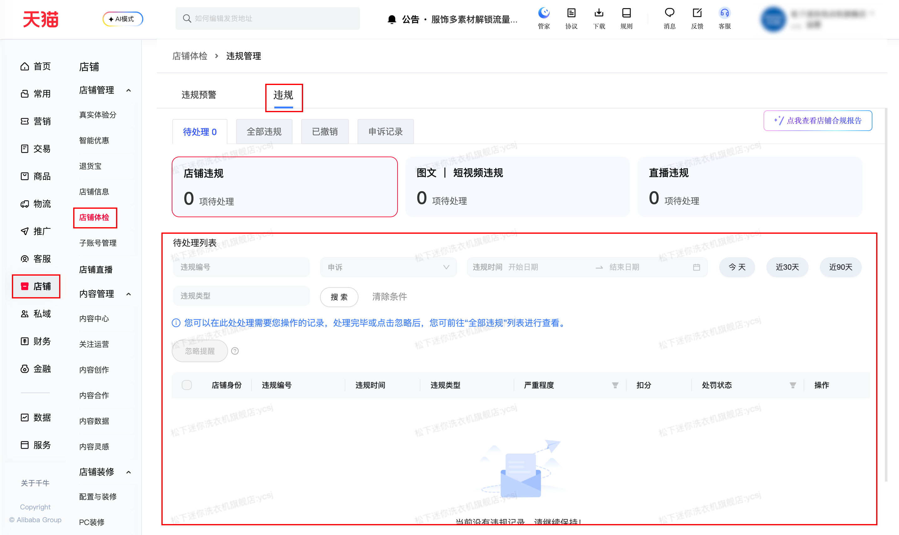

| 属性             | 值                                                                                                                   |
| ---------------- | -------------------------------------------------------------------------------------------------------------------- |
| **连接器类型**   | `RPA 连接器`                                                                                                         |
| **连接器代码**   | `rpa.conn.qianniu.shop.violation.list`                                                                               |
| **归属 PyPI 包** | `rpa-conn-qianniu-all`                                                                                               |
| **操作类型**     | 浏览器自动化操作 + 网络请求监听                                                                                      |
| **目标网页**     | `https://qn.taobao.com/home.htm/ysb-new-ksr-q/violation/VIOLATION?tab=pending`                                       |
| **适用场景**     | 获取店铺违规管理中心记录，查询待处理/全部/已撤销违规，按违规时间范围筛选，用于违规处理跟进；默认配置最大翻页次数 100 |

### 目标页面

> **路径**：千牛后台—店铺—店铺体检—违规管理—待处理/全部违规/已撤销
>
> **网址**：[https://qn.taobao.com/home.htm/ysb-new-ksr-q/violation/VIOLATION?tab=pending](https://qn.taobao.com/home.htm/ysb-new-ksr-q/violation/VIOLATION?tab=pending)



### 业务入参

| 字段                   | 中文释义     | 数据类型 | 必填 | 默认值    | 说明                                                   |
| ---------------------- | ------------ | -------- | ---- | --------- | ------------------------------------------------------ |
| `violation_status`     | 违规状态     | `string` | 否   | `PENDING` | `PENDING`（待处理）、`ALL`（全部）、`UNDONE`（已撤销） |
| `violation_date_start` | 违规开始日期 | `string` | 否   | bizDate-1 | 格式 `YYYY-MM-DD`                                      |
| `violation_date_end`   | 违规结束日期 | `string` | 否   | bizDate   | 格式 `YYYY-MM-DD`                                      |

### 入参样例

```json
{
    "violation_status": "ALL",
    "violation_date_start": "2025-06-01",
    "violation_date_end": "2025-08-30"
}
```

### 数据字段

| 字段                 | 中文释义     | 数据类型  | 可为空 | 取数路径             | 示例         |
| -------------------- | ------------ | --------- | ------ | -------------------- | ------------ |
| `bizCode`            | 业务代码     | `string`  | 否     | `bizCode`            | tmall |
| `sellerIdentityName` | 店铺身份名称 | `string`  | 否     | `sellerIdentityName` | 天猫 |
| `sellerIdentity`     | 店铺身份代码 | `string`  | 否     | `sellerIdentity`     | TMALL |
| `entityId`           | 违规对象 ID  | `string`  | 否     | `entityId`           | 752102501302 |
| `entityType`         | 违规对象类型 | `string`  | 否     | `entityType`         | ITEM |
| `hasAppeal`          | 是否有申诉   | `boolean` | 否     | `hasAppeal`          | false |
| `isNew`              | 是否为新记录 | `boolean` | 否     | `isNew`              | false |
| `isRead`             | 是否已读     | `boolean` | 否     | `isRead`             | false |
| `pointRange`         | 违规扣分范围 | `string`  | 否     | `pointRangeName`     | 违规扣分 |
| `pointRangeName`     | 扣分范围名称 | `string`  | 否     | `pointRangeName`     | 违规扣分 |
| `punishAffect`       | 违规影响     | `string`  | 否     | `punishAffect`       | 立即下架商品;立即天猫保证金扣款;扣6分 |
| `punishId`           | 违规编号     | `string`  | 否     | `punishId`           | 56314814784 |
| `punishPoint`        | 违规扣分     | `number`  | 否     | `punishPoint`        | 6.0 |
| `punishReason`       | 违规原因     | `string`  | 否     | `punishReason`       | 卖家发布的商品，经消费者维权退款评价数据反馈及主动排查发现涉嫌劣质或描述不符 |
| `punishSource`       | 处罚来源     | `string`  | 否     | `punishSource`       | MTee3.0 |
| `punishStatus`       | 处罚状态     | `string`  | 否     | `punishStatus`       | DONE |
| `punishTime`         | 违规时间     | `string`  | 否     | `punishTime`         | 2025-08-18 15:50:07 |
| `recordId`           | 记录 ID      | `string`  | 否     | `recordId`           | 824639 |
| `recordSource`       | 记录来源     | `string`  | 否     | `recordSource`       | PUNISH_CENTER |
| `recordStatus`       | 记录状态     | `string`  | 否     | `recordStatus`       | DONE |
| `ruleType`           | 违规类型     | `string`  | 否     | `ruleType`           | 出售描述不符或品质存在问题的商品 |
| `uniqueID`           | 唯一 ID      | `string`  | 否     | `uniqueID`           | pid-56314814784 |
| `extraProps`         | 额外信息     | `object`  | 是     | `extraProps`         | {} |
| `bizDate`            | 业务日期     | `string`  | 否     | 附加                 |              |
| `accountId`          | 授权 ID      | `string`  | 否     | 附加                 |              |

### 数据样例

```json
[
    {
        "bizCode": "tmall",
        "sellerIdentityName": "天猫",
        "sellerIdentity": "TMALL",
        "entityId": 752102501302,
        "entityType": "ITEM",
        "hasAppeal": false,
        "isNew": false,
        "isRead": false,
        "pointRange": "违规扣分",
        "pointRangeName": "违规扣分",
        "punishAffect": "立即下架商品;立即天猫保证金扣款;扣6分",
        "punishId": 56314814784,
        "punishPoint": 6.0,
        "punishReason": "卖家发布的商品，经消费者维权退款评价数据反馈及主动排查发现涉嫌劣质或描述不符",
        "punishSource": "MTee3.0",
        "punishStatus": "DONE",
        "punishTime": "2025-08-18 15:50:07",
        "recordId": 824639,
        "recordSource": "PUNISH_CENTER",
        "recordStatus": "DONE",
        "ruleType": "出售描述不符或品质存在问题的商品",
        "uniqueID": "pid-56314814784",
        "extraProps": {},
        "bizDate": "20260423",
        "accountId": "101"
    }
]
```

### 运行时配置

```json
{
    "name": "rpa.conn.qianniu.shop.violation.list",
    "package": "rpa-conn-qianniu-all",
    "version": null,
    "mode": "Eager"
}
```

---
