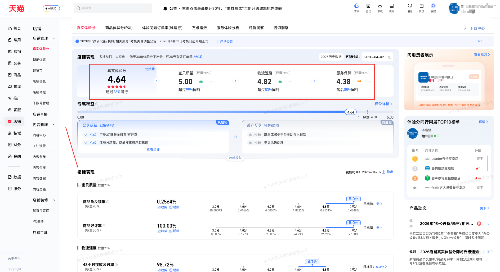

| 属性             | 值                                                                                    |
| ---------------- | ------------------------------------------------------------------------------------- |
| **连接器类型**   | `RPA 连接器`                                                                          |
| **连接器代码**   | `rpa.conn.qianniu.shop.voc.score.index`                                                |
| **归属 PyPI 包** | `rpa-conn-qianniu-all`                                                                |
| **操作类型**     | 浏览器自动化操作 + 网络请求监听                                                               |
| **目标网页**     | `https://myseller.taobao.com/home.htm/voc-tmall/serverReport`                         |
| **适用场景**     | 获取真实体验分及子指标（宝贝质量、物流、服务等）数据以及同行对比值，用于店铺体验治理       |

### 目标页面

> **路径**：千牛后台—店铺—店铺管理—真实体验分
>
> **网址**：[https://myseller.taobao.com/home.htm/voc-tmall/serverReport](https://myseller.taobao.com/home.htm/voc-tmall/serverReport)



### 业务入参

| 字段 | 中文释义 | 数据类型 | 必填 | 默认值 | 说明 |
| ---- | -------- | -------- | ---- | ------ | ---- |

### 入参样例

```json
{}
```

### 数据字段

| 字段     | 中文释义   | 数据类型  | 可为空 | 取数路径 | 示例 |
| -------- | ---------- | --------- | ------ | -------- | ---- |
| `nps`   | 真实体验分   | `Object`  | 否     | 数据整合 | 见数据样例 |
| `newGoods`   | 宝贝质量   | `Object`  | 否     | 数据整合 | 见数据样例 |
| `newLogistics`   | 物流速度   | `Object`  | 否     | 数据整合 | 见数据样例 |
| `newServices`   | 服务保障   | `Object`  | 否     | 数据整合 | 见数据样例 |
| `additionalPoints`   | 附加分   | `Object`  | 否     | 数据整合 | 见数据样例 |
| `transactionAbility`   | 成交能力   | `Object`  | 否     | 数据整合 | 见数据样例 |
| `bizDate` | 业务日期 | `string`  | 否     | 附加 | |
| `accountId` | 授权 ID | `string` | 否  | 附加 | |

#### 指标通用字段
| 字段     | 中文释义   | 数据类型  | 可为空 | 取数路径 | 示例 |
| -------- | ---------- | --------- | ------ | -------- | ---- |
| `code`   | 指标代码   | `string`  | 否     | 数据整合 | nps |
| `name`   | 指标名称   | `string`  | 否     | 数据整合 | 真实体验分 |
| `score`  | 指标得分   | `string`  | 否     | 数据整合 | 4.66 |
| `grade`  | 等级描述   | `string`  | 否     | `1` 高 / `2` 中 / `3` 低 | 中 |
| `gradeCode`  | 等级代码   | `string`  | 否     | 数据整合 | 2 |
| `rank`  | 超过同行百分比   | `string`  | 否     | 数据整合 | 0.29 |
| `reverseRank`  | 被超过同行百分比   | `string`  | 否     | 数据整合 | 0.71 |
| `compare`  | 较昨日变化说明   | `string`  | 否     | 数据整合 | 较昨日- |
| `weight`  | 指标权重   | `string`  | 否     | 数据整合 | 0.25 |
| `subIndexInfoList`  | 子指标列表   | `List`  | 是     | 数据整合 | 中 |

#### 子指标核心字段

| 字段     | 中文释义   | 数据类型  | 可为空 | 取数路径 | 示例 |
| -------- | ---------- | --------- | ------ | -------- | ---- |
| `code`   | 子指标代码   | `string`  | 否     | 数据整合 | neg_itm_feedback_rate |
| `name`   | 子指标名称   | `string`  | 否     | 数据整合 | 商品负反馈率 |
| `score`  | 子指标得分   | `string`  | 否     | 数据整合 | 5.0 |
| `showValue`  | 展示值(含单位)   | `string`  | 否     | 数据整合 | 0.2105% |
| `value`  | 展示值(含单位)   | `string`  | 否     | 数据整合 | 0.2105% |
| `rank`  | 超过同行百分比   | `string`  | 否     | 数据整合 | 95% |
| `weight`  | 指标权重   | `string`  | 否     | 数据整合 | 70% |
| `indexLevelCode`  | 等级代码   | `string`  | 否     | 数据整合 | excellent |
| `isAssessed`  | 是否参与考核   | `boolean`  | 否     | 数据整合 | true |


### 数据样例

```json
[
  {
    "nps": {
      "code": "nps",
      "name": "真实体验分",
      "score": "4.66",
      "grade": "中",
      "gradeCode": "2",
      "rank": "0.29",
      "reverseRank": "0.71",
      "compare": "较昨日-",
      "starNum": "4.5",
      "useReverseRank": "false"
    },
    "newGoods": {
      "code": "newGoods",
      "name": "宝贝质量",
      "score": "5.00",
      "grade": "高",
      "gradeCode": "1",
      "rank": "0.99",
      "weight": "0.25",
      "subIndexInfoList": [
        {
          "code": "neg_itm_feedback_rate",
          "name": "商品负反馈率",
          "score": "5.0",
          "showValue": "0.2105%",
          "value": "0.002105",
          "rank": "95%",
          "weight": "70%",
          "indexLevelCode": "excellent",
          "isAssessed": true
        },
        {
          "code": "good_itm_eva_rate",
          "name": "商品好评率",
          "score": "5.0",
          "showValue": "100.00%",
          "value": "1.0000",
          "rank": "100%",
          "weight": "30%",
          "indexLevelCode": "excellent",
          "isAssessed": true
        }
      ]
    },
    "newLogistics": {
      "code": "newLogistics",
      "name": "物流速度",
      "score": "5.00",
      "grade": "高",
      "gradeCode": "1",
      "rank": "0.99",
      "weight": "0.25",
      "subIndexInfoList": [
        {
          "code": "48h_pickup_rate",
          "name": "48小时揽收及时率",
          "score": "5.0",
          "showValue": "100.00%",
          "value": "1.0000",
          "rank": "99%",
          "weight": "70%",
          "indexLevelCode": "excellent",
          "isAssessed": true
        }
      ]
    },
    "newServices": {
      "code": "newServices",
      "name": "服务保障",
      "score": "4.32",
      "grade": "中",
      "gradeCode": "2",
      "rank": "0.12",
      "weight": "0.50",
      "subIndexInfoList": [
        {
          "code": "3min_manual_rsp_rate",
          "name": "3分钟人工响应率",
          "score": "4.0",
          "showValue": "85.00%",
          "value": "0.8500",
          "rank": "40%",
          "weight": "30%",
          "indexLevelCode": "normal",
          "isAssessed": true
        }
      ]
    },
    "additionalPoints": {
      "code": "additionalPoints",
      "name": "附加分",
      "subIndexInfoList": []
    },
    "transactionAbility": {
      "code": "transactionAbility",
      "name": "成交能力",
      "subIndexInfoList": []
    },
    "bizDate": "20260402",
    "accountId": "test_account_2"
  }
]
```

### 运行时配置

```json
{
    "name": "rpa.conn.qianniu.shop.voc.score.index",
    "package": "rpa-conn-qianniu-all",
    "version": null,
    "mode": "Eager"
}
```

---
