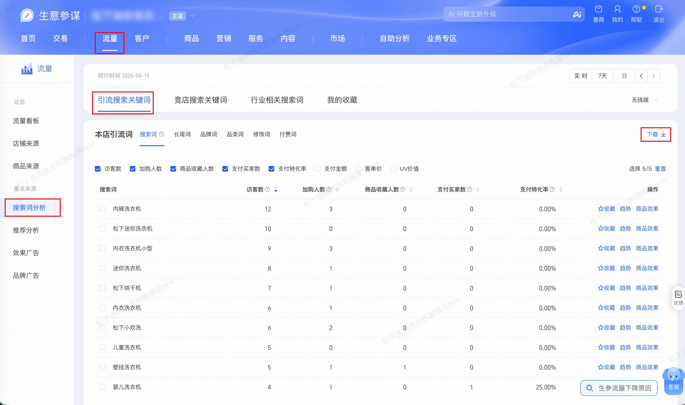

| 属性             | 值                                                                                |
| ---------------- | --------------------------------------------------------------------------------- |
| **连接器类型**   | `RPA 连接器`                                                                      |
| **连接器代码**   | `rpa.conn.sycm.flow.drainage.keyword`                                              |
| **归属 PyPI 包** | `rpa-conn-sycm-all`                                                               |
| **操作类型**     | 浏览器自动化操作 + XLS 文件导出                                                       |
| **目标网页**     | `https://sycm.taobao.com/flow/monitor/keyword_assistant`                          |
| **适用场景**     | 导出「引流搜索关键词」明细报表，获得引流侧搜索词效果（UV、加购、收藏、支付、UV 价值等）与流量转化         |

### 目标页面

> **路径**：生意参谋—流量—搜索词分析—引流搜索关键词
>
> **网址**：[https://sycm.taobao.com/flow/monitor/keyword_assistant](https://sycm.taobao.com/flow/monitor/keyword_assistant)



### 业务入参

| 字段        | 中文释义 | 数据类型  | 必填 | 默认值   | 说明 |
| ----------- | -------- | --------- | ---- | -------- | ---- |
| `biz_date`  | 业务日期 | `string`  | 否   | 昨日 T-1 | 格式：`YYYYMMDD` |

### 入参样例

```json
{
    "biz_date": "20260419"
}
```

### 数据字段


| 字段            | 中文释义   | 数据类型              | 可为空 | 取数路径           | 示例 |
| --------------- | ---------- | --------------------- | ------ | ------------------ | ---- |
| `statDate`      | 统计日期   | `string` | 否     | `XLS.0.统计日期`   | 2026-04-14 |
| `keyword`       | 搜索词     | `string` | 否     | `XLS.0.搜索词`     | 内衣洗衣机 |
| `uv`            | 访客数     | `number`  | 否     | `XLS.0.访客数`     | 7 |
| `addCartUv`     | 加购人数   | `number`  | 否     | `XLS.0.加购人数`   | 0 |
| `collectUv`     | 商品收藏人数 | `number` | 否   | `XLS.0.商品收藏人数` | 0 |
| `payBuyerCnt`   | 支付买家数 | `number`  | 否     | `XLS.0.支付买家数` | 0 |
| `payConversionRatio`        | 支付转化率 | `string` | 否     | `XLS.0.支付转化率` | 0.00% |
| `payItemCnt`    | 支付件数   | `number`  | 是     | `XLS.0.支付件数`   | - |
| `payAmt`        | 支付金额   | `string` | 是     | `XLS.0.支付金额`   | - |
| `avgOrderAmt`   | 客单价     | `number`  | 是     | `XLS.0.客单价`     | - |
| `uvValue`       | UV 价值    | `number`  | 是     | `XLS.0.UV价值`     | - |
| `bizDate`       | 业务日期   | `string` | 否     | 附加 | |
| `accountId`     | 授权 ID    | `string` | 否     | 附加 | |

### 数据样例

```json
[
  {
    "statDate": "2026-04-14",
    "keyword": "内衣洗衣机",
    "uv": 7,
    "addCartUv": 0,
    "collectUv": 0,
    "payBuyerCnt": 0,
    "payConversionRatio": "0.00%",
    "payAmt": "-",
    "avgPrice": "-",
    "uvValue": "-",
    "bizDate": "20260414",
    "accountId": "101"
  }
]
```

### 运行时配置

```json
{
    "name": "rpa.conn.sycm.flow.drainage.keyword",
    "package": "rpa-conn-sycm-all",
    "version": null,
    "mode": "Eager"
}
```

---
