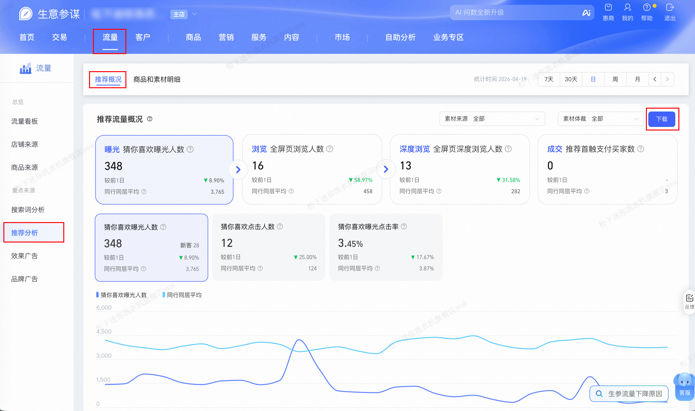

| 属性| 值|
| ---------------- | ---------------- |
| **连接器类型**   | `RPA 连接器`|
| **连接器代码**   | `rpa.conn.sycm.flow.recommend.analysis`|
| **归属 PyPI 包** | `rpa-conn-sycm-all`|
| **操作类型**     | 浏览器自动化操作 + XLS 文件导出 + LEFT JOIN 合并 |
| **目标网页**     | `https://sycm.taobao.com/flow/recommend/analysis` |
| **适用场景**     |根据统计日期 LEFT JOIN 合并「推荐概况」和「同行同层平均」两个 Sheet 字段， 推荐流量渗透、全屏/双列/互动等行为指标 |

### 目标页面

> **路径**：生意参谋—流量—推荐分析—推荐概况
>
> **网址**：[https://sycm.taobao.com/flow/recommend/analysis](https://sycm.taobao.com/flow/recommend/analysis)



### 业务入参

| 字段        | 中文释义 | 数据类型  | 必填 | 默认值   | 说明 |
| ----------- | -------- | --------- | ---- | -------- | ---- |
| `biz_date`  | 业务日期 | `string`  | 否   | 昨日 T-1 | `YYYYMMDD`；只支持回溯 15 个自然日 |

### 入参样例

```json
{
    "biz_date": "20260414"
}
```

### 数据字段

| 字段            | 中文释义   | 数据类型              | 可为空 | 取数路径           | 示例 |
| --------------- | ---------- | --------------------- | ------ | ------------------ | ---- |
| `statDate`                           | 统计日期             | `string`              | 否     | `XLS.同行同层平均.统计日期` **主键** | 2026-03-16 |
| `recExposureUv`                      | 猜你喜欢曝光人数     | `string`  | 是     | `XLS.同行同层平均.猜你喜欢曝光人数` | 4,772 |
| `recExposureNewUv`                   | 猜你喜欢曝光新客     | `string`  | 是     | `XLS.同行同层平均.猜你喜欢曝光新客` | — |
| `recClickUv`                         | 猜你喜欢点击人数     | `string`  | 否     | `XLS.同行同层平均.猜你喜欢点击人数` | 171 |
| `recExposureClickRate`               | 猜你喜欢曝光点击率   | `string`              | 否     | `XLS.同行同层平均.猜你喜欢曝光点击率` | 3.83% |
| `fullScreenPageUv`                   | 全屏页浏览人数       | `string`  | 否     | `XLS.同行同层平均.全屏页浏览人数` | 521 |
| `fullScreenPageNewUv`                | 全屏页浏览新客       | `string`  | 是     | `XLS.同行同层平均.全屏页浏览新客` | — |
| `doubleColumnFlowIntoFullScreenUv`  | 双列流进全屏人数     | `string`  | 否     | `XLS.同行同层平均.双列流进入全屏页人数` | 159 |
| `swipeIntoFullScreenUv`              | 上下滑进全屏人数     | `string`  | 否     | `XLS.同行同层平均.上下滑进入全屏页人数` | 299 |
| `fullScreenPageDeepUv`               | 全屏页深度浏览人数   | `string`  | 否     | `XLS.同行同层平均.全屏页深度浏览人数` | 300 |
| `fullScreenPageNewDeepUv`            | 全屏页深度浏览新客   | `string`  | 是     | `XLS.同行同层平均.全屏页深度浏览新客` | — |
| `3SecondViewUv`                      | 3 秒浏览人数         | `string`  | 否     | `XLS.同行同层平均.3秒浏览人数` | 247 |
| `clickIntoShopDetailUv`              | 点击进入商详人数     | `string`  | 否     | `XLS.同行同层平均.点击进入商详人数` | 106 |
| `addCartCollectUv`                   | 加购收藏人数         | `string`  | 否     | `XLS.同行同层平均.加购收藏人数` | 19 |
| `interactionUv`                      | 互动人数             | `string`  | 否     | `XLS.同行同层平均.互动人数` | 2 |
| `recommendFirstPayUv`                | 推荐首触支付买家数   | `string`  | 否     | `XLS.同行同层平均.推荐首触支付买家数` | 3 |
| `recommendFirstPayOrderCnt`         | 推荐首触支付订单数   | `string`  | 否     | `XLS.同行同层平均.推荐首触支付订单数` | 3 |
| `recommendFirstNewPayUv`             | 推荐首触支付新买家   | `string`  | 否     | `XLS.同行同层平均.推荐首触支付新买家` | 3 |
| `recommendFirstPayAmt`              | 推荐首触支付金额     | `string`              | 否     | `XLS.同行同层平均.推荐首触支付金额` | 1,896.00 |
| `recommendFirstDayPayBuyerCount`     | 推荐首触当日付买家数 | `string`  | 否     | `XLS.同行同层平均.推荐首触当日支付买家数` | 3 |
| `recommendFirstDayPayOrderCnt`      | 推荐首触当日付订单数 | `string`  | 否     | `XLS.同行同层平均.推荐首触当日支付订单数` | 4 |
| `recommendFirstDayPayAmt`            | 推荐首触当日付金额   | `string`              | 否     | `XLS.同行同层平均.推荐首触当日支付金额` | 2,177.00 |
| `payBuyerCnt`                        | 本店支付买家数       | `string`  | 否     | `XLS.推荐概况.支付买家数` | 1 |
| `payOrderCnt`                        | 本店支付订单数       | `string`  | 否     | `XLS.推荐概况.支付订单数` | 1 |
| `payAmt`                             | 本店支付金额         | `string`              | 否     | `XLS.推荐概况.支付金额` | 2,899.00 |
| `bizDate`                     | 业务日期     | `string`              | 否     | | |
| `accountId`                   | 授权 ID     | `string`              | 否     | | |

### 数据样例

```json
[
  {
    "statDate": "2026-03-16",
    "recExposureUv": "4,772",
    "recExposureNewUv": "-",
    "recClickUv": 171,
    "recExposureClickRate": "3.83%",
    "fullScreenPageUv": 521,
    "fullScreenPageNewUv": "-",
    "doubleColumnFlowIntoFullScreenUv": 159,
    "swipeIntoFullScreenUv": 299,
    "fullScreenPageDeepUv": 300,
    "fullScreenPageNewDeepUv": "-",
    "3SecondViewUv": 247,
    "clickIntoShopDetailUv": 106,
    "addCartCollectUv": 19,
    "interactionUv": 2,
    "recommendFirstPayUv": 3,
    "recommendFirstPayOrderCnt": 3,
    "recommendFirstNewPayUv": 3,
    "recommendFirstPayAmt": "1,896.00",
    "recommendFirstDayPayBuyerCount": 3,
    "recommendFirstDayPayOrderCnt": 4,
    "recommendFirstDayPayAmt": "2,177.00",
    "payBuyerCnt": 1,
    "payOrderCnt": 1,
    "payAmt": "2,899.00",
    "bizDate": "20260414",
    "accountId": "101"
  }
]
```

### 运行时配置

```json
{
    "name": "rpa.conn.sycm.flow.recommend.analysis",
    "package": "rpa-conn-sycm-all",
    "version": null,
    "mode": "Eager"
}
```

---
