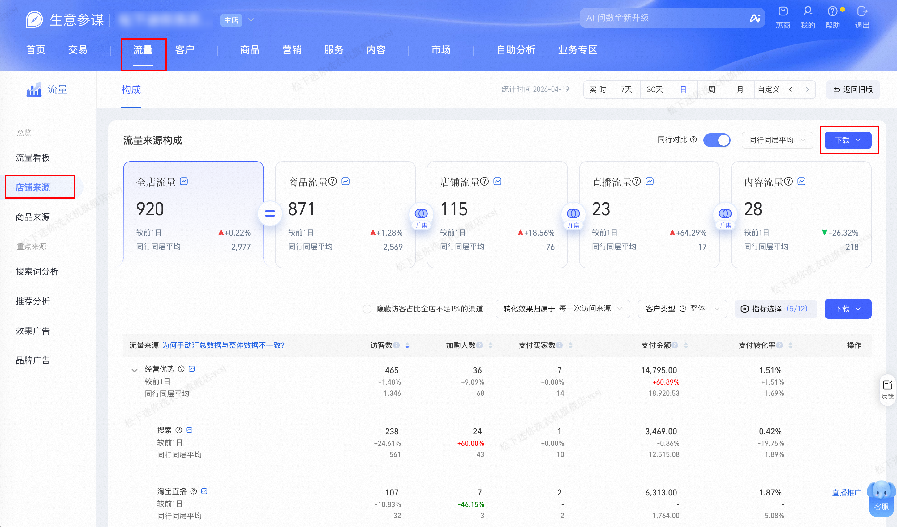

| 属性 | 值 |
| ---------------- | ---------------- |
| **连接器类型**   | `RPA 连接器`|
| **连接器代码**   | `rpa.conn.sycm.flow.shop.source`|
| **归属 PyPI 包** | `rpa-conn-sycm-all`|
| **操作类型**     | 浏览器自动化操作 + XLS 文件导出 + 拼接 |
| **目标网页**     | `https://sycm.taobao.com/flow/monitor/shopsource/construction`|
| **适用场景**     | 拼接「全店流量来源」与「分载体流量来源」两个 Sheet 数据，获得流量载体与多级流量来源构成指标 |

### 目标页面

> **路径**：生意参谋—流量—店铺来源—流量来源构成
>
> **网址**：[https://sycm.taobao.com/flow/monitor/shopsource/construction](https://sycm.taobao.com/flow/monitor/shopsource/construction)



### 业务入参

| 字段        | 中文释义 | 数据类型  | 必填 | 默认值   | 说明 |
| ----------- | -------- | --------- | ---- | -------- | ---- |
| `biz_date`  | 业务日期 | `string`  | 否   | 昨日 T-1 | 格式：`YYYYMMDD` |

### 入参样例

```json
{
    "biz_date": "20260419"
}
```

### 数据字段

| 字段                          | 中文释义         | 数据类型              | 可为空 | 取数路径                      | 示例 |
| ----------------------------- | ---------------- | --------------------- | ------ | ----------------------------- | ---- |
| `flowSource`                  | 流量载体         | `string`              | 否     | `XLS.全店流量来源.流量载体`   | 全店流量 |
| `firstLevelSource`            | 一级来源         | `string`              | 否     | `XLS.全店流量来源.一级来源`   | 付费推广 |
| `secondLevelSource`           | 二级来源         | `string`              | 否     | `XLS.全店流量来源.二级来源`   | 汇总 |
| `thirdLevelSource`            | 三级来源         | `string`              | 否     | `XLS.全店流量来源.三级来源`   | 汇总 |
| `fourthLevelSource`           | 四级来源         | `string`              | 否     | `XLS.全店流量来源.四级来源`   | 汇总 |
| `uv`                          | 访客数           | `string`  | 否     | `XLS.全店流量来源.访客数`     | 652 |
| `uvRatio`                     | 访客数环比       | `string`              | 是     | `XLS.全店流量来源.访客数环比` | 59.02% |
| `newUv`                       | 新访客           | `string`  | 否     | `XLS.全店流量来源.新访客`     | 612 |
| `newUvRatio`                  | 新访客环比       | `string`              | 是     | `XLS.全店流量来源.新访客环比` | 61.48% |
| `avgStayTime`                 | 平均停留时长     | `string` | 否     | `XLS.全店流量来源.平均停留时长` | 12.55 |
| `avgStayTimeRatio`            | 平均停留环比     | `string`              | 是     | `XLS.全店流量来源.平均停留时长环比` | 4.09% |
| `3sViewUv`                    | 3s 查看人数      | `string` | 否     | `XLS.全店流量来源.3s查看人数`  | 0 |
| `3sViewUvRatio`               | 3s 查看环比      | `string`              | 是     | `XLS.全店流量来源.3s查看人数环比` | — |
| `itemClickUv`                 | 商品点击人数     | `string` | 否     | `XLS.全店流量来源.商品点击人数` | 0 |
| `itemClickUvRatio`            | 商品点击环比     | `string`              | 是     | `XLS.全店流量来源.商品点击人数环比` | — |
| `addCartUv`                   | 加购人数         | `string`  | 否     | `XLS.全店流量来源.加购人数`   | 34 |
| `addCartUvRatio`              | 加购人数环比     | `string`              | 是     | `XLS.全店流量来源.加购人数环比` | 112.50% |
| `collectUv`                   | 商品收藏人数     | `string`  | 否     | `XLS.全店流量来源.商品收藏人数` | 6 |
| `collectUvRatio`              | 收藏人数环比     | `string`              | 是     | `XLS.全店流量来源.商品收藏人数环比` | 200.00% |
| `addCartCnt`                  | 加购件数         | `string`  | 否     | `XLS.全店流量来源.加购件数`   | 40 |
| `addCartCntRatio`             | 加购件数环比     | `string`              | 是     | `XLS.全店流量来源.加购件数环比` | 135.29% |
| `followShopUv`                | 关注店铺人数     | `string`  | 否     | `XLS.全店流量来源.关注店铺人数` | 2 |
| `followShopUvRatio`           | 关注店铺环比     | `string`              | 是     | `XLS.全店流量来源.关注店铺人数环比` | — |
| `payBuyerCnt`                 | 支付买家数       | `string`  | 否     | `XLS.全店流量来源.支付买家数`  | 0 |
| `payBuyerCntRatio`            | 支付买家环比     | `string`              | 是     | `XLS.全店流量来源.支付买家数环比` | — |
| `payConversionRatio`          | 支付转化率       | `string`              | 否     | `XLS.全店流量来源.支付转化率`  | 0.00% |
| `payConversionRatioRatio`     | 支付转化率环比   | `string`              | 是     | `XLS.全店流量来源.支付转化率环比` | — |
| `payAmt`                      | 支付金额         | `string`              | 否     | `XLS.全店流量来源.支付金额`   | 0.00 |
| `payAmtRatio`                 | 支付金额环比     | `string`              | 是     | `XLS.全店流量来源.支付金额环比` | — |
| `avgPrice`                    | 客单价           | `string`  | 否     | `XLS.全店流量来源.客单价`     | 0.00 |
| `avgPriceRatio`               | 客单价环比       | `string`              | 是     | `XLS.全店流量来源.客单价环比`  | — |
| `uvValue`                     | UV 价值          | `string`  | 否     | `XLS.全店流量来源.UV价值`     | 0.0 |
| `uvValueRatio`                | UV 价值环比      | `string`              | 是     | `XLS.全店流量来源.uv价值环比`  | — |
| `orderBuyerCnt`               | 下单买家数       | `string`  | 否     | `XLS.全店流量来源.下单买家数`  | 0.0 |
| `orderBuyerCntRatio`          | 下单买家环比     | `string`              | 是     | `XLS.全店流量来源.下单买家数环比` | — |
| `orderAmt`                    | 下单金额         | `string`              | 否     | `XLS.全店流量来源.下单金额`   | 0.0 |
| `orderAmtRatio`               | 下单金额环比     | `string`              | 是     | `XLS.全店流量来源.下单金额环比` | — |
| `orderConversionRatio`        | 下单转化率       | `string`              | 否     | `XLS.全店流量来源.下单转化率`  | 0.00% |
| `orderConversionRatioRatio`   | 下单转化率环比   | `string`              | 是     | `XLS.全店流量来源.下单转化率环比` | — |
| `bizDate`                     | 业务日期     | `string`              | 否     | | |
| `accountId`                   | 授权 ID     | `string`              | 否     | | |

### 数据样例

```json
[
  {
    "flowSource": "全店流量",
    "firstLevelSource": "付费推广",
    "secondLevelSource": "汇总",
    "thirdLevelSource": "汇总",
    "fourthLevelSource": "汇总",
    "uv": 652,
    "uvRatio": "59.02%",
    "newUv": 612,
    "newUvRatio": "61.48%",
    "avgStayTime": 12.55,
    "avgStayTimeRatio": "4.09%",
    "3sViewUv": 0,
    "3sViewUvRatio": "-",
    "itemClickUv": 0,
    "itemClickUvRatio": "-",
    "addCartUv": 34,
    "addCartUvRatio": "112.50%",
    "collectUv": 6,
    "collectUvRatio": "200.00%",
    "addCartCnt": 40,
    "addCartCntRatio": "135.29%",
    "followShopUv": 2,
    "followShopUvRatio": "-",
    "payBuyerCnt": 0,
    "payBuyerCntRatio": "-",
    "payConversionRatio": "0.00%",
    "payConversionRatioRatio": "-",
    "payAmt": "0.00",
    "payAmtRatio": "-",
    "avgPrice": "0.00",
    "avgPriceRatio": "-",
    "uvValue": 0.0,
    "uvValueRatio": "-",
    "orderBuyerCnt": 0.0,
    "orderBuyerCntRatio": "-",
    "orderAmt": "0.00",
    "orderAmtRatio": "-",
    "orderConversionRatio": "0.00%",
    "orderConversionRatioRatio": "-",
    "bizDate": "20260414",
    "accountId": "101"
  }
]
```

### 运行时配置

```json
{
    "name": "rpa.conn.sycm.flow.shop.source",
    "package": "rpa-conn-sycm-all",
    "version": null,
    "mode": "Eager"
}
```

---
