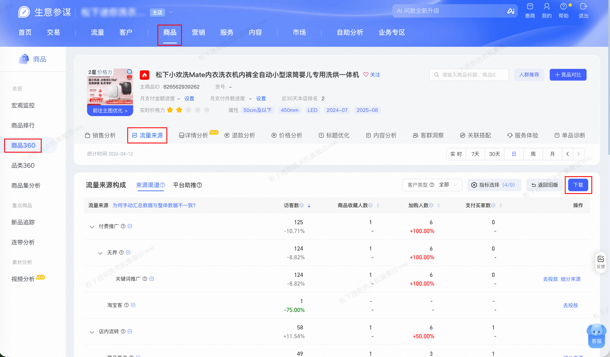

| 属性             | 值                                                                                      |
| ---------------- | --------------------------------------------------------------------------------------- |
| **连接器类型**   | `RPA 连接器` |
| **连接器代码**   | `rpa.conn.sycm.item.archives.flow.source` |
| **归属 PyPI 包** | `rpa-conn-sycm-all` |
| **操作类型**     | 浏览器自动化操作 + XLS 文件导出 |
| **目标网页**     | `https://sycm.taobao.com/cc/item_archives` |
| **适用场景**     | 按商品 ID 和统计日期查询指定商品的流量来源数据，导出获取的单品维度的流量来源拆解（一级～四级来源、UV/PV、加购收藏、支付等） |

### 目标页面

> **路径**：生意参谋—商品—商品360—流量来源
>
> **网址**：[https://sycm.taobao.com/cc/item_archives](https://sycm.taobao.com/cc/item_archives?activeKey=flow&activeTab=diagnosis)



### 业务入参

| 字段        | 中文释义 | 数据类型  | 必填 | 默认值   | 说明 |
| ----------- | -------- | --------- | ---- | -------- | ---- |
| `item_id`   | 商品 ID  | `string`  | 是   | —        | 商品 ID |
| `biz_date`  | 业务日期 | `string`  | 否   | 昨日 T-1 | 格式：`YYYYMMDD` |

### 入参样例

```json
{
    "item_id": "988297980428",
    "biz_date": "20260414"
}
```

### 数据字段

| 字段                   | 中文释义   | 数据类型              | 可为空 | 取数路径           | 示例 |
| ---------------------- | ---------- | --------------------- | ------ | ------------------ | ---- |
| `firstLevelSource`     | 一级来源   | `string`              | 否     | `XLS.0.一级来源`   | 店内流转 |
| `secondLevelSource`    | 二级来源   | `string`              | 否     | `XLS.0.二级来源`   | 商品导流 |
| `thirdLevelSource`     | 三级来源   | `string`              | 是     | `XLS.0.三级来源`   | 商品导流 |
| `fourthLevelSource`    | 四级来源   | `string`              | 是     | `XLS.0.四级来源`   | 商品导流 |
| `uv`                   | 访客数     | `number`              | 否     | `XLS.0.访客数`     | 25 |
| `pv`                   | 浏览量     | `number`              | 否     | `XLS.0.浏览量`     | 58 |
| `addCartUv`            | 加购人数   | `string`              | 否     | `XLS.0.加购人数`   | 1 |
| `collectUv`            | 商品收藏人数 | `string`             | 否   | `XLS.0.商品收藏人数` | 0 |
| `payBuyerCnt`          | 支付买家数 | `string`              | 否     | `XLS.0.支付买家数` | 1 |
| `payConversionRatio`   | 支付转化率 | `string`              | 否     | `XLS.0.支付转化率` | 4.00% |
| `payAmt`               | 支付金额   | `string`              | 否     | `XLS.0.支付金额`   | 3,299.00 |
| `avgPrice`             | 客单价     | `string`              | 否     | `XLS.0.客单价`     | 3,299.00 |
| `payItemCnt`           | 支付件数   | `string`              | 否     | `XLS.0.支付件数`   | 1 |
| `itemId`               | 商品 ID    | `string`              | 否     | 来自入参           | 988297980428 |
| `bizDate`              | 业务日期   | `string`              | 否     | 附加 | |
| `accountId`            | 授权 ID    | `string`              | 否     | 附加 | |

### 数据样例

```json
[
  {
    "firstLevelSource": "店内流转",
    "secondLevelSource": "商品导流",
    "thirdLevelSource": "商品导流",
    "fourthLevelSource": "商品导流",
    "uv": 25,
    "pv": 58,
    "addCartUv": "1",
    "collectUv": "0",
    "payBuyerCnt": "1",
    "payConversionRatio": "4.00%",
    "payAmt": "3,299.00",
    "avgPrice": "3,299.00",
    "payItemCnt": "1",
    "itemId": "988297980428",
    "bizDate": "20260414",
    "accountId": "101"
  }
]
```

### 运行时配置

```json
{
    "name": "rpa.conn.sycm.item.archives.flow.source",
    "package": "rpa-conn-sycm-all",
    "version": null,
    "mode": "Eager"
}
```

---
