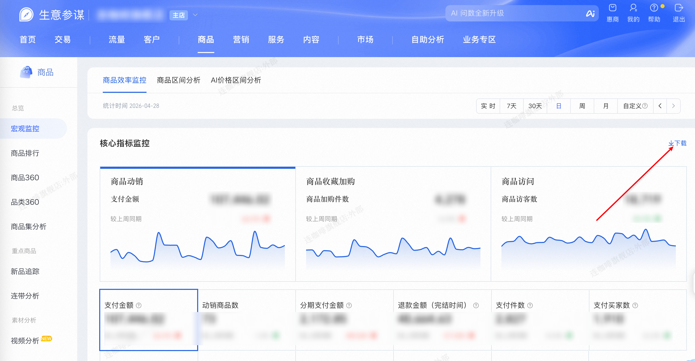

| 属性             | 值                                                                                           |
| ---------------- | -------------------------------------------------------------------------------------------- |
| **连接器类型**   | `RPA 连接器`                                                                                 |
| **连接器代码**   | `rpa.conn.sycm.item.macro.monitor`                                                          |
| **归属 PyPI 包** | `rpa-conn-sycm-all`                                                                         |
| **操作类型**     | 浏览器自动化操作 + XLS 文件导出                                                              |
| **目标网页**     | `https://sycm.taobao.com/cc/macro_monitor`                                                  |
| **适用场景**     | 采集生意参谋宏观监控页面按日维度的商品经营数据，含支付、加购、访客、转化率等核心指标         |

### 目标页面

> **路径**：生意参谋—商品—宏观监控
>
> **网址**：[https://sycm.taobao.com/cc/macro_monitor](https://sycm.taobao.com/cc/macro_monitor)



### 业务入参

| 字段 | 中文释义 | 数据类型 | 必填 | 默认值 | 说明 |
| ---- | -------- | -------- | ---- | ------ | ---- |
| `biz_date` | 统计日期 | `string` | 是 | — | 格式 `YYYYMMDD`，不能晚于昨天 |

### 入参样例

```json
{
    "biz_date": "20260408"
}
```

### 数据字段

| 字段 | 中文释义 | 数据类型 | 可为空 | 取数路径 | 示例 |
| ---- | -------- | -------- | ------ | -------- | ---- |
| `stat_date` | 统计日期 | `string` | 否 | `XLS.0.统计日期` | `2025-01-27` |
| `refund_amt` | 成功退货退款金额 | `string` | 是 | `XLS.0.成功退货退款金额` | `14,414.00` |
| `pay_amt` | 支付金额 | `string` | 是 | `XLS.0.支付金额` | `10,095.00` |
| `installment_pay_amt` | 分期支付金额 | `number` | 是 | `XLS.0.分期支付金额` | `0.0` |
| `pay_item_cnt` | 支付件数 | `number` | 是 | `XLS.0.支付件数` | `5` |
| `item_cart_buyer_cnt` | 商品加购人数 | `string` | 是 | `XLS.0.商品加购人数` | `39` |
| `item_cart_cnt` | 商品加购件数 | `string` | 是 | `XLS.0.商品加购件数` | `47` |
| `item_pv` | 商品浏览量 | `string` | 是 | `XLS.0.商品浏览量` | `2,133` |
| `item_uv` | 商品访客数 | `string` | 是 | `XLS.0.商品访客数` | `877` |
| `mini_detail_uv` | 商品微详情访客数 | `string` | 是 | `XLS.0.商品微详情访客数` | `222` |
| `item_collect_buyer_cnt` | 商品收藏人数 | `number` | 是 | `XLS.0.商品收藏人数` | `8` |
| `avg_stay_duration` | 商品平均停留时长 | `number` | 是 | `XLS.0.商品平均停留时长` | `18` |
| `order_buyer_cnt` | 下单买家数 | `number` | 是 | `XLS.0.下单买家数` | `4` |
| `pay_buyer_cnt` | 支付买家数 | `number` | 是 | `XLS.0.支付买家数` | `2` |
| `order_convert_rate` | 下单转化率 | `string` | 是 | `XLS.0.下单转化率` | `0.45%` |
| `detail_bounce_rate` | 商品详情页跳出率 | `string` | 是 | `XLS.0.商品详情页跳出率` | `0.00%` |
| `order_amt` | 下单金额 | `string` | 是 | `XLS.0.下单金额` | `20,692.00` |
| `visit_collect_rate` | 访问收藏转化率 | `string` | 是 | `XLS.0.访问收藏转化率` | `0.89%` |
| `cart_convert_rate` | 访问加购转化率 | `string` | 是 | `XLS.0.访问加购转化率` | `4.45%` |
| `pay_old_buyer_cnt` | 支付老买家数 | `number` | 是 | `XLS.0.支付老买家数` | `0` |
| `old_buyer_pay_amt` | 老买家支付金额 | `number` | 是 | `XLS.0.老买家支付金额` | `0.0` |
| `pay_convert_rate` | 支付转化率 | `string` | 是 | `XLS.0.支付转化率` | `0.23%` |
| `pay_new_buyer_cnt` | 支付新买家数 | `number` | 是 | `XLS.0.支付新买家数` | `0` |
| `pay_item_num` | 有支付商品数 | `number` | 是 | `XLS.0.有支付商品数` | `3` |
| `order_item_cnt` | 下单件数 | `number` | 是 | `XLS.0.下单件数` | `8` |
| `visit_item_num` | 有访问商品数 | `number` | 是 | `XLS.0.有访问商品数` | `75` |
| `avg_price_per_buyer` | 客单价 | `string` | 是 | `XLS.0.客单价` | `5,047.50` |
| `bizDate` | 业务日期 | `string` | 否 | 附加 |  |
| `accountId` | 授权 ID | `string` | 否 | 附加 |  |
| `taskId` | 任务 ID | `string` | 否 | 附加 |  |

### 数据样例

```json
{
    "stat_date": "2025-01-27",
    "refund_amt": "14,414.00",
    "pay_amt": "10,095.00",
    "installment_pay_amt": 0.0,
    "pay_item_cnt": 5,
    "item_cart_buyer_cnt": "39",
    "item_cart_cnt": "47",
    "item_pv": "2,133",
    "item_uv": "877",
    "mini_detail_uv": "222",
    "item_collect_buyer_cnt": 8,
    "avg_stay_duration": 18,
    "order_buyer_cnt": 4,
    "pay_buyer_cnt": 2,
    "order_convert_rate": "0.45%",
    "detail_bounce_rate": "0.00%",
    "order_amt": "20,692.00",
    "visit_collect_rate": "0.89%",
    "cart_convert_rate": "4.45%",
    "pay_old_buyer_cnt": 0,
    "old_buyer_pay_amt": 0.0,
    "pay_convert_rate": "0.23%",
    "pay_new_buyer_cnt": 0,
    "pay_item_num": 3,
    "order_item_cnt": 8,
    "visit_item_num": 75,
    "avg_price_per_buyer": "5,047.50",
    "bizDate": "20250225",
    "accountId": "101",
    "taskId": "dev-0-eb0baf43"
}
```

### 运行时配置

```json
{
    "name": "rpa.conn.sycm.item.macro.monitor",
    "package": "rpa-conn-sycm-all",
    "version": null,
    "mode": "Eager"
}
```

---
