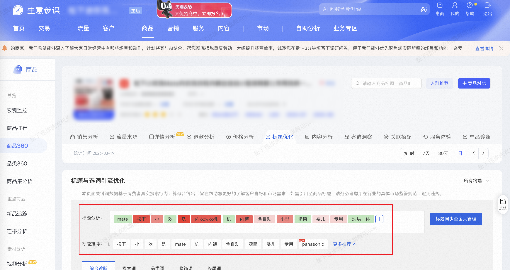

| 属性             | 值                                                                                           |
| ---------------- | -------------------------------------------------------------------------------------------- |
| **连接器类型**   | `RPA 连接器`                                                                                 |
| **连接器代码**   | `rpa.conn.sycm.item.title.analysis.recommend`                                              |
| **归属 PyPI 包** | `rpa-conn-sycm-all`                                                                          |
| **操作类型**     | 浏览器自动化操作 + 网络请求监听                                                              |
| **目标网页**     | `https://sycm.taobao.com/cc/item_archives`                                                   |
| **适用场景**     | 按商品 ID 与统计周期采集生意参谋商品360标题页的标题分析分词（含标签色）与标题推荐方案         |

### 目标页面

> **路径**：生意参谋—商品—商品360—标题分析
>
> **网址**：[https://sycm.taobao.com/cc/item_archives?activeKey=title](https://sycm.taobao.com/cc/item_archives?activeKey=title)



### 业务入参

| 字段 | 中文释义 | 数据类型 | 必填 | 默认值 | 说明 |
| ---- | -------- | -------- | ---- | ------ | ---- |
| `item_id` | 商品 ID | `string` | 是 | — | 商品 ID |
| `date_type` | 统计周期类型 | `string` | 是 | — | 允许值：`today`（今日）、`recent7`（近 7 天）、`recent30`（近 30 天）、`day`（指定单日） |
| `stat_date` | 统计日期 | `string` | 条件必填 | — | 当 `date_type=day` 时必填；格式 `YYYYMMDD`；不能晚于昨天、不能早于近三个月 |

### 入参样例

```json
{
    "item_id": "826562939262",
    "date_type": "day",
    "stat_date": "20260319"
}
```

### 数据字段

每条任务输出 **1 条记录**（`data[0]`），包含当前商品在指定统计周期内的标题分析与标题推荐。

| 字段 | 中文释义 | 数据类型 | 可为空 | 取数路径 | 示例 |
| ---- | -------- | -------- | ------ | -------- | ---- |
| `itemId` | 商品 ID | `string` | 否 | 来自入参 | `826562939262` |
| `dateType` | 统计周期类型 | `string` | 否 | 由入参 `date_type` 映射 | `day` |
| `dateRangeStart` | 统计区间起始日 | `string` | 否 | 由入参与周期类型计算 | `2026-03-19` |
| `dateRangeEnd` | 统计区间结束日 | `string` | 否 | 由入参与周期类型计算 | `2026-03-19` |
| `maxGuideSeUv` | 标题引流人数最大值 | `number` | 否 | 当次标题各分词 `guideSeUv` 的最大值 | `68` |
| `titleAnalysis` | 标题分析分词列表 | `List[Dict]` | 否 | 见下方「标题分析」 | 见数据样例 `titleAnalysis` |
| `titleRecommend` | 标题推荐方案列表 | `List[Dict]` | 否 | 见下方「标题推荐」 | 见数据样例 `titleRecommend` |
| `bizDate` | 业务日期 | `string` | 否 | 附加 |  |
| `accountId` | 授权 ID | `string` | 否 | 附加 |  |
| `taskId` | 任务 ID | `string` | 否 | 附加 |  |

#### 标题分析（titleAnalysis[]）

| 字段 | 中文释义 | 数据类型 | 可为空 | 取数路径 | 示例 |
| ---- | -------- | -------- | ------ | -------- | ---- |
| `titleAnalysis[].word` | 分词文案 | `string` | 否 | `data[].searchWord` | `洗` |
| `titleAnalysis[].colorType` | 标签色类型 | `string` | 否 | 由 `guideSeUv` 派生 | `red` |
| `titleAnalysis[].opacity` | 红色标签深浅 | `number` | 是 | 由 `guideSeUv` 与 `maxGuideSeUv` 派生 | `1` |
| `titleAnalysis[].guideSeUv` | 引流人数 | `number` | 是 | `data[].guideSeUv` | `68` |
| `titleAnalysis[].payRate` | 支付转化率 | `number` | 是 | `data[].payRate` | `0.0294` |

##### 标题分析标签色（colorType / opacity）

与生意参谋商品360标题分析页面上各分词标签的背景色一致，便于业务侧还原页面展示效果。

| 页面表现 | 输出字段 | 规则说明 |
| -------- | -------- | -------- |
| **绿色标签** | `colorType=green` | 该分词引流人数为 0，或接口未返回引流人数字段 |
| **红色标签** | `colorType=red` + `opacity` | 该分词引流人数大于 0；`opacity` 取值范围 `0.1`～`1`，数值越大红色越深 |
| 红色深浅计算 | `opacity` | `opacity = 0.1 + 0.9 × guideSeUv ÷ maxGuideSeUv`；`maxGuideSeUv` 为本条记录中所有分词引流人数的最大值（见上方 `maxGuideSeUv` 字段） |
| 支付转化率 | `payRate` | 仅对应页面鼠标悬停时的提示信息，**不参与**标签背景色计算；接口有返回时原样输出，供业务查阅 |

> **示例**：当 `maxGuideSeUv=68` 时，引流人数 68 的分词 `opacity=1`（最深红），引流人数 9 的分词 `opacity≈0.22`（较浅红）；引流人数为 0 的分词仅输出 `colorType=green`，不含 `opacity`。

#### 标题推荐（titleRecommend[]）

每组对应页面上一套推荐标题方案，按页面顺序从 1 开始编号。

| 字段 | 中文释义 | 数据类型 | 可为空 | 取数路径 | 示例 |
| ---- | -------- | -------- | ------ | -------- | ---- |
| `titleRecommend[].index` | 方案序号 | `number` | 否 | 按 `titleList` 顺序从 1 编号 | `1` |
| `titleRecommend[].words` | 推荐词列表 | `List[Dict]` | 否 | 见下方「推荐词明细」 | 见数据样例 `titleRecommend` |

##### 推荐词明细（titleRecommend[].words[]）

| 字段 | 中文释义 | 数据类型 | 可为空 | 取数路径 | 示例 |
| ---- | -------- | -------- | ------ | -------- | ---- |
| `titleRecommend[].words[].word` | 推荐词文案 | `string` | 否 | `data.titleList[][].word` | `松下` |
| `titleRecommend[].words[].isNew` | 是否新词 | `boolean` | 否 | `data.titleList[][].isnew`（yes/no 转布尔） | `false` |
| `titleRecommend[].words[].wordType` | 词类型 | `number` | 否 | `data.titleList[][].type` | `1` |
| `titleRecommend[].words[].score` | 词得分 | `number` | 否 | `data.titleList[][].score` | `0` |
| `titleRecommend[].words[].hotPctile` | 热度分位数 | `number` | 否 | `data.titleList[][].hot_pctile` | `0.0077399381` |
| `titleRecommend[].words[].competePctile` | 竞争度分位数 | `number` | 否 | `data.titleList[][].compete_pctile` | `0.0061919505` |

### 数据样例

```json
{
    "itemId": "826562939262",
    "dateType": "day",
    "dateRangeStart": "2026-03-19",
    "dateRangeEnd": "2026-03-19",
    "maxGuideSeUv": 68,
    "titleAnalysis": [
        {
            "word": "mate",
            "colorType": "green"
        },
        {
            "word": "松下",
            "colorType": "red",
            "opacity": 0.9073529412,
            "guideSeUv": 61,
            "payRate": 0.0164
        },
        {
            "word": "小",
            "colorType": "red",
            "opacity": 0.5897058824,
            "guideSeUv": 37,
            "payRate": 0.027
        },
        {
            "word": "欢",
            "colorType": "green"
        },
        {
            "word": "洗",
            "colorType": "red",
            "opacity": 1,
            "guideSeUv": 68,
            "payRate": 0.0294
        },
        {
            "word": "内衣洗衣机",
            "colorType": "red",
            "opacity": 0.8676470588,
            "guideSeUv": 58,
            "payRate": 0.0345
        },
        {
            "word": "机",
            "colorType": "green"
        },
        {
            "word": "内裤",
            "colorType": "red",
            "opacity": 0.7882352941,
            "guideSeUv": 52,
            "payRate": 0.0385
        },
        {
            "word": "全自动",
            "colorType": "red",
            "opacity": 0.2191176471,
            "guideSeUv": 9,
            "payRate": 0
        },
        {
            "word": "小型",
            "colorType": "red",
            "opacity": 0.6029411765,
            "guideSeUv": 38,
            "payRate": 0.0526
        },
        {
            "word": "滚筒",
            "colorType": "green"
        },
        {
            "word": "婴儿",
            "colorType": "red",
            "opacity": 0.1661764706,
            "guideSeUv": 5,
            "payRate": 0
        },
        {
            "word": "专用",
            "colorType": "red",
            "opacity": 0.2191176471,
            "guideSeUv": 9,
            "payRate": 0
        },
        {
            "word": "洗烘一体",
            "colorType": "green"
        }
    ],
    "titleRecommend": [
        {
            "index": 1,
            "words": [
                {
                    "word": "松下",
                    "isNew": false,
                    "wordType": 1,
                    "score": 0,
                    "hotPctile": 0.0077399381,
                    "competePctile": 0.0061919505
                },
                {
                    "word": "小",
                    "isNew": false,
                    "wordType": 3,
                    "score": -2,
                    "hotPctile": 1,
                    "competePctile": 1
                },
                {
                    "word": "panasonic",
                    "isNew": true,
                    "wordType": 1,
                    "score": -32,
                    "hotPctile": 0.0882352941,
                    "competePctile": 0.0123839009
                }
            ]
        },
        {
            "index": 2,
            "words": [
                {
                    "word": "松下",
                    "isNew": false,
                    "wordType": 1,
                    "score": 0,
                    "hotPctile": 0.0077399381,
                    "competePctile": 0.0061919505
                },
                {
                    "word": "洗烘一体",
                    "isNew": false,
                    "wordType": 3,
                    "score": -27,
                    "hotPctile": 0.0017185882,
                    "competePctile": 0.0357055064
                },
                {
                    "word": "panasonic",
                    "isNew": true,
                    "wordType": 1,
                    "score": -32,
                    "hotPctile": 0.0882352941,
                    "competePctile": 0.0123839009
                }
            ]
        }
    ],
    "bizDate": "20260520",
    "accountId": "101",
    "taskId": "dev-0-ead042f1"
}
```

### 运行时配置

```json
{
    "name": "rpa.conn.sycm.item.title.analysis.recommend",
    "package": "rpa-conn-sycm-all",
    "version": null,
    "mode": "Eager"
}
```

---
