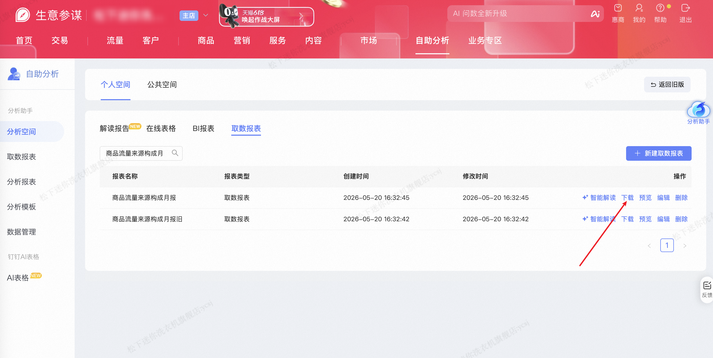

| 属性             | 值                  |
| ---------------- | ------------------- |
| **连接器类型**   | `RPA 连接器`        |
| **连接器代码**   | `rpa.conn.sycm.shop.auto.analysis.fetch.report` |
| **归属 PyPI 包** | `rpa-conn-sycm-all` |
| **操作类型**     | 浏览器自动化操作 + XLSX 文件导出 |
| **目标网页**     | `https://sycm.taobao.com/adm/v3/micro/auto_analysis/my_space?tab=fetch` |
| **适用场景**     | 在生意参谋自助分析「分析空间」中按报表名称精确匹配并下载取数报表，逐行输出 Excel 表头与数据 |

### 目标页面

> **路径**：生意参谋—自助分析—分析空间—取数报表
>
> **网址**：[https://sycm.taobao.com/adm/v3/micro/auto_analysis/my_space?tab=fetch](https://sycm.taobao.com/adm/v3/micro/auto_analysis/my_space?tab=fetch)



### 业务入参

| 字段 | 中文释义 | 数据类型 | 必填 | 默认值 | 说明 |
| ---- | -------- | -------- | ---- | ------ | ---- |
| `report_name` | 取数报表名称 | `string` | 是 | — | 与列表「报表名称」列精确匹配 |
| `column_headers` | Excel 表头校验列表 | `List[string]` \| `string` | 否 | — | 须为下载文件实际表头的子集，支持数组或英文逗号分隔的字符串；缺失时任务失败并返回缺少/现有表头 |

### 入参样例

数组形式：

```json
{
    "report_name": "自动化报表demo2",
    "column_headers": ["统计日期", "店铺名称"]
}
```

逗号分隔字符串形式：

```json
{
    "report_name": "自动化报表demo2",
    "column_headers": "统计日期,店铺名称"
}
```

### 数据字段

| 字段 | 中文释义 | 数据类型 | 可为空 | 取数路径 | 示例 |
| ---- | -------- | -------- | ------ | -------- | ---- |
| `id` | 行序号 | `number` | 否 | 序号从 1 递增 | 1 |
| `value` | 报表行数据 | `Dict` | 否 | `XLSX` 行记录（原始表头） | 见数据样例 `value` |
| `taskId` | 任务 ID | `string` | 否 | 附加 | — |
| `bizDate` | 业务日期 | `string` | 否 | 附加 |  |
| `accountId` | 授权 ID | `string` | 否 | 附加 |  |

### 数据样例

```json
[
  {
    "id": 1,
    "value": {
      "统计日期": "2026-05-11~2026-05-17",
      "店铺名称": "松下迷你洗衣机旗舰店",
      "回访客户数": "1,321",
      "新访客户数": "9,387",
      "存量店铺资产-回访客户数": 0,
      "新增店铺资产-客户数": 0,
      "店铺客户数": "10,253",
      "当期未购客户数": "10,199",
      "当期已购客户数": 54,
      "新访客户进店客户数": "9,362",
      "未购客户回访客户数": "1,127",
      "已购客户回访客户数": 165,
      "新访客户购买客户数": 25,
      "新访客户购买成交金额": "41,923.34",
      "未购客户购买客户数": 21,
      "未购客户购买种草成交金额": "43,609.22",
      "已购客户回购客户数": 9,
      "已购客户回购成交金额": "15,847.68",
      "未购客户回访数": "1,148",
      "已购客户回访数": 174,
      "潜在客户新访客户数": 481,
      "潜在状态客户数": "137,813",
      "未购状态客户数": "20,239",
      "已购状态客户数": "7,164",
      "店铺粉丝数": 168,
      "店铺会员数": 863,
      "新访客户粉丝数": 59,
      "新访客户会员数": 8,
      "未购客户回访粉丝数": 47,
      "未购客户回访会员数": 2,
      "已购客户回访粉丝数": 70,
      "已购客户回访会员数": 3,
      "父订单数": 61,
      "复购父订单数": 11,
      "子订单数": 61,
      "复购子订单数": 11,
      "店铺店播时长(s)": "172,559.00",
      "店铺有效内容数": 33,
      "店铺在线权益数": 0,
      "店铺新品发布数": 2,
      "店铺淘外回流人数": 622,
      "店铺广告引导人数": "5,323"
    },
    "bizDate": "20260521",
    "accountId": "101",
    "taskId": "dev-0-69b427ed"
  }
]
```

### 运行时配置

```json
{
    "name": "rpa.conn.sycm.shop.auto.analysis.fetch.report",
    "package": "rpa-conn-sycm-all",
    "version": null,
    "mode": "Eager"
}
```

---
