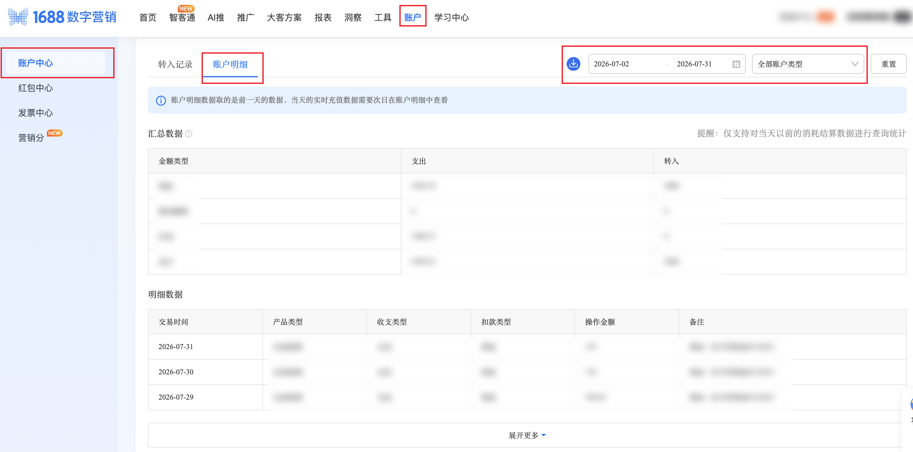

:::references
path: /docs/auth/YUCE_RPA/RPA_1688/SZYX
mode: summary
badge:
  label: 授权依赖
prompt:
  label: 请提前完成授权配置
  type: warning
:::

| 属性             | 值                                                                                      |
| ---------------- | --------------------------------------------------------------------------------------- |
| **连接器类型**   | `RPA 连接器`                                                                            |
| **连接器名称**   | `ODS_数字营销账户中心账户明细表(1688RPA)`                                               |
| **连接器代码**   | `rpa.conn.1688.szyx.account.center.detail`                                              |
| **操作类型**     | `文件导出`                                                                              |
| **目标网页**     | `https://p4p.1688.com/main.html#!/boot-page?pageId=100388&tab=account`                  |
| **适用场景**     | 导出 1688 数字营销账户中心账户汇总与明细，支持按日期类型与产品类型筛选后下载解析         |
| **数据表名**     | `ods_rpa_1688_szyx_account_center_detail_du`                                            |
| **业务表名**     | `ODS_数字营销账户中心账户明细表(1688RPA)`                                               |

### 目标页面

> **取数路径**：1688 数字营销—账户中心—账户明细
>
> **取数链接**：[https://p4p.1688.com/main.html#!/boot-page?pageId=100388&tab=account](https://p4p.1688.com/main.html#!/boot-page?pageId=100388&tab=account)



### 业务入参

| 字段 | 中文释义 | 数据类型 | 必填 | 默认值 | 说明 |
| ---- | -------- | -------- | ---- | ------ | ---- |
| `date_type` | 日期类型 | `String` | 是 | — | 可选值：`YESTERDAY`（昨天）/ `LAST_7_DAYS`（近7天）/ `LAST_15_DAYS`（近15天）/ `LAST_30_DAYS`（近30天）/ `THIS_MONTH`（本月）/ `LAST_MONTH`（上个月）/ `CUSTOM`（自定义） |
| `custom_start_date` | 自定义起始日期 | `String` | 条件必填 | — | `date_type=CUSTOM` 时必填；支持格式：`YYYYMMDD` / `YYYY-MM-DD`；不能晚于 `custom_end_date` |
| `custom_end_date` | 自定义结束日期 | `String` | 条件必填 | — | `date_type=CUSTOM` 时必填；支持格式：`YYYYMMDD` / `YYYY-MM-DD`；不能早于 `custom_start_date` |
| `product_type` | 产品类型 | `String` | 否 | `ALL` | 可选值：`ALL`（全部账户类型）；本期仅支持 `ALL`，其余预留 |

### 入参样例

近 30 天、全部账户类型：

```json
{
  "date_type": "LAST_30_DAYS",
  "product_type": "ALL"
}
```

自定义日期区间：

```json
{
  "date_type": "CUSTOM",
  "custom_start_date": "2026-07-01",
  "custom_end_date": "2026-07-31",
  "product_type": "ALL"
}
```

昨天（省略产品类型，默认全部账户类型）：

```json
{
  "date_type": "YESTERDAY"
}
```

### 入参校验

```json-schema collapsed
{
  "$schema": "https://json-schema.org/draft/2020-12/schema",
  "title": "1688-数字营销账户中心账户明细 - 查询入参",
  "description": "导出 1688 数字营销账户中心账户汇总与明细，支持按日期类型与产品类型筛选后下载解析",
  "type": "object",
  "properties": {
    "date_type": {
      "description": "日期类型。可选值：YESTERDAY（昨天）/ LAST_7_DAYS（近7天）/ LAST_15_DAYS（近15天）/ LAST_30_DAYS（近30天）/ THIS_MONTH（本月）/ LAST_MONTH（上个月）/ CUSTOM（自定义）",
      "type": "string",
      "enum": [
        "YESTERDAY",
        "LAST_7_DAYS",
        "LAST_15_DAYS",
        "LAST_30_DAYS",
        "THIS_MONTH",
        "LAST_MONTH",
        "CUSTOM"
      ]
    },
    "custom_start_date": {
      "description": "自定义起始日期；date_type=CUSTOM 时必填；支持 YYYYMMDD 或 YYYY-MM-DD；不能晚于 custom_end_date",
      "type": "string",
      "pattern": "^(\\d{8}|\\d{4}-\\d{2}-\\d{2})$"
    },
    "custom_end_date": {
      "description": "自定义结束日期；date_type=CUSTOM 时必填；支持 YYYYMMDD 或 YYYY-MM-DD；不能早于 custom_start_date",
      "type": "string",
      "pattern": "^(\\d{8}|\\d{4}-\\d{2}-\\d{2})$"
    },
    "product_type": {
      "description": "产品类型。可选值：ALL（全部账户类型）；本期仅支持 ALL，其余预留；默认 ALL",
      "type": "string",
      "enum": ["ALL"],
      "default": "ALL"
    }
  },
  "required": ["date_type"],
  "additionalProperties": false,
  "allOf": [
    {
      "if": {
        "properties": {
          "date_type": { "const": "CUSTOM" }
        },
        "required": ["date_type"]
      },
      "then": {
        "required": ["custom_start_date", "custom_end_date"]
      }
    }
  ]
}
```

### 数据字段

每条任务输出 **1 条聚合记录**（`data[0]`），含账户汇总对象与明细列表；`bizDate` / `accountId` 附加在明细行上。

:::field-tree
@define 金额汇总项
| `expense` | 支出 | `Number` | 是 | `XLS.汇总.支出` | `3296.34` |
| `income` | 存入 | `Number` | 是 | `XLS.汇总.存入` | `3000.0` |

@define 账户汇总
| `<amountType>` @金额汇总项 | 按金额类型汇总（如 `现金` / `红包` / `总计`） | `Dict` | 是 | `XLS.汇总.金额类型` 为 key | 见数据样例 |

@define 明细行
| `tradeDate` | 交易日期 | `String` | 是 | `XLS.明细.日期` | `2026-07-31T00:00:00.000` |
| `productType` | 产品/交易类型 | `String` | 是 | `XLS.明细.类型` | `全站投放` |
| `expense` | 支出 | `Number` | 是 | `XLS.明细.支出` | `110.0` |
| `income` | 收入 | `Number` | 是 | `XLS.明细.收入` | `0.0` |
| `remark` | 说明 | `String` | 是 | `XLS.明细.说明` | `现金` |
| `bizDate` | 业务日期 | `String` | 否 | 附加 | `20260801` |
| `accountId` | 授权 ID | `String` | 否 | 附加 | `1****8` (已脱敏) |

| 字段 | 中文释义 | 数据类型 | 可为空 | 取数路径 | 示例 |
| ---- | -------- | -------- | ------ | -------- | ---- |
| `summary` @账户汇总 | 账户汇总（按金额类型） | `Dict` | 否 | `XLS.汇总` | 见数据样例 |
| `detail` @明细行 | 账户明细列表 | `List[Dict]` | 否 | `XLS.明细` | 见数据样例 |
| `bizDate` | 业务日期 | `String` | 否 | 附加（明细行） | `20260801` |
| `accountId` | 授权 ID | `String` | 否 | 附加（明细行） | `1****8` (已脱敏) |
:::

### 数据样例

```json
[
  {
    "summary": {
      "现金": {
        "expense": 3296.34,
        "income": 3000.0
      },
      "红包": {
        "expense": 1488.57,
        "income": 0.0
      },
      "总计": {
        "expense": 4784.91,
        "income": 3000.0
      }
    },
    "detail": [
      {
        "tradeDate": "2026-07-31T00:00:00.000",
        "productType": "全站投放",
        "expense": 110.0,
        "income": 0.0,
        "remark": "现金",
        "bizDate": "20260801",
        "accountId": "1****8"
      },
      {
        "tradeDate": "2026-07-30T00:00:00.000",
        "productType": "全站投放",
        "expense": 110.0,
        "income": 0.0,
        "remark": "现金",
        "bizDate": "20260801",
        "accountId": "1****8"
      },
      {
        "tradeDate": "2026-07-23T08:07:55.000",
        "productType": "现金充值",
        "expense": 0.0,
        "income": 1000.0,
        "remark": "现金充值",
        "bizDate": "20260801",
        "accountId": "1****8"
      },
      {
        "tradeDate": "2026-07-02T00:00:00.000",
        "productType": "全站投放",
        "expense": 109.27,
        "income": 0.0,
        "remark": "现金",
        "bizDate": "20260801",
        "accountId": "1****8"
      },
      {
        "tradeDate": "2026-07-02T00:00:00.000",
        "productType": "全站投放",
        "expense": 130.0,
        "income": 0.0,
        "remark": "红包",
        "bizDate": "20260801",
        "accountId": "1****8"
      }
    ]
  }
]
```

---
