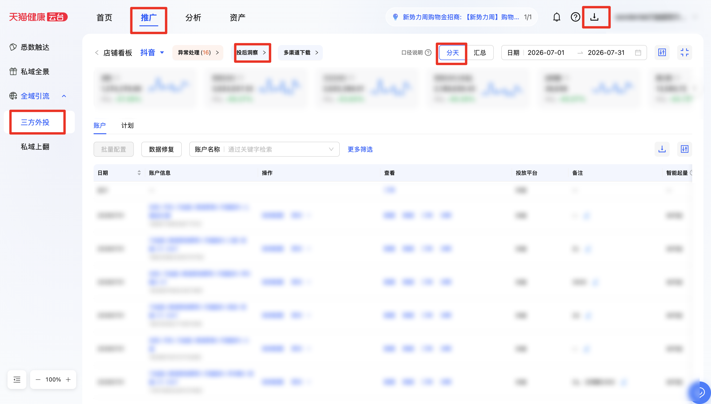

| 属性             | 值                                                                                   |
| ---------------- | ------------------------------------------------------------------------------------ |
| **连接器类型**   | `RPA 连接器`                                                                         |
| **连接器名称**   | `ODS_天猫健康三方渠道自定义报表下载(阿里健康RPA)`                                    |
| **连接器代码**   | `rpa.conn.alijiankang.tmjk.three.party.custom.report`                                |
| **操作类型**     | `文件导出`                                                                           |
| **目标网页**     | `https://yt.taobao.com/v2/third-party-invest#`                                       |
| **适用场景**     | 登录天猫健康云台后，按媒体平台、日期与自定义表头模板筛选三方外投数据，异步导出账户粒度天汇总并解析为行级明细 |
| **数据表名**     | `ods_rpa_alijiankang_tmjk_three_party_custom_report_du`                              |
| **业务表名**     | `ODS_天猫健康三方渠道自定义报表下载(阿里健康RPA)`                                    |

### 目标页面

> **取数路径**：天猫健康云台—三方外投—店铺看板—选择指标模板—口径说明（分天）—多渠道数据汇总下载—下载中心
>
> **取数链接**：[https://yt.taobao.com/v2/third-party-invest#](https://yt.taobao.com/v2/third-party-invest#)



### 业务入参

| 字段 | 中文释义 | 数据类型 | 必填 | 默认值 | 说明 |
| ---- | -------- | -------- | ---- | ------ | ---- |
| `channels` | 媒体平台 / 下载渠道 | `String` / `List[String]` | 是 | — | 英文 code，列表页「媒体平台」与下载抽屉「渠道」共用同一套选项；支持英文逗号分隔字符串或 JSON 数组。可选值：`DOUYIN`（抖音）/ `BILIBILI`（B站）/ `TENCENT`（腾讯）/ `UC`（UC）/ `KUAISHOU`（快手）/ `ZHIHU`（知乎）/ `XIAOHONGSHU`（小红书）/ `WEIBO`（微博）/ `BAIDU`（百度）/ `ALIPAY`（支付宝）/ `XIAOHE_MEDICAL`（小荷医疗） |
| `date_type` | 日期类型 | `String` | 是 | — | 英文 code，列表页与下载抽屉共用。可选值：`LAST_7_DAYS`（近7天）/ `LAST_30_DAYS`（近30天）/ `CUSTOM`（自定义） |
| `custom_start_date` | 自定义起始日期 | `String` | 条件必填 | — | 仅 `date_type=CUSTOM` 时必填；支持 `YYYYMMDD` 或 `YYYY-MM-DD` |
| `custom_end_date` | 自定义结束日期 | `String` | 条件必填 | — | 仅 `date_type=CUSTOM` 时必填；支持 `YYYYMMDD` 或 `YYYY-MM-DD`；须不早于起始日期；跨度不超过 31 天（含首尾） |
| `report_template_name` | 自定义表头模板名称 | `String` | 是 | — | 与店铺看板「常用自定义表头模板」弹层项全文精确匹配 |

### 入参样例

近 7 天 + 单渠道：

```json
{
  "channels": ["DOUYIN"],
  "date_type": "LAST_7_DAYS",
  "report_template_name": "输入模版的名称"
}
```

自定义日期 + 多渠道（逗号分隔）：

```json
{
  "channels": "DOUYIN,TENCENT",
  "date_type": "CUSTOM",
  "custom_start_date": "2026-07-01",
  "custom_end_date": "2026-07-31",
  "report_template_name": "输入模版的名称"
}
```

### 入参校验

```json-schema collapsed
{
  "$schema": "https://json-schema.org/draft/2020-12/schema",
  "title": "阿里健康-三方外投自定义报表 - 查询入参",
  "description": "登录天猫健康云台后，按媒体平台、日期与自定义表头模板筛选三方外投数据，异步导出账户粒度天汇总并解析为行级明细",
  "type": "object",
  "properties": {
    "channels": {
      "description": "媒体平台与下载渠道英文 code，支持英文逗号分隔字符串或 JSON 数组。可选值：DOUYIN（抖音）/ BILIBILI（B站）/ TENCENT（腾讯）/ UC（UC）/ KUAISHOU（快手）/ ZHIHU（知乎）/ XIAOHONGSHU（小红书）/ WEIBO（微博）/ BAIDU（百度）/ ALIPAY（支付宝）/ XIAOHE_MEDICAL（小荷医疗）",
      "oneOf": [
        {
          "type": "string",
          "minLength": 1
        },
        {
          "type": "array",
          "minItems": 1,
          "items": {
            "type": "string",
            "enum": [
              "DOUYIN",
              "BILIBILI",
              "TENCENT",
              "UC",
              "KUAISHOU",
              "ZHIHU",
              "XIAOHONGSHU",
              "WEIBO",
              "BAIDU",
              "ALIPAY",
              "XIAOHE_MEDICAL"
            ]
          },
          "uniqueItems": true
        }
      ]
    },
    "date_type": {
      "description": "日期类型英文 code。可选值：LAST_7_DAYS（近7天）/ LAST_30_DAYS（近30天）/ CUSTOM（自定义）",
      "type": "string",
      "enum": ["LAST_7_DAYS", "LAST_30_DAYS", "CUSTOM"]
    },
    "custom_start_date": {
      "description": "自定义起始日期，仅 date_type=CUSTOM 时必填；支持 YYYYMMDD 或 YYYY-MM-DD",
      "type": "string",
      "pattern": "^(\\d{8}|\\d{4}-\\d{2}-\\d{2})$"
    },
    "custom_end_date": {
      "description": "自定义结束日期，仅 date_type=CUSTOM 时必填；跨度不超过 31 天（含首尾）",
      "type": "string",
      "pattern": "^(\\d{8}|\\d{4}-\\d{2}-\\d{2})$"
    },
    "report_template_name": {
      "description": "常用自定义表头模板名称，与弹层项全文精确匹配",
      "type": "string",
      "minLength": 1
    }
  },
  "required": ["channels", "date_type", "report_template_name"],
  "additionalProperties": false,
  "allOf": [
    {
      "if": {
        "properties": { "date_type": { "const": "CUSTOM" } },
        "required": ["date_type"]
      },
      "then": {
        "required": ["custom_start_date", "custom_end_date"]
      }
    }
  ]
}
```

### 数据字段

导出 Excel 按所选表头模板解析为行级记录；口径说明固定为「分天」，下载维度固定为「账户」。导出前若列表无数据，返回 `success=true`、`message=暂无数据`、`data=[]`，不创建导出任务。

| 字段 | 中文释义 | 数据类型 | 可为空 | 取数路径 | 示例 |
| ---- | -------- | -------- | ------ | -------- | ---- |
| `statDate` | 日期 | `String` | 是 | `XLSX.日期` | `2026-07-01` |
| `merchantNickname` | 商家昵称 | `String` | 是 | `XLSX.商家昵称` | `****` (已脱敏) |
| `channelName` | 渠道名称 | `String` | 是 | `XLSX.渠道名称` | `抖音,腾讯` |
| `mediaAccountId` | 账户 ID | `String` | 是 | `XLSX.账户id` | — |
| `mediaAccountName` | 账户名称 | `String` | 是 | `XLSX.账户名称` | — |
| `remark` | 备注 | `String` | 是 | `XLSX.备注` | — |
| `smartVolumeBoost` | 智能起量 | `String` | 是 | `XLSX.智能起量` | `未开启` |
| `bidHosting` | 出价托管 | `String` | 是 | `XLSX.出价托管` | `未开启` |
| `trafficSubsidyPlatformFunded` | 引流补贴(平台出资) | `String` | 是 | `XLSX.引流补贴(平台出资)` | — |
| `cost` | 消耗 | `String` | 是 | `XLSX.消耗` | `1550983.45` |
| `validGmv` | 有效 GMV | `String` | 是 | `XLSX.有效gmv` | `5593761.53` |
| `todayGmv` | 今日 GMV | `String` | 是 | `XLSX.今日gmv` | `2976952.48` |
| `validGmvSelfProduct` | 有效 GMV（本品） | `String` | 是 | `XLSX.有效gmv（本品）` | `2601936.99` |
| `addToCartCount` | 加购量 | `String` | 是 | `XLSX.加购量` | `36642` |
| `impressionCount` | 展示数 | `String` | 是 | `XLSX.展示数` | `34757399` |
| `clickCount` | 点击数 | `String` | 是 | `XLSX.点击数` | `274558` |
| `conversionCount` | 转化数 | `String` | 是 | `XLSX.转化数` | `9728` |
| `paidParentOrderCount` | 支付父订单量 | `String` | 是 | `XLSX.支付父订单量` | `16441` |
| `paidParentOrderCountSelfProduct` | 支付父订单量（本品） | `String` | 是 | `XLSX.支付父订单量（本品）` | `7648` |
| `validRoiSelfProduct` | 有效 ROI（本品） | `String` | 是 | `XLSX.有效roi（本品）` | `1.68` |
| `validRoi` | 有效 ROI | `String` | 是 | `XLSX.有效roi` | `3.61` |
| `todayRoi` | 今日 ROI | `String` | 是 | `XLSX.今日roi` | `1.92` |
| `bizDate` | 业务日期 | `String` | 否 | 附加 | `20260821` |
| `accountId` | 授权 ID | `String` | 否 | 附加 | `1****2` (已脱敏) |

### 数据样例

> 样例来自真实运行（`message=导出成功，共 742 条`，自定义 2026-07-01~2026-07-31，渠道抖音+腾讯）。商家昵称等主体名称已脱敏。

```json
[
  {
    "statDate": null,
    "merchantNickname": "****",
    "channelName": "**,**",
    "mediaAccountId": null,
    "mediaAccountName": null,
    "remark": null,
    "smartVolumeBoost": "未开启",
    "bidHosting": "未开启",
    "trafficSubsidyPlatformFunded": null,
    "cost": "1550983.45",
    "validGmv": "5593761.53",
    "todayGmv": "2976952.48",
    "validGmvSelfProduct": "2601936.99",
    "addToCartCount": "36642",
    "impressionCount": "34757399",
    "clickCount": "274558",
    "conversionCount": "9728",
    "paidParentOrderCount": "16441",
    "paidParentOrderCountSelfProduct": "7648",
    "validRoiSelfProduct": "1.68",
    "validRoi": "3.61",
    "todayRoi": "1.92",
    "bizDate": "20260821",
    "accountId": "1****2"
  }
]
```

---
