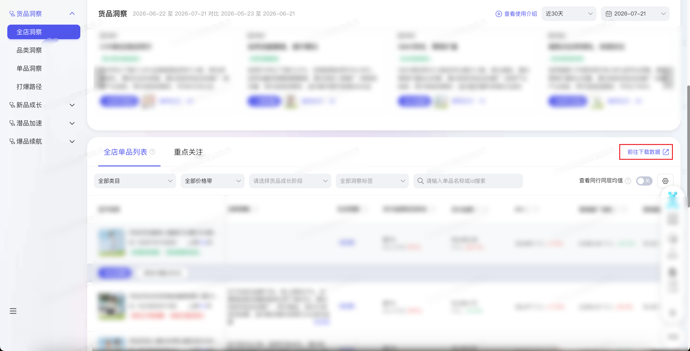
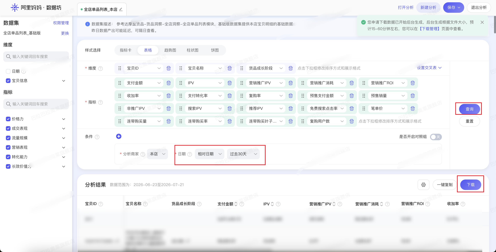

| 属性             | 值                                                                 |
| ---------------- | ------------------------------------------------------------------ |
| **连接器类型**   | `RPA 连接器`                                                       |
| **连接器名称**   | `ODS_达摩盘货品洞察全店单品明细表(阿里妈妈RPA)`                       |
| **连接器代码**   | `rpa.conn.alimm.dmp.shop.insight.item.list`                        |
| **操作类型**     | `文件导出`                                                         |
| **目标网页**     | `https://dmp.taobao.com/index_new.html#!/items/shop-insight`       |
| **适用场景**     | 导出达摩盘货品洞察全店单品列表（基础版）数据，支持按快捷时间或自定义日期区间筛选 |
| **数据表名**     | `ods_rpa_alimm_dmp_shop_insight_item_list_du`                      |
| **业务表名**     | `ODS_达摩盘货品洞察全店单品明细表(阿里妈妈RPA)`                       |

### 目标页面

> **取数路径**：阿里妈妈达摩盘—货品洞察—全店洞察—前往下载数据—全店单品列表_基础版
>
> **取数链接**：[https://dmp.taobao.com/index_new.html#!/items/shop-insight](https://dmp.taobao.com/index_new.html#!/items/shop-insight)





### 业务入参

| 字段                 | 中文释义     | 数据类型 | 必填     | 默认值       | 说明 |
| -------------------- | ------------ | -------- | -------- | ------------ | ---- |
| `date_type`          | 时间类型     | `String` | 否       | `YESTERDAY`  | 可选值：`YESTERDAY`（昨日）/ `RECENT7`（过去 7 天）/ `LAST_WEEK`（上周）/ `RECENT15`（过去 15 天）/ `THIS_MONTH`（本月）/ `RECENT30`（过去 30 天）/ `LAST_MONTH`（上月）/ `CUSTOM`（自定义）。非 `CUSTOM` 时仅点击绝对日期面板快捷项；选「昨日」时实际数据范围可能因平台产出延迟而为前天，以返回字段 `summaryPeriod` 为准 |
| `custom_start_date`  | 自定义起始日 | `String` | 条件必填 | —            | `date_type=CUSTOM` 时必填；格式 `YYYYMMDD` 或 `YYYY-MM-DD`；不可晚于 `custom_end_date`；与结束日跨度 ≤180 天 |
| `custom_end_date`    | 自定义结束日 | `String` | 条件必填 | —            | `date_type=CUSTOM` 时必填；格式 `YYYYMMDD` 或 `YYYY-MM-DD`；不可早于 `custom_start_date`；与起始日跨度 ≤180 天。非 `CUSTOM` 时不要传起止日 |

### 入参样例

**默认昨日**

```json
{
  "date_type": "YESTERDAY"
}
```

**快捷区间（过去 7 天）**

```json
{
  "date_type": "RECENT7"
}
```

**自定义区间（紧凑日期）**

```json
{
  "date_type": "CUSTOM",
  "custom_start_date": "20260701",
  "custom_end_date": "20260715"
}
```

**自定义区间（横线日期）**

```json
{
  "date_type": "CUSTOM",
  "custom_start_date": "2026-07-01",
  "custom_end_date": "2026-07-15"
}
```

### 入参校验

```json-schema collapsed
{
  "$schema": "https://json-schema.org/draft/2020-12/schema",
  "title": "阿里妈妈达摩盘-货品洞察全店单品列表 - 查询入参",
  "description": "导出达摩盘货品洞察全店单品列表（基础版）数据，支持按快捷时间或自定义日期区间筛选",
  "type": "object",
  "properties": {
    "date_type": {
      "type": "string",
      "description": "时间类型；非 CUSTOM 时仅使用绝对日期快捷项；选昨日时实际数据范围可能因平台产出延迟而为前天，以返回 summaryPeriod 为准",
      "enum": [
        "YESTERDAY",
        "RECENT7",
        "LAST_WEEK",
        "RECENT15",
        "THIS_MONTH",
        "RECENT30",
        "LAST_MONTH",
        "CUSTOM"
      ],
      "default": "YESTERDAY"
    },
    "custom_start_date": {
      "type": "string",
      "description": "自定义起始日；date_type=CUSTOM 时必填；格式 YYYYMMDD 或 YYYY-MM-DD；不可晚于 custom_end_date；与结束日跨度 ≤180 天",
      "pattern": "^(\\d{8}|\\d{4}-\\d{2}-\\d{2})$"
    },
    "custom_end_date": {
      "type": "string",
      "description": "自定义结束日；date_type=CUSTOM 时必填；格式 YYYYMMDD 或 YYYY-MM-DD；不可早于 custom_start_date；与起始日跨度 ≤180 天",
      "pattern": "^(\\d{8}|\\d{4}-\\d{2}-\\d{2})$"
    }
  },
  "required": [],
  "allOf": [
    {
      "if": {
        "properties": { "date_type": { "const": "CUSTOM" } },
        "required": ["date_type"]
      },
      "then": {
        "required": ["custom_start_date", "custom_end_date"]
      }
    },
    {
      "if": {
        "properties": {
          "date_type": {
            "enum": [
              "YESTERDAY",
              "RECENT7",
              "LAST_WEEK",
              "RECENT15",
              "THIS_MONTH",
              "RECENT30",
              "LAST_MONTH"
            ]
          }
        },
        "required": ["date_type"]
      },
      "then": {
        "not": {
          "anyOf": [
            { "required": ["custom_start_date"] },
            { "required": ["custom_end_date"] }
          ]
        }
      }
    }
  ],
  "additionalProperties": false
}
```

### 数据字段

| 字段                     | 中文释义               | 数据类型 | 可为空 | 取数路径                       | 示例 |
| ------------------------ | ---------------------- | -------- | ------ | ------------------------------ | ---- |
| `itemId`                 | 宝贝 ID                | `String` | 否     | `XLSX.0.宝贝ID`                | `988****428` (已脱敏) |
| `itemName`               | 宝贝名称               | `String` | 是     | `XLSX.0.宝贝名称`              | `示例品牌` |
| `growthStage`            | 货品成长阶段           | `String` | 是     | `XLSX.0.货品成长阶段`          | `成长期` |
| `payAmt`                 | 支付金额               | `String` | 否     | `XLSX.0.支付金额`              | `99,549.31` |
| `ipv`                    | IPV                    | `String` | 否     | `XLSX.0.IPV`                   | `6,752` |
| `promoIpv`               | 营销推广 IPV           | `String` | 否     | `XLSX.0.营销推广IPV`           | `123` |
| `promoCost`              | 营销推广消耗           | `String` | 否     | `XLSX.0.营销推广消耗`          | `3,420.68` |
| `promoRoi`               | 营销推广 ROI           | `String` | 否     | `XLSX.0.营销推广ROI`           | `13.91` |
| `collectCartRate`        | 收加率                 | `String` | 否     | `XLSX.0.收加率`                | `3.07%` |
| `payCvr`                 | 支付转化率             | `String` | 否     | `XLSX.0.支付转化率`            | `0.46%` |
| `repurchaseRate`         | 复购率                 | `String` | 否     | `XLSX.0.复购率`                | `10.39%` |
| `presalePayAmt`          | 预售支付金额           | `Number` | 否     | `XLSX.0.预售支付金额`          | `0.0` |
| `presaleQty`             | 预售销量               | `Number` | 否     | `XLSX.0.预售销量`              | `0` |
| `organicIpv`             | 非推广 IPV             | `String` | 否     | `XLSX.0.非推广IPV`             | `6,654` |
| `searchIpv`              | 搜索 IPV               | `String` | 否     | `XLSX.0.搜索IPV`               | `2,783` |
| `recommendIpv`           | 推荐 IPV               | `String` | 否     | `XLSX.0.推荐IPV`               | `958` |
| `freeSearchCtr`          | 免费搜索点击率         | `String` | 否     | `XLSX.0.免费搜索点击率`        | `4.20%` |
| `avgOrderValue`          | 笔单价                 | `String` | 否     | `XLSX.0.笔单价`                | `3,211.27` |
| `crossBuyQty`            | 连带购买量             | `String` | 否     | `XLSX.0.连带购买量`            | `5` |
| `crossBuyRate`           | 连带购买率             | `String` | 否     | `XLSX.0.连带购买率`            | `16.13%` |
| `crossBuyLeafCateWidth`  | 连带购买叶子类目宽度   | `String` | 否     | `XLSX.0.连带购买叶子类目宽度`  | `1` |
| `repurchaseUserCnt`      | 复购用户数             | `String` | 否     | `XLSX.0.复购用户数`            | `16` |
| `dateType`               | 时间类型（入参回写）   | `String` | 否     | 附加                           | `YESTERDAY` |
| `summaryPeriod`          | 实际数据范围           | `String` | 否     | 页面解析                       | `2026-07-21` |
| `bizDate`                | 业务日期               | `String` | 否     | 附加                           | `20260723` |
| `accountId`              | 授权 ID                | `String` | 否     | 附加                           | `1****8` (已脱敏) |

### 数据样例

```json
{
  "itemId": "988****428",
  "itemName": "示例品牌",
  "growthStage": "成长期",
  "payAmt": "99,549.31",
  "ipv": "6,752",
  "promoIpv": "123",
  "promoCost": "3,420.68",
  "promoRoi": "13.91",
  "collectCartRate": "3.07%",
  "payCvr": "0.46%",
  "repurchaseRate": "10.39%",
  "presalePayAmt": 0.0,
  "presaleQty": 0,
  "organicIpv": "6,654",
  "searchIpv": "2,783",
  "recommendIpv": "958",
  "freeSearchCtr": "4.20%",
  "avgOrderValue": "3,211.27",
  "crossBuyQty": "5",
  "crossBuyRate": "16.13%",
  "crossBuyLeafCateWidth": "1",
  "repurchaseUserCnt": "16",
  "bizDate": "20260723",
  "accountId": "1****8",
  "dateType": "YESTERDAY",
  "summaryPeriod": "2026-07-21"
}
```

---
